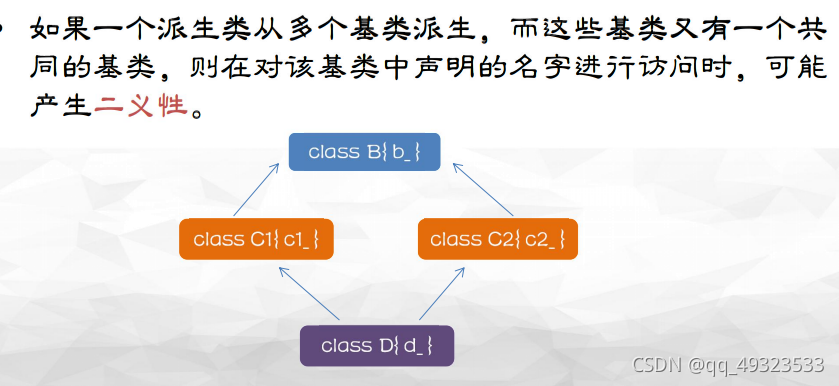
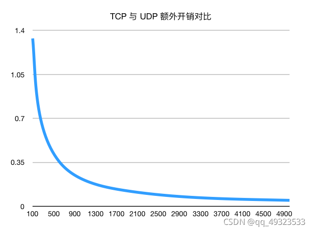
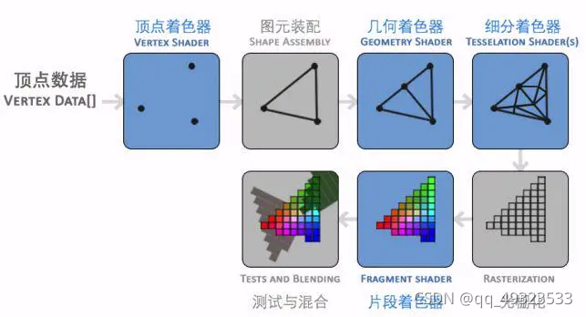

# 算法部分

## 寻路算法

1. 广度优先算法
2. Dijkstra( 狄克斯特拉）算法
   基于广度优先算法，需要计算每一个节点距离起点的总移动代价。还需要一个优先队列结构。对于所有待遍历的节点，放入优先队列中会按照代价进行排序。每次都从优先队列中选出代价最小的作为下一个遍历的节点。直到到达终点为止。
   考虑这样一种场景，在一些情况下，图形中相邻节点之间的移动代价并不相等。例如，游戏中的一幅图，既有平地也有山脉，那么游戏中的角色在平地和山脉中移动的速度通常是不相等的。
   
3. Greedy Best First Search
   基于目标寻找，而非完全搜索。
   每个顶点到目标顶点的距离进行排序。一个采用离起始顶点的距离来排序，一个采用离目标顶点距离排序（离目标的远近排序）
   寻找速度快于宽度优先算法，但是路径可能不是最优的。
4. A *算法
   
   f(n)是节点n的综合优先级。当我们选择下一个要遍历的节点时，我们总会选取综合优先级最高（值最小）的节点。
   g(n) 是节点n距离起点的代价。
   h(n)是节点n距离终点的预计代价，这也就是A*算法的启发函数。

> h(n)=0时，此时算法就退化成了Dijkstra算法。
> h(n)相较于g(n)大很多，则此时只有h(n)产生效果，这也就变成了最佳优先搜索。
> 

A*算法使用两个集合来表示待遍历的节点，与已经遍历过的节点，这通常称之为open_set和close_set。

.h

```cpp
#pragma once
/*
//A*算法对象类
*/
#include <vector>
#include <list>

const int kCost1 = 10; //直移一格消耗
const int kCost2 = 14; //斜移一格消耗
//每个点都有自己的坐标，HGF值，父节点
struct Point
{
	int x, y; //点坐标，这里为了方便按照C++的数组来计算，x代表横排，y代表竖列
	int F, G, H; //F=G+H
	Point *parent; //parent的坐标，这里没有用指针，从而简化代码
	Point(int _x, int _y) :x(_x), y(_y), F(0), G(0), H(0), parent(NULL)  //变量初始化
	{
	}
};

class Astar
{
public:
	void InitAstar(std::vector<std::vector<int>> &_maze);
	std::list<Point *> GetPath(Point &startPoint, Point &endPoint, bool isIgnoreCorner);

private:
	Point *findPath(Point &startPoint, Point &endPoint, bool isIgnoreCorner);
	std::vector<Point *> getSurroundPoints(const Point *point, bool isIgnoreCorner) const;
	bool isCanreach(const Point *point, const Point *target, bool isIgnoreCorner) const; //判断某点是否可以用于下一步判断
	Point *isInList(const std::list<Point *> &list, const Point *point) const; //判断开启/关闭列表中是否包含某点
	Point *getLeastFpoint(); //从开启列表中返回F值最小的节点
	//计算FGH值
	int calcG(Point *temp_start, Point *point);
	int calcH(Point *point, Point *end);
	int calcF(Point *point);
private:
	std::vector<std::vector<int>> maze;
	std::list<Point *> openList;  //开启列表
	std::list<Point *> closeList; //关闭列表
};
```

.cpp

```cpp
#include <math.h>
#include "Astar.h"

void Astar::InitAstar(std::vector<std::vector<int>> &_maze)
{
	maze = _maze;
}

int Astar::calcG(Point *temp_start, Point *point)//G是从起点走过来的消耗
{
	int extraG = (abs(point->x - temp_start->x) + abs(point->y - temp_start->y)) == 1 ? kCost1 : kCost2;//走了一步 判断是上下左右or斜着走的，==1说明水平竖直走，！=1(==1.414）说明斜着走的
	int parentG = point->parent == NULL ? 0 : point->parent->G; //如果是初始节点，则其父节点是空
	return parentG + extraG;
}

int Astar::calcH(Point *point, Point *end)//从指定的方格移动到终点的预计耗费
{
	return sqrt((double)(end->x - point->x)*(double)(end->x - point->x) + (double)(end->y - point->y)*(double)(end->y - point->y))*kCost1;//（x^2+y^2)开根号*kCost1  这里我们设定只可以上下左右移动).
}

int Astar::calcF(Point *point)
{
	return point->G + point->H;
}

Point *Astar::getLeastFpoint()
{
	if (!openList.empty())
	{
		auto resPoint = openList.front();
		for (auto &point : openList)
			if (point->F < resPoint->F)
				resPoint = point;
		return resPoint;
	}
	return NULL;
}

Point *Astar::findPath(Point &startPoint, Point &endPoint, bool isIgnoreCorner)
{
	openList.push_back(new Point(startPoint.x, startPoint.y)); //置入起点,拷贝开辟一个节点，内外隔离
	while (!openList.empty())
	{
		auto curPoint = getLeastFpoint(); //找到F值最小的点
		openList.remove(curPoint); //从开启列表中删除
		closeList.push_back(curPoint); //放到关闭列表
		//1,找到当前周围八个格中可以通过的格子
		auto surroundPoints = getSurroundPoints(curPoint, isIgnoreCorner);
		for (auto &target : surroundPoints)
		{
			//2,对某一个格子，如果它不在开启列表中，加入到开启列表，设置当前格为其父节点，计算F G H
			if (!isInList(openList, target))
			{
				target->parent = curPoint;

				target->G = calcG(curPoint, target);
				target->H = calcH(target, &endPoint);
				target->F = calcF(target);

				openList.push_back(target);
			}
			//3，对某一个格子，它在开启列表中，计算G值, 如果比原来的大, 就什么都不做, 否则设置它的父节点为当前点,并更新G和F
			else
			{
				int tempG = calcG(curPoint, target);
				if (tempG < target->G)
				{
					target->parent = curPoint;

					target->G = tempG;
					target->F = calcF(target);
				}
			}
			Point *resPoint = isInList(openList, &endPoint);
			if (resPoint)
				return resPoint; //返回列表里的节点指针，不要用原来传入的endpoint指针，因为发生了深拷贝
		}
	}

	return NULL;
}

std::list<Point *> Astar::GetPath(Point &startPoint, Point &endPoint, bool isIgnoreCorner)
{
	Point *result = findPath(startPoint, endPoint, isIgnoreCorner);
	std::list<Point *> path;
	//返回路径，如果没找到路径，返回空链表
	while (result)
	{
		path.push_front(result);
		result = result->parent;
	}

	// 清空临时开闭列表，防止重复执行GetPath导致结果异常
	openList.clear();
	closeList.clear();

	return path;
}

Point *Astar::isInList(const std::list<Point *> &list, const Point *point) const
{
	//判断某个节点是否在列表中，这里不能比较指针，因为每次加入列表是新开辟的节点，只能比较坐标
	for (auto p : list)
		if (p->x == point->x&&p->y == point->y)
			return p;
	return NULL;
}

bool Astar::isCanreach(const Point *point, const Point *target, bool isIgnoreCorner) const
{
	if (target->x<0 || target->x>maze.size() - 1
		|| target->y<0 || target->y>maze[0].size() - 1
		|| maze[target->x][target->y] == 1
		|| target->x == point->x&&target->y == point->y
		|| isInList(closeList, target)) //如果点与当前节点重合、超出地图、是障碍物、或者在关闭列表中，返回false
		return false;
	else
	{
		if (abs(point->x - target->x) + abs(point->y - target->y) == 1) //非斜角可以
			return true;
		else
		{
			//斜对角要判断是否绊住
			if (maze[point->x][target->y] == 0 && maze[target->x][point->y] == 0)
				return true;
			else
				return isIgnoreCorner;
		}
	}
}

std::vector<Point *> Astar::getSurroundPoints(const Point *point, bool isIgnoreCorner) const
{
	std::vector<Point *> surroundPoints;

	for (int x = point->x - 1; x <= point->x + 1; x++)
		for (int y = point->y - 1; y <= point->y + 1; y++)
			if (isCanreach(point, new Point(x, y), isIgnoreCorner))
				surroundPoints.push_back(new Point(x, y));

	return surroundPoints;
}
```

.main

```cpp
#include <iostream>
#include "Astar.h"

bool InPath(const int &row, const int &col, const std::list<Point *> &path) {
	for (const auto &p : path) {
		if (row == p->x && col == p->y) {
			return true;
		}
	}
	return false;
}

int main() {
	//初始化地图，用二维矩阵代表地图，1表示障碍物，0表示可通
	std::vector<std::vector<int>> map = { {1, 1, 1, 1, 1, 1, 1, 1, 1, 1, 1, 1},
										 {1, 0, 0, 1, 1, 0, 1, 0, 0, 0, 0, 1},
										 {1, 0, 0, 1, 1, 0, 0, 0, 0, 0, 0, 1},
										 {1, 0, 0, 0, 0, 0, 1, 0, 0, 0, 1, 1},
										 {1, 1, 1, 0, 1, 0, 0, 1, 1, 0, 0, 1},
										 {1, 1, 0, 1, 0, 0, 1, 0, 0, 0, 0, 1},
										 {1, 0, 1, 0, 0, 0, 0, 1, 0, 0, 0, 1},
										 {1, 1, 1, 1, 1, 1, 1, 1, 1, 1, 1, 1} };
	Astar astar;
	astar.InitAstar(map);

	//设置起始和结束点
	Point start(1, 1);
	Point end(6, 10);

	// A*算法找寻路径
	std::list<Point *> path = astar.GetPath(start, end, false);

	// 打印结果
	for (auto &p : path) {
		std::cout << "(" << p->x << "," << p->y << ") ";
	}
	std::cout << "\n";

	for (int row = 0; row < map.size(); ++row) {
		for (int col = 0; col < map[0].size(); ++col) {
			if (InPath(row, col, path)) {
				if (map[row][col] != 0) {
					std::cout << "e ";
				}
				else {
					std::cout << "* ";
				}
			}
			else {
				std::cout << map[row][col] << " ";
			}
		}
		std::cout << "\n";
	}
	return 0;
}
```

1. B*算法
   适用于游戏中怪物的自动寻路，其效率远远超过A*算法

> 1、起始，探索节点为自由节点，从原点出发，向目标前进；
> 2、自由节点前进过程中判断前面是否为障碍，
> a、不是障碍，向目标前进一步，仍为自由节点；
> b、是障碍，以前方障碍为界，分出左右两个分支，分别试图绕过障碍，这两个分支节点即成为两个绕爬的探索节点；
> 3、绕爬的探索节点绕过障碍后，又成为自由节点，回到2）；
> 4、探索节点前进后，判断当前地图格子是否为目标格子，如果是则寻路成功，根据寻路过程构造完整路径；
> 5、寻路过程中，如果探索节点没有了，则寻路结束，表明没有目标格子不可达；

1. D*算法
   适合动态环境，在原路线遇到障碍重新规划路线。

## 占用房间问题

每个面试官有一个占用房间的时间区间，如[3,4]。给定一组面试官的面试时间区间，问最少需要多少间房间？

```cpp
#include <iostream>
#include <vector>
#include <algorithm>
using namespace std;
class Solution {
public:
	Solution() {}
	int merge(vector<vector<int>>& intervals) {
		int count = 0;
		if (intervals.size() == 0) return{};
		sort(intervals.begin(), intervals.end());
		vector<vector<int>> merged;
		for (int i = 0; i < intervals.size(); i++)
		{
			int L = intervals[i][0], R = intervals[i][1];
			if (!merged.size() || merged.back()[1] <= L)
			{
				merged.push_back({ L,R });//空 or 最大值小于等于下一个左值，直接插入下一对
			}
			else
			{
				count++;
				merged.back()[1] =  R;
			}
		}
		return count;
	}
};
int main()
{
	vector<vector<int>>vec = { {0,1},{2,5},{3,7},{5,6},{7,8},{2,8} };//01 25 28/37/56  78  至少三个
	Solution Sol;
	int x=Sol.merge(vec);
	cout << x <<endl;
	return 0;
}
```

## 两个单链表寻找相交节点

遍历一个链表，把尾指针指向第二个链表的头，然后用循环链表查找

```cpp
class Solution {
public:
	node *getIntersectionNode(node *headA, node *headB)
	{
		while (headA->next!=NULL)
		{
			headA = headA->next;
		}
		headA->next=headB;//构造循环链表
		headA = headB;
		node*fast = headB;
		while (fast->next != NULL)
		{
			fast = fast->next;
			headA = headA->next;
			if (fast->next != NULL)
				fast = fast->next;
			if (fast == headA)
				break;
		}
		if (!fast || !fast->next) return nullptr;
		fast = headB;
		while (fast != headA)
		{
			fast = fast->next;
			headA = headA->next;
		}
		return fast;
	}
};
```

## 单链表归并排序


```cpp
#include "iostream"
struct node {
	int data;
	node*next;
	node(int data = 0, node*next = NULL):data(data),next(next) {}
};

void mergesort(node*&head)
{
	if (head->next)
	{
		node*mid = cut(head);//找到链表的中点，切开，分
		mergesort(head);//分别递归
		mergesort(mid);
		head = merge(head, mid);//排序，治
	}
}

node* cut(node*&head)//获得中间节点
{
	node*p = head;
	node*q = head;
	node*second_head;
	while (q&&q->next)
	{
		q = q->next;
		if (q->next)
		{
			q = q->next;
			p = p->next;
		}
	}
	second_head = p->next;
	p->next = NULL;
	return second_head;
}

node* merge(node*&head, node*&mid)
{
	node tmp;
	node*p = &tmp, *q = head, *t = mid;
	while (q&&t)
	{
		if (q->data <= t->data)
		{
			p->next = q;
			p = p->next;
			q = q->next;
		}
		else
		{
			p->next = t;
			p = p->next;
			t = t->next;
		}
	}
	if (q)//q比t长，q剩余的节点直接插入
		p->next = q;
	else
		p->next = t;
	return tmp.next;
}
// 37984843 24679631
// 3798 4843 2467 9631
// 37 98 48 43 24 67 96 31
// 37 89 48 34 24 67 69 13
// 3789 3448 2467 1369
// 33447889 12346679
// 12333444778899
```

## 在一个链表中找到环的开端

```cpp
//寻找链表环的入口
//快慢指针
struct ListNode {
	int val;
	struct ListNode*next;
	ListNode (int x) :
		val(x),next(NULL){}
};

class Solution
{
public:
	ListNode*EntryNodeOfLoop(ListNode*pHead)
	{
		if (!pHead) return nullptr;
		ListNode*fast = pHead;
		ListNode*slow = pHead;
		while (fast&&fast->next)
		{
			fast = fast->next->next;
			slow = slow->next;
			if (fast == slow)
				break;
		}

		if (!fast || !fast->next) return nullptr;
		fast = pHead;
		while (fast!=slow)
		{
			fast = fast->next;
			slow = slow->next;
		}
		return fast;

	}
};
//哈希表
class Solution {
public:
	ListNode*EntryNodeOfLoop(ListNode*pHead)
	{
		unordered_set <ListNode*> st;
		while (pHead)
		{
			if (st.find(pHead) == st.end())//set里没有结点则存入，有了则输出，遍历完都没有则没有
			{
				st.insert(pHead);
				pHead = pHead->next;
			}
			else return pHead;
		}
		return nullptr;
	}
};
```

## Hash查找

哈希表中的key和value通过哈希函数一一对应，便于查找。
线性探测法解决哈希冲突

```cpp
# define m 13
int Hash(int key)//哈希函数
{
	int H = key % m;
	return H;
}

void InitHashTable(int data[])
{
	for (int i = 0; i < m; i++)
	{
		data[i] = -1;//初始化
	}

	for (int i =0;i<10;i++)
	{
		int n = rand() % 100;
		int x = Hash(n);
		if (data[x] != -1)
		{
			x = (x + 1) % m;
			while (data[x]!=-1&&x!=Hash(n))
			{
				x = (x + 1) % m;//线性探测法
			}
		}
		data[x] = n;
		cout << n << ":" << x << "\t";
	}

}
int SearchHash(int* data, int key)
{
	int H = Hash(key);
	if (data[H] == -1) return -1;
	else if (data[H] == key) return H;
	else {
		for (int i = 0; i < m; i++)
		{
			int H1 = (H + i) % m;//线性探测法
			if (data[H1] == -1) return -1;
			else if (data[H1] == key) return H1;
		}
		return -1;
	}
}

int main()
{
	int data[m];
	InitHashTable(data);
	int key;
	while (cin >> key)
	{
		if (SearchHash(data, key) == -1) cout << "search failed"<<endl;
		else cout << SearchHash(data, key);
	}
}
```

## 字符串匹配

遇到左括号压入栈，遇到右括号取出栈顶元素判断是否匹配

## 斐波那契数列

递归自己的前两项之和，考虑012特殊值

```cpp
class Solution {
public:
    int Fibonacci(int n) {
        if(n==0) return 0;
        if(n==1||n==2) return 1;
        else{
            return Fibonacci(n-1)+Fibonacci(n-2);
        }
    }
};
```

## 二叉树性质

二叉树中，第 i 层最多有 pow(2,i-1) 个结点。
如果二叉树的深度为 K，那么此二叉树最多有 pow(2,K)-1 个结点。
二叉树中，终端结点数（叶子结点数）为 n0，度为 2 的结点数为 n2，则 n0=n2+1。

满二叉树：

完全二叉树：


## 确定有限自动机（DFA）

可用来创建字典树，用于敏感词检测

## 输出指定范围的随机数

x = rand()%11; /产生1~10之间的随机整数/

y = rand()%51 - 25; /产生-25 ~ 25之间的随机整数/

z = ((double)rand()/RAND_MAX)*(b-a) + a;/产生区间[a,b]上的随机数/
通用：
要取得[a,b)的随机整数，使用(rand() % (b-a))+ a;
要取得[a,b]的随机整数，使用(rand() % (b-a+1))+ a;
要取得(a,b]的随机整数，使用(rand() % (b-a))+ a + 1;
要取得0～1之间的浮点数，可以使用rand() / double(RAND_MAX)。

```cpp
#include <iostream>
#include <stdlib.h>
#include <time.h> 

using namespace std; 

int main()
{ 
        srand((unsigned)time(NULL)); //产生新的随机数种子，不调用这个 则每次rand的随机数都和之前的一样
        for(int i = 0; i < 10;i++ ) 
                cout << rand() << '/t';//生成随机数
        cout << endl; 
        return 0;
}
//从n个随机数中生成m个随机数

int RanN(int n)
{
	srand((unsigned)time(NULL));
	int res = rand() % n;
	return res;
}

int RanM(int n,int m)
{

	int res;
	do 
	{
		int temp = RanN(n);//temp[0.n]
		res = temp * m;//res[0,m*n]
	} while (res>=m);//res[0,m-1]
	return res;
}

int main()
{
	srand((unsigned)time(NULL));
	cout<<RanM(3, 4)<<endl;
}
```

# 操作系统

## 用户态和内核态

内核态：运行操作系统程序，执行特权指令，能访问所有的内存空间和对象，且所占用的处理机是不允许被抢占的。
用户态：运行用户程序，执行非特权指令，进程所能访问的内存空间和对象受到限制，其所占有的处理机是可被抢占的。
用户态切换到内核态的途径——>中断/异常/陷入

> 中断：外围设备完成用户请求的操作后，会像CPU发送相应的中断信号。CPU会暂停执行下一条即将要执行的指令，转而执行与中断信号对应的处理程序。
> 异常：当CPU在执行运行在用户态下的程序时，发生了某些事先不可知的异常，会触发由当前运行进程切换到处理此异常的内核相关程序中。因此也就转到了内核态，比如缺页异常。
> 陷入（系统调用）：用户态进程主动要求切换到内核态的一种方式。用户态进程通过系统调用，申请使用操作系统提供的服务程序，以完成工作。

内核态切换到用户态的途径——>设置程序状态字


## 系统调用

系统调用：运行在用户空间的程序向操作系统内核请求需要更高权限运行的服务。系统调用提供用户程序与操作系统之间的接口
系统调用大致可分为六大类：
进程控制（process control）：
文件管理（file manipulation）
设备管理（device manipulation）
信息维护（information maintenance）
通信（communication）
保护（protection）提供控制访问计算机的系统资源的机制。

## 线程，进程，协程

|          | 线程                             | 进程                       | 协程                                                     |
| -------- | -------------------------------- | -------------------------- | -------------------------------------------------------- |
| 定义     | 系统程序执行的最小单位           | 系统资源分配调度的基本单位 | 多个函数并发地执行                                       |
| 地址空间 | 线程共享本进程的地址空间         | 进程之间是独立的地址空间   |                                                          |
| 可靠性   | 一个线程死掉会毁掉整个进程       | 一个进程死掉不影响其他进程 |                                                          |
| 开销     | 中                               | 大                         | 小                                                       |
| 共享性   | 强，抢占式，多个线程可以并发运行 | 差                         | 协作式，同一时只有一个协程拥有运行权，相当于单线程的能力 |
| 机制     | 同步机制                         | 同步机制                   | 异步机制                                                 |

一个线程可以有多个协程，一个进程也可以有多个协程

进程之间的切换：1.切换页表以使用新的地址空间。2.切换内核栈和硬件上下文
对于linux来说，线程切换，第1步是不需要做的，第2步是进程和线程切换都要做的。

## promise和future

用于线程间的交流


```cpp
#include <iostream>
#include <functional>
#include <future>
#include <thread>
#include <chrono>
#include <cstdlib>
 
void thread_set_promise(std::promise<int>& promiseObj) {
    std::cout << "In a thread, making data...\n";
    std::this_thread::sleep_for(std::chrono::milliseconds(1000));
    promiseObj.set_value(35);//promise设置数值，future可以接收到
    std::cout << "Finished\n";
}
 
int main() {
    std::promise<int> promiseObj;//
    std::future<int> futureObj = promiseObj.get_future();//创建future和promise建立连接
    std::thread t(&thread_set_promise, std::ref(promiseObj));
    std::cout << futureObj.get() << std::endl;//获取数值
    t.join();
 
    system("pause");
    return 0;
}
```

## 死锁的四个必备条件

互斥条件：一个资源只能被一个进程使用
请求与保持条件：一个资源在请求所需资源的时候对已有的资源保持不放
不剥夺条件：不可强行剥夺进程未使用完的资源
循环等待条件：若干进程循环等待所需资源

## 死锁破坏方法

一次就好（一次分配好 就不会再有请求
缺一不可（进程缺一个资源 就不分配其资源给他
学会放手（得不到想要的资源，就把已有的资源也放掉
号码排序（系统给每类资源赋予一个编号，每一个进程按编号递增的顺序请求资源，释放则相反

# 数据结构

## 随机存储 顺序存储 随机存取 顺序存取

随机存储：存储空间不连续
顺序存储：存储空间连续
随机存取：可根据下标存取内容
顺序存取：需要从头遍历存取内容

## vector list array

|          | array | vector | list     |
| -------- | ----- | ------ | -------- |
| 底层     |       |        | 双向链表 |
| 大小     | 固定  | 可变   | 可变     |
| 插入删除 | 慢    | 慢     | 快       |
| 随机存取 | 快    | 快     | 慢       |

## 顺序存储结构和链式存储结构

> 存储密度：结点数据本身所占的存储量/结点结构所占的存储总量

|                | 顺序存储结构           | 链式存储结构                   |
| -------------- | ---------------------- | ------------------------------ |
| 存储密度       | 大                     | 小                             |
| 空间利用率     | 高                     | 低                             |
| 插入删除元素   | 不方便                 | 方便                           |
| 查找           | 快                     | 慢                             |
| 存储分配的方式 | 静态分配               | 动态分配                       |
| 存取方式       | 随机存取or顺序存取     | 顺序存取                       |
| 插入删除效率   | 平均需要移动近一半元素 | 不需要移动元素，只需要修改指针 |

## vector容器如何翻倍

重新分配一个原来两倍的内存空间，将原来旧的元素全部复制到新的存储空间中去，然后再插入新的元素。

## 队列

特点：尾进头出，先进先出
应用：排队买菜，医院挂号
实现方法：顺序队列&链队列
主要操作：初始化，尾进，头出，查值，遍历输出，删除队列，获取长度，判空

```cpp
//链表的方式创建队列
#include <iostream>
#include <vector>
using namespace std;
vector<int>A;//存放寻找的数值
class Node
{
public:
	int data;
	Node*next;
};
class Linkqueue
{
public:
	void InitQueue(Linkqueue&Q);
	void enNode(Linkqueue&Q);
	void outputNode(Linkqueue&Q);
	bool Isempty(Linkqueue&Q);
	void delfirstNode(Linkqueue&Q);
	void getLength(Linkqueue&Q);
	void findNode(Linkqueue&Q, int value);
	void destroyNode(Linkqueue&Q);
private:
	Node*front;
	Node*rear;
};

void Linkqueue::InitQueue(Linkqueue&Q)
{
	Node*p = new Node;
	p->next = NULL;
	Q.front = p;
	Q.rear = p;
}

void Linkqueue::enNode(Linkqueue&Q)
{
	Node*q = new Node;
	q->next = NULL;
	cout << "please input a value" << endl;
	cin >> q->data;
	Q.rear->next = q;//令rear的下一个是q
	Q.rear = q;//尾指针指向q
}

void Linkqueue::outputNode(Linkqueue&Q)
{
	Node*p;
	p = Q.front->next;
	if (p == NULL)
		cout << "空队列" << endl;
	else while (p != NULL)
	{
		cout << p->data << " ";
		p = p->next;
	}
	cout << endl;
}

bool Linkqueue::Isempty(Linkqueue&Q)
{
	if (Q.front == Q.rear)
		return true;
	else return false;
}

void Linkqueue::delfirstNode(Linkqueue&Q)
{
	Node*pDel;
	pDel = Q.front->next;
	Q.front->next = Q.front->next->next;
	delete pDel;
	pDel = NULL;
}

void Linkqueue::getLength(Linkqueue&Q)
{
	int count = 0;
	Node*p;
	p = Q.front->next;
	while (p != NULL)
	{
		p = p->next;
		count++;
	}
	cout << count<<endl;
}

void Linkqueue::findNode(Linkqueue&Q,int value)
{
	Node*p;
	p = Q.front;
	int n = 0;
	while (p != Q.rear)
	{
		if (p->data == value)
		{
			A.push_back(n + 1);
		}
		n = n + 1;
		p = p->next;
	}
	cout << endl;
	if (A.empty())
		cout << "查无此值" << endl;
	else {
		cout << "位置有";
		for (int i : A)
		{
			cout << A[i]<<' ';
		}
	}
	cout << endl;
}

void Linkqueue::destroyNode(Linkqueue&Q)
{
	while (Q.front)
	{
		Q.rear = Q.front->next;
		delete Q.front;//删除了front指向的内存空间
		Q.front = Q.rear;//front重新指向rear
	}
}
void main() {
	Linkqueue que;
	int n;
	Linkqueue *Q = new Linkqueue;
	que.InitQueue(*Q);
	cout << "请输入队列的长度=";
	cin >> n;
	for (int i = 0; i < n; i++) {
		que.enNode(*Q);
	}
	que.outputNode(*Q);
	que.getLength(*Q);
	que.delfirstNode(*Q);
	que.outputNode(*Q);
	Q->Isempty(*Q);
	que.getLength(*Q);
	que.findNode(*Q, 4);
	Q->destroyNode(*Q);
}
#include "iostream"
using namespace std;
class queue {
public:
	queue(int len)
	{
		data = new int[len];
		length = len;
		head = 0;
		tail = -1;
	}
	~queue() {
		delete[]data;
	}

	void insertVal(int v)
	{
		if (tail + 1 < length)
		{
			tail = tail + 1;
			data[tail] = v;
		}
	}

	void getfirstVal()
	{
		if (head <= tail)
			cout << data[head] << endl;
	}

	void deletefirstVal()
	{
		if (head <= tail)
			head = head + 1;
	}

	void outputVal()
	{
		for (int i=head;i<=tail;i++)
		{
			cout << data[i] << " ";
		}
		cout << endl;
	}
	void findVal(int a)
	{
		for (int i = head; i <= tail; i++)
		{
			if (a == data[i])
				cout << i + 1;
		}
		cout << endl;
	}
private:
	int *data;
	int length;
	int head;
	int tail;
};

int main() {
	int n, a;
	queue que(100);
	cout << "请输入您需要的节点的个数=";
	cin >> n;
	for (int i = 0; i < n; i++) {
		cout << "请输入第" << i + 1 << "个节点的值=";
		cin >> a;
		que.insertVal(a);
	}
	que.getfirstVal();
	que.outputVal();
	que.findVal(3);
	cout << "删除元素";
	que.deletefirstVal();
	que.getfirstVal();
	que.outputVal();
	return 0;
}
```

# C++知识点

## 继承方式

友元函数不能被继承，友元函数不是成员函数
访问控制：

访问属性设置的原则：
1.需要被外界访问的成员，设置为：public。
2.只能在当前类中访问的成员，设置为：private。
3.只能在当前类和派生类中访问的成员，设置为：protected。

```cpp
#include<iostream>
using namespace std;
//////////////////////////////////////////////////////////////////////////
class A       //父类
{
private:
    int privatedateA;
protected:
    int protecteddateA;
public:
    int publicdateA;
    int print(){};
};
//////////////////////////////////////////////////////////////////////////
class B :public A      //基类A的派生类B（共有继承）
{
public:
    void funct()
    {
        int b;
        b=privatedateA;   //error：基类中私有成员在派生类中是不可见的
        b=protecteddateA; //ok：基类的保护成员在派生类中为保护成员
        b=publicdateA;    //ok：基类的公共成员在派生类中为公共成员
    }
};
//////////////////////////////////////////////////////////////////////////
class C :private A  //基类A的派生类C（私有继承）
{
public:
    void funct()
    {
        int c;
        c=privatedateA;    //error：基类中私有成员在派生类中是不可见的
        c=protecteddateA;  //ok：基类的保护成员在派生类中为私有成员
        c=publicdateA;     //ok：基类的公共成员在派生类中为私有成员
    }
};
//////////////////////////////////////////////////////////////////////////
class D :protected A   //基类A的派生类D（保护继承）
{
public:
    void funct()
    {
        int d;
        d=privatedateA;   //error：基类中私有成员在派生类中是不可见的
        d=protecteddateA; //ok：基类的保护成员在派生类中为保护成员
        d=publicdateA;    //ok：基类的公共成员在派生类中为保护成员
    }
};
A a;
B b;
b.A::print(); //如果想要调用基类中的方法，可以使用作用域操作符::
```

派生类的构造函数，需要使用:Base()调用基类的构造函数，不写的话默认调用基类的默认构造函数.构造函数调用顺序： 先基类，再是子对象，再是派生类。
派生类的析构函数，编译器会自动地调用基类的析构函数，先派生类，再子对象，再基类。

```cpp
class Base{....};
class B{....};
class Derived:public Base
{
public:
	Derived() :Base(),b1()//调用基类的默认构造函数
	{
		dnum1_ = 0;
		cout << "调用派生类的默认构造函数" << endl;
	}
	Derived(int bnum1, int dnum1) : Base(bnum1),b1(b)//调用基类的构造函数
	{
		dnum1_ = dnum1;
		cout << "调用派生类的构造函数" << endl;
	}
	private:
		B b1;//子对象
};
```

虚继承：
要使公共基类B在派生类D中只产生一个子对象，必须将这个基类B声明为虚继承，使这个基类成为虚基类。

```cpp
class C1: virtual public B
{
}
class C2: virtual public B
{
}
```

## std::function

可以调用的目标实体进行存储、复制、和调用操作，这些目标实体包括普通函数、Lambda表达式、函数指针、以及其它函数对象等.简单粗暴，最大的用处是函数回调。

> bind用来帮助使用成员函数

```cpp
#include <functional>
#include <iostream>
using namespace std;
 
std::function< int(int)> Functional;//声明
 
// 普通函数
int TestFunc(int a)
{
    return a;
}
 
// Lambda表达式
auto lambda = [](int a)->int{ return a; };
 
// 仿函数(functor) 是一个能行使函数功能的类， 调用仿函数，实际上就是通过类对象调用重载后的 operator() 运算符。
class Functor
{
public:
    int operator()(int a)
    {
        return a;
    }
};
 
// 1.类成员函数
// 2.类静态函数
class TestClass
{
public:
    int ClassMember(int a) { return a; }
    static int StaticMember(int a) { return a; }
};
 
int main()
{
    // 普通函数
    Functional = TestFunc;
    int result = Functional(10);
    cout << "普通函数："<< result << endl;
 
    // Lambda表达式
    Functional = lambda;
    result = Functional(20);
    cout << "Lambda表达式："<< result << endl;
 
    // 仿函数
    Functor testFunctor;
    Functional = testFunctor;
    result = Functional(30);
    cout << "仿函数："<< result << endl;
 
    // 类成员函数
    TestClass testObj;
    Functional = std::bind(&TestClass::ClassMember, testObj, std::placeholders::_1);
    result = Functional(40);
    cout << "类成员函数："<< result << endl;
 
    // 类静态函数
    Functional = TestClass::StaticMember;
    result = Functional(50);
    cout << "类静态函数："<< result << endl;
 
    return 0;
}
```

## 常用的设计模式

1. 单例模式：一个类始终只能创建一个实例，则这个类被称为单例类，这种模式就被称为单例模式。
   懒汉式：指系统运行中，实例并不存在，只有当需要使用该实例时，才会去创建并使用实例。（这种方式要考虑线程安全）
   饿汉式：指系统一运行，就初始化创建实例，当需要时，直接调用即可。（本身就线程安全，没有多线程的问题）
   懒汉式是以时间换空间，适应于访问量较小时；推荐使用内部静态变量的懒汉单例，代码量少
   饿汉式是以空间换时间，适应于访问量较大时，或者线程比较多的的情况

```cpp
//懒汉单例:用了延迟加载来保证了类在没有被使用之前是不会被加载到内存中去初始化的，使用c++的lock安全

class Singleton
{
private:
	Singleton();
	static Singleton*instance;
public:
	static Singleton*GetInstance();
};

Singleton::Singleton()
{
	cout << "create a singleton" << endl;
}

Singleton* Singleton::GetInstance()
{
	if (instance == nullptr)
	{
		std::unique_lock<std::mutex> lock();
		if (instance == nullptr)
		{
			instance = new Singleton();
		}
		std::unique_lock<std::mutex> unlock();
	}
	return instance;
}

Singleton*Singleton::instance = nullptr;


int main()
{
	Singleton* test1 = Singleton::GetInstance();
	Singleton* test2 = Singleton::GetInstance();

}
//饿汉单例,本身已经安全
class Singleton
{
public:
	static Singleton*GetInstance();
private:
	Singleton();
	static Singleton* instance;
};

Singleton::Singleton()
{
	cout << "create a singleton" << endl;
}
Singleton*Singleton::GetInstance()
{
	return instance;
}

Singleton*Singleton::instance = new Singleton();
int main()
{
	Singleton* test1 = Singleton::GetInstance();
	Singleton* test2 = Singleton::GetInstance();
}
```

1. 简单工厂：主要特点是需要在工厂类中做判断，从而创造相应的产品，当增加新产品时，需要修改工厂类。
   缺点：工厂类集中了所有产品类的创建逻辑，如果产品量较大，会使得工厂类变的非常臃肿。

```cpp
#include <iostream>

using namespace std;
//简单工厂

//定义产品类型
typedef enum 
{
	Male,
	Female
}Sex_type;

//抽象类
class People
{
public:
	virtual const string & Sex() = 0;
};
//具体类1
class Man :public People
{
public:
	Man() :People(), my_Sex("Male")
	{

	}

	const string & Sex()override //& 返回一个引用
	{
		cout << my_Sex.data() << endl;
		return my_Sex;
	}
private:
	string my_Sex;
};
//具体类2
class Woman :public People
{
public:
	Woman() :People(), my_Sex("Female")
	{

	}

	const string & Sex()override
	{
		cout << my_Sex.data() << endl;
		return my_Sex;
	}
private:
	string my_Sex;
};

//工厂类
class PeopleFactory
{
public:
	People*CreatePeople(Sex_type sex) //根据变量状态执行，适合用指针函数
	{
		switch (sex)
		{
		case Female:
			return new Woman();
		case Male:
			return new Man();
		default:
			return nullptr;
		}
	}
};

int main()
{
	PeopleFactory*facctory = new PeopleFactory();
	People*Male_001 = facctory->CreatePeople(Male);
	Male_001->Sex();
	delete Male_001;
	Male_001 = nullptr;
	return 0;
}
```

1. 工厂方法模式：定义一个创建对象的抽象工厂接口，其子类去具体现实这个接口以完成具体的创建工作。如果需要增加新的产品类，只需要扩展一个相应的工厂类即可。
   缺点：产品类数据较多时，需要实现大量的工厂类，这无疑增加了代码量。

```cpp
//抽象类
class People
{
public:
	virtual const string & Sex() = 0;
};
//具体类1
class Man :public People
{
public:
	Man() :People(), my_Sex("Male")
	{

	}

	const string & Sex()override //& 返回一个引用
	{
		cout << my_Sex.data() << endl;
		return my_Sex;
	}
private:
	string my_Sex;
};
//具体类2
class Woman :public People
{
public:
	Woman() :People(), my_Sex("Female")
	{

	}

	const string & Sex()override
	{
		cout << my_Sex.data() << endl;
		return my_Sex;
	}
private:
	string my_Sex;
};

//抽象工厂类
class PeopleFactory
{
public:
	virtual People*CreatePeople() = 0;
};

////具体的创建工厂类，使用抽象工厂类提供的接口，去创建具体的产品实例
class MaleFactory :public PeopleFactory
{
public:
	People *CreatePeople() override
	{
		return new Man();
	}
};
class FemaleFactory :public PeopleFactory
{
public:
	People *CreatePeople() override
	{
		return new Woman();
	}
};

int main()
{
	PeopleFactory*facctory = new MaleFactory();//抽象工厂父类 创建一个 子类 男人工厂
	People * man_001 = facctory->CreatePeople();//从男人工厂创建一个人类
	man_001->Sex();
	delete man_001;
	man_001 = nullptr;

	return 0;
}
```

1. 抽象工厂模式：在一个工厂里聚合多个同类产品。当存在多个产品系列，而客户端只使用一个系列的产品时，可以考虑使用抽象工厂模式。
   缺点：当增加一个新系列的产品时，不仅需要现实具体的产品类，还需要增加一个新的创建接口，扩展相对困难。

```cpp
#include "iostream"
using namespace std;

//white coat together with white shoes
//black coat together with black shoes

class coat
{
public:
	virtual const string&color() = 0;
};

class whitecoat :public coat
{
public:
	whitecoat() :coat(),m_color("white") {}
	const string&color()override
	{
		cout << m_color.data() << endl;
		return m_color;
	}
private:
	string m_color;
};
class blackcoat :public coat
{
	//the same as whitecoat
};

class shoes
{
public:
	virtual const string&color() = 0;
};

class whiteshoes :public shoes
{
public:
	whiteshoes() :shoes(), m_color("white") {}
	const string &color()override
	{
		cout << m_color.data() << endl;
		return m_color;
	}
private:
	string m_color;
};

class blackshoes :public shoes
{
	//the same as whiteshoes
};

class factory
{
public:
	//a coat and a pair of shoes which have the same color should be made in one factory
	virtual coat*createcoat() = 0;
	virtual shoes*createshoes() = 0;
};

class whitefactory:public factory
{
public:
	coat*createcoat()override
	{
		return new whitecoat();
	}

	shoes*createshoes()override
	{
		return new whiteshoes();
	}
};

class blackfactory :public factory
{

};

int main()
{
	factory *w_factory = new whitefactory();
	coat* w_coat = w_factory->createcoat();
	shoes*w_shoes = w_factory->createshoes();
	w_coat->color();
	delete w_coat;
	w_coat = nullptr;
	return 0;
}
```

1. 策略模式：定义一系列的算法，把它们单独封装起来，并且使它们可以互相替换，使得算法可以独立于使用它的客户端而变化，也是说这些算法所完成的功能类型是一样的，对外接口也是一样的，只是不同的策略为引起环境角色环境角色表现出不同的行为。就像一个角色按下不同按键会释放不同的技能

```cpp
#include "iostream"
#include "functional"
using namespace std;

void adcHurt()
{
	cout << "adcHurt" << endl;
}
void apcHurt()
{
	cout << "apcHurt" << endl;
}
//战士，使用传统指针函数
class Soldier
{
public:
	typedef void(*Function)();//定义一个函数指针，该函数无参数，无返回值
	Soldier(Function fun):m_fun(fun){}
	void attack()
	{
		m_fun();
	}
private:
	Function m_fun;
};
//法师，使用std::function<>
class Mage
{
public:
	typedef function<void()>Function;
	Mage(Function fun):m_fun(fun){}
	void attack()
	{
		m_fun();
	}
private:
	Function m_fun;
};

int main()
{
	Soldier* soldier = new Soldier(adcHurt);
	soldier->attack();
	delete soldier;
	soldier = nullptr;

	Mage mage(apcHurt);
	mage.attack();

	return 0;
}
```

1. 适配器模式:适配器模式可以将一个类的接口转换成客户端希望的另一个接口，使得原来由于接口不兼容而不能在一起工作的那些类可以在一起工作。

```cpp
#include <iostream>
using namespace std;

class Deque
{
public:
	void push_back(int x)
	{
		cout << "Deque push_back:" << x << endl;
	}

	void push_front(int x)
	{
		cout << "Deque push_front:" << x << endl;
	}

	void pop_back()
	{
		cout << "Deque pop_back" << endl;
	}

	void pop_front()
	{
		cout << "Deque pop_front" << endl;
	}
};

class Sequence
{
public:
	virtual void push(int x) = 0;
	virtual void pop() = 0;
};

class Stack :public Sequence, private Deque
{
	//stack 只能在堆顶插入删除数据
	void push(int x)
	{
		push_front(x);
	}
	void pop()
	{
		pop_front();
	}
};

class Queue :public Sequence, private Deque
{
	//Queue 队尾插入 队首删除
	void push(int x)
	{
		push_back(x);
	}
	void pop()
	{
		pop_front();
	}
};
```

1. 原型模式:用原型实例指定创建对象的种类，并且通过拷贝这些原型创建新的对象。

```cpp
#include <iostream>

using namespace std;

//提供一个抽象克隆基类。
class Clone
{
public:
	virtual Clone* clone() = 0;
	virtual void show() = 0;
};

//具体的实现类
class Sheep :public Clone
{
public:
	Sheep(int id, string name) :Clone(),
		m_id(id), m_name(name)
	{
		cout << "Sheep() id address:" << &m_id << endl;
		cout << "Sheep() name address:" << &m_name << endl;
	}
	~Sheep()
	{
	}
	//关键代码拷贝构造函数
	Sheep(const Sheep& obj)
	{
		this->m_id = obj.m_id;
		this->m_name = obj.m_name;
		cout << "Sheep(const Sheep& obj) id address:" << &m_id << endl;
		cout << "Sheep(const Sheep& obj) name address:" << &m_name << endl;
	}
	//关键代码克隆函数，返回return new Sheep(*this)
	Clone* clone()
	{
		return new Sheep(*this);//返回一个新的自己
	}
	void show()
	{
		cout << "id  :" << m_id << endl;
		cout << "name:" << m_name.data() << endl;
	}
private:
	int m_id;
	string m_name;
};

int main()
{
	Clone* s1 = new Sheep(1, "abs");
	s1->show();
	Clone* s2 = s1->clone();
	s2->show();

	delete s1;
	s1 = nullptr;
	delete s2;
	s2 = nullptr;
	return 0;
}
```

1. 模板模式：定义一个操作中的算法的骨架，而将一些步骤延迟到子类中。模板方法使得子类可以不改变一个算法的结构即可重定义该算法的某些特定步骤。

```cpp
/*
* 关键代码：在抽象类实现通用接口，细节变化在子类实现。
*/

#include <iostream>

using namespace std;

class Computer
{
public:
    void product()
    {
        installCpu();
        installRam();
        installGraphicsCard();
    }

protected:
    virtual void installCpu() = 0;
    virtual void installRam() = 0;
    virtual void installGraphicsCard() = 0;

};

class ComputerA : public Computer
{
protected:
    void installCpu() override
    {
        cout << "ComputerA install Inter Core i5" << endl;
    }

    void installRam() override
    {
        cout << "ComputerA install 2G Ram" << endl;
    }

    void installGraphicsCard() override
    {
        cout << "ComputerA install Gtx940 GraphicsCard" << endl;
    }
};

class ComputerB : public Computer
{
protected:
    void installCpu() override
    {
        cout << "ComputerB install Inter Core i7" << endl;
    }

    void installRam() override
    {
        cout << "ComputerB install 4G Ram" << endl;
    }

    void installGraphicsCard() override
    {
        cout << "ComputerB install Gtx960 GraphicsCard" << endl;
    }
};

int main()
{
    ComputerB* c1 = new ComputerB();
    c1->product();

    delete c1;
    c1 = nullptr;

    return 0;
}
```

1. 建造者模式:将复杂对象的构建和其表示分离，使得相同的构建过程可以产生不同的表示。

```cpp
#include <iostream>
#include <string>
using namespace std;

class NPC//具体的产品类,共有的相似功能
{
public:
	void set_NPC_name(const string&name)
	{
		npc_name = name;
	}
	const string& show_name()
	{
		cout << npc_name.data() << endl;
		return npc_name;
	}
	void set_NPC_age(const string&age)
	{
		npc_age = age;
	}
	const string& show_age()
	{
		cout << npc_age.data() << endl;
		return npc_age;
	}

private:
	string npc_name;
	string npc_age;
};

class NPC_builder//抽象建造类，提供建造接口。
{
public:
	virtual ~NPC_builder()
	{
		cout << "~NPC_builder" << endl;
	}

	virtual void setNPCname() = 0;
	virtual void setNPCage() = 0;
	virtual NPC*getNPC() = 0;
};

class TreeMan :public NPC_builder
{
public:
	TreeMan()
	{
		m_pNPC = new NPC;
	}
	~TreeMan()
	{
		cout << "~TreeMan" << endl;
		delete m_pNPC;
		m_pNPC = nullptr;
	}

	void setNPCname()override
	{
		m_pNPC->set_NPC_name("TreeMan");
	}

	void setNPCage()override
	{
		m_pNPC->set_NPC_age("653");
	}

	NPC*getNPC()override
	{
		return m_pNPC;
	}

private:
	NPC*m_pNPC;
};

//class FireMan:public NPC_builder

//class IronMan:public NPC_builder

class Director//Director类，负责管理实例创建的依赖关系，指挥构建者类创建实例，把功能函数封装了一下，构建时一起调用
{
public:
	Director(NPC_builder*builder,NPC*npc):m_pNPCbuilder(builder),npc(npc)
	{}
	void construct()
	{
		m_pNPCbuilder->setNPCname();
		m_pNPCbuilder->setNPCage();
		npc->show_name();
		npc->show_age();
	}

private:
	NPC_builder*m_pNPCbuilder;
	NPC*npc;
};

int main()
{
	NPC_builder*tree_npc = new TreeMan;
	NPC* npc = tree_npc->getNPC();
	Director*director = new Director(tree_npc,npc);
	director->construct();
	delete director;
	director = nullptr;
	return 0;
}
```

1. 外观模式：为子系统中的一组接口定义一个一致的界面；外观模式提供一个高层的接口，这个接口使得这一子系统更加容易被使用；对于复杂的系统，系统为客户端提供一个简单的接口，把负责的实现过程封装起来，客户端不需要连接系统内部的细节。

```cpp
/*
* 关键代码：客户与系统之间加一个外观层，外观层处理系统的调用关系、依赖关系等。
*以下实例以电脑的启动过程为例，客户端只关心电脑开机的、关机的过程，并不需要了解电脑内部子系统的启动过程。
*/
#include <iostream>

using namespace std;

//抽象控件类，提供接口
class Control
{
public:
    virtual void start() = 0;
    virtual void shutdown() = 0;
};

//子控件， 主机
class Host : public Control
{
public:
    void start() override
    {
        cout << "Host start" << endl;
    }
    void shutdown() override
    {
        cout << "Host shutdown" << endl;
    }
};

//子控件， 显示屏
class LCDDisplay : public Control
{
public:
    void start() override
    {
        cout << "LCD Display start" << endl;
    }
    void shutdown() override
    {
        cout << "LCD Display shutdonw" << endl;
    }
};

//子控件， 外部设备
class Peripheral : public Control
{
public:
    void start() override
    {
        cout << "Peripheral start" << endl;
    }
    void shutdown() override
    {
        cout << "Peripheral shutdown" << endl;
    }
};

class Computer
{
public:
    void start()
    {
        m_host.start();
        m_display.start();
        m_peripheral.start();
        cout << "Computer start" << endl;
    }
    void shutdown()
    {
        m_host.shutdown();
        m_display.shutdown();
        m_peripheral.shutdown();
        cout << "Computer shutdown" << endl;
    }
private:
    Host   m_host;
    LCDDisplay m_display;
    Peripheral   m_peripheral;
};

int main()
{
    Computer computer;
    computer.start();

    //do something

    computer.shutdown();

    return 0;
}
```

1. 组合模式

```cpp
#include <iostream>
#include <list>
#include <memory>
using namespace std;

class Company//抽象类，树枝，树叶的一致接口
{
public:
	Company(const string & name) :m_name(name) {}
	virtual ~Company() { cout << "~Company" << endl; }

	virtual void add(Company*) = 0;
	virtual void remove(const string&) = 0;

	virtual const string& name()
	{
		return m_name;
	}

private:
	string m_name;
};

//树枝类，重写父类的 add remove从而可以带其他的树枝树叶
class HeadCompany :public Company
{
public:
	HeadCompany(const string&name) :Company(name) {}
	virtual ~HeadCompany() { cout << "~HeadCompany()" << endl; }

	void add(Company* company)override
	{
		shared_ptr<Company>temp(company);
		m_companyList.push_back(temp);
	}

	void remove(const string& strName)override
	{
		list<shared_ptr<Company>>::iterator iter = m_companyList.begin();//迭代器
		for (; iter != m_companyList.end(); iter++)
		{
			if ((*iter).get()->name() == strName)
			{
				m_companyList.erase(iter);
				return;
			}
		}
	}

private:
	list<shared_ptr<Company>> m_companyList;//指针列表
};

//树叶类
class SalesCompany :public Company {
public:
	SalesCompany(const string& name) :Company(name) {}
	virtual ~SalesCompany() { cout << "~SalesCompany()" << endl; }
	void add(Company*)override
	{

	}
	void remove(const string&)override
	{

	}
};

int main()
{
	HeadCompany* headRoot = new HeadCompany("Head Root Company");
	HeadCompany*son1 = new HeadCompany("son1");
	SalesCompany*son2 = new SalesCompany("son2");

	headRoot->add(son1);//根公司插入一个树枝公司
	headRoot->add(son2);//根公司插入一个树叶公司
	son1->add(son2);//树叶公司插入一个树叶公司
	//son2->add(son1);//树叶公司不能再添加其他公司

	headRoot->remove("son1");
	delete headRoot;
	headRoot = nullptr;
	return 0;
}
```

1. 代理模式:为其它对象提供一种代理以控制这个对象的访问。在某些情况下，一个对象不适合或者不能直接引用另一个对象，而代理对象可以在客户端和目标对象之间起到中介作用。用B封装A的功能

```cpp
#include <iostream>

using namespace std;

class Gril
{
public:
	Gril(const string& name = "gril") :m_string(name) {}
	string getName()
	{
		return m_string;
	}
private:
	string m_string;
};

class Profession
{
public:
	virtual ~Profession() {}
	virtual void profess() = 0;
};

class YoungMan : public Profession
{
public:
	YoungMan(const Gril& gril) :m_gril(gril) {}
	void profess()
	{
		cout << "Young man love " << m_gril.getName().data() << endl;
	}

private:
	Gril m_gril;
};

class ManProxy : public Profession
{
public:
	ManProxy(const Gril& gril) :m_pMan(new YoungMan(gril)) {}
	~ManProxy()
	{
		delete m_pMan;
		m_pMan = nullptr;
	}
	void profess()
	{
		m_pMan->profess();
	}
private:
	YoungMan* m_pMan;
};

int main(int argc, char *argv[])
{
	Gril gril("heihei");
	ManProxy* proxy = new ManProxy(gril);
	proxy->profess();

	delete proxy;
	proxy = nullptr;
	return 0;
}
```

1. 享元模式：运用共享技术有效地支持大量细粒度的对象

```cpp
#include <iostream>
#include <memory>
#include <map>
using namespace std;

/*
* 关键代码：将内部状态作为标识，进行共享。
*/
#include <iostream>
#include <map>
#include <memory>

using namespace std;

//抽象享元类，提供享元类外部接口。
class AbstractConsumer
{
public:
	virtual ~AbstractConsumer() {}
	virtual void setArticle(const string&) = 0;
	virtual const string& article() = 0;
};

//具体的享元类
class Consumer : public AbstractConsumer
{
public:
	Consumer(const string& strName) : m_user(strName) {}
	~Consumer()
	{
		cout << " ~Consumer()" << endl;
	}

	void setArticle(const string& info) override
	{
		m_article = info;
	}

	const string& article() override
	{
		return m_article;
	}

private:
	string m_user;
	string m_article;
};

//享元工厂类
class Trusteeship
{
public:
	~Trusteeship()
	{
		m_consumerMap.clear();
	}

	void hosting(const string& user, const string& article)
	{
		/*享元模式，需要将对象的信息分为两个部分：内部状态和外部状态。
		内部状态是指被共享出来的信息，储存在享元对象内部且不随环境变化而改变；
		外部状态是不可以共享的，它随环境改变而改变，是由客户端控制的。*/
		if (m_consumerMap.count(user))//key值不可改变，只能添加，value可改变
		{
			cout << "A customer named " << user.data() << " already exists" << endl;
			Consumer* consumer = m_consumerMap.at(user).get();
			consumer->setArticle(article);//名字存在就直接修改他的value，不创建新对象
		}
		else
		{
			shared_ptr<Consumer> consumer(new Consumer(user));
			consumer.get()->setArticle(article);
			m_consumerMap.insert(pair<string, shared_ptr<Consumer>>(user, consumer));
		}
	}

	void display()
	{
		map<string, shared_ptr<Consumer>>::iterator iter = m_consumerMap.begin();
		for (; iter != m_consumerMap.end(); iter++)
		{
			cout << iter->first.data() << " : " << iter->second.get()->article().data() << endl;
		}
	}

private:
	map<string, shared_ptr<Consumer>> m_consumerMap;
};


int main()
{
	Trusteeship* ts = new Trusteeship;
	ts->hosting("zhangsan", "computer");
	ts->hosting("lisi", "phone");
	ts->hosting("wangwu", "watch");

	ts->display();

	ts->hosting("zhangsan", "TT");
	ts->hosting("lisi", "TT");
	ts->hosting("wangwu", "TT");

	ts->display();

	delete ts;
	ts = nullptr;

	return 0;
}
```

1. 桥接模式：将抽象部分与实现部分分离，使它们都可以独立变换

```cpp
/*
* 关键代码：将现实独立出来，抽象类依赖现实类。
* 以下示例中，将各类App、各类手机独立开来，实现各种App和各种手机的自由桥接。
*/
#include <iostream>

using namespace std;

//抽象App类，提供接口
class App
{
public:
    virtual ~App(){ cout << "~App()" << endl; }
    virtual void run() = 0;
};

//具体的App实现类
class GameApp:public App
{
public:
    void run()
    {
        cout << "GameApp Running" << endl;
    }
};

//具体的App实现类
class TranslateApp:public App
{
public:
    void run()
    {
        cout << "TranslateApp Running" << endl;
    }
};

//抽象手机类，提供接口
class MobilePhone
{
public:
    virtual ~MobilePhone(){ cout << "~MobilePhone()" << endl;}
    virtual void appRun(App* app) = 0;  //实现App与手机的桥接
};

//具体的手机实现类
class XiaoMi:public MobilePhone
{
public:
    void appRun(App* app)
    {
        cout << "XiaoMi: ";
        app->run();
    }
};

//具体的手机实现类
class HuaWei:public MobilePhone
{
public:
    void appRun(App* app)
    {
        cout << "HuaWei: ";
        app->run();
    }
};

int main()
{
    App* gameApp = new GameApp;
    App* translateApp = new TranslateApp;
    MobilePhone* mi = new XiaoMi;
    MobilePhone* hua = new HuaWei;
    mi->appRun(gameApp);
    mi->appRun(translateApp);
    hua->appRun(gameApp);
    hua->appRun(translateApp);

    delete hua;
    hua = nullptr;
    delete mi;
    mi = nullptr;
    delete gameApp;
    gameApp = nullptr;
    delete translateApp;
    translateApp = nullptr;

    return 0;
}
```

1. 装饰模式：动态地给一个对象添加一些额外的功能，它是通过创建一个包装对象，也就是装饰来包裹真实的对象。新增加功能来说，装饰器模式比生产子类更加灵活

```cpp
/*
* 关键代码：1、Component 类充当抽象角色，不应该具体实现。 2、修饰类引用和继承 Component 类，具体扩展类重写父类方法。
*/
#include <iostream>

using namespace std;

//抽象构件（Component）角色：给出一个抽象接口，以规范准备接收附加责任的对象。
class Component
{
public:
	virtual ~Component() {}

	virtual void configuration() = 0;
};

//具体构件（Concrete Component）角色：定义一个将要接收附加责任的类。
class Car : public Component
{
public:
	void configuration() override
	{
		cout << "A Car" << endl;
	}
};

//装饰（Decorator）角色：持有一个构件（Component）对象的实例，并实现一个与抽象构件接口一致的接口。
class DecorateCar : public Component
{
public:
	DecorateCar(Component* car) : m_pCar(car) {}

	void configuration() override
	{
		m_pCar->configuration();
	}

private:
	Component* m_pCar;
};

//具体装饰（Concrete Decorator）角色：负责给构件对象添加上附加的责任。
class DecorateLED : public DecorateCar
{
public:
	DecorateLED(Component* car) : DecorateCar(car) {}

	void configuration() override
	{
		DecorateCar::configuration();
		addLED();
	}

private:
	void addLED()
	{
		cout << "Install LED" << endl;
	}

};

//具体装饰（Concrete Decorator）角色：负责给构件对象添加上附加的责任。
class DecoratePC : public DecorateCar
{
public:
	DecoratePC(Component* car) : DecorateCar(car) {}

	void configuration() override
	{
		DecorateCar::configuration();
		addPC();
	}

private:
	void addPC()
	{
		cout << "Install PC" << endl;
	}
};

//具体装饰（Concrete Decorator）角色：负责给构件对象添加上附加的责任。
class DecorateEPB : public DecorateCar
{
public:
	DecorateEPB(Component* car) : DecorateCar(car) {}

	void configuration() override
	{
		DecorateCar::configuration();
		addEPB();
	}

private:
	void addEPB()
	{
		cout << "Install Electrical Park Brake" << endl;
	}
};

int main()
{
	Car* car = new Car;
	DecorateLED* ledCar = new DecorateLED(car);
	DecoratePC* pcCar = new DecoratePC(ledCar);
	DecorateEPB* epbCar = new DecorateEPB(pcCar);

	epbCar->configuration();

	delete epbCar;
	epbCar = nullptr;

	delete pcCar;
	pcCar = nullptr;

	delete ledCar;
	ledCar = nullptr;

	delete car;
	car = nullptr;

	return 0;
}
```

1. 备忘录模式：在不破坏封装性的前提下，捕获一个对象的内部状态，并在该对象之外保存这个状态。这样以后就可以将该对象恢复到原来保存的状态。

```cpp
#include <iostream>
using namespace std;
//information （需要备忘的信息）
//Originator (负责创建一个备忘录memento)
//memento (负责存储information)
//caretaker ()

//information
typedef struct  
{
	int grade;
	string arm;
	string corps;
}GameValue;


//memento
class Memento
{
public:
	Memento() {}
	Memento(GameValue value) :m_gameValue(value) {}
	GameValue getValue()
	{
		return m_gameValue;
	}
private:
	GameValue m_gameValue;
};

class Game
{
public:
	Game(GameValue value) :m_gameValue(value) {}

	void addGrade()
	{
		m_gameValue.grade++;
	}

	void replaceArm(string arm)//更换武器
	{
		m_gameValue.arm = arm;
	}

	void replaceCorps(string corps)//更换工会
	{
		m_gameValue.corps = corps;
	}

	Memento saveValue()//保存当前信息
	{
		Memento memento(m_gameValue);//用memento 存 m_memento 的值
		return memento;
	}

	void load(Memento memento)//载入信息
	{
		m_gameValue = memento.getValue();
	}

	void showValue()
	{
		cout << "grade:" << m_gameValue.grade << endl;
		cout << "arm:" << m_gameValue.arm.data() << endl;
		cout << "corps:" << m_gameValue.corps.data() << endl;
	}
private:
	GameValue m_gameValue;
};

class Caretake
{
public:
	void save(Memento memento)
	{
		m_memento = memento;
	}

	Memento load()
	{
		return m_memento;
	}

private:
	Memento m_memento;
};

int main()
{
	GameValue v1 = { 0,"AK","3K" };
	Game game(v1);//游戏中的值
	game.addGrade();
	Caretake care;
	care.save(game.saveValue());//存数据
	game.addGrade();
	game.replaceArm("M16");
	game.replaceCorps("zbdx");
	game.showValue();

	game.load(care.load());//
	game.showValue();
	return 0;
}
```

1. 中介者模式：用一个中介对象来封装一系列的对象交互，中介者使各对象不需要显示地相互引用，从而使其耦合松散，而且可以独立地改变它们之前的交互。

```cpp
/*
* 关键代码：将相关对象的通信封装到一个类中单独处理。
*/
#include <iostream>

using namespace std;

class Mediator;

//抽象同事类。
class Businessman
{
public:
	Businessman() {}
	Businessman(Mediator* mediator) : m_pMediator(mediator) {}

	virtual ~Businessman() {}

	virtual void setMediator(Mediator* m)
	{
		m_pMediator = m;
	}

	virtual void sendMessage(const string& msg) = 0;
	virtual void getMessage(const string& msg) = 0;

protected:
	Mediator* m_pMediator;
};

//抽象中介者类。
class  Mediator
{
public:
	virtual ~Mediator() {}
	virtual void setBuyer(Businessman* buyer) = 0;
	virtual void setSeller(Businessman* seller) = 0;
	virtual void send(const string& msg, Businessman* man) = 0;
};

//具体同事类
class Buyer : public Businessman
{
public:
	Buyer() : Businessman() {}
	Buyer(Mediator* mediator) : Businessman(mediator) {}

	void sendMessage(const string& msg) override
	{
		m_pMediator->send(msg, this);
	}

	void getMessage(const string& msg)
	{
		cout << "Buyer recv: " << msg.data() << endl;
	}
};

//具体同事类
class Seller : public Businessman
{
public:
	Seller() : Businessman() {}
	Seller(Mediator* mediator) : Businessman(mediator) {}

	void sendMessage(const string& msg) override
	{
		m_pMediator->send(msg, this);
	}

	void getMessage(const string& msg)
	{
		cout << "Seller recv: " << msg.data() << endl;
	}
};

//具体中介者类
class HouseMediator : public Mediator
{
public:
	//设置具类是哪个具体类，然后根据具体的类设置函数
	void setBuyer(Businessman* buyer) override
	{
		m_pBuyer = buyer;
	}

	void setSeller(Businessman* seller) override
	{
		m_pSeller = seller;
	}

	void send(const string& msg, Businessman* man) override
	{
		if (man == m_pBuyer)
		{
			m_pSeller->getMessage(msg);
		}
		else if (man == m_pSeller)
		{
			m_pBuyer->getMessage(msg);
		}
	}

private:
	Businessman* m_pBuyer;
	Businessman* m_pSeller;
};

int main()
{
	HouseMediator* hMediator = new HouseMediator;
	//通过中介类统一调配
	Buyer* buyer = new Buyer(hMediator);
	Seller* seller = new Seller(hMediator);

	hMediator->setBuyer(buyer);
	hMediator->setSeller(seller);

	buyer->sendMessage("Sell not to sell?");
	seller->sendMessage("Of course selling!");

	delete buyer;
	buyer = nullptr;

	delete seller;
	seller = nullptr;

	delete hMediator;
	hMediator = nullptr;


	return 0;
}
```

1. 职责链模式：使多个对象都有机会处理请求，从而避免请求的发送者和接收者之前的耦合关系，将这些对象连成一条链，并沿着这条链传递请求，直到有一个对象处理它为止。

```cpp
/*
* 关键代码：Handler内指明其上级，handleRequest()里判断是否合适，不合适则传递给上级。
*/
#include <iostream>

using namespace std;

enum RequestLevel
{
    Level_One = 0,
    Level_Two,
    Level_Three,
    Level_Num
};

//抽象处理者（Handler）角色，提供职责链的统一接口。
class Leader
{
public:
    Leader(Leader* leader):m_leader(leader){}
    virtual ~Leader(){}
    virtual void handleRequest(RequestLevel level) = 0;
protected:
    Leader* m_leader;
};

//具体处理者（Concrete Handler）角色
class Monitor:public Leader   //链扣1
{
public:
    Monitor(Leader* leader):Leader(leader){}
    void handleRequest(RequestLevel level)
    {
        if(level < Level_Two)
        {
            cout << "Mointor handle request : " << level << endl;
        }
        else
        {
            m_leader->handleRequest(level);//等级大于二级，传入下一段位
        }
    }
};

//具体处理者（Concrete Handler）角色
class Captain:public Leader    //链扣2
{
public:
    Captain(Leader* leader):Leader(leader){}
    void handleRequest(RequestLevel level)
    {
        if(level < Level_Three)
        {
            cout << "Captain handle request : " << level << endl;
        }
        else
        {
            m_leader->handleRequest(level);//等级大于三级，传入下一个段位
        }
    }
};

//具体处理者（Concrete Handler）角色
class General:public Leader   //链扣3
{
public:
    General(Leader* leader):Leader(leader){}
    void handleRequest(RequestLevel level)
    {
        cout << "General handle request : " << level << endl;
    }
};

int main()
{
    Leader* general = new General(nullptr);
    Leader* captain = new Captain(general);
    Leader* monitor = new Monitor(captain);
    monitor->handleRequest(Level_One);

    delete monitor;
    monitor = nullptr;
    delete captain;
    captain = nullptr;
    delete general;
    general = nullptr;
    return 0;
}
```

1. 观察者模式 ：定义对象间的一种一对多的依赖关系，当一个对象的状态发生改变时，所有依赖于它的对象都要得到通知并自动更新。

```cpp
/*
* 关键代码：在目标类中增加一个ArrayList来存放观察者们。
*/
#include <iostream>
#include <list>
#include <memory>

using namespace std;

class View;

//被观察者抽象类   数据模型
class DataModel
{
public:
	virtual ~DataModel() {}
	virtual void addView(View* view) = 0;
	virtual void removeView(View* view) = 0;
	virtual void notify() = 0;   //通知函数
};

//观察者抽象类   视图
class View
{
public:
	virtual ~View() { cout << "~View()" << endl; }
	virtual void update() = 0;
	virtual void setViewName(const string& name) = 0;
	virtual const string& name() = 0;
};

//具体的被观察类， 整数模型
class IntDataModel :public DataModel
{
public:
	~IntDataModel()
	{
		m_pViewList.clear();//被观察者消失，观察者失去意义全部清除
	}

	virtual void addView(View* view) override
	{
		shared_ptr<View> temp(view);//观察者的智能指针
		auto iter = find(m_pViewList.begin(), m_pViewList.end(), temp);
		if (iter == m_pViewList.end())
		{
			m_pViewList.push_front(temp);
		}
		else
		{
			cout << "View already exists" << endl;
		}
	}

	void removeView(View* view) override
	{
		auto iter = m_pViewList.begin();
		for (; iter != m_pViewList.end(); iter++)
		{
			if ((*iter).get() == view)
			{
				m_pViewList.erase(iter);
				cout << "remove view" << endl;
				return;
			}
		}
	}

	virtual void notify() override
	{
		auto iter = m_pViewList.begin();
		for (; iter != m_pViewList.end(); iter++)
		{
			(*iter).get()->update();
		}
	}

private:
	list<shared_ptr<View>> m_pViewList;//观察者指针列表
};

//具体的观察者类    表视图
class TableView : public View
{
public:
	TableView() : m_name("unknow") {}
	TableView(const string& name) : m_name(name) {}
	~TableView() { cout << "~TableView(): " << m_name.data() << endl; }

	void setViewName(const string& name)
	{
		m_name = name;
	}

	const string& name()
	{
		return m_name;
	}

	void update() override
	{
		cout << m_name.data() << " update" << endl;
	}

private:
	string m_name;
};

int main()
{
	/*
	* 这里需要补充说明的是在此示例代码中，View一旦被注册到DataModel类之后，DataModel解析时会自动解析掉     * 内部容器中存储的View对象，因此注册后的View对象不需要在手动去delete，再去delete View对象会出错。
	*/

	View* v1 = new TableView("TableView1");
	View* v2 = new TableView("TableView2");
	View* v3 = new TableView("TableView3");
	View* v4 = new TableView("TableView4");

	IntDataModel* model = new IntDataModel;
	model->addView(v1);
	model->addView(v2);
	model->addView(v3);
	model->addView(v4);

	model->notify();

	cout << "-------------\n" << endl;

	model->removeView(v1);

	model->notify();

	delete model;
	model = nullptr;

	return 0;
}
```

## c++的内存大小问题

1. 求数组大小时，如果数组作为参数传递时，退化为指针，所以sizeof(arr)大小为该系统下指针的大小
2. 对于C字符串，需要牢记C/C++中一个汉字占两个字节。
3. 求struct 或者 class 的大小时候，除了基本的数据类型大小，特别要考虑的是字节对齐问题，如果是C++的还涉及虚函数的虚表问题，需要加上虚表指针的大小。

```cpp
struct A{
    A() {}
    ~A() {}
    int m1;//4
    int m2;//4
};//共8字节

struct B:A{//继承自A有8个字节
    B() {}
    ~B() {}
    int m1;//4
    char m2;//1
    static char m3;//非实例独占，不计入统计
};//共13字节

struct C{
    C() {}
    virtual~C() {}//虚函数需要维持虚函数表，需要一个指针，32位机器为4个字节
    int m1;//4
    short m2;//2
};

class CBase
{ };//空类隐含的添加一个字节

//这个也是空类
class Base  
{  
public:  
    Base();  
    ~Base();  
}; //1字节

class CBase

{
public:
    CBase(void); //其他成员函数不归入sizeof统计
    virtual ~CBase(void); //虚析构函数 virtual ~Base() 的指针占4子字节
private:
    int  a;   //4
    char b; //1,由于字节对齐又+3
    char *p;  //4
    
};//一共16
```

## 有限状态机FSM

```cpp
#include <iostream>

enum location_type
{
	//不同的地址
	Home,//when need warmth
	School,//when need knowledge
	Company,//when need money
	Bar//when need freedom
};

class State
{
public:
	virtual ~State() {}
	virtual void Enter(I*) = 0;//进入状态执行
	virtual void Execute(I*) = 0;//状态中执行
	virtual void Exit(I*) = 0;//状态结束时执行
};

class I {
public:
	State* m_pCurrentState;
	location_type m_Location;
	I() {}
	void Update();
	void ChangeState(State *pNewState);//在特定的地址转换成特定的状态,是一个interface
	void ChangeLocation(const location_type goal) { m_Location = goal; }
};

class GoWork :public State
{
private:
	GoWork() = default;
public:
	static GoWork* Instance();
	virtual void Enter(I* pMe);
	virtual void Execute(I* pMe);
	virtual void Exit(I* pMe);
};

class GoSchool :public State
{
private:
	GoSchool() = default;
public:
	static GoSchool* Instance();
	virtual void Enter(I* pMe);
	virtual void Execute(I* pMe);
	virtual void Exit(I* pMe);
};

class GoHome :public State
{
private:
	GoHome() = default;
public:
	static GoHome* Instance();
	virtual void Enter(I* pMe);
	virtual void Execute(I* pMe);
	virtual void Exit(I* pMe);
};

class GoBar :public State
{
private:
	GoBar() = default;
public:
	static GoBar* Instance();
	virtual void Enter(I* pMe);
	virtual void Execute(I* pMe);
	virtual void Exit(I* pMe);
};
```

## 行为树

1. 根节点root
   行为树的入口节点
2. 选择节点selector
   从左到右执行子节点，直到有一个成功返回成功，或者全部失败返回失败。
3. 随机选择节点Random Selector
   随即顺序执行子节点，直到有一个成功返回成功，或者全部失败返回失败。
4. 顺序节点Sequence
   从左到右执行子节点，如果有一个失败返回失败，或者全部成功返回成功。
5. 修饰节点Decorator
   只包含一个子节点，用来以某种方式来改变这个子节点的行为。

> 常见的修饰节点：
> **Until Success和Until Failure**
> 循环执行子节点，直到返回“成功”或“失败”为止。
> 比如Until Success在子节点返回“运行中”和“失败”时都会向父节点返回“运行中”，返回“成功”时向父节点返回“成功”。
> Until Failure在子节点返回“运行中”和“成功”时都会向父节点返回“运行中”，返回“失败”时向父节点返回“成功”。
> **Limit**
> 当子节点运行指定次数后还没有返回“失败”则该节点向父节点返回失败。
> **Timer**
> 子节点不会立即执行，而会在指定的时间到达后才开始执行。
> **TimeLimit**
> 指定子节点的最长运行时间，如果子节点在指定时间到达后还在运行则强制返回“失败”。
> **Invert**
> 对子节点的返回结果取反，即子节点返回“成功”则该节点返回“失败”，子节点返回“失败”则该节点返回成功。

1. 并行节点Parallel
   “同时”执行所有的节点，根据设定的退出该节点条件退出节点。
2. 条件节点Condition
   当条件的测试结果为true时向父节点传递success，结果为false时向父节点传递failure；
3. 行为节点Action
   行为节点用来完成具体的操作

## 行为树和状态机

两者都可以用来处理AI编写问题，但行为树是“轮询”机制，而状态机是“事件”机制。

## const 的位置

```cpp
class A {
private:
	const int a;//常对象成员，可以使用初始化列表或者类内初始化
public:
	//构造函数
	A() :a(0) {};
	A(int x) :a(x) {};//初始化列表

	//const可用于对重载函数的区分
	int getValue();//普通成员函数
	int getValue() const;//常成员函数，不得修改类中任何数据成员的值
};

void function()
{
	//对象
	A b;//普通对象，可以调用全部成员函数
	const A a;//常对象，只能调用常成员函数
	const A *p = &a;//指针变量，指向常对象
	const A &q = a;//指向常对象的引用

	//指针
	char greeting[] = "Hello";
	char *p1 = greeting;//指针变量，指向字符数组变量			注：指针指向数组不需要加&，它本身就是地址
	const char* p2 = greeting;//指针变量，指向字符数组常量		注：const后面是char，说明char不能改变
	char* const p3 = greeting;//指针常量，指向字符数组变量		注：const后面是p3指针，说明指针不能改变
	const char* const p4 = greeting;//指针常量，指向字符数组常量
}

//函数
void function1(const int Var);//传递过来的参数在函数内不可变
void function2(const char* Var);//参数指针所指的内容为常量
void function3(char* const Var);//参数指针为常量
void function4(const int& Var);//引用参数在函数内为常量

//函数返回值
const int function5();//返回一个常量
const int* function6();//返回一个指向常量的指针变量。使用const int* p =function6();
int* const function7();//返回一个指向量的常针。使用 int* const p =function7();
```

> 没有const &a，引用只是对象的别名，不是对象，不能用const修饰

## const和define的区别

|            | const        | #define                                |
| ---------- | ------------ | -------------------------------------- |
| 定义常数   | 有数据类型   | 没有数据类型                           |
| 作用的阶段 | 编译期运行期 | 预处理阶段                             |
| 内存中     | 数据段       | 代码段                                 |
| 指针       | 可以指向地址 | 不可以指向                             |
| 定义函数   | 不可以       | 可以                                   |
| 弊端       |              | 没有类型检测，不能调试，要考虑边界效应 |

define可以防止头文件重复引用

```cpp
//主要把以下代码放在头文件中，可以防止头文件被重复引用
#ifndef xxx//如果没有定义xxx
#define xxx//定义xxx

//这里是你的代码

#endif //结束如果
```

## 源码到可执行文件的过程


预处理阶段：对源代码文件中文件包含关系（头文件）、预编译语句（宏定义）进行分析和替换，生成预编译文件。主要处理源代码文件中的以“#”开头的预编译指令。
编译阶段：将经过预处理后的预编译文件转换成特定汇编代码，生成汇编文件。
汇编阶段：将编译阶段生成的汇编文件转化成机器码，生成可重定位目标文件
链接阶段：将多个目标文件及所需要的库连接成最终的可执行目标文件

## static

作用：
延长局部变量的生命周期
限制全局变量的访问范围时本文件
限制函数调用范围是本文件
对象不想被释放的时候，可以使用static修饰。
考虑到数据安全性，使用全局变量时先考虑static，其它文件中可以定义相同名字的函数，不会发生冲突；

> 自动变量存放在堆里，一般会随着函数的退出而释放空间，静态数据（即使是函数内部的静态局部变量）存放在全局数据区，并不会因为函数的退出而释放空间。

```cpp
class Point  
{  
public:   
    void init()  
    {    
    }  
    static void output()  
    {  
        printf("%d\n", m_x);  //error static比类先创建，无法使用非静态变量。静态成员函数只能访问静态数据成员和静态成员函数
    }  
private:  
    int m_x;  
};  

void main()  
{  
    Point::init();  //error 不能通过类名调用非静态成员函数
    Point::output();  
    Point pt;  //类的对象可以使用静态成员函数和非静态成员函数。
    pt.init();  
    pt.output();  
}
```

性质：
初始化只有一次，但是可以多次赋值。
基类定义的静态成员，将被所有的派生类共享

## lambda表达式（匿名函数）

`[捕获列表](参数列表)->返回类型{函数体}`
lambda只有在其捕获列表中捕获一个它所在函数中的局部变量，才能在函数体中使用该变量。
如果没有进行捕获，则lambda表达式函数体内只能使用参数列表中的变量。
可以忽略参数列表和返回类型，但必须永远包含捕获列表和函数体
捕获列表只用于非静态局部变量，lambda可以直接使用静态局部变量和在它所在函数之外声明的名字。

```cpp
void func()
{
	static int i = 10;
	int  j = 20;
	auto f1 = [ ] () { return j; };		//编译出错，没有进行捕获，函数体内不能使用
	auto f2 = [ ] () { return i; };		//静态变量无需捕获
	auto f3 = [j] () { return j; };		//进行了捕获，函数体内可以使用了
}；
```


修改值捕获的值，加关键字mutable
`[捕获列表](参数列表)mutable->返回类型{函数体}`

```cpp
int main()
{
    int a = 123;
    auto f = [a]()mutable { cout << ++a; }; // 不会报错
    
    cout << a << endl; 	// 输出：123
    f(); 					// 输出：124
}
```

lambda表达式的底层实现

```cpp
//示例
int a = 10;
	int b = 20;
	auto func3 = [&]() // “a”: 无法在非可变 lambda 中修改通过复制捕获
	{
		int tmp = a;
		a = b;
		b = tmp;
	};
	func3();

//底层实现
template<typename T = int>//T=返回类型
class TestLambda03
{
public:
	TestLambda03(int &a, int &b):ma(a), mb(b) {}//形参是捕获类型，自动初始化
	void operator()()const//靠operator const实现函数功能
	{
		int tmp = ma;
		ma = mb;
		mb = tmp;
	}
private://private存储
	int &ma;
	int &mb;
};
```

## 左值引用&右值引用

1. 左值引用，用 “&” 表示

```cpp
int num = 10;
int &b = num; //正确,c++允许我们对左值做引用
//int &c = 10; //错误
const int &c = 10;//正确，允许使用常量左值引用操作右值
const int &d = num;//正确，允许使用常量左值引用左值
```

1. 右值引用，用 “&&” 表示

```cpp
int num = 10;
//int && a = num;  //右值引用不能初始化为左值
int && a = 10;//只能使用右值进行初始化
a=100;//右值引用还可以对右值进行修改
const int&& b = 10;//编译器不会报错,支持常引用右值，常量右值引用的作用就是引用一个不可修改的右值，这项工作完全可以交给常量左值引用完成。
```


\3. 移动语义
效率问题：移动赋值也是将一个将亡值的资源直接接管了过来，无需再去申请新的内存。尤其是对象中所含堆上资源比较大的情况下，在效率上的体现是非常高的。

```cpp
class A
{
public:
    A() { std::cout << "Constructor" << std::endl; }//构造函数和拷贝构造函数是消耗比较大的
    A(const A&) { std::cout << "Copy Constructor" << std::endl; }
    
     A(const A&&)noexcept { std::cout << "Move Constructor" << std::endl; }//移动构造，移动赋值要加上noexcept，用于通知标准库不抛出异常。
     A& operator=(const A& src) //拷贝赋值
    {
    }
    A& operator=(A&& src) noexcept//移动赋值
    {
    }
    ~A() {}
};

static A getA()
{
    A a;
    return a;
}

int main()
{
    A a = getA();//没有移动函数时调用构造函数和拷贝构造，有移动函数调用构造函数和移动函数
    A a1(a);//这种方式调用拷贝构造函数，没有移动构造效率高
    A a2(std::move(a1));//std::move语句可以将左值变为右值而避免拷贝构造，a2调用的移动构造而不是拷贝构造
    a2=getA();//移动赋值
    a2=a1;//拷贝赋值
    return 0;
}
```

## cast

|                  | 用法                                                 |
| ---------------- | ---------------------------------------------------- |
| static_cast      | 基本类型转换，父子类相互转换（父类到子类转换不安全） |
| dynamic_cast     | 父子类的指针引用相互转换                             |
| const_cast       | 将常量（指针，引用，对象）转换为非常量               |
| reinterpret_cast | 非关联类型的转换                                     |

## 指针和引用


|              | 指针                         | 引用                           |
| ------------ | ---------------------------- | ------------------------------ |
| 定义         | 存地址的变量                 | 对象的别名                     |
| 用法         | int *p=&a;                   | int &n=a;                      |
| 级数         | 可以多级 int **p;            | 只能一级                       |
| 初始化       | 可以不初始化                 | 必须初始化                     |
| NULL         | 可以指向NULL                 | 不可以为NULL                   |
| 可变性       | 初始化后可指向其他变量       | 初始化后不可再变               |
| sizeof()     | 指针的大小，64位是8字节      | 对象的大小                     |
| 自增运算     | 指向后面的内存               | 原变量加一                     |
| 作为函数参数 | 需判断是否为空，可改变原始值 | 不需判断是否为空，可改变原始值 |

函数名称前面加引用符号“&”，代表该函数返回值类型是引用。

函数名称前面加指针符号“*”，代表它是函数指针。
函数指针是一个指向函数的指针，函数指针表示一个函数的入口地址。使用函数指针的好处就是在处理“在运行时根据数据的具体状态来选择相应的处理方式”这种需求时更加灵活。

- 引用也是一种指针，那为什么需要引用？
  指针的使用经常犯得错：1，操作空指针，2，操作野指针，3，不知不觉改变了指针的值，而后还以为该指针正常。
  引用区别于指针的特性是 ：1，不存在空引用（保证不操作空指针），2，必须初始化（保证不是野指针），3，一个引用永远指向他初始化的那个对象（保证指针值不变）。4.为了支持运算符重载
- 我们在删除一个指针之后，编译器只会释放该指针所指向的内存空间，而不会删除这个指针本身。
  所以在删除指针时要有两步

```cpp
delete p;
p=NULL;
```

## 浅拷贝和深拷贝

浅拷贝 (shallow copy) 只是对指针的拷贝, 拷贝够两个指针指向同一个内存空间.
浅拷贝可能对同一块内存释放执行2次及2次以上的释放会造成内存泄露或者是程序crash！用深拷贝解决：
深拷贝 (deep copy) 不但对指针进行拷贝, 而且对指针指向的内容进行拷贝. 经过深拷贝后的指针是指向两个不同地址的指针
深拷贝格式：`Function(const Function &a){...}`

> 深拷贝调用时机：1. 当用类的一个对象初始化该类的另一个对象时 `Function A(1,2); FunctionB(A);`
> 2.函数的形参为类的对象时,当调用函数时,拷贝构造函数被调用`Func1 A(1,2); Func2(A);`
> 3.函数的返回值是类的对象,返回函数值时,调用拷贝构造函数
> 4.需要产生一个临时类对象时


```cpp
class A
{
public:
	A(int _size) : size(_size) { data = new int[size]; } //假如其中有一段动态分配的内存
	int Get_Val() { return *data; }
	int *Get_Val_add() { return data; }
	A() {}
	//类没有提供它的复制构造函数，当用该类的一个对象去给令一个对象赋值时所执行的过程就是浅拷贝
	A(const A&_A) :size(_A.size) { data = new int[size]; }//复制构造函数，直观上来看，加上这行就是深拷贝，没有这行就是浅拷贝
	~A() { delete[] data; data = NULL; } //析构时释放资源

private:
	int *data;
	int size;
};
int main()
{
	A a(5);
	A b(a);//这里b的指针data 和a的指针指向了堆上的同一块内存，a和b析构时，b先把其data指向的动态分配的内存释放了一次，而后a析构时又将这块已经释放过的内存再释放一次。
	//b = a;
	cout << b.Get_Val() << endl;
	return 0;
}
```

## 内存对齐

1. 原因
   平台原因(移植原因)：不是所有的硬件平台都能访问任意地址上的任意数据的；某些硬件平台只能在某些地址处取某些特定类型的数据，否则抛出硬件异常
   硬件原因：经过内存对齐后，CPU的内存访问速度大大提升
2. 对齐方法：`#pragma pack(n)` n是对齐模数
3. 结构体变量内存对齐：变量的起始地址能够被其对齐值整除，结构体变量的对齐值为最宽的成员大小。
   结构体每个成员相对于起始地址的偏移能够被其自身对齐值整除，如果不能则在前一个成员后面补充字节。
   结构体总体大小能够被最宽的成员的大小整除，如不能则在后面补充字节。将能对齐的数据放在一起，不能对齐的数据凑一凑可以节省空间。

## 大端和小端

主机字节序
a) Little-Endian就是低位字节排放在内存的低地址端，高位字节排放在内存的高地址端。
b) Big-Endian就是高位字节排放在内存的低地址端，低位字节排放在内存的高地址端。

input：11223344


## new和malloc的区别

|                        | new                                                     | malloc                                                       |
| ---------------------- | ------------------------------------------------------- | ------------------------------------------------------------ |
| 申请的内存所在位置     | 自由存储区                                              | 堆                                                           |
| 返回类型安全性         | 返回对象指针，安全                                      | 返回void*，需要强制转换，不安全                              |
| 内存分配失败时的返回值 | 抛出bac_alloc异常                                       | 返回NULL                                                     |
| 指定内存大小           | 根据类型自动计算                                        | 需要显式表示                                                 |
| 创建对象               | 1.operator new分配内存 ；2.调用构造函数；3.返回对象指针 | malloc分配内存，不调用构造函数                               |
| 删除对象               | 1.调用析构函数；2.operator delete释放内存               | free释放内存，不调用析构函数                                 |
| 对数组的处理           | A * ptr = new A[10];delete [] ptr;                      | int * ptr = (int *) malloc( sizeof(int) );需要用户计算数组的大小后进行内存分配 |
| 相互调用               | operator new可包含malloc；operator delete可包含free     | 反之不可                                                     |
| 重载                   | 可以                                                    | 不可以                                                       |
| 内存不够扩充内存       | 不能直接扩充                                            | realloc可用来扩充                                            |

## map与unordered_map的区别

|        | map                | unordered_map             |
| ------ | ------------------ | ------------------------- |
| 头文件 | #include “map”     | # include “unordered_map” |
| 底层   | 红黑树             | 哈希表                    |
| 顺序   | 有序               | 无序                      |
| 优点   | 插入删除查找效率高 | 查找快                    |
| 缺点   | 占内存大           | 建立hash表费时间          |

## 多态&虚函数

编译时多态(静态多态)和运行时多态(动态多态):
静态多态通过模板和函数重载实现
动态多态发生在继承关系的类中，通过虚函数表实现

多态就是不同继承类的对象，对同一消息做出的不同响应，基类的指针指向或绑定到派生类的对象，使得基类指针呈现不同的表现形式。
多态成立的三个条件：
1.要有继承。
2.要有函数重写。
3.要有基类指针(引用)指向派生类对象

虚函数`virtual void function();`子类不重写就调用父类的function，重写了就调用自己的
纯虚函数`virtual void function()=0;`子类必须重写
每一个类都有虚表：一个记录虚函数地址指针的数组，子类如果重写了父类的函数，指针指向子类的函数，如果没重写，就只想父类的函数，虚函数指针的个数至少和父类相当。


> 子类调用重写的成员函数时候，先调用父类的虚函数再调用自己的虚函数，调用重写的析构函数先调用自己的析构函数，后调用父类的析构函数。

> **析构函数须是虚函数**
> 如果在编程过程中采用了基类指针指向子类对象，并且通过基类指针将该对象销毁，尽管子类中定义了析构函数来释放其申请的资源，但是并没有得到调用。原因是基类指针指向了子类对象，而基类中的析构函数却是非virtual的，而虚函数是动态绑定的基础。现在析构函数不是virtual的，因此不会发生动态绑定，而是静态绑定，指针的静态类型为基类指针，因此在delete时候只会调用基类的析构函数，而不会调用子类的析构函数。这样，在子类中申请的资源就不会得到释放，就会造成内存泄漏，这是相当危险的。

> **不能是虚函数的函数**
> 不能被继承和不能被重载的函数
>
> 1. 构造函数是用来创建一个新的对象，而虚函数的运行是建立在对象的基础上，在构造函数执行时，对象尚未形成，所以不能将构造函数定义为虚函数
> 2. 普通函数和友元函数都不属于成员函数，不能被继承
> 3. 内联成员函数在代码中 直接展开，减少函数调用花费的代价，在编译期展开，虚函数为了实现多态在运行期绑定，所以特性相违背。
>    

> 1. 静态成员函数理论上可继承，但是在编译器确定，无法动态绑定，不支持多态

```cpp
	//多态，根据指向的对象的类型进行调用
	Base *pb = &b1;
	pb->print();
	pb = &d1;
	pb->print();
    return 0;
    ~~~
## override 和 final
override是用来检查函数是否重写，是在`virtual void fun() override {}`这里加上，然后来检查的。实际中，建议这样写。

final是在`class A final {};`这里加上，目的是为了不让这个类被继承。或者，在一个函数后加，表示这个函数不能被重写。`void fun() final {}`。
## 函数重载
名称相同 但是形参列表不同(参数类型不同或参数个数不同)
局部函数有和全局重名的函数，函数内调用该函数时不会考虑到全局的重载，哪怕参数符合
可以提升匹配，出现二义性才会报错。

1.重载：在同一作用域下，函数名相同，但是参数列表不同。
2.重写：分别在基类和派生类中(在不同作用域下)，函数名相同，参数相同，返回类型相同，并且基类函数必须为虚函数。
3.重定义：分别在基类和派生类中(在不同作用域下)，函数名相同，不构成重写的话则为重定义(参数列表可相同可不同)
~~~cpp
class Derived : public Base
{
public:
	virtual void print() //不加virtual关键字的话，为重定义。加virtual关键字的话，为重写
	{
		cout << "调用派生类的print方法" << endl;
	}
	void print(int i) //对于基类中的函数，为重定义。对于派生中的print函数而言，为函数重载
	{
		cout << "i: " << i + 1 << endl;
	}
};
```

## c++内存结构

```cpp
int a = 0; //全局初始化区 
char *p1; //全局未初始化区 
main() 
{ 
    int b; //栈 
    char s[] = "abc"; //栈 
    char *p2; //栈 
    char *p3 = "123456"; //123456\0在常量区，p3在栈上。 
    static int c =0； //全局（静态）初始化区 
    p1 = (char *)malloc(10); //堆 
    p2 = (char *)malloc(20);  //堆 
```


malloc free从堆上动态分配内存.
new delete处理的是自由存储区上的数据空间。自由存储区不仅可以是堆，还可以是静态存储区，这都看operator new在哪里为对象分配内存。

## c++内存分配方式

堆：C语言使用malloc从堆上分配内存，使用free释放已分配的对应内存。
栈：函数内局部变量的存储单元都可以在栈上创建，函数执行结束时这些存储单元自动被释放。
自由存储区：通过new操作符进行内存申请，该内存即为自由存储区
全局/静态存储区：程序编译的时候就已经分配好的，在程序整个运行期间都存在。存全局变量，静态变量
常量存储区：存const常量

## 智能指针

```cpp
include<memory>
//shared_ptr使用引用计数,每使用他一次，内部的引用计数加1，每析构一次，内部的引用计数减1，减为0时，自动删除所指向的堆内存。
string *s1 = new string("s1");
shared_ptr<string> ps1(s1);
shared_ptr<string> ps2;
ps2 = ps1;
cout << ps1.use_count()<<endl;//返回引用计数的个数
cout << ps1.unique()<<endl;//返回是否是独占所有权
cout << (ps1.get()) << endl;//返回内部对象(指针
string *s3 = new string("s3");
shared_ptr<string> ps3(s3);
swap(ps1, ps3); //交换所拥有的对象
ps1.reset(); //放弃ps1的拥有权，引用计数的减少

//unique_ptr同一时刻只能有一个unique_ptr指向给定对象
unique_ptr<string> p3 (new string ("auto")); 
unique_ptr<string> p4；
p4 = p3;//此时会报错！避免了p3不再指向有效数据的问题
p4=move(p3);//可以这样转移所有权

//weak_ptr不具有普通指针的行为,协助shared_ptr，它的构造不会引起指针引用计数的增加,用来解决shared_ptr相互引用时的死锁问题
int s1=1;
shared_ptr<int>sp1=s1;
weak_ptr<int> wp = sp1;
shared_ptr<int>sp2=wp.lock();//使用 lock 获得一个可用的 shared_ptr 对象,相当于把weak_ptr转化为shared_ptr
```


底层实现

```cpp
#include<iostream>

using namespace std;

template <typename T>

//引用计数类，用于Shared_Ptr计数
class Counter
{
private:
	T *ptr;
	int cnt;
	
	template<typename T>
	friend class SmartPtr;//SmartPtr可访问

	Counter(T *p)
	{
		ptr=p;
		cnt=1;                                                                                                                                                                                                                                                                                                        
	}

	~Counter()
	{
		delete ptr;
	}
};

template<typename T>
class SmartPtr
{
private:
	Counter<T>*ptr_cnt;

public:
	SmartPtr(T*p)
	{
		ptr_cnt=new Counter<T>(p);
	}
	SmartPtr(const SmartPtr& other)
	{
		ptr_cnt=other.ptr_cnt;
		ptr_cnt->cnt++;
		//p1(p2);  //p1和p2指向同一块内存，总的计数++
	}
	SmartPtr &operator=(const SmartPtr &rhs)
	{
		ptr_cnt=rhs->ptr_cnt;
		rhs.ptr_cnt->cnt++;
		ptr_cnt->cnt--;
		if(ptr_cnt==0)
			delete ptr_cnt;
		return *this;
		//p1 = p2; //p1指向p2的内存，p2的计数++,p1的计数--
	}
	T &operator*()
	{
		return *(ptr_cnt->cnt);
	}

	~SmartPtr()
	{
		ptr_cnt->cnt--;
		if(ptr_cnt->cnt==0)
			delete ptr_cnt;
		else 
			cout<<"there are "<<ptr_cnt->cnt<<" ptrs remaining"<<endl;
	}
};


void test()
{
	int *p = new int(42);
	{
		SmartPtr<int> sptr1(p);  
		{
			SmartPtr<int> sptr2(sptr1);  
			{
				SmartPtr<int> sptr3(sptr1);  
			}
		}
	}
	cout << *p << endl;  //  动态分配的对象已被释放，故输出垃圾值
}

int main()
{
	test();
	return 0;
}
```

# 计算机网络

## 网络协议

TCP/IP协议：一种分层协议，从物理层，数据链路层，网络层，传输层，（会话层，表示层），应用层。数据是层层封装的，封装的方式一般都是在原有数据的前面加一个数据控制头。
Telnet协议：可以仿真终端，用户连接在主机上响应起来就像终端一样。
FTP协议：允许目录和文件访问，上传下载，不能远程执行文件。
TFTP协议：简单文件传输协议，无连接，用于当数据传输错误无关紧要而且无须安全性时的小型文件的传输。
SMTP协议：简单邮件传输协议，是为网络系统间的电子邮件交换而设计的。
DNS协议：域名解析服务，将域名转换成IP地址，或将IP地址转换为域名，用于解析完全合格域名
DHCP协议：动态主机配置协议，服务器可以提供的信息有:IP地址，子网掩码(subnet mask)，域名(domain name)，默认网关(default gateway)，DNS

## https原理

https使用的是对称加密与非对称加密相结合的方式。
向CA机构申请一个证书（非对称加密）结合域名等信息防止被恶意篡改。他会给你一个公钥，用于之后的对称加密，效率高。

## TCP&UDP传输层协议

|          | TCP                              | UDP                            |
| -------- | -------------------------------- | ------------------------------ |
| 可靠性   | 可靠                             | 不可靠                         |
| 连接性   | 面向连接                         | 面向无连接                     |
| 报文     | 面向字节流                       | 面向报文                       |
| 效率     | 低                               | 高                             |
| 双工性   | 全双工，一对一                   | 一对一，一对多，多对一，多对多 |
| 流量控制 | 滑动窗口                         | 无                             |
| 拥塞控制 | 慢开始，拥塞避免，快重传，快恢复 | 无                             |
| 传输速度 | 慢                               | 快                             |
| 应用场景 | 对可靠性要求高，有连接           | 对速度要求高                   |

TCP是面向字节流的，即把应用层传来的报文看成字节流，将字节流拆分成大小不等的数据块，并添加TCP首部；UDP是面向报文的，对应用层传下来的报文不拆分也不合并，仅添加UDP首部；


- udp和tcp发包大小限制
  理论上：（1500是MTU最大传输单元）
  UDP 包的大小就应该是 1500 - IP头(20) - UDP头(8) = 1472(Bytes)
  TCP 包的大小就应该是 1500 - IP头(20) - TCP头(20) = 1460 (Bytes)
  实际应用中：
  用UDP协议发送时，用sendto函数最大能发送数据的长度为：65535- IP头(20) - UDP头(8)＝65507字节。用sendto函数发送数据时，如果发送数据长度大于该值，则函数会返回错误。
  用TCP协议发送时，由于TCP是数据流协议，因此不存在包大小的限制（暂不考虑缓冲区的大小），这是指在用send函数时，数据长度参数不受限制。而实际上，所指定的这段数据并不一定会一次性发送出去，如果这段数据比较长，会被分段发送，如果比较短，可能会等待和下一次数据一起发送。

## TCP的三次握手&四次挥手

> 1、ACK 是TCP报头的控制位之一，对数据进行确认。确认由目的端发出， 用它来告诉发送端这个序列号之前的数据段都收到了。 比如确认号为X，则表示前X-1个数据段都收到了，只有当ACK=1时,确认号才有效，当ACK=0时，确认号无效，这时会要求重传数据，保证数据的完整性。
> 2、SYN 同步序列号，TCP建立连接时将这个位置1。
> 3、FIN 发送端完成发送任务位，当TCP完成数据传输需要断开时,，提出断开连接的一方将这位置1。

1. TCP建立连接时三次握手
   A—>含有同步序列号的标志位的数据段—>B
   A<—带有确认应答（ACK=1）和同步序列号（SYN=1）标志位的数据段<—B
   A—>确认应答—>B
   A开始传输数据


1. TCP断开连接时四次挥手
   A—>控制位FIN=1—>B
   B的ACK置1
   B—>控制位FIN=1—>A
   A的ACK置1
   AB连接断开
   

> 在四次挥手中，为什么客户端进入TIME_WAIT状态等待2*MSL时间最长报文段寿命），而不是直接进入CLOSED状态？
> 客户端发送给服务端回执后，有可能这个回执报文在传输途中丢失等原因，服务端并没有收到，此时服务端会再次向客户端发送FIN=1的断开请求报文，如果客户端没有等待2*MSL时间而直接进入了CLOSED状态，客户端就会收不到服务端再次发送的断开连接的请求报文，导致服务端无法进入CLOSED状态；
> 等待一段时间是为了让本连接持续时间内所产生的所有报文都从网络中消失，使得下一个新的连接不会出现旧的连接请求报文。

## UDP为什么比TCP快

1.当代网络远距离采用光纤传输，给UDP的稳定性提供可靠网络保障，丢包率很低，如果使用应用层重传，能够确保传输的可靠性。

2.TCP为了可靠性保证，增加了3次握手4次挥手，复杂的拥塞控制，以及流量控制，让网络传输的延迟进一步增加。

3.采用TCP，一旦发生丢包，TCP会将后续的包缓存起来，等前面的包重传并接收到后再继续发送，延时会越来越大，基于UDP对实时性要求较为严格的情况下，采用自定义重传机制，有包就发，能够把丢包产生的延迟降到最低，尽量减少网络延迟。

4.基于滑动窗口，接收方因为需要对保证顺序，因此前面的包没到，不会继续去处理后续的包。

5.TCP头部的大小，进一步增加了，传输的数据量。

> 当数据包足够大的时候，TCP 三次握手带来的额外开销比例就会越来越小，与整个包的大小相比就会趋近于 0
> 

## 实现socket网络通信（TCP）


1. socket()
   创建一个socket描述符（socket descriptor），它唯一标识一个socket。后续的操作都有用到它，把它作为参数，通过它来进行一些读写操作。

```cpp
int socket(int damain, int type, int protocol);
```

domain协议域：决定了socket的地址类型，在通信中必须采用对应的地址,常用协议族有AF_INET,AF_INET6,AF_LOCAL,AF_ROUTE
type：指定socket类型，常用的socket类型有SOCK_STREAM、SOCK_DGRAM、SOCK_RAW、SOCK_PACKET、SOCK_SEQPACKET
protocol:指定协议。常用的协议有，IPPROTO_TCP、IPPTOTO_UDP、IPPROTO_SCTP、IPPROTO_TIPC等

1. bind()
   把一个地址族中的特定地址赋给socket.对应AF_INET、AF_INET6就是把一个ipv4或ipv6地址和端口号组合赋给socket。

```cpp
int bind (int sockfd,const struct sockaddr *addr,socklen_t addrlen); 
```

sockfd:socket描述字，bind()就是给这个描述字绑定一个名字。
*addr:指向要绑定给sockfd的协议地址。这个地址结构根据地址创建socket时的地址协议族的不同而不同。

```cpp
//如ipv4对应的是：
struct sockaddr_in { sa_family_t sin_family; /* address family: AF_INET */ in_port_t sin_port; /* port in network byte order */ struct in_addr sin_addr; /* internet address */ }; /* Internet address. */ struct in_addr { uint32_t s_addr; /* address in network byte order */ };
//ipv6对应的是：
struct sockaddr_in6 { sa_family_t sin6_family; /* AF_INET6 */ in_port_t sin6_port; /* port number */ uint32_t sin6_flowinfo; /* IPv6 flow information */ struct in6_addr sin6_addr; /* IPv6 address */ uint32_t sin6_scope_id; /* Scope ID (new in 2.4) */ }; struct in6_addr { unsigned char s6_addr[16]; /* IPv6 address */ };
//Unix域对应的是：
#define UNIX_PATH_MAX 108 struct sockaddr_un { sa_family_t sun_family; /* AF_UNIX */ char sun_path[UNIX_PATH_MAX]; /* pathname */ };
```

addrlen:对应地址的长度。通常服务器在启动的时候都会绑定一个众所周知的地址（如ip地址+端口号），用于提供服务，客户就可以通过它来接连服务器；而客户端就不用指定，有系统自动分配一个端口号和自身的ip地址组合。这就是为什么通常服务器端在listen之前会调用bind()，而客户端就不会调用，而是在connect()时由系统随机生成一个。

3.listen()
如果作为一个服务器，在调用socket()、bind()之后就会调用listen()来监听这个socket，将socket变为被动类型的，等待客户的连接请求。

```cpp
int listen(int sockfd,int backlog);
```

sockfd：要监听的socket描述字
backlog：相应socket可以排队的最大连接个数。

1. connect()
   客户端调用connect()发出连接请求，监听状态的服务器端就会接收到这个请求。客户端通过调用connect函数来建立与TCP服务器的连接。

```cpp
int connect(int sockfd,const struct sockaddr *addr,socklen_t addrlen);
```

sockfd：客户端的socket描述字
*addr：废纸箱服务器的socket地址
addrlen：socket地址的长度

1. accept()
   TCP服务器端依次调用socket()、bind()、listen()之后，就会监听指定的socket地址了。TCP客户端依次调用socket()、connect()之后就想TCP服务器发送了一个连接请求。TCP服务器监听到这个请求之后，就会调用accept()函数取接收请求，这样连接就建立好了。之后就可以开始网络I/O操作了，即类同于普通文件的读写I/O操作。
   如果accpet成功，那么其返回值是由内核自动生成的一个全新的描述字，代表与返回客户的TCP连接。

```cpp
int accept(int sockfd,struct sockaddr *addr,socklen_t addrlen);
```

sockfd:服务器的socket描述字
*addr:返回客户端的协议地址
addrlen:协议地址长度

1. read() write()
   网络I/O操作有下面几组：
   read()/write()
   recv()/send()
   readv()/writev()
   recvmsg()/sendmsg() //这两个函数是最通用的I/O函数
   recvfrom()/sendto()
   声明如下：

```cpp
#include <unistd.h>       
ssize_t read(int fd, void *buf, size_t count);       
ssize_t write(int fd, const void *buf, size_t count);       

#include <sys/types.h>       
#include <sys/socket.h>       
ssize_t send(int sockfd, const void *buf, size_t len, int flags);       
ssize_t recv(int sockfd, void *buf, size_t len, int flags);      
ssize_t sendto(int sockfd, const void *buf, size_t len, int flags,const struct sockaddr *dest_addr, socklen_t addrlen);       
ssize_t recvfrom(int sockfd, void *buf, size_t len, int flags,struct sockaddr *src_addr, socklen_t *addrlen);       ssize_t sendmsg(int sockfd, const struct msghdr *msg, int flags);       
ssize_t recvmsg(int sockfd, struct msghdr *msg, int flags);
```

1. close()
   完成了读写操作就要关闭相应的socket描述字.把该socket标记为以关闭，然后立即返回到调用进程。该描述字不能再由调用进程使用，也就是说不能再作为read或write的第一个参数。close操作只是使相应socket描述字的引用计数-1，只有当引用计数为0的时候，才会触发TCP客户端向服务器发送终止连接请求。

```cpp
#include <unistd.h>
int close(int fd);
```

服务端客户端的简单实现

- 服务端

```cpp
#include<iostream>
#include<winsock.h>
#pragma comment(lib,"ws2_32.lib")
using namespace std;
void initialization();
int main() {
	//定义长度变量
	int send_len = 0;
	int recv_len = 0;
	int len = 0;
	//定义发送缓冲区和接受缓冲区
	char send_buf[100];
	char recv_buf[100];
	//定义服务端套接字，接受请求套接字
	SOCKET s_server;
	SOCKET s_accept;
	//服务端地址客户端地址
	SOCKADDR_IN server_addr;
	SOCKADDR_IN accept_addr;
	initialization();
	//填充服务端信息
	server_addr.sin_family = AF_INET;
	server_addr.sin_addr.S_un.S_addr = htonl(INADDR_ANY);
	server_addr.sin_port = htons(7777);
	//创建套接字
	s_server = socket(AF_INET, SOCK_STREAM, 0);
	if (bind(s_server, (SOCKADDR *)&server_addr, sizeof(SOCKADDR)) == SOCKET_ERROR) {
		cout << "套接字绑定失败！" << endl;
		WSACleanup();
	}
	else {
		cout << "套接字绑定成功！" << endl;
	}
	//设置套接字为监听状态
	if (listen(s_server, SOMAXCONN) < 0) {
		cout << "设置监听状态失败！" << endl;
		WSACleanup();
	}
	else {
		cout << "设置监听状态成功！" << endl;
	}
	cout << "服务端正在监听连接，请稍候...." << endl;
	//接受连接请求
	len = sizeof(SOCKADDR);
	s_accept = accept(s_server, (SOCKADDR *)&accept_addr, &len);
	if (s_accept == SOCKET_ERROR) {
		cout << "连接失败！" << endl;
		WSACleanup();
		return 0;
	}
	cout << "连接建立，准备接受数据" << endl;
	//接收数据
	while (1) {
		recv_len = recv(s_accept, recv_buf, 100, 0);
		if (recv_len < 0) {
			cout << "接受失败！" << endl;
			break;
		}
		else {
			cout << "客户端信息:" << recv_buf << endl;
		}
		cout << "请输入回复信息:";
		cin >> send_buf;
		send_len = send(s_accept, send_buf, 100, 0);
		if (send_len < 0) {
			cout << "发送失败！" << endl;
			break;
		}
	}
	//关闭套接字
	closesocket(s_server);
	closesocket(s_accept);
	//释放DLL资源
	WSACleanup();
	return 0;
}
void initialization() {
	//初始化套接字库
	WORD w_req = MAKEWORD(2, 2);//版本号
	WSADATA wsadata;
	int err;
	err = WSAStartup(w_req, &wsadata);
	if (err != 0) {
		cout << "初始化套接字库失败！" << endl;
	}
	else {
		cout << "初始化套接字库成功！" << endl;
	}
	//检测版本号
	if (LOBYTE(wsadata.wVersion) != 2 || HIBYTE(wsadata.wHighVersion) != 2) {
		cout << "套接字库版本号不符！" << endl;
		WSACleanup();
	}
	else {
		cout << "套接字库版本正确！" << endl;
	}
	//填充服务端地址信息

}
```

- 客户端

```cpp
#include<iostream>
#include<winsock.h>
#pragma comment(lib,"ws2_32.lib")
using namespace std;
void initialization();
int main() {
	//定义长度变量
	int send_len = 0;
	int recv_len = 0;
	//定义发送缓冲区和接受缓冲区
	char send_buf[100];
	char recv_buf[100];
	//定义服务端套接字，接受请求套接字
	SOCKET s_server;
	//服务端地址客户端地址
	SOCKADDR_IN server_addr;
	initialization();
	//填充服务端信息
	server_addr.sin_family = AF_INET;
	server_addr.sin_addr.S_un.S_addr = inet_addr("127.0.0.1");
	server_addr.sin_port = htons(7777);
	//创建套接字
	s_server = socket(AF_INET, SOCK_STREAM, 0);
	if (connect(s_server, (SOCKADDR *)&server_addr, sizeof(SOCKADDR)) == SOCKET_ERROR) {
		cout << "服务器连接失败！" << endl;
		WSACleanup();
	}
	else {
		cout << "服务器连接成功！" << endl;
	}

	//发送,接收数据
	while (1) {
		cout << "请输入发送信息:";
		cin >> send_buf;
		send_len = send(s_server, send_buf, 100, 0);
		if (send_len < 0) {
			cout << "发送失败！" << endl;
			break;
		}
		recv_len = recv(s_server, recv_buf, 100, 0);
		if (recv_len < 0) {
			cout << "接受失败！" << endl;
			break;
		}
		else {
			cout << "服务端信息:" << recv_buf << endl;
		}

	}
	//关闭套接字
	closesocket(s_server);
	//释放DLL资源
	WSACleanup();
	return 0;
}
void initialization() {
	//初始化套接字库
	WORD w_req = MAKEWORD(2, 2);//版本号
	WSADATA wsadata;
	int err;
	err = WSAStartup(w_req, &wsadata);
	if (err != 0) {
		cout << "初始化套接字库失败！" << endl;
	}
	else {
		cout << "初始化套接字库成功！" << endl;
	}
	//检测版本号
	if (LOBYTE(wsadata.wVersion) != 2 || HIBYTE(wsadata.wHighVersion) != 2) {
		cout << "套接字库版本号不符！" << endl;
		WSACleanup();
	}
	else {
		cout << "套接字库版本正确！" << endl;
	}
	//填充服务端地址信息

}
```

# 虚幻引擎

## Slate框架


# 图形学

## Phong和Blinn-Phong光照模型

物品的光照是由高光，环境光，漫反射光叠加构成


是计算镜面反射光的两种光照模型。
在相同条件下，
Blinn-Phong的高光范围要比Phong更大，算法简单，运行速度快，高光效果更平滑
Phong写实效果更好

> P**hong的问题**
> 当反射光与视线的夹角大于90度时，由于在实际渲染时余弦值总是被限制在[0,1]，在这些地方上高光项没有任何贡献。当物体的反光度非常小时，高光半径就会非常大，在反射角与视线夹角为90度的区域附近就会出现很明显的断层现象。
> 而由于半角向量与法线夹角总不大于90度，使用Blinn-Phong模型时断层现象不会发生。

## 渲染管线

渲染管线的功能是通过给定虚拟相机、3D场景物体以及光源等场景要素来产生或者渲染一副2D的图像。
两个功能：一是将物体3D坐标转变为屏幕空间2D坐标，二是为屏幕每个像素点进行着色。
一般流程：顶点数据的输入、顶点着色器、曲面细分过程、几何着色器、图元组装、裁剪剔除、光栅化、片段着色器以及混合测试。

1. 顶点数据：为后面的阶段提供处理的数据。
   顶点属性包括顶点坐标，顶点法线，纹理坐标，顶点颜色等。
   图元信息包括点，线，线段，三角面等
2. 顶点着色器：进行坐标变换。
   将局部坐标变换到世界坐标，观察坐标和裁剪坐标
3. 曲面细分（可选）：对三角面进行细分，增加物体的三角面数量。
   有细节层次机制，近物细节多，远物细节少
4. 几何着色器（可选）：处理图元，可将输入的点或线扩展成多边形
5. 图元组装：将输入的顶点组装成指定的图元。进行裁剪，背面剔除相关的优化和屏幕映射的操作。
6. 光栅化：光栅化是个离散化的过程，将3D连续的物体转化为离散屏幕像素点的过程。光栅化会确定图元所覆盖的片段，利用顶点属性插值得到片段的属性信息，然后送到片段着色器进行颜色计算。
7. 片段着色器（像素着色器）：决定屏幕上像素的最终颜色。在这个阶段会进行光照计算以及阴影处理，是渲染管线高级效果产生的地方。
8. 测试混合阶段：测试包括裁切测试、Alpha测试、模板测试和深度测试。通过测试的片段会进入混合阶段。半透明物体的绘制需要遵循画家算法由远及近进行绘制，半透明物体渲染时，一般会使用顺序无关的半透明渲染技术。



# 特殊问题

## 如何看待996

## 近一年读过的书

专业的书：《lua程序设计》

文学的书：

## 游戏开发的经验

## 反问面试官的问题

## 最近有在玩什么游戏

## 期望工作城市

## 实习时间

## 倾向去哪个工作室

## 倾向做3A or 小游戏

## 游戏开发的过程


## 对各个游戏公司的看法