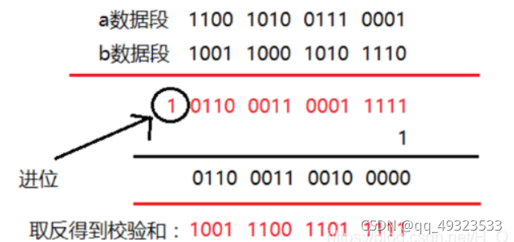
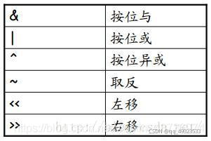

# ue4知识点

## NavMesh寻路

Recast（使用体素化）：创建体素模型，把模型分割成简单的区域，把这些区域再分割成简单多边形，之后使用体素创建导航网格。
Detour：利用Recast导航网格进行寻路,寻路算法是A*，漏斗算法平滑路径

> 生成Navmesh数据主要有两种方式：多边形裁剪和体素化。
> 多边形裁剪是直接对地形的多边形网格数据进行裁剪及合并，从而生成导航网格。
> 体素化是对地形多边形网格进行栅格化，然后用这些“格子”重新生成导航网格

> 体素模型：采用大量规则体素（如立方体）的有序组合来表示三维物体的模型

# 数据结构

## 大顶堆 小顶堆

```cpp
//降序队列，大顶堆
priority_queue<int>que;
//等价于
priority_queue<int,vector<int>,less<int> >que;

//升序队列，小顶堆
priority_queue <int,vector<int>,greater<int> > q;

//greater和less是std实现的两个仿函数（就是使一个类的使用看上去像一个函数。其实现就是类中实现一个operator()，这个类就有了类似函数的行为，就是一个仿函数类了）
```

## 红黑树

1. 根节点和叶子节点必须是黑色，不能有两个红色节点相邻

   每次插入元素的时候会将 元素 着色为红色。其目的为了快的满足红黑树的4个条件

   

   > ```
   > 插入	/ -> ⋀     \ -> ⋀   < ->/(父子换位) ->⋀ 	> ->\(父子换位) ->⋀ 
   > ```

删除操作

```cpp
#include<iostream>
using namespace std;
#define RED 0
#define BLACK 1

//每个节点都有  值  两个儿子  一个爹  颜色 
struct TreeNode
{
	int val;
	bool color;
	struct TreeNode*left;
	struct TreeNode*right;
	struct TreeNode*parent;
	TreeNode(int val):val(val),color(RED),left(nullptr),right(nullptr),parent(nullptr){}
};

class RBT
{
	TreeNode* _root;
public:
	RBT();
	~RBT();
	void left_rotate(TreeNode*n);
	void right_rotate(TreeNode*n);
	void insert_node(TreeNode*);
	void insert_fixup(TreeNode*);
	void delete_node(TreeNode*);
	void delete_fixup(TreeNode*, TreeNode*);
	void preOrder(TreeNode*) const;
	void inOrder(TreeNode*) const;
	TreeNode* getRoot()const { return _root; }
};

RBT::RBT()
	:_root(nullptr)
{
	cout << "RBT()" << endl;
}
RBT::~RBT()
{
	cout << "~RBT()" << endl;
}

//先序遍历 中左右
void RBT::preOrder(TreeNode*root)const
{
	if (root)
	{
		cout << root->val << " ";
		preOrder(root->left);
		preOrder(root->right);
	}
}
//中序遍历 左中右
void RBT::inOrder(TreeNode* root) const
{
	if (root)
	{
		inOrder(root->left);
		cout << root->val << " ";
		inOrder(root->right);
	}
}

//左旋
void RBT::left_rotate(TreeNode*x)
{
	TreeNode*y = x->right;
	x->right = y->left;
	if (y->left)
	{
		y->left->parent = x;
	}
	y->parent = x->parent;
	//用y替换x
	if (_root == x)
		_root = y;
	else if (x == x->parent->left)
		x->parent->left = y;
	else if (x == x->parent->right)
		x->parent->right = y;
	//x成为自己右儿子的左儿子
	y->left = x;
	x->parent = y;
}

void RBT::right_rotate(TreeNode*x)
{
	TreeNode*y;
	y = x->left;
	x->left = y->right;
	if (y->right)
	{
		y->right->parent = x;
	}

	y->parent = x->parent;
	if (_root == x->parent)
	{
		_root = y;
	}
	else if (x == x->parent->left)
	{
		x->parent->left = y;
	}
	else if (x == x->parent->right)
	{
		x->parent->right = y;
	}
	y->right = x;
	x->parent = y;
}

void RBT::insert_node(TreeNode*node)//找到位置 然后调整
{
	TreeNode* curr = _root, *pre = nullptr;
	while (curr)
	{
		pre = curr;
		if (node->val < curr->val)
		{
			curr = curr->left;//小值在左子树插入
		}
		else if (node->val > curr->val)
		{
			curr = curr->right;//大值在右子树插入
		}
		else return;//已经存在这个值，无需添加
	}//遍历完 pre成了curr的爸爸
	node->parent = pre;
	if (!pre)
	{
		_root = node;//创建新树
	}
	else {
		if (node->val < pre->val)
		{
			pre->left = node;
		}
		else
		{
			pre->right = node;
		}
	}

	insert_fixup(node);
}
/*
我们在插入时选择插入红色的节点。
插入的几种情况：
1.插入节点后，父节点为空，说明此树原本一颗空树，只需要将节点颜色染黑即可；
2.插入节点后，父节点为黑色，并不会破坏红黑树的性质，则什么都不用做；
3.插入节点后，父节点为红色，叔节点存在并且也为红色，那么将 祖父节点，父节点，叔节点颜色翻转，并检查祖父节点是否为根节点；
4.插入节点后，父节点为红色，叔节点不存在，该种情况较为复杂：
1）如果插入的节点是在父节点的左边，那么将祖父节点向右旋转，并将父节点与祖父节点的颜色翻转即可；
2）如果插入的节点是在父节点的右边，那么先向父节点左旋转，再执行1）操作即可。
*/

void RBT::insert_fixup(TreeNode*node)
{
	TreeNode*parent, *uncle, *gparent;
	while ((parent = node->parent) != nullptr && parent->color == RED)//node有parent且parent是红色
	{
		gparent = parent->parent;
		if (parent == gparent->left)//父节点在祖父左边
		{
			//变色
			if ((uncle = gparent->right) != nullptr&&uncle->color == RED)
			{
				parent->color = BLACK;
				uncle->color = BLACK;
				gparent->color = RED;
				node = gparent;
				continue;//将祖父当成新插入的节点进行调整
			}
			// 4.2） "<" 左旋+换色 变成  4.1）"/"
			if (parent->right == node)
			{
				left_rotate(parent);
				TreeNode*t = parent;
				parent = node;
				node = t;
			}

			//4.1) "/" 换色+右旋 变成"^"
			parent->color = BLACK;
			gparent->color = RED;
			right_rotate(gparent);
		}
		else //对称操作
		{
			//情况3
			if ((uncle = gparent->left) != nullptr && uncle->color == RED) {
				parent->color = BLACK;
				uncle->color = BLACK;
				gparent->color = RED;
				node = gparent;
				continue; //将祖父当成新插入的节点进行调整
			}
			//情况4
			if (parent->left == node) {//可能是情况4中的2）情况，那么先进行一次旋转
				right_rotate(parent);
				TreeNode* t = parent;
				parent = node;
				node = t;
			}
			//情况4中1）情况
			parent->color = BLACK;
			gparent->color = RED;
			left_rotate(gparent);
		}
	}		
	_root->color = BLACK;
}

/*
删除节点：
一.删除节点有两个子节点，可以转化成删除单个子节点或者叶子节点的情况；

二.删除节点有单个子节点，那么待删除节点必为黑色，子节点必为红色，将子节点顶上去，再染成黑色即可；

三.删除叶子节点，该叶子节点为红色，那么直接删除即可；

四.删除叶子节点，该叶子节点为黑色，该叶子节点一定有兄弟节点，这种情况比较复杂，需要分情况讨论：（此时只讨论叶子节点在左侧的情况，右侧属于对称情况）

1. 如果兄弟节点为红色，那么将兄弟节点染黑，兄弟节点的左儿子染红，再左转即可。

2. 如果兄弟节点为黑色且为叶子节点，那么将兄弟节点染红，由于此时黑色节点数目不均衡，所以需要再次对父节点进行调整；

3. 如果兄弟节点为黑色且不为叶子节点，那么兄弟节点的孩子一定为红色，又有以下三种情况：
1）兄弟节点有一个红色右孩子，经过如下变换：
将父节点的颜色赋值给兄弟节点，再将父节点，兄弟节点的右孩纸颜色染成黑色，最后左旋

2）兄弟节点有一个红色左孩子，经过如下变换：
将兄弟节点染红，兄弟节点左孩子染黑，最后对兄弟节点右转，也就回到了1）的情况

3）兄弟节点有两个红色孩子，经过如下变换：
该情况实质上也和情况1）是一样的，将父节点的颜色赋值给兄弟节点，再将父节点，兄弟节点的右孩纸颜色染成黑色，最后左旋

*/

void RBT::delete_node(TreeNode*node)
{
	//replace代表删除之后顶替上来的节点
	//parent为replace节点的父节点
	TreeNode*replace = nullptr, *parent = nullptr;
	if (node->left&&node->right)//如果删除的节点有左右孩子，那么找到左子树最大的孩子或者右子树最小的孩子进行替换
	{
		TreeNode*succ = nullptr;
		for (succ = node->left; succ->right; succ = succ->right);
		node->val = succ->val;
		delete_node(succ);
		return;
	}
	else
	{
		if (!node->parent)//删除的是根
		{
			_root = (node->left ? node->left : node->right);
			replace = _root;
			if (_root)
			{
				_root->parent = nullptr;
			}
		}
		else
		{
			//删除的不是根
			TreeNode* child = (node->left ? node->left : node->right);
			if (node->parent->left == node)
				node->parent->left = child;
			else
				node->parent->right = child;

			if (child)
				child->parent = node->parent;
			replace = child;
			parent = node->parent;
		}
	}
	//如果删除节点为红色，直接结束
	if (node->color == RED)
		delete_fixup(replace, parent);
}

void RBT::delete_fixup(TreeNode* replace, TreeNode* parent)
{
	TreeNode* brother = nullptr;
	// 如果顶替结点是黑色结点，并且不是根结点。
	//由于经过了上面的deleteNode方法，这里面parent是一定不为null的
	while ((replace == nullptr || replace->color == BLACK) && replace != this->_root) {
		//左孩子位置的所有情况，
		if (parent->left == replace) {
			brother = parent->right;
			// case1 红兄，brother涂黑，parent涂红，parent左旋，replace的兄弟改变了，变成了黑兄的情况
			if (brother->color == RED) {
				brother->color = BLACK;
				parent->color = RED;
				left_rotate(parent);
				brother = parent->right;
			}
			// 经过上面，不管进没进if，兄弟都成了黑色
			// case2 黑兄，且兄弟的两个孩子都为黑
			if ((brother->left == nullptr || brother->left->color == BLACK) && (brother->right == nullptr || brother->right->color == BLACK)) {
				// 如果parent此时为红，则把brother的黑色转移到parent上
				if (parent->color == RED) {
					parent->color = BLACK;
					brother->color = RED;
					break;
				}
				else {// 如果此时parent为黑，即此时全黑了，则把brother涂红，导致brother分支少一个黑，使整个分支都少了一个黑，需要对parent又进行一轮调整
					brother->color = RED;
					replace = parent;
					parent = replace->parent;
				}
			}
			else {
				// case3 黑兄，兄弟的左孩子为红色
				if (brother->left != nullptr && brother->left->color == RED) {
					brother->left->color = parent->color;
					parent->color = BLACK;
					right_rotate(brother);
					left_rotate(parent);
					// case4 黑兄，兄弟的右孩子为红色
				}
				else if (brother->right != nullptr && brother->right->color == RED) {
					brother->color = parent->color;
					parent->color = BLACK;
					brother->right->color = BLACK;
					left_rotate(parent);
				}
				break;
			}
		}
		else {//对称位置的情况，把旋转方向反回来
			brother = parent->left;
			// case1 红兄，brother涂黑，parent涂红，parent左旋，replace的兄弟改变了，变成了黑兄的情况
			if (brother->color == RED) {
				brother->color = BLACK;
				parent->color = RED;
				right_rotate(parent);
				brother = parent->left;
			}
			// 经过上面，不管进没进if，兄弟都成了黑色
			// case2 黑兄，且兄弟的两个孩子都为黑
			if ((brother->left == nullptr || brother->left->color == BLACK)
				&& (brother->right == nullptr || brother->right->color == BLACK)) {
				// 如果parent此时为红，则把brother的黑色转移到parent上
				if (parent->color == RED) {
					parent->color = BLACK;
					brother->color = RED;
					break;
				}
				else {// 如果此时parent为黑，即此时全黑了，则把brother涂红，导致brother分支少一个黑，使整个分支都少了一个黑，需要对parent又进行一轮调整
					brother->color = RED;
					replace = parent;
					parent = replace->parent;
				}
			}
			else {
				// case3 黑兄，兄弟的左孩子为红色，右孩子随意
				if (brother->right != nullptr && brother->right->color == RED) {
					brother->right->color = parent->color;
					parent->color = BLACK;
					left_rotate(brother);
					right_rotate(parent);
					// case4 黑兄，兄弟的右孩子为红色，左孩子随意
				}
				else if (brother->left != nullptr && brother->left->color == RED) {
					brother->color = parent->color;
					parent->color = BLACK;
					brother->left->color = BLACK;
					right_rotate(parent);
				}
				break;
			}
		}
	}
	//这里可以处理到删除结点为只有一个孩子结点的情况，如果是根，也会将其涂黑。
	if (replace != nullptr)
		replace->color = BLACK;
}
```

1. 平衡二叉搜索树&红黑树

|                    | AVL                      | 红黑树            |
| ------------------ | ------------------------ | ----------------- |
| 定义               | 左右子树的高度差最大为1  | 黑结点的高度一样  |
| 插入（最差情况     | 两次旋转 o(1)            | 两次旋转 o(1)     |
| 删除               | 需要回溯多个节点 o(logn) | 最多三次旋转 o(1) |
| 搜索效率（平衡性） | 高                       | 低                |
| 统计性能           | 低                       | 高                |
| 使用场景           | 查找多                   | 插入删除多        |

1. 跳表&红黑树

|                | 红黑树           | 跳表           |
| -------------- | ---------------- | -------------- |
| 定义           | 黑结点的高度一样 | 多层的有序链表 |
| 查找一个范围   | o(logn)          | logn*o(logn)   |
| 增删改查一个数 | o(logn)          | o(logn)        |

# 计算机网络

## 交换机&路由器&网关

路由器相当于邮局，把信投递到收件人地址，它的任务就完成了。但是信邮到了你们宿舍楼，而这个地址不是你一个人专享的，所以楼管王大爷还要负责把信给到你手里，他不会关心收件人地址，只看收件人姓名，然后打个内线电话叫你来取信。如果没有邮局，你没法向世界各地的漂亮妹子们发信，也没法从楼外的漂亮妹子那里收信。
但是因为楼管王大爷的存在，你仍然可以通过他与同宿舍楼的好基友书信往来。所有邮局构成的系统，就是“广域网”，而你的宿舍楼，就是“局域网”，构建局域网是不需要路由器的。

路由器会在局域网自动分配IP，实现虚拟拨号
路由器在网络层，路由器根据IP地址寻址，路由器可以处理TCP/IP协议
路由器能将一个IP分配给超多个主机使用，主机对外ip也是同一个
路由器是用来做网间连接，也就是用来连接不同的网络。

交换机只是用来分配网络数据的。
交换机在中继层，交换机根据MAC地址寻址。
交换机是可以将不同的主机连接起来，对外表现的IP也可各有不同。
集线器、交换机都是做端口扩展的，就是扩大局域网(通常都是以太网)的接入点，也就是能让局域网可以连进来更多的电脑。

网关这种设备它主要是用来连接两种不同的网络，两边的主机是不能够直接进行通信，是必须要经过网关才能进行通信。网关的工作是在应用层当中。
网关它可以是路由器，交换机或者是PC。在同一网段之内进行通信，是不需要将网关介入其中，只有当主机非本网段设备进行通信的时候，才需要将数据包全部发给网关设备，再经由网关设备进行转发或者是有路由处理等。

## IP地址的分类

A、B、C是基本类，D、E类作为多播和保留使用。
A类地址：以0开头， 第一个字节范围：1~126（1.0.0.0 - 126.255.255.255）；
B类地址：以10开头， 第一个字节范围：128~191（128.0.0.0 - 191.255.255.255）；
C类地址：以110开头， 第一个字节范围：192~223（192.0.0.0 - 223.255.255.255）；
D类地址：以1110开头，第一个字节范围：224~239（224.0.0.0 - 239.255.255.255）；（作为多播使用）
E类地址：保留

以下是留用的内部私有地址：
A类 10.0.0.0–10.255.255.255
B类 172.16.0.0–172.31.255.255
C类 192.168.0.0–192.168.255.255

IP地址与子网掩码相与得到网络号：
ip:192.168.2.110 & submask:255.255.255.0 = 网络号：192.168.2 .0

主机号，全为0的是网络号（例如：192.168.2.0），主机号全为1的为广播地址（192.168.2.255）

## 数据链路层

传送的数据单位是帧（每一帧包括数据和必要的控制信息（如同步信息，地址信息，差错控制等）），链路层保证被传输数据的正确性。
封装成帧 ：在一段数据的前后分别添加首部和尾部，然后就构成了一个帧，首部和尾部的一个重要作用就是进行帧定界。
透明传输：在数据传输过程中，如果数据中的某个字节的二进制代码恰好和 SOH 或 EOT 一样，数据链路层就会错误地“找到帧的边界”从而导致这些数据有差错地通过这个数据链路层。解决透明传输问题：字符填充 (插入转义字符)
差错检测：在传输过程中可能会产生比特差错：1 可能会变成 0， 而 0 也可能变成 1。在一段时间内，传输错误的比特占所传输比特总数的比率称为**误码率** BER (Bit Error Rate)，误码率与信噪比有很大的关系，为了保证数据传输的可靠性，在计算机网络传输数据时，必须采用各种差错检测措施，在数据链路层传送的帧中，广泛使用了循环冗余检验 CRC 的检错技术。

## OSI七层模型&TCP五层模型


每一层的作用如下：
物理层：通过媒介传输比特,确定机械及电气规范（比特Bit）
数据链路层：将比特组装成帧和点到点的传递（帧Frame）
网络层：负责数据包从源到宿的传递和网际互连（包PackeT）
传输层：提供端到端的可靠报文传递和错误恢复（段Segment）
会话层：建立、管理和终止会话（会话协议数据单元SPDU）
表示层：对数据进行翻译、加密和压缩（表示协议数据单元PPDU）
应用层：允许访问OSI环境的手段（应用协议数据单元APDU）

## TCP粘包

由于TCP协议发送的是字节流， TCP 的首部没有表示数据长度的字段，TCP把这些数据块仅仅看成一连串无结构的字节流，当两个数据包连在一起时，服务端接收到一串包含两个数据包的数据，无法区分。
产生原因：
1.发送方产生粘包：发送的数据包过小时，TCP启用NAgle算法，奖这些较小的数据包合并发送，这个合并过程在缓冲区进行，数据发出来就是粘包状态了。简而言之：要发送的数据小于 TCP 发送缓冲区的大小，TCP 将多次写入缓冲区的数据一次发送出去，将会发生粘包。
2.接收方产生粘包：数据到接收方，从网络模型的下方传递至传输层，传输层的 TCP 协议处理是将其放置接收缓冲区，然后由应用层来主动获取（C 语言用 recv、read 等函数）；这时我们在程序中调用的读取数据函数不能及时的把缓冲区中的数据拿出来，而下一个数据又到来并有一部分放入的缓冲区末尾，等我们读取数据时就是一个粘包。（放数据的速度 > 应用层拿数据速度）。一句话：接收数据端的应用层没有及时读取接收缓冲区中的数据，将发生粘包。
解决方法：
在每个包的末尾加上特殊字符，用以区分连续的两个包；
在报文首部添加包的长度。

## ARP协议

ARP是地址解析协议
每个主机都会在自己的ARP缓冲区中建立一个ARP列表，以表示IP地址和MAC地址之间的对应关系。
当源主机要发送数据时，首先检查ARP列表中是否有对应IP地址的目的主机的MAC地址，如果有，则直接发送数据，如果没有，就向本网段的所有主机发送ARP数据包，该数据包包括的内容有：源主机 IP地址，源主机MAC地址，目的主机的IP 地址。
当本网络的所有主机收到该ARP数据包时，首先检查数据包中的IP地址是否是自己的IP地址，如果不是，则忽略该数据包，如果是，则首先从数据包中取出源主机的IP和MAC地址写入到ARP列表中，如果已经存在，则覆盖，然后将自己的MAC地址写入ARP响应包中，告诉源主机自己是它想要找的MAC地址。
源主机收到ARP响应包后。将目的主机的IP和MAC地址写入ARP列表，并利用此信息发送数据。如果源主机一直没有收到ARP响应数据包，表示ARP查询失败。

广播发送ARP请求，单播发送ARP响应。

## ARQ协议

自动重传请求ARQ：发送给接收方一段时间没有收到确认回执，就重新发送。ARQ分为停止等待ARQ协议和连续ARQ协议
停止等待ARQ协议：在停止等待中接收端没有接收到发送端发来的分组，就不会给发送端发送确认回执，发送端会维护一个超时计时器，超时时间一般会比数据在传输往返过程中长一些，超时后发送端会重新发送之前的报文分组。
连续ARQ协议：发送端会维护一个窗口，窗口内可以有多个分组，窗口的大小就是窗口能容纳分组的个数，位于窗口内的分组可以连续发送不必等待确认回执，对按序到达的最后一个分组，接收端会发送确认回执，如果有分组没能正确到达，会从该分组往后重新发送给接收端。
eg：send：1，2，3，4 receive：1，2，4 report：2 send：3，4 receive：3，4 report:4 finished

## 应用层协议

ICMP协议： 因特网控制报文协议。
FTP:文件传输协议（TCP对应的协议）
Telnet：一种用于远程登陆的端口（TCP对应的协议）
SSH：远程登录协议,用于加密安全登陆
HTTP:web服务器传输超文本到本地浏览器的超文本传输协议。（TCP对应的协议）
HTTPS:安全超文本传输协议
SMTP:简单邮件传输协议，用来发送电子邮件（TCP对应的协议）
POP3：它是和SMTP对应，用于接收邮件（TCP对应的协议）

NAT协议：网络地址转换属接入广域网(WAN)技术，是一种将私有（保留）地址转化为合法IP地址的转换技术，
DNS：域名解析协议,用于完成地址查找，邮件转发等工作。（UDP对应的协议）
TFTP：简单文件传输协议（UDP对应的协议）
SNMP：简单网络管理协议,用于网络信息的收集和网络管理。（UDP对应的协议）
DHCP协议：动态主机配置协议

## RARP协议

RARP是逆地址解析协议，作用是完成硬件地址到IP地址的映射

## 面向有连接型和面向无连接型

面向有连接型传输包括会话建立、传输数据和会话断开，此外还包括保证传输可靠性的各种措施，比如超时重传、流量控制等，常见的面向有连接传输有TCP；
面向无连接型传输仅提供基本的传输数据的功能，即使接收端不存在，发送端也能发送数据包，常见的面向无连接传输有UDP、IP。

## select poll epoll


## 并发和并行

并行(parallel)：指在同一时刻，有多条指令在多个处理器上同时执行。所以无论从微观还是从宏观来看，二者都是一起执行的。

并发(concurrency)：指在同一时刻只能有一条指令执行，但多个进程指令被快速的轮换执行，使得在宏观上具有多个进程同时执行的效果，但在微观上并不是同时执行的，只是把时间分成若干段，使多个进程快速交替的执行。


## 网络游戏数据同步

竞技类网络游戏，几乎都是帧同步。需要更高速的数据同步
传统冒险类网络游戏，几乎都是状态同步。
数据同步方式主要分为以下三种：状态同步、帧同步、混合同步

1. 状态同步
   由主机或服务器进行游戏逻辑运算。所有的客户端发送【操作指令】数据到主机或服务端，由主机或服务器处理过逻辑运算后，将场景中相应的物体状态数据，下发到每个客户端，完成同步。


1. 帧同步
   帧同步主要依赖客户端的能力，服务器仅仅是做一个转发，甚至客户端可以无需服务器，通过P2P方式来转发数据。由于只是转发游戏的行为，所以广播的数据量比状态同步要小很多。非常适合游戏行为非常频繁的动作游戏，诸如飞行射击、FPS、RTS（即时战略）
   


\3. 混合同步
状态同步 + 帧同步
正常同步时使用帧同步，当掉线、存档、回滚、或重播、速播的时候，使用状态同步

## DNS

主要的作用就是将人们所熟悉的网址 (域名) “翻译”成电脑可以理解的 IP 地址，这个过程叫做 DNS 域名解析。

DNS查询的完整过程


> 为什么选择基于UDP协议发起DNS查询，而非TCP
> 响应时间 = DNS域名解析时间 + TCP 连接建立时间 + HTTP交易时间
> 其中，TCP 连接建立需要三次挥手，HTTP交易一来一回，都不可能减少，所以只能让DNS域名解析的时间越小越好
> 但是UDP发送的报文不能超过576字节，所以将 DNS 报文限制在 512 字节，超过的DNS查询会被截断，当 DNS 查询被截断时，应该使用 TCP 协议进行重试

## ping

当在局域网中使用ping www.xxx.com时

通过DNS协议，将ping后接的域名转换为ip地址。

通过ARP解析服务，由ip地址解析出MAC地址，以在数据链路层传输。

ping是为了测试另一台主机是否可达，发送一份ICMP回显请求给目标主机，并等待ICMP回显应答。（ICMP用于在ip主机、路由器间传递网络是否通畅、主机是否可达等控制信息）

## 可靠传输

TCP可靠传输的原因：

- 确认机制（三次握手四次挥手）：
  
- 超时重传：
  发送方没有接收到响应的ACK报文原因可能有两点：
  数据在传输过程中由于网络原因等直接全体丢包，接收方根本没有接收到。
  接收方接收到了响应的数据，但是发送的ACK报文响应却由于网络原因丢包了。
  如果是刚才第一个原因，接收方收到二次重发的数据后，便进行ACK应答。
  如果是第二个原因，接收方发现接收的数据已存在（判断存在的根据就是序列号，所以上面说序列号还有去除重复数据的作用），那么直接丢弃，仍旧发送ACK应答。
- 拥塞控制：原因：拥堵的加剧就会产生大量的丢包，就对大量的超时重传，严重影响传输。
  拥塞窗口：发送刚开始定义拥塞窗口为 1，每次收到ACK应答，拥塞窗口加 1。
  实际窗口大小=min（拥塞窗口，滑动窗口）
  慢启动：在开始发送数据时，先发送少量的数据探路。在慢启动开始的时候，慢启动的阈值等于窗口的最大值，拥塞窗口的增长是指数级别的。慢启动的机制只是说明在开始的时候发送的少，发送的慢，但是增长的速度是非常快的。
  
  为了控制拥塞窗口的增长，不能使拥塞窗口单纯的加倍，设置一个拥塞窗口的阈值，当拥塞窗口大小超过阈值时，不能再按照指数来增长，而是线性的增长。
  快恢复：一旦造成网络拥塞，发生超时重传时，慢启动的阈值会为原来的一半（这里的原来指的是发生网络拥塞时拥塞窗口的大小），同时拥塞窗口从此阈值线性增长。
- 流量控制：滑动窗口协议，定义一个固定大小的缓冲空间，TCP的接收端只允许发送端发送接收端缓冲区能接纳的数据。当接收方来不及处理发送方的数据，能提示发送方降低发送的速率，防止包丢失。
- 数据校验：校验和
  

UDP实现可靠传输： 在应用层实现确认机制、重传机制、窗口机制。

## http & https

http协议是应用层的协议，中文名称是超文本传输协议，是客户端和服务端相互通信时将信息以http报文的形式传输。
https可以简单的理解为：https = http + 加密 + 认证 + 完整性保护。

http协议是无状态协议:协议自身不对请求和响应之间的通信状态进行保存，即对发送过来的请求和响应都不做持久化处理，把http协议设计的如此简单是为了更快地处理大量事务。
为了解决http协议不能保存通信状态的问题，引入了Cookie状态管理。Cookie技术通过在请求和响应报文中写入Cookie信息来控制客户端的状态。Cookie会根据从服务端发送的响应报文的一个叫Set-Cookie的首部字段，通知客户端保存Cookie。当下次客户端再往该服务端发送请求时，客户端会自动在请求报文中加入Cookie值发送出去，服务端发现客户端发来的Cookie后，会检查是哪一个客户端发来的连接请求，对比服务器上的记录，最后得到之前的状态信息。

http协议的缺点:
通信使用明文，内容可能被窃听。
通信双方的身份无法得到认证，身份可能遭遇伪装。
无法验证报文的完整性。

https的改进措施:
加密。https协议通过SSL或者TLS协议将报文内容进行加密，client端进行加密，server端进行解密。
认证。通过值得信赖的第三方机构颁布证书，即可确认通信双方的身份。客户端持有证书即可完成客户端身份的确认，客户端通信前会查看服务端的证书。
完整性保护。可以通过MD5等散列码进行通信内容的校验。

HTTP请求体由：请求行 、请求头、请求数据组成的
HTTP的响应报是服务器返回给我们的数据，必须先有请求体再有响应报文。响应报文包含三部分： 状态行、响应首部字段、响应内容实体实现

## 加密算法

对信息进行编码和解码的技术，编码是把原来可读信息（又称明文）译成代码形式（又称密文），其逆过程就是解码（解密）

1. 对称加密：AES
   基本原理：将明文分成 N 个组，然后使用密钥对各个组进行加密，形成各自的密文，最后把所有的分组密文进行合并，形成最终的密文。
   优点：算法公开、计算量小、加密速度快、加密效率高
   缺点：双方都使用同样密钥，安全性得不到保证
2. 非对称加密：RSA
   基本原理：同时生成两把密钥：私钥和公钥，私钥隐秘保存，公钥可以下发给信任客户端
   私钥加密，持有私钥或公钥才可以解密
   公钥加密，持有私钥才可解密
   优点：安全，难以破解
   缺点：算法比较耗时
3. 不可逆加密：MD5，SHA
   基本原理：加密过程中不需要使用密钥，输入明文后由系统直接经过加密算法处理成密文，这种加密后的数据是无法被解密的，无法根据密文推算出明文。

## HTTP请求方法 get&post

GET - 从指定的资源请求数据。
POST - 向指定的资源提交要被处理的数据。

|                  | GET                                | POST                  |
| ---------------- | ---------------------------------- | --------------------- |
| 后退/刷新        | 无害                               | 数据被重新提交        |
| 书签             | 可收藏为书签                       | 不可                  |
| 缓存             | 能被缓存                           | 不能被缓存            |
| 历史             | 参数保留在历史中                   | 参数不会保留在历史中  |
| 对数据长度的限制 | 向 URL 添加数据；URL最长2048个字节 | 无限制                |
| 对数据类型的限制 | ASCII                              | 没有限制              |
| 安全性           | 不安全                             | 安全                  |
| 可见性           | 数据在 URL 中对所有人都是可见的    | 数据不会显示在 URL 中 |

## 常见的http动词

GET: 从服务器获取资源
POST: 在服务器新建资源
PUT: 在服务器更新资源
DELETE: 在服务器删除资源
HEAD: 获取资源的元数据
OPTIONAL: 查询对指定的资源支持的方法

## http状态码

200： 请求被正常处理
204： 请求被受理但没有资源可以返回
301： 永久性重定向
302： 临时重定向
304： 已缓存
400： 请求报文语法有误，服务器无法识别
403： 请求的对应资源禁止被访问
404： 服务器无法找到对应资源
500： 服务器内部错误
503： 服务器正忙

## URI和URL的区别

URI: Uniform Resource Identifier，统一资源标识符，用来唯一标识互联网中的一份资源。
URL: Uniform Resource Locator，统一资源定位符，我们访问网站的网址就是URL。

URL是URI的子集。

URI的目的就是唯一标识互联网中的一份资源，具体可以用资源名称、资源地址等，但是资源地址是目前使用最广泛的
URI相当于抽象类，URL就是这个抽象类的具体实现类。

## 输入网址到获取网页的过程

浏览器搜索自身的DNS缓存、搜索操作系统的DNS缓存、读取本地的Host文件和向本地DNS服务器进行查询等。
对于向本地DNS服务器进行查询，如果要查询的域名包含在本地配置区域资源中，则返回解析结果给客户机，完成域名解析(此解析具有权威性)；如果要查询的域名不由本地DNS服务器区域解析，但该服务器已缓存了此网址映射关系，则调用这个IP地址映射，完成域名解析（此解析不具有权威性）。如果本地域名服务器并未缓存该网址映射关系，那么将根据其设置发起递归查询或者迭代查询；
浏览器获得域名对应的IP地址以后，浏览器向服务器请求建立链接，发起三次握手；
TCP/IP链接建立起来后，浏览器向服务器发送HTTP请求；
服务器接收到这个请求，并根据路径参数映射到特定的请求处理器进行处理，并将处理结果及相应的视图返回给浏览器；
浏览器解析并渲染视图，若遇到对js文件、css文件及图片等静态资源的引用，则重复上述步骤并向服务器请求这些资源；
浏览器根据其请求到的资源、数据渲染页面，最终向用户呈现一个完整的页面

# 图形学

## 双缓冲

## 碰撞检测之包围盒

1. 包围盒算法是一种求解离散点集最优包围空间的方法
   基本思想是用体积稍大且特性简单的集合体近似代替复杂的几何体。
   最常见的包围盒算法有AABB包围盒，包围球，方向包围盒OBB以及固定方向凸包FDH
2. AABB包围盒
   又称轴对齐包围盒，包围盒对应的长方体每一个面都是与某个坐标轴平面平行的
   采用一个长方体将物体包裹起来，进行两个物体的相交性检测时仅检测物体对应包围盒（包裹物体的长方体）的相交性。
   
   如果在程序运行过程中，物体发生了移动，那就需要根据移动后的位置计算产生新包围盒对象，getCurrAABBBox方法需要传递物体移动后位置的 3 个坐标分量，用于与原始包围盒的 6 个 参数进行运算，产生移动后包围盒的 6 个参数。
   
3. AABB 包围盒的碰撞检测
   

# 游戏方面

## 优化

## IK逆向运动学

# 算法

## top k

在n个数中找出最大的k个数
S1：排序后取前k个数
S2：k次冒泡最大的数 O(kn)
S3：只找到TopK，不排序TopK。取前k个数维护一个小顶堆，从k+1个数开始 和小顶堆中最小的数（堆顶）替换，直到n。 O(nlgk)
S4：随机选择算法，减治思想，类似快排，把需要的范围缩小


## 剪绳子

思路：动态规划
每次得到了每段绳子和另一段的乘积的最大值，记录下来。取得最大

```cpp
#include<iostream>
#include<vector>
#include<algorithm>
using namespace std;
class Solution {
public:
	int cuttingRope(int n) {
		if (n < 4) return n - 1;
		vector<int> arr(n + 1, 0);
		arr[0] = 0;
		arr[1] = 1;
		arr[2] = 2;
		arr[3] = 3;
		for (int i = 4; i <= n; i++)
		{
			for (int j = 1; j <= i / 2; j++)
			{
				arr[i] = max(arr[i], arr[j] * arr[i - j]);
				cout<<"i:"<<i<<"  arr[i]:"<<arr[i]<<endl;
			}
		}
		return arr[n];
	}
};

int main()
{
	Solution sol;
	sol.cuttingRope(10);
}
```


## 快速排序


然后递归左边的数组和右边的数组的到结果。

**注**：当基准数选择最左边的数字时，那么就应该先从右边开始搜索；当基准数选择最右边的数字时，那么就应该先从左边开始搜索。不论是从小到大排序还是从大到小排序！

```cpp
void QuickSort(int left,int right,vector<int>arr)
{
	if(left>=right)
		return;
	int flag=arr[left];
	int i=left,j=right;
	while (i<j)
	{
		while(arr[j]>flag&&i<j)
			j--;
		while(arr[i]<flag&&i<j)
			i++;
			if(i<j)
			{ 
				int temp = arr[i];
				arr[i] = arr[j];
				arr[j] = temp;
			}

	}
	arr[left]=arr[i];
	arr[i]=flag;//基准数归位
	QuickSort(left,i-1,arr);
	QuickSort(i+1,right,arr);
}
```

## 重建二叉树


```cpp
class Solution {
private:
	vector<int> preorder;
    unordered_map<int, int> dic;

    TreeNode*recur(int root,int left,int right)
    {
        if(left>right) return nullptr;
        TreeNode*node=new TreeNode(preorder[root]);
        int i = dic[preorder[root]];
        node->left=recur(root+1,left,i-1);
        node->right=recur(root+i-left+1,i+1,right);
        return node;
    }
public:
    TreeNode* buildTree(vector<int>& preorder, vector<int>& inorder) {
            this->preorder=preorder;
            for (int i = 0; i < inorder.size(); i++)
			    dic[inorder[i]] = i;
            return recur(0,0,inorder.size()-1);

    }
};
```

## 动态规划(斐波那契数列)

> 迭代是自顶向下（带有备忘录可以减小计算量,剪枝）

直接迭代超时


用一个备忘数组来剪枝

```cpp
class Solution {
public:
    int fib(int n) {
        if(n==0) return 0;
        if(n==1||n==2) return 1;
        vector<int>dp(n+1);
        dp[0]=0,dp[1]=1;
        for(int i =2;i<=n;i++)
        {
            dp[i]=(dp[i-1]+dp[i-2])%1000000007;
        }
        return dp[n];
    }
};
```


动态规划是自底向上

通过拆分子问题，记住过往，减少重复计算

> 动态规划有几个典型特征，最优子结构、状态转移方程、边界、重叠子问题。在青蛙跳阶问题中：
> f(n-1)和f(n-2) 称为 f(n) 的最优子结构
> f(n)= f（n-1）+f（n-2）就称为状态转移方程
> f(1) = 1, f(2) = 2 就是边界啦
> 比如f(10)= f(9)+f(8),f(9) = f(8) + f(7) ,f(8)就是重叠子问题。


> 什么样的问题可以考虑使用动态规划解决呢？
> 如果一个问题，可以把所有可能的答案穷举出来，并且穷举出来后，发现存在重叠子问题，就可以考虑使用动态规划。比如一些求最值的场景，如最长递增子序列、最小编辑距离、背包问题、凑零钱问题等等

矩阵快速幂
找出递推关系矩阵


```cpp
//这里用的是pow函数，没用快速幂
class Solution {
public:
    int fib(int n) {
        if (n <= 1) 
            return n;
        vector<vector<long>> mat = {{1, 1},
                                    {1, 0}};
        vector<vector<long>> ans = {{1},
                                    {0}};
        ans = pow(mat, n-1)*ans;
        return ans;
        }
};
```

## 大数据小内存的排序

思路:多路归并排序

## BFS DFS(Depth)

DFS适合目标明确，而BFS适合大范围的寻找。
这两种算法都可以使用的递归的方式，其中dfs还可以用栈来实现，bfs还可以用队列实现


```cpp
#include<iostream>
#include <cstdio>
#include <list>
#include <vector>
#include <queue>
#include<stack>
#include<fstream>
using namespace std;
int n;
vector< list<int> > graph;
bool visited[100] = { 0 };
void CreateGraph()
{
	cout << "input the vertex num:" << endl;
	cin >> n;
	vector< list<int> >::iterator it;
	for (int i = 0; i < n; ++i)
	{
		list<int> i1;
		int t;
		while (cin >> t && t != n)//输入每个顶点相连的图，以最终节点为结束标志
			i1.push_back(t);
		graph.push_back(i1);
	}
}

void dfs(int v)//以v开始做深度优先搜索
{
	list<int>::iterator it;
	visited[v] = true;
	cout << v << " ";
	for (it = graph[v].begin(); it != graph[v].end(); it++)
		if (!visited[*it])
			dfs(*it);
}
void dfs_noRecursion(int v)//以v开始做深度优先搜索,非递归实现
{
	list<int>::iterator it;
	visited[v] = true;
	cout << v << " ";
	stack<int>mystack;
	mystack.push(v);
	while (!mystack.empty())
	{
		v = mystack.top();
		mystack.pop();
		if (!visited[v])
		{
			cout << v << " ";
			visited[v] = true;
		}

		for (it = graph[v].begin(); it != graph[v].end(); it++)
		{
			if (!visited[*it])
			{
				mystack.push(*it);
			}
		}
	}
	cout << endl;
}
void bfs(int v)//以v开始做广度优先搜索（非递归实现，借助队列）
{
	list<int>::iterator it;
	visited[v] = true;
	cout << v << " ";
	queue<int> myque;
	myque.push(v);
	while (!myque.empty())
	{
		v = myque.front();
		myque.pop();
		for (it = graph[v].begin(); it != graph[v].end(); it++)
		{
			if (!visited[*it])
			{
				cout << *it << " ";
				myque.push(*it);//把v的子图都插入队列中，然后按顺序拿
				visited[*it] = true;//访问过
			}
		}
	}
	cout << endl;
}
int main()
{
	CreateGraph();
	cout << "result for bfs:" << endl;
	bfs(0);
	memset(visited, 0, sizeof(visited));
	cout << "result for dfs(Recursion):" << endl;
	dfs(0);
	cout << endl;
	memset(visited, 0, sizeof(visited));
	cout << "result for nodfs(Recursion):" << endl;
	dfs_noRecursion(0);
	system("pause");
	return 0;
}
```

## 从海量数据中取出最大的100个

1. 用快排划分区间，左边小右边大，取右边，重复操作，直到右边的区间小于100个（等于时直接返回结果即可），保存这些数据，返回上一区间，在左边区间继续划分区间，直到一共有100个为止。
2. 先取100个数构成小根堆，遍历剩余的数据，如果比根大，就替换掉根，维护小根堆。
3. （思路同上）假设数组arr保存100个数字，首先取前100个数字放入数组arr，对于第101个数字k，如果k大于arr中的最小数，则用k替换最小数，对剩下的数字都进行这种处理。
4. 把数据分成N部分，每部分取最大的100个数，然后把这N*100个数合起来，重复上述步骤。

## 滑动窗口寻找01序列中最长的1

其中可以将一个0变成1

```cpp
#include <iostream>
#include <vector>
#include <algorithm>
using namespace std;

int findMaxConsecutiveOnes(vector<int>& nums)
{
	int dp1 = 0;
	int dp0 = 0;
	int res = -1;
	for (int i = 0; i < nums.size(); ++i)
	{
		if (nums[i] == 1)
		{
			dp0 += 1;
			dp1 += 1;
		}
		else
		{
			dp1 = dp0 + 1;
			dp0 = 0;
		}

		res = max(dp1,res);
		cout <<"nums[i]"<<nums[i]<<"   res:"<< res <<"  dp0:"<< dp0 << "  dp1:" << dp1 << endl;
	}

	return res;
}

int main()
{
	vector<int> nums = { 0,1,1,1,0,1,1,0,1,1,0,1,1};
	int res = findMaxConsecutiveOnes(nums);
	cout << res << endl;
	return 0;
}
```

## KMP字符串匹配


```cpp
#include <iostream>
#include <string>
#include <vector>
using namespace std;

void getNext(const string &s, vector<int> &next) {
	int j = 0, k = -1;
	next[0] = -1; //初始值为-1是为了使后面处理方便
	int sz = s.size();
	while (j < sz - 1) {
		if (k == -1 || s[j] == s[k]) next[++j] = ++k;
		else  k = next[k];
	}

}

int kmp(const string &s1, const string &s2) {
	int i = 0, j = 0;
	int sz1 = s1.size(), sz2 = s2.size(); //注意不要拿string::size_t和int类型数据比较，会导致一些问题，比如int为负数时
	vector<int> next(s2.size());
	getNext(s2, next);
	while (i < sz1 && j < sz2) {
		if (j == -1 || s1[i] == s2[j]) {
			++i;
			++j;
		}
		else
			j = next[j];
	}
	if (j >= s2.size()) return(i - sz2);
	else return -1;
}
int main() {
	string s1("abdbabde");
	string s2("babd");
	cout << kmp(s1, s2) << endl;
	return 0;
}
```

## 字典树trieTree

利用字串的公共前缀来节省存储空间，最大限度的减少无谓的字串比较。
应用于字符串的检索，统计与排序，经常被搜索引擎系统用于文本词频统计。


```cpp
#include <iostream>
using namespace std;
 
/* trie的节点类型 */
template <int Size> //Size为字符表的大小
struct trie_node 
{
    bool terminable; //当前节点是否可以作为字符串的结尾
    int node; //子节点的个数
    trie_node *child[Size]; //指向子节点指针
 
    /* 构造函数 */
    trie_node() : terminable(false), node(0) { memset(child, 0, sizeof(child)); }
};
 
/* trie */
template <int Size, typename Index> //Size为字符表的大小，Index为字符表的哈希函数
class trie 
{
public:
    /* 定义类型别名 */
    typedef trie_node<Size> node_type;
    typedef trie_node<Size>* link_type;
 
    /* 构造函数 */
    trie(Index i = Index()) : index(i){ }
 
    /* 析构函数 */
    ~trie() { clear(); }
 
    /* 清空 */
    void clear() 
    {
        clear_node(root);
        for (int i = 0; i < Size; ++i)
            root.child[i] = 0;
    }
 
    /* 插入字符串 */
    template <typename Iterator>
    void insert(Iterator begin, Iterator end) 
    {
        link_type cur = &root; //当前节点设置为根节点
        for (; begin != end; ++begin) 
        {
            if (!cur->child[index[*begin]]) //若当前字符找不到匹配，则新建节点
            {
                cur->child[index[*begin]] = new node_type;
                ++cur->node; //当前节点的子节点数加一
            }
            cur = cur->child[index[*begin]]; //将当前节点设置为当前字符对应的子节点
        }
        cur->terminable = true; //设置存放最后一个字符的节点的可终止标志为真
    }
 
    /* 插入字符串，针对C风格字符串的重载版本 */
    void insert(const char *str)
    {
        insert(str, str + strlen(str)); 
    }
 
    /* 查找字符串，算法和插入类似 */
    template <typename Iterator>
    bool find(Iterator begin, Iterator end) 
    {
        link_type cur = &root;
        for (; begin != end; ++begin) 
        {
            if (!cur->child[index[*begin]]) 
                return false;
            cur = cur->child[index[*begin]];
        }
        return cur->terminable;
    }
 
    /* 查找字符串，针对C风格字符串的重载版本 */
    bool find(const char *str) 
    {
        return find(str, str + strlen(str)); 
    }
 
    /* 删除字符串 */
    template <typename Iterator>
    bool erase(Iterator begin, Iterator end) 
    {
        bool result; //用于存放搜索结果
        erase_node(begin, end, root, result);
        return result;
    }
 
    /* 删除字符串，针对C风格字符串的重载版本 */
    bool erase(char *str) 
    {    
        return erase(str, str + strlen(str)); 
    }
 
    /* 按字典序遍历单词树 */
    template <typename Functor>
    void traverse(Functor &execute = Functor()) 
    {
        visit_node(root, execute);
    }
 
private:
    /* 访问某结点及其子结点 */
    template <typename Functor>
    void visit_node(node_type cur, Functor &execute) 
    {
        execute(cur);
        for (int i = 0; i < Size; ++i) 
        {
            if (cur.child[i] == 0) continue;
            visit_node(*cur.child[i], execute);
        }
    }
    /* 清除某个节点的所有子节点 */
    void clear_node(node_type cur) 
    {
        for (int i = 0; i < Size; ++i) 
        {
            if (cur.child[i] == 0) continue;
            clear_node(*cur.child[i]);
            delete cur.child[i];
            cur.child[i] = 0;
            if (--cur.node == 0) break;
        }
    }
 
    /* 边搜索边删除冗余节点，返回值用于向其父节点声明是否该删除该节点 */
    template <typename Iterator>
    bool erase_node(Iterator begin, Iterator end, node_type &cur, bool &result) 
    {
        if (begin == end) //当到达字符串结尾：递归的终止条件
        { 
            result = cur.terminable; //如果当前节点可以作为终止字符，那么结果为真
            cur.terminable = false;  //设置该节点为不可作为终止字符，即删除该字符串
            return cur.node == 0;    //若该节点为树叶，那么通知其父节点删除它
        }
        //当无法匹配当前字符时，将结果设为假并返回假，即通知其父节点不要删除它
        if (cur.child[index[*begin]] == 0) return result = false; 
        //判断是否应该删除该子节点
        else if (erase_node((++begin)--, end, *(cur.child[index[*begin]]), result)) 
        { 
            delete cur.child[index[*begin]]; //删除该子节点
            cur.child[index[*begin]] = 0; //子节点数减一
            //若当前节点为树叶，那么通知其父节点删除它
            if (--cur.node == 0 && cur.terminable == false) return true; 
        }
        return false; //其他情况都返回假
    }
 
    /* 根节点 */
    node_type root;
 
    /* 将字符转换为索引的转换表或函数对象 */
    Index index;
};
 
//index function object
class IndexClass
{  
public:
    int operator[](const char key)  
    {  
        return key % 26;  
    }
};
 
int main()
{
    trie<26,IndexClass> t;
    t.insert("tree");
    t.insert("tea");
    t.insert("A");
    t.insert("ABC");
 
    if(t.find("tree"))
        cout<<"find tree"<<endl;
    else
        cout<<"not find tree"<<endl;
 
    if(t.find("tre"))
        cout<<"find tre"<<endl;
    else
        cout<<"not find tre"<<endl;
    
    if(t.erase("tree"))
        cout<<"delete tree"<<endl;
    else
        cout<<"not find tree"<<endl;
 
    if(t.find("tree"))
        cout<<"find tree"<<endl;
    else
        cout<<"not find tree"<<endl;
 
    return 0;
}
```

## AC自动机

用来处理多模式匹配问题的。
基本可认为是TrieTree+KMP。其中KMP是一种单模式匹配算法。

```cpp
#include <queue>
#include <cstdlib>
#include <cmath>
#include <cstdio>
#include <string>
#include <cstring>
#include <iostream>
#include <algorithm>
using namespace std;
typedef long long ll;
const int maxn =  2*1e6+9;

int trie[maxn][26]; //字典树
int cntword[maxn];  //记录该单词出现次数
int fail[maxn];     //失败时的回溯指针
int cnt = 0;

void insertWords(string s){
    int root = 0;
    for(int i=0;i<s.size();i++){
        int next = s[i] - 'a';
        if(!trie[root][next])
            trie[root][next] = ++cnt;
        root = trie[root][next];
    }
    cntword[root]++;      //当前节点单词数+1
}
void getFail(){
    queue <int>q;
    for(int i=0;i<26;i++){      //将第二层所有出现了的字母扔进队列
        if(trie[0][i]){
            fail[trie[0][i]] = 0;
            q.push(trie[0][i]);
        }
    }

//fail[now]    ->当前节点now的失败指针指向的地方
tire[now][i] -> 下一个字母为i+'a'的节点的下标为tire[now][i]
    while(!q.empty()){
        int now = q.front();
        q.pop();

        for(int i=0;i<26;i++){      //查询26个字母
            if(trie[now][i]){
                //如果有这个子节点为字母i+'a',则
//让这个节点的失败指针指向(((他父亲节点)的失败指针所指向的那个节点)的下一个节点)
                //有点绕,为了方便理解特意加了括号

                fail[trie[now][i]] = trie[fail[now]][i];
                q.push(trie[now][i]);
            }
            else//否则就让当前节点的这个子节点
                //指向当前节点fail指针的这个子节点
                trie[now][i] = trie[fail[now]][i];
        }
    }
}


int query(string s){
    int now = 0,ans = 0;
    for(int i=0;i<s.size();i++){    //遍历文本串
        now = trie[now][s[i]-'a'];  //从s[i]点开始寻找
        for(int j=now;j && cntword[j]!=-1;j=fail[j]){
            //一直向下寻找,直到匹配失败(失败指针指向根或者当前节点已找过).
            ans += cntword[j];
            cntword[j] = -1;    //将遍历国后的节点标记,防止重复计算
        }
    }
    return ans;
}

int main() {
    int n;
    string s;
    cin >> n;
    for(int i=0;i<n;i++){
        cin >> s ;
        insertWords(s);
    }
    fail[0] = 0;
    getFail();
    cin >> s ;
    cout << query(s) << endl;
    return 0;
}
```

## 跳台阶（递归，斐波那契数列）

```cpp
class Solution {
public:
    int jumpFloor(int number) {
        if (number==0) return 0;
        if(number==1) return 1;
        int dpi_2=1;
        int dpi_1=1;
        int res=0;
        for(int i=2;i<=number;i++)
        {
            res=dpi_1+dpi_2;
            dpi_2=dpi_1;
            dpi_1=res;
        }
        return res;
    }
};
```

## 寻找子串

```cpp
class Solution
{
public:

	bool FindStr1(string a, string b)
	{
		string::size_type str;//保存任意string对象或vector对象的长度
		str = a.find(b);
		if (str == string::npos)//find函数在找不到指定值得情况下会返回string::npos。
			return false;
		else return true;
	}
};
int main()
{
	Solution solution;
	string a1 = "abcdefg";
	string b2 = "cd";
	bool res = solution.FindStr1(a1, b2);
	cout << res << endl;
	return 0;
}
```

# c++知识点

## 函数参数的压栈顺序是从右至左

## memcpy函数

从源内存地址的起始位置开始拷贝若干个字节到目标内存地址中，即从源source中拷贝n个字节到目标destin中。

```cpp
#include<bits/stdc++.h>
using namespace std;


void *memcpy(void *dst, const void *src, size_t len)
{
    if(NULL == dst || NULL == src){
        return NULL;
    }

    void *ret = dst;

    if(dst <= src){
        //dst在前，从低地址开始复制(可能有内存重叠)
        while(len--){
            *(char *)dst = *(char *)src;  // char正好是一个字节，按一个字节一个字节的拷贝
            dst = (char *)dst + 1;
            src = (char *)src + 1;
        }
    }else{
        //src在前，从高地址开始复制（可能有内存重叠）
        src = (char *)src + len - 1;
        dst = (char *)dst + len - 1;
        while(len--){
            *(char *)dst = *(char *)src;
            dst = (char *)dst - 1;
            src = (char *)src - 1;
        }
    }
    return ret;
}

int main()
{
    char a[20] = "1234567";
    cout << (char*)memcpy(a, a+2, 5) << endl;    // 3456767, a会被修改
    cout << (char*)memcpy(a+2, a, 5) << endl;    // 34567
}
```

## 多态的表现形式

方法的重载
方法的重写
抽象类
接口

## 操作符重载

```cpp
class Count
{
	//存储男生和女生的人数
private:
	int mNum_;
	int fNum_;
public:
	Count(int mNum = 0, int fNum = 0);
	~Count();
	void print();

	//运算符重载 + ，计算2个类类型对象的男生人数总和 和 女生人数总和
	//成员函数,参数列表中的参数比运算对象个数少一，this指针隐式地指向左侧的运算对象。
	Count operator+(const Count &c);
	//友元函数，参数列表中的参数和运算对象个数相等
	friend Count operator+(const Count &c1, const Count &c2);
};
//+号的运算符重载，成员函数的实现
Count Count::operator+(const Count &c)
{
	Count temp;
	temp.mNum_ = this->mNum_ + c.mNum_;
	temp.fNum_ = this->fNum_ + c.fNum_;
	return temp;
}
//+号的运算符重载，友元函数的实现
Count operator+(const Count &c1, const Count &c2)
{
	Count temp;
	temp.mNum_ = c1.mNum_ + c2.mNum_;
	temp.fNum_ = c1.fNum_ + c2.fNum_;
	return temp;
}
int main()
{
	Count c1 = Count(30, 45);
	Count c2(25, 42);
	//运算符重载函数的调用
	//1.使用函数名进行调用（成员函数）
	//Count total1 = c1.operator+(c2);
	//2.和普通运算符一样使用 1+2  /  c1 + c2
	Count total1 = c1 + c2;
	//1.使用函数名进行调用（友元函数）
	Count total2 = operator+(c1, c2);
    return 0;
}
```

自增自减运算符重载
前置

```cpp
	//重载++自增运算符 --自减运算符  
	//前置， 先自增、自减，再使用，返回值为引用类型
	Time& operator++();
	//friend Time& operator++(Time &t); //友元函数的方式
	Time& operator--();

	//后置，先使用，再自增、自减，返回类型不用引用
	Time operator++(int);
	//friend Time operator++(Time &t, int);//友元函数的方式
	Time operator--(int);
```

不要重载&&和||运算符。
1.&&和||是C++中非常特殊的操作符，它们实现了短路求值属性。
(2 > 3) && (3 == 3); //首先求得(2 > 3)的值，并判断是否为true，
这里为false，则整个表达式的结果为false，(3==3) 不会被求值

复合运算符用引用 += -= *= /=

## 动态绑定

绑定是在编译时进行的，叫作静态绑定，在运行时进行的，叫作动态绑定。
多态发生的条件有三个：

1. 基类中定义了虚函数
2. 派生类中对继承自基类的虚函数进行了覆盖（重写），
3. 存在继承关系，在这种情况下，使用父类的指针或者引用调用虚函数时，这个调用可能在运行时，绑定到不同的子类中，产生不同的行为。

```cpp
#include <iostream>
using namespace std;
class Person
{
 public:
 //虚函数 
      virtual void print(){
          std::cout << "I'm a person" << endl;
      }
      virtual void foo(){}  
 };

class Chinese : public Person
{
public:
//重写
     virtual void print(){
         std::cout << "I'm as Chinese" << endl;
     }
     virtual void foo2(){} 
};
class American : public Person{
public:
     virtual void print(){
         std::cout << "I'm as American" << endl;
     }  
};
 //reference
 void printPerson(Person& person){
     person.print();
 }
 //pointer 
 void printPerson(Person* p){
     p->print();
 }
 int main()
 {
     Person p;
     Chinese c;
     American a；
     //使用父类的指针或者引用调用虚函数
     printPerson(&p);
     printPerson(&c);
     printPerson(&a);    
     return 0;
}
```

## constexpr常量表达式

允许在编译期计算并返回会结果

```cpp
//常量表达式函数
constexpr int fact(int n)
{
	return n=1? 1 : n*fact(n-1);
}
//常量表达式
constexpr int m=8;

int main()
{
//在编译器可以计算并返回结果
	fact(m);
	fact(3);
//实参为变量时，在运行期计算并返回结果
	int i=3;
	int res = fact(i);
	return 0;
}
```

## 移动语义

可以在没有必要的时候避免复制，就像是浅拷贝以后把原来的指针置空了，新的指针指到了原来的内存，于是节省了内存，但是原来的指针就不能用了


```cpp
Test t1;
Test t2(t1);//使用拷贝构造函数

//move()会无条件的将一个参数转换成右值
Test t3(std::move(t1));//使用转移构造函数
```

## 完美转发

调用relay，Test的临时对象作为一个右值传入relay，在relay当中又被转发给了func，那这时候转发给func的参数t也应当是一个右值。也就是说，我们希望：当relay的参数是右值的时候，func的参数也是右值；当relay的参数是左值的时候，func的参数也是左值。

```cpp
template<typename T>
void func(T t)
{
	
}

template<typename T>
void relay(T&& t)//使用的是通用引用，而非右值引用
{
	func(t);//调用了复制构造函数，即编译器认为t是一个左值
	func(std::forward<T>(t));//forward()则会保留参数的左右值类型
}
```

> 引用类型合成：规律：&要选少的
> T& & => T&
> T&& & => T&
> T& && => T&
> T&& && => T&&
> 总之，传进来的如果是左值引用那就是左值引用，如果是右值引用那就是右值引用

## 通用引用

构成条件：
必须满足T&&这种形式
类型T必须是通过推断得到的

可以构成通用引用的有如下几种可能：

1. 函数模板参数

```cpp
 template <typename T>
 void f(T&& param);
```

1. auto声明

```cpp
auto && var = ...;
```

1. typedef声明
2. decltype声明

## 位运算


应用：
判断一个数n ，是不是2的整数幂
如果 n 是 2 的幂次方的话，那么 n 的二进制数的最高位是 1，后面的都是 0。如果我们把它减 1，则会导致最高位变成 0，其余全部变成 1。然后我们把 n 和 （n - 1）进行与操作，结果就会是 0

与0相异或，保留原值 ，10101110^ 00000000 = 1010 1110。
将所有的数全部异或，得到的结果与1^ 2^ 3^ …^1000的结果进行异或，得到的结果就是重复数。

```cpp
n&(n-1)==0?true:false
```

1-1000放在含有1001个元素的数组中，只有唯一的一个元素值重复，其它均只出现
一次。每个数组元素只能访问一次，设计一个算法，将它找出来

```cpp
	int i,n,a[11]={1,2,5,3,4,5,6,7,8,9,10};
   	n=a[0]^a[1];
	for(i=2;i<=1000;i++)n=n^a[i]; 
  	for(i=1;i<=1000;i++)n=n^i;
	cout<<n;
```

## 行为树 vs 状态机

|                                       | 行为树      | 状态机 |
| ------------------------------------- | ----------- | ------ |
| 形式                                  | 树          | 图     |
| 复用性，扩展性                        | 强          | 弱     |
| 消耗每一帧都从root开始，消耗的CPU更多 | 消耗的CPU少 |        |

## 函数调用的过程

调用函数的过程主要有四方面，①函数参数代入，②函数栈帧开辟（保存上一个函数的栈底，重新设置栈底ebp和栈顶esp），③保存函数返回值，④函数栈帧回退

## bitset

```cpp
#include <iostream>
#include <bitset>
#include <string>
using namespace std;
int main()
{
    bitset<7> bst1;
    bitset<7> bst2;
    cout << "1) " << bst1 << endl; //输出 1) 0000000
    bst1.set(0,1);//将第0位变成1，bst1变为 0000001
    cout << "2) " << bst1 << endl; //输出 2) 0000001
    bst1 <<= 4; //左移4位，变为 0010000
    cout << "3) " << bst1 << endl; //输出 3) 0010000
    bst2.set(2);//第二位设置为1，bst2变成  0000100
    bst2 |=bst1; // bst2变成  0010100  bst2=bst2|bst1
    cout << "4) " << bst2 << endl; //输出 4) 0010100
    cout << "5) " << bst2.to_ulong () << endl; //输出 5) 20  将对象中的0、1串转换成整数
    bst2.flip(); //每一位都取反，bst2变成 1101011
    bst1.set(3); //bst1变成  0011000
    bst2.flip(6); //bst2变成 0101011  第六位反转
    bitset<7> bst3 = bst2^ bst1;//bst3 变成 0110011     ^ 异或操作
    cout << "6) " << bst3 << endl; //输出 6) 0110011
    cout << "7) " << bst3[3] << "," << bst3[4] << endl; //输出 7) 0,1
    return 0;
}
```

## 类模板中成员函数的创建时机

如果是普通的类的成员函数，在类的**实例化**对象创建过程中就可以创建成员函数。
在类模板中，成员函数是不会里面创建。因为这里T这个类型如果没有被确定，成员函数是无法创建的，而是这个成员函数在**调用**的时候才被创建。

## 模板的实例化

显式具体化优先于常规模板，而非模板函数优先于具体化和常规模板

```cpp
#include <iostream>
#include <string>
/*
模板的隐式实例化,显式实例化,显式具体化
*/
struct job
{
	char name[64];
	int salary;
	std::string pos;
};
template<typename T>
void swap(T& a, T& b);//隐式实例化,只有当后面使用到时编译器才进行实例化函数
//void swap(int& a, int& b);//非模板函数,调用时优先级最高
template void swap<int>(int& a, int& b);
/*显式实例化,无论后面是否使用了该函数,编译器都会生成一个实例函数,
和模板函数具有相同的功能,显示实例化的函数不能更改函数内容*/
template<> void swap(double& a, double& b);
template<> void swap(job& a, job& b);
/*显式具体化,遇到相应的特征标直接调用,有一点重载的意思,
可以重新变更函数内容*/

int main()
{
	using std::cout;
	using std::endl;
	int a = 57, b = 75;
	double c = 105.0, d = 501;
	swap(a, b);//template void swap<int>(int& a, int& b),显式实例化
	swap(c, d);//template<> void swap(double& a, double& b),显式具体化
	job a1 = { "gouzi668",10,"Husky" };
	job a2 = { "gouzi667",100,"Alaska" };
	swap(a1, a2);//template<> void swap(job& a, job& b);显式具体化
	return 0;
}

template <typename T>
void swap(T& a, T& b)//使用时进行隐式实例化
{
	T temp = a;
	a = b;
	b = temp;
}
/*
void swap(int& a, int& b)
{
 a = a + b;
}
//非模板函数调用优先级高于模板类函数
*/
template<> void swap(job& a, job& b)//显式具体化,遇到相应的特征标直接调用
{
	int temp = a.salary;
	a.salary = b.salary;
	b.salary = temp;
	std::string temp2 = a.pos;
	a.pos = b.pos;
	b.pos = temp2;
}
template<> void swap(double& a, double& b)
{
	a = a + b;
}
```

## c++的六个缺省函数

即默认产生6个类成员函数
1.缺省构造函数
2.缺省拷贝构造函数
3.缺省析构函数
4.缺省赋值运算符
5.缺省取址运算符
6.缺省常量取址运算符

```cpp
#include<iostream>
using namespace std;
 
class Test
{
public:
	Test() {}             //默认构造函数
	Test(const Test &t)   //默认拷贝构造函数
	{
		a=t.a;
		p=t.p;
	}
	Test& operator = (const Test &t) //赋值操作符重载
	{
		if(this!=&t)
		{
			a=t.a;
			p=t.p;
		}
		return *this;
	}
	~Test()           //默认析构函数
	{}
	Test* operator&() //取地址操作符重载
	{
		return this;
	}
//	const Test* operator&(const Test * const this) 
	const Test* operator&() const  //const修饰的取地址操作符重载
	{
		return this;
	}
private:
	int a;
	char *p;
};
int main()
{
	Test t; //构造函数
	const Test te;
	Test t1=t; //默认拷贝构造函数
    Test t2;  
	t2=t;   //赋值操作符重载
	Test *t2=&t;  //取地址操作符重载
 
     //const修饰的取地址操作符重载
	const Test *p=&te;//常对象必须要用常量指针接受  常量指针可以接受常量对象和非常量对象的地址
	return 0;
}
```

## class vs struct

|          | class    | struct     |
| -------- | -------- | ---------- |
| 默认成员 | private  | public     |
| 默认继承 | private  | public     |
| 使用模板 | 可以使用 | 不可以使用 |

## c++ vs c

| c                                                            | c++                                                          |
| ------------------------------------------------------------ | ------------------------------------------------------------ |
| 与 C++ 相比，C 是 C++ 的子集。                               | C++是C的超集。C++可以运行大部分C代码，而C不能运行C++代码。   |
| 不支持面向对象编程，支持过程式编程范式。它是一种函数驱动的语言。 | 支持面向过程和面向对象的编程范式，它是一种对象驱动的语言。   |
| 不支持多态、封装和继承。                                     | 支持多态、封装和继承。                                       |
| 数据和函数是独立且自由的实体。                               | 当它用作面向对象的编程语言时，数据和函数以对象的形式封装在一起。为创建对象类提供了对象结构的蓝图。 |
| 数据是自由实体，可以由外部代码操作。因为 C 不支持信息隐藏。  | 封装隐藏数据以确保按预期使用数据结构和运算符。               |
| 不支持函数和运算符重载                                       | 支持函数和运算符重载                                         |
| 不允许在结构内部定义函数                                     | 函数可以在结构内部使用                                       |
| 没有命名空间功能                                             | 使用 NAMESPACE 来避免名称冲突。                              |
| 不支持引用变量                                               | 支持引用变量                                                 |
| 不支持虚拟和友元函数                                         | 支持虚函数和友元函数                                         |
| 提供malloc()并calloc()用于动态存储器分配的功能，并free()为存储器解除分配。 | 提供new了内存分配delete操作符和内存释放操作符。              |
| 不直接支持错误处理                                           | 提供对异常处理的支持                                         |

## 二维数组按行遍历和按列遍历

顺序不同，效率不同，按行遍历一般效率高于按列遍历。
效率不同的原因：数组数据按顺序放在内存中，在引用某一数据的时候会取出这个数据和之后紧跟的一部分数据到高速缓存中，这样读取的速度会快很多。但是如果按列遍历，相当于跳着读取数组的数据，如果数组特别大，新的一行的数据可能放不到高速缓存中，所以会从内存中去取，这样就比较费时间。


## STL容器的底层实现

| 容器                     | 底层实现   |
| ------------------------ | ---------- |
| vector                   | 数组       |
| list                     | 双向链表   |
| deque                    | 双向链表   |
| stack                    | list/deque |
| queue                    | list/deque |
| priority_queue(优先队列) | vector     |
| set(集合)                | 红黑树     |
| multiset                 | vector     |
| map(映射)                | 红黑树     |
| multimap                 | 红黑树     |
| unorderd_set             | hash表     |
| unorderd_multiset        | hash表     |
| unorderd_map             | hash表     |
| unorderd_multimap        | hash表     |

# 操作系统

## 缓冲区溢出及其危害

缓冲区溢出指的是，计算机向缓冲区填充数据时，超出了缓冲区本身的容量，溢出的数据覆盖在了合法的数据上。其危害有：
程序崩溃，导致拒绝服务
跳转并且执行一段恶意代码
造成缓冲区溢出的主要原因是因为程序中没有仔细检查用户输入。

## 操作系统的特性

并发：同一段时间内多个程序执行
共享：系统中的资源可以被内存中多个并发执行的进线程共同使用
虚拟：通过时分复用以及空分复用（如虚拟内存），把一个物理实体虚拟为多个
异步：系统中的进程是以走走停停的方式执行的，且以一种不可预知的速度推进

## 碎片

在内存管理中，内部碎片是已经被分配出去的的内存空间大于请求所需的内存空间。
外部碎片是指还没有分配出去，但是由于大小太小而无法分配给申请空间的新进程的内存空间空闲块。

页式虚拟存储系统存在内部碎片；段式虚拟存储系统，存在外部碎片
为了有效的利用内存，使内存产生更少的碎片，要对内存分页，内存以页为单位来使用，最后一页往往装不满，于是形成了内部碎片。
为了共享要分段，在段的换入换出时形成外部碎片，比如5K的段换出后，有一个4k的段进来放到原来5k的地方，于是形成1k的外部碎片。

## 池化技术

池化技术就是：提前保存大量的资源，以备不时之需以及重复使用。
池化技术应用广泛，如内存池，线程池，连接池等等。

1. 对象池
   频繁得创建和销毁大量相同对象，会出现两个性能问题——大量的内存碎片以及频繁的分配内存空间，而对象池能供完美得解决这两个问题。
   当创建对象时，对象池将对象放入池管理的某种内存连续的数据结构中（数组或者栈等）。当不需要对象时，对象池并不销毁对象，而是将对象回收到池中，下次需要的时候再次从池中拿出来。
   因为，对象储存在内存连续的数据结构中，所以解决了内存碎片的问题。
   因为，对象每次用完以后就放回池中循环利用而不是再次创建和销毁，这样就解决了频繁的内存分配和销毁的问题。
2. 线程池：先启动若干数量的线程，并让这些线程都处于睡眠状态，当需要一个开辟一个线程去做具体的工作时，就会唤醒线程池中的某一个睡眠线程，让它去做具体工作，当工作完成后，线程又处于睡眠状态，而不是将线程销毁。
3. 进程池：同线程池
4. 内存池：内存池是指程序预先从操作系统申请一块足够大内存，此后，当程序中需要申请内存的时候，不是直接向操作系统申请，而是直接从内存池中获取；同理，当程序释放内存的时候，并不真正将内存返回给操作系统，而是返回内存池。当程序退出(或者特定时间)时，内存池才将之前申请的内存真正释放。

## 操作系统的主要功能

进程管理：进程控制，进程同步，进程通信和进程调度
内存管理：内存分配，内存保护，地址映射，内存扩充
设备管理：管理所有外围设备，包括完成用户IO请求，为用户进程分配IO设备，提高IO设备利用率，提高IO速度，方便IO使用
文件管理：管理用户文件和系统文件，包括磁盘存储空间管理，目录管理，文件读写管理以及文件共享及保护
提供用户接口：程序接口API&用户接口GUI

## 操作系统的类别

批处理操作系统
分时操作系统
实时操作系统

## 内存连续分配

首次适应算法：空闲分区以地址递增次序链接，分配内存时顺序查找，找到大小能满足要求的第一个空闲分区
最佳适应算法：空闲分区按容量递增的次序链接，找到第一个能满足要求的空闲分区
最坏适应算法：空闲分区以容量递减的次序链接，找到第一个能满足要求的空闲分区，也就是挑选最大的分区

## 静态链接库&动态链接库

静态链接库是 .lib 格式，一般在工程设置界面加入工程，程序编译的时候会把lib文件加入到程序中，不能手动移除lib代码。
动态链接库是 .dll 格式，在程序运行时动态装入内存的模块，在程序运行是可以随意加载和移除，节省内存空间。

## 中断处理过程


## 中断和轮询的区别

轮询：CPU对特定设备轮流询问。轮询：效率低等待时间长，CPU利用率不高。轮询时，CPU会以固定的间隔稳定地对设备进行投票。
中断：设备通过特定事件提醒CPU。中断：容易遗漏问题，CPU利用率不高。中断可以随时发生

## 硬链接和软链接

硬链接就是在目录下创建一个条目，记录着文件名与 inode 编号，这个 inode 就是源文件的 inode。删除任意一个条目，文件还是存在，只要引用数量不为 0。但是硬链接有限制，它不能跨越文件系统，也不能对目录进行链接。
软链接（符号链接）文件保存着源文件所在的绝对路径，在读取时会定位到源文件上，可以理解为 Windows 的快捷方式。当源文件被删除了，链接文件就打不开了。因为记录的是路径，所以可以为目录建立符号链接。

## I/O模型

同步IO vs 异步IO
同步IO指的是程序会一直阻塞到IO操作如read、write完成
异步IO指的是IO操作不会阻塞当前程序的继续执行

1. 阻塞IO：阻塞IO意味着当我们发起一次IO操作后一直等待成功或失败之后才返回，在这期间程序不能做其它的事情。
2. 非阻塞IO
3. IO多路复用：是指内核一旦发现进程指定的一个或者多个IO条件准备读取，它就通知该进程。select、poll、epoll
4. 信号驱动IO：信号驱动IO是利用信号机制，让内核告知应用程序文件描述符的相关事件
   以上四种都是同步IO
5. 异步IO：完全完成了数据的拷贝之后才通知程序进行处理，没有阻塞的数据读写过程

> IO多路复用适用如下场合：
> 客户端处理多个描述字，必须用
> 客户端处理多个套接口
> TCP既要处理监听套接口又要处理已连接的套接口
> 服务器纪要处理TCP又要处理UDP
> 服务器处理多个服务or协议
>
> 与多进程和多线程技术相比，I/O多路复用技术的最大优势是系统开销小，系统不必创建进程/线程，也不必维护这些进程/线程，从而大大减小了系统的开销。

## 线程安全

代码所在的进程中有多个线程在同时运行，而这些线程可能会同时运行这段代码。如果每次运行结果和单线程运行的结果是一样的，而且其他的变量的值也和预期的是一样的，就是线程安全的。或者说:一个类或者程序所提供的接口对于线程来说是原子操作或者多个线程之间的切换不会导致该接口的执行结果存在二义性,也就是说我们不用考虑同步的问题。

线程安全问题都是由全局变量及静态变量引起的。
若每个线程中对全局变量、静态变量只有读操作，而无写操作，一般来说，这个全局变量是线程安全的；若有多个线程同时执行写操作，一般都需要考虑线程同步，否则的话就可能影响线程安全。

## 同步和异步

同步是指一个进程在执行某个请求的时候，若该请求需要一段时间才能返回信息，那么，这个进程将会一直等待下去，直到收到返回信息才继续执行下去。
特点：
同步是阻塞模式；
同步是按顺序执行，执行完一个再执行下一个，需要等待，协调运行；

异步是指进程不需要一直等下去，而是继续执行下面的操作，不管其他进程的状态。当有消息返回时系统会通知进程进行处理，这样可以提高执行的效率。
特点：
异步是非阻塞模式，无需等待；
异步是彼此独立，在等待某事件的过程中，继续做自己的事，不需要等待这一事件完成后再工作。线程是异步实现的一个方式。

同步与异步的优缺点：
同步可以避免出现死锁，读脏数据的发生。一般共享某一资源的时候，如果每个人都有修改权限，同时修改一个文件，有可能使一个读取另一个人已经删除了内容，就会出错，同步就不会出错。但，同步需要等待资源访问结束，浪费时间，效率低。异步可以提高效率，但，安全性较低。

## 并行和并发

并发就是在一段时间内，多个任务都会被处理；但在某一时刻，只有一个任务在执行。单核处理器可以做到并发。比如有两个进程A和B，A运行一个时间片之后，切换到B，B运行一个时间片之后又切换到A。因为切换速度足够快，所以宏观上表现为在一段时间内能同时运行多个程序。

并行就是在同一时刻，有多个任务在执行。这个需要多核处理器才能完成，在微观上就能同时执行多条指令，不同的程序被放到不同的处理器上运行，这个是物理上的多个进程同时进行。

## 分页

为了提高内存利用率。主要用于实现虚拟内存，从而获得更大的地址空间
把内存空间划分为大小相等且固定的块，作为主存的基本单位。因为程序数据存储在不同的页面中，而页面又离散的分布在内存中，因此需要一个页表来记录映射关系，以实现从页号到物理块号的映射。
访问分页系统中内存数据需要两次的内存访问 (一次是从内存中访问页表，从中找到指定的物理块号，加上页内偏移得到实际物理地址；第二次就是根据第一次得到的物理地址访问内存取出数据)。


## 分段

为了满足程序员在编写代码的时候的一些逻辑需求(比如数据共享，数据保护，动态链接等)。主要是为了使程序和数据可以被划分为逻辑上独立的地址空间并且有助于共享和保护。
分段内存管理当中，地址是二维的，一维是段号，二维是段内地址；其中每个段的长度是不一样的，而且每个段内部都是从0开始编址的。由于分段管理中，每个段内部是连续内存分配，但是段和段之间是离散分配的，因此也存在一个逻辑地址到物理地址的映射关系，相应的就是段表机制。


## 虚拟内存

- 特点：
  多次性，是指无需在作业运行时一次性地全部装入内存，而是允许被分成多次调入内存运行。
  对换性，是指无需在作业运行时一直常驻内存，而是允许在作业的运行过程中，进行换进和换出。
  虚拟性，是指从逻辑上扩充内存的容量，使用户所看到的内存容量，远大于实际的内存容量。

1. 交换空间：操作系统把物理内存分成一块一块的小内存，每一块内存被称为页(page)。当内存资源不足时，Linux把某些页的内容转移至硬盘上的一块空间上，以释放内存空间。硬盘上的那块空间叫做交换空间(swap space),而这一过程被称为交换(swapping)。物理内存和交换空间的总容量就是虚拟内存的可用容量。
   原因：
   由于主存空间有限，匀出一部分硬盘空间来充当内存使用，以缓解内存的紧张。

优点：
（1）可以使用有限的内存资源，处理比实际内存更大的文件或者数据
（2）更加高效的内存利用
（3）在有限的内存资源内，让系统运行更多的程序实例，因为每个程序都是按需取。

缺点：
（1）如果内存严重不足，而处理超级大的文件时，会频繁引起内存和磁盘进行swap，从而降低系统性能。
（2）在多个应用程序之间切换会花费更多的时间
（3）虚拟内存本质上是充分了磁盘空间，但同时变相的提供用户使用的实际磁盘空间也会变小。

虚拟内存地址如何映射物理地址：
进程创建的时候会建立一个页表，从而把虚拟内存和物理内存关联在一起。

> 为什么要进行分页处理？
> 把那些不常用的程序片断放入虚拟内存，当需要用到它的时候在load入主存（物理内存）中。这个就是内存管理所要做的事。内存管理还有另外一件事需要做：计算程序片段在主存中的物理位置，以便CPU调度。这个调度就是利用内存分页，通过页表映射的。
> 
> 
> Win32通过一个两层的表结构来实现地址映射：
> 第一层称为页目录，实际就是一个内存页，Win32的内存页有4KB大小，这个内存页以4个字节分为1024项，每一项称为“页目录项”(PDE)；
> 第二层称为页表，这一层共有1024个页表，页表结构与页目录相似，每个页表也都是一个内存页，这个内存页以4KB的大小被分为1024项，页表的每一项被称为页表项（PTE），易知共有1024×1024个页表项。每一个页表项对应一个物理内存中的某一个“内存页”，即共有1024×1024个物理内存页，每个物理内存页为4KB，这样就可以索引到4G大小的虚拟物理内存。

页表查找是一个很慢的过程，因此通常使用Cache来缓存常用的地址映射，这样可以加速页表查找，这个Cache就是TLB。
由于每个进程都有自己的虚拟地址空间，那么显然每个进程都有自己的页表，那么当进程切换后页表也要进行切换，页表切换后TLB就失效了，Cache失效导致命中率降低，那么虚拟地址转换为物理地址就会变慢，表现出来的就是程序运行会变慢，而线程切换则不会导致TLB失效，因为线程无需切换地址空间，因此我们通常说线程切换要比较进程切换块，原因就在这里。

## 主存，辅存，缓存，控存，虚存

主存：内存，直接与CPU交换信息
辅存：容量大，速度慢，作为主存的后被存储器
缓存：用于解决主存和CPU速度不匹配，速度比主存快，容量比主存小，存放CPU最近要用的信息。
控存：微程序控制器中存放微指令的存储器，速度比主存快
虚存：解决主存容量不够的问题，把主存和辅存统一成一个整体。速度取决于主存，容量取决于辅存。实际上CPU仍然只与主存交换信息，由操作系统和硬件共同实现主存和辅存之间信息的自动交换。

## 进程有哪些状态

> 进程的基本状态及状态间的转换：
> 　　1.创建态
> 　　2.就绪态：进程获得了除CPU之外的一切所需资源，一旦得到CPU即可运行。
> 　　3.运行态：进程正在CPU上运行。
> 　　4.终止态
> 　　5.阻塞态：进程正在等待某一事件而暂停运行
> 运行态→阻塞态：需要资源，人工干预引起的
> 阻塞态→就绪态：等待条件满足，只需要处理器就可以运行
> 运行态→就绪态：外界抢占了运行状态的处理机
> 就绪态→运行态：系统根据某种算法从就绪队列选择一个进程占有处理机

## 进程调度算法

原因：用户进程数于处理机数，他们将互相争夺处理机。

|                            | 算法优点                                                     | 算法缺点                                                     |
| -------------------------- | ------------------------------------------------------------ | ------------------------------------------------------------ |
| 先来先服务调度算法（FCFS） | 易于理解且实现简单，只需要一个队列（FIFO），并且相对公平     | 有利于长进程的执行，而不利于短进程，有利于计算密集型进程(CPU密集型)，而不利于I/O密集型进程。 |
| 最短作业优先算法（SJF）    | 改善平均周转时间和平均带权周转时间，缩短进程的等待时间，提高系统的吞吐量。 | 对长进程非常不利，可能长时间不能执行，而且不能根据进程的紧迫程度来划分进程执行的优先级，也很难准确预计进程的执行时间，从而降低调度性能。 |
| 最高响应比优先算法（HRRN） | 对短进程比较有利，但是长进程随着等待的时间增加，也能被执行。该算法照顾了短作业,且不会使长作业长期得不到服务。 | 由于每次调度前要计算响应比，增大了系统开销。                 |
| 时间片轮流算法（RR）       | 简单易行，平均响应时间短。                                   | 不利于处理紧急进程。在时间片轮转算法中，时间片的大小对系统性能的影响很大，因此时间片的大小要选择恰当。 |
| 优先级调度                 | 紧急任务能得到及时响应                                       | 饿死不紧急的任务，低优先级的进程永远等不到调度               |

和抢断有关的算法：
非抢占式调度算法：实时任务到达时，把它挂在轮转队列的队尾等待调度运行
非抢占式优先调度算法：实时任务到达时,把他们安排在就绪队列的队首,等待当前任务自我终止或运行完成后才能被调度执行.
基于时钟中断的抢占式优先权调度算法：实时任务到达后,如果该任务的优先级别高于当前任务的优先级并不立即抢占当前任务的处理机,而是等到时钟中断到来时,调度程序才剥夺当前任务的执行,将处理机分配给新到的高优先权任务.
立即抢占的优先权调度算法：一旦出现外部中断,只要当前任务未处于临界区便立即剥夺当前任务的执行,把处理机分配给请求中断的紧迫任务，实时进程调度，实时进程抢占当前。

## 页面调度算法

OPT 最佳置换算法
FIFO 先进先出置换算法
LRU 最近最久未使用置换算法
NRU 最近未用算法 or CLOCK时钟置换算法
改进CLOCK 改进型的时钟置换算法


## 线程间的通信

定义：当多个线程共同操作共享的资源时，互相告知自己的状态以避免资源争夺。
方式：共享内存、消息传递和管道流

1. 共享内存：线程之间共享程序的公共状态，线程之间通过读-写内存中的公共状态来隐式通信。
   如果线程A要和线程B通信，则需要经过以下步骤：
   ①线程A把本地内存A更新过的共享变量刷新到主内存中
   ②线程B到内存中去读取线程A之前已更新过的共享变量。
   用到关键字volatile：volatile有一个关键的特性：保证内存可见性，即多个线程访问内存中的同一个被volatile关键字修饰的变量时，当某一个线程修改完该变量后，需要先将这个最新修改的值写回到主内存，从而保证下一个读取该变量的线程取得的就是主内存中该数据的最新值，这样就保证线程之间的透明性，便于线程通信。
2. 消息传递：线程之间没有公共的状态，线程之间必须通过明确的发送信息来显示的进行通信。
   wait/notify等待通知方式
   
   join()方式：在当前线程A调用线程B的join()方法后，会让当前线程A阻塞，直到线程B的逻辑执行完成，A线程才会解除阻塞，然后继续执行自己的业务逻辑，这样做可以节省计算机中资源。
   
3. 管道输入/输出流：主要用于线程之间的数据传输，传输的媒介为管道。使用一个循环缓冲数组来实现，默认为1024，输入流从这个数组中读取数据，输出流从这个数组中写入数据，当这个缓冲数组已满的时候，输出流所在的线程就会被阻塞，当向这个缓冲数组为空时，输入流所在的线程就会被阻塞。
   

## 管道

包括三种:1)普通管道PIPE, 通常有种限制,一是半双工,只能单向传输;二是只能在父子进程间使用. 2)流管道s_pipe: 去除了第一种限制,可以双向传输. 3)命名管道:name_pipe, 去除了第二种限制,可以在许多并不相关的进程之间进行通讯.

## 进程间的通信

1. 管道( pipe )：普通管道PIPE、命名管道NAME_PIPE、流管道S_PIPE
   普通管道为半双工，只能单向传输，只能在父子进程间使用
   流管道去除了第一种限制，可以双向传输
   命名管道去除了第二种限制，可以在许多并不相关的进程之间进行通讯
2. 系统IPC
   1）共享内存( shared memory ) ：共享内存就是映射一段能被其他进程所访问的内存，这段共享内存由一个进程创建，但多个进程都可以访问。共享内存是最快的 IPC 方式，它是针对其他进程间通信方式运行效率低而专门设计的。它往往与其他通信机制，如信号两，配合使用，来实现进程间的同步和通信。
   2）消息队列( message queue ) ： 消息队列是由消息的链表，存放在内核中并由消息队列标识符标识。消息队列克服了信号传递信息少、管道只能承载无格式字节流以及缓冲区大小受限等缺点。
   3）信号 ( sinal ) ： 信号是一种比较复杂的通信方式，用于通知接收进程某个事件已经发生。
   4）信号量( semophore ) ： 信号量是一个计数器，可以用来控制多个进程对共享资源的访问。它常作为一种锁机制，防止某进程正在访问共享资源时，其他进程也访问该资源。因此，主要作为进程间以及同一进程内不同线程之间的同步手段。
3. 套接字( socket ) ： 套解口也是一种进程间通信机制，与其他通信机制不同的是，它可用于不同及其间的进程通信。

## 互斥量和信号量

互斥：是指某一资源同时只允许一个访问者对其进行访问，具有唯一性和排它性，且访问是无序的。
同步：在互斥的基础上（大多数情况），通过其它机制实现访问者对资源的有序访问。

|      | 互斥量                                                       | 信号量                                                       |
| ---- | ------------------------------------------------------------ | ------------------------------------------------------------ |
| 用处 | 线程的互斥                                                   | 线程的同步                                                   |
| 值   | 0/1                                                          | 非负整数                                                     |
| 用法 | 值为0, 表示锁定状态，当前对象被锁定，用户进程/线程如果试图Lock临界资源，则进入排队等待；值为1，表示空闲状态，当前对象为空闲，用户进程/线程可以Lock临界资源，之后值减1变为0。 | 每个信号量s除一个整数值value（计数）外，还有一个等待队列List，其中是阻塞在该信号量的各个线程的标识。当信号量被释放一个，值被加一后，系统自动从等待队列中唤醒一个等待中的线程，让其获得信号量，同时信号量再减一。 |

## 线程的各个状态


睡眠和挂起是两种行为，阻塞则是一种状态。


阻塞态：进程在内存中并等待一个事件。
阻塞/挂起态：进程在外存中并等待一个事件。
就绪/挂起态：进程在外存中，但是只要被载入内存就可以执行。
阻塞是放弃cpu的使用，暂停运行。挂起是被淘汰出内存的进程。
阻塞一般在进程等待资源（IO资源、信号量等）时发生；而挂起是由于用户和系统的需要。阻塞要在等待的资源得到满足（例如获得了锁）后，才会进入就绪状态，等待被调度而执行；被挂起的进程由将其挂起的对象（如用户、系统）在时机符合时（调试结束、被调度进程选中需要重新执行）将其主动激活

## 多线程带来的问题

1. 可见性问题：
   
2. 原子性问题：
   
3. 有序性问题：编译器对指令执行顺序调整来优化执行性能导致的指令有序性在多线程情况下遭到破坏的情况。
   final禁用对象初始化与赋值操作重排序，即确保新创建的对象在构造函数初始化完成后完成赋值给共享变量的操作
   volatile修饰共享变量，确保编译后指令像源代码指定的那样，读变量操作在写变量操作之后，不受重排序影响

## 进程的问题

1. 读者－写者问题
   在系统中，一个数据集(如文件或 记录) 被几个并发进程共享，这些线程分两类，一部分只要求进行读操作，称之为“读者”； 另一类要求写或修改操作，我们称之为“写者“。一般而言，对一个数据集，为了保证数据的完整 性、正确性，允许多个读者进程同时访问，但是不允许一个写者进程同其它任何一个进程（读者 或者写者）同时访问。

解决方法：
读者优先算法：
写者优先算法：
\2. 哲学家就餐问题
哲学家吃饭需要拿左右两只筷子，但是当每个人都拿了自己左边的筷子，就会陷入死循环，都吃不到饭。

解决思路：
1）只允许四位哲学家同时拿起同一边的筷子
2）如果想给某个哲学家筷子，就将他需要的所有资源都给他，然后让他进餐，否则就一个都不给他
3）规定奇数号哲学家先拿起他左边的筷子，然后再去拿他右边的筷子，而偶数号的哲学家则相反

## 锁（用于多线程同步）

1. 互斥锁
   保护临界区，确保同一时间，只有一个线程访问数据。
   如果互斥量已经上锁，调用线程会阻塞，直到互斥量被解锁

```cpp
#include <mutex>//互斥锁的头文件
#include <thread>//线程的头文件
#include <iostream>

using namespace std;
int a = 0;
mutex some_mutex;

void safe_addlist()
{
	lock_guard<mutex>guard(some_mutex);//std::lock_guard在构造函数里调用互斥体的lock函数进行加锁，在析构函数里调用互斥体的unlock函数进行解锁。它所管理的mutex对象会自动解锁，不需要程序员手动调用lock和unlock对mutex进行上锁和解锁操作。
	a++;
	cout << a << endl;
}

int main()
{
	thread t1(safe_addlist);
	thread t2(safe_addlist);
	t1.join();
	t2.join();//调用了join()函数，处于block状态；
}
```

1. 条件锁
   需要互斥锁的配合来使用

```cpp
#include<condition_variable>//条件锁的头文件
#include<iostream>
#include<thread>

using namespace std;

mutex mut;
condition_variable data_cond;

void func1()
{
	lock_guard<mutex> lk(mut);//自动上锁解锁
	dosomething();//做些事
	data_cond.notify_one();//再叫一个来
}

void func2()
{
	unique_lock<mutex> lk(mut);;//锁上
	data_cond.wait(lk, { return condition; });//等待notify的通知，如果条件已经满足，解除阻塞，仍然锁定。如果条件不满足，该线程恢复等待，解锁锁定
	wait_dosomething();//解除阻塞的线程做一些事
	lk.unlock();//解锁
}
```

1. 自旋锁
   在获取到锁之前，一直处于循环检测保持者是否已经释放了锁。
   与互斥锁的区别是，在申请自旋锁时，线程处于忙等状态，而非挂起状态

互斥锁是是一种sleep-waiting的锁：得不到资源就把线程放到等待队列，不会一直等待
自旋锁是一种busy-waiting的锁：得不到就一直访问，直到得到为止

```cpp
#include <mutex>
#include<iostream>
#include<atomic>
#include<thread>
using namespace std;

class spinlock_mutex
{
	atomic_flag flag;
public:
	spinlock_mutex() :flag(ATOMIC_FLAG_INIT) {}
	void lock()
	{
		while (flag.test_and_set(memory_order_acquire));// 可以理解为 mutex 的 lock 操作,在代码中这条语句后面所有读写操作都无法重排到这个操作之前
	}
	void unlock()
	{
		flag.clear(memory_order_release); //可以理解为 mutex 的 unlock 操作,在代码中这条语句前面的所有读写操作都无法被重排到这个操作之后
	}
};
```

1. 读写锁
   如果任意一个线程拥有一个共享锁，试图获取独占锁的线程会被阻塞，知道其他线程全都撤回它们的锁。
   如果一个线程具有独占锁，其他线程都不能获取共享锁或独占锁，直到第一个线程撤回它的锁。
   可以使用boost::shared_ mutex的实例来实现同步
2. 信号量：一个计数器，用来控制多个进程对共享资源的访问。
3. 递归锁：只能由一个线程访问该对象，但允许同一个线程在未释放其拥有的锁时，反复对锁进行加锁操作

# UE

## 反射和垃圾回收系统

当一个资源没有其他组件使用的时候，我们将它回收掉
以下的宏自带反射和垃圾回收系统功能

> `#include "xx.generated.h"`必须放在头文件的最后

```cpp
SPECIAL_MICRO()

UCLASS()
UPROPERTY()
UFUNCTION()
```

## cast

子类之间的函数投射互用

## 派生名称

Object->Uxxx
Actor->Axxx
Enums->Exxx
Interface->Ixxx
Template->Txxx
SWidget->Sxxx
others->Fxxx

## 宏的性质

Blueprintable 可被蓝图继承
BlueprintReadOnly
BlueprintWriteOnly
BlueprintReadWrite 蓝图可读写get&set
BlueprintCallable 蓝图内可调用
BlueprintImplementableEvent 蓝图扩展，不可写c++
Category=“name” 分类
VisibleAnywhere 哪里都可见
EditInstanceOnly 仅实例可编辑
VisibleInstanceOnly 仅实例可见
EditDefaultsOnly 仅默认值可编辑
EditAnywhere 随处可编辑 指针类型不可用
meta=(ClampMin=-5.0f,ClampMax=5.0f,UIMin=-5.0f,UIMax=5.0f) 限制参数的范围 Clamp管理输入值，UI管理滑动值

# 其他问题

## 赛马问题

一共有25匹马，有一个赛场，赛场有5个赛道，就是说最多同时可以有5匹马一起比赛。假设每匹马都跑的很稳定，不用任何其他工具，只通过马与马之间的比赛，试问最少 得比多少场才能知道跑得最快的5匹马。


## 职业规划

