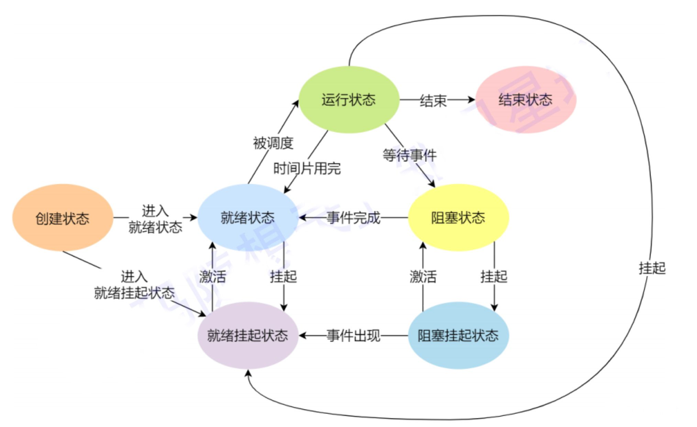
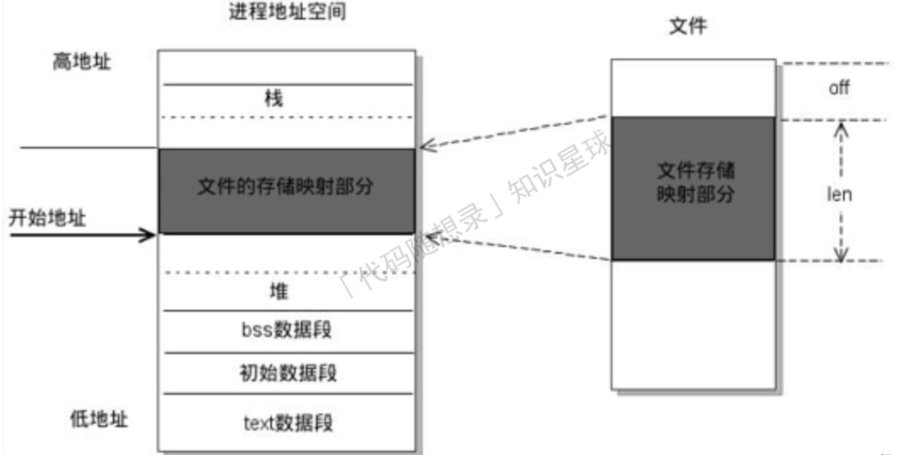

# 操作系统的功能

- 资源分配，资源回收（资源包括cpu，内存，硬盘，IO设备）
- 为应用程序提供服务：将硬件资源的操作封装起来，提供统一的接口（系统调用）供开发者调用
- 管理应用程序：控制进程的生命周期
- 操作系统内核的功能：
  - 进程调度能力：决定哪个进程，线程使用CPU
  - 内存管理能力：决定内存的分配和回收
  - 硬件通信能力：管理硬件，为进程和硬件之间提供通信
  - 系统调用能力：用户程序和操作系统的接口

# 进程

## 描述

- 进程是对运行时程序的封装，操作系统进行资源调度和分配的基本单位

- 每个操作系统维护者一张进程表，每个进程占一个表项，进程表维护着进程状态的重要信息，从而保证该进程可以随时开始停止。

## 进程状态

- 运行态：占有cpu
- 就绪态：可运行，等待cpu
- 阻塞态：暂停运行，等待触发事件发生
- 挂起态：进程阻塞之后，会占用内存，将进程置换到硬盘里，称为挂起
- 阻塞挂起态：在外存，等待事件
- 就绪挂起态：在外存，进入内存马上能运行

## 进程控制块PCB

### 描述

- 操作系统对进程感知的唯一标识
- 包含的信息
  - 进程描述信息：进程标识符，用户标识符等
  - 进程控制和管理信息：进程状态，进程优先级
  - 进程资源分配清单：虚拟内存地址空间信息，打开文件列表，IO设备信息等
  - CPU相关信息：便于从断点恢复执行
- PCB以链表形式管理：就绪队列，阻塞队列

## 进程切换比线程切换慢

- 每个进程都有自己的虚拟内存，而线程共享同一虚拟内存，进程切换涉及虚拟地址的切换
- 虚拟地址转换为物理地址需要查找页表，至少两次访问内存。通常使用Cache缓存常用地址的映射，可以加速页表查找。这个Cache就是TLB（快表）
- 进程切换时页表也要切换，快表就失效了，表现出来就是程序运行缓慢；而线程切换不会切换虚拟内存，不会导致快表失效。

## 进程调度算法

### 批处理系统中的调度

- 先来先服务
  - 非抢占，按照请求顺序
  - 有利于长作业，不利于短作业。短作业等待时间过长
- 最短作业优先
  - 非抢占，按照运行时间最短顺序
  - 如果一直有短作业来，长作业可能饿死

- 最短剩余时间优先
  - 抢占式，按剩余时间最短顺序

### 交互式系统中的调度

- 时间片轮转调度
  - 通过一个队列，将cpu分给首个进程，时间片用完就将这个进程放到队伍末尾
- 优先级调度
  - 为进程分配优先级，按优先级顺序。
  - 为防止低优先级饿死，可随着时间推移增加优先级
- 多级队列
  - 时间片轮转调度+优先级调度
  - 越靠前的队列优先级越高，越靠后的队列时间片越长

## 进程通信

通信的类型：

1. 同一主机

   1. 无名管道
      1. 半双工
      2. 数据先入先出
      3. 传输的数据没有格式，需双方提前规定好数据格式，如多少字节算一个消息
      4. 没有名字，只能在具有公共祖先的进程之间使用
      5. 存在阻塞方式

   1. 有名管道（FIFO）
      1. 提供一个路径名与之关联，因此非亲缘进程也能交换数据
      2. 读管道时
         1. 写管道开启，读管道阻塞
         2. 写管道关闭，读管道返回0
      3. 写管道时
         1. 管道未满，写入并返回字节数
         2. 管道已满，写管道阻塞
   2. 信号
      1. 软件中断，异步通信
      2. 可导致中断，转而处理其他事件
      3. 信号的四要素
         - 编号，名称，事件，默认处理动作
   3. 消息队列
      1. A把消息写入队列，B在需要的时候读取队列
      2. 消息队列的长度有限
   4. 共享内存
   5. 信号量
   6. 存储映射
      1. 磁盘文件和存储空间的一个缓冲区相映射
      2. 使用指针直接读取内存，无需拷贝

1. 不同主机
   1. socket
