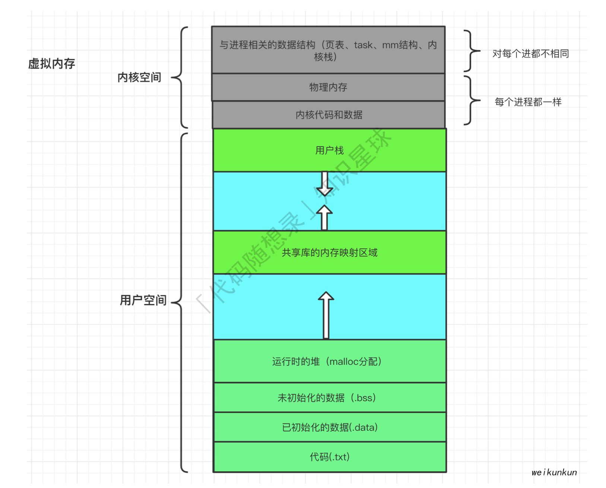

# 操作系统的功能

- 资源分配，资源回收（资源包括cpu，内存，硬盘，IO设备）
- 为应用程序提供服务：将硬件资源的操作封装起来，提供统一的接口（系统调用）供开发者调用
- 管理应用程序：控制进程的生命周期
- 操作系统内核的功能：
  - 进程调度能力：决定哪个进程，线程使用CPU
  - 内存管理能力：决定内存的分配和回收
  - 硬件通信能力：管理硬件，为进程和硬件之间提供通信
  - 系统调用能力：用户程序和操作系统的接口

# 进程

## 描述

- 进程是对运行时程序的封装，操作系统进行资源调度和分配的基本单位

- 每个操作系统维护者一张进程表，每个进程占一个表项，进程表维护着进程状态的重要信息，从而保证该进程可以随时开始停止。

## 进程状态

- 运行态：占有cpu
- 就绪态：可运行，等待cpu
- 阻塞态：暂停运行，等待触发事件发生
- 挂起态：进程阻塞之后，会占用内存，将进程置换到硬盘里，称为挂起
- 阻塞挂起态：在外存，等待事件
- 就绪挂起态：在外存，进入内存马上能运行

## 进程控制块PCB

### 描述

- 操作系统对进程感知的唯一标识
- 包含的信息
  - 进程描述信息：进程标识符，用户标识符等
  - 进程控制和管理信息：进程状态，进程优先级
  - 进程资源分配清单：虚拟内存地址空间信息，打开文件列表，IO设备信息等
  - CPU相关信息：便于从断点恢复执行
- PCB以链表形式管理：就绪队列，阻塞队列

## 进程切换比线程切换慢

- 每个进程都有自己的虚拟内存，而线程共享同一虚拟内存，进程切换涉及虚拟地址的切换
- 虚拟地址转换为物理地址需要查找页表，至少两次访问内存。通常使用Cache缓存常用地址的映射，可以加速页表查找。这个Cache就是TLB（快表）
- 进程切换时页表也要切换，快表就失效了，表现出来就是程序运行缓慢；而线程切换不会切换虚拟内存，不会导致快表失效。

## 进程调度算法

### 批处理系统中的调度

- 先来先服务
  - 非抢占，按照请求顺序
  - 有利于长作业，不利于短作业。短作业等待时间过长
- 最短作业优先
  - 非抢占，按照运行时间最短顺序
  - 如果一直有短作业来，长作业可能饿死

- 最短剩余时间优先
  - 抢占式，按剩余时间最短顺序

### 交互式系统中的调度

- 时间片轮转调度
  - 通过一个队列，将cpu分给首个进程，时间片用完就将这个进程放到队伍末尾
- 优先级调度
  - 为进程分配优先级，按优先级顺序。
  - 为防止低优先级饿死，可随着时间推移增加优先级
- 多级队列
  - 时间片轮转调度+优先级调度
  - 越靠前的队列优先级越高，越靠后的队列时间片越长

## 进程通信

通信的类型：

1. 同一主机

   1. 无名管道
      1. 半双工
      2. 数据先入先出
      3. 传输的数据没有格式，需双方提前规定好数据格式，如多少字节算一个消息
      4. 没有名字，只能在具有公共祖先的进程之间使用
      5. 存在阻塞方式

   1. 有名管道（FIFO）
      1. 提供一个路径名与之关联，因此非亲缘进程也能交换数据
      2. 读管道时
         1. 写管道开启，读管道阻塞
         2. 写管道关闭，读管道返回0
      3. 写管道时
         1. 管道未满，写入并返回字节数
         2. 管道已满，写管道阻塞
   2. 信号
      1. 软件中断，异步通信
      2. 可导致中断，转而处理其他事件
      3. 信号的四要素
         - 编号，名称，事件，默认处理动作
   3. 消息队列
      1. A把消息写入队列，B在需要的时候读取队列
      2. 消息队列的长度有限
   4. 共享内存
   5. 信号量
   6. 存储映射
      1. 磁盘文件和存储空间的一个缓冲区相映射
      2. 使用指针直接读取内存，无需拷贝

1. 不同主机
   1. socket

## 守护进程

du利于控制终端在后台执行的进程，周期性完成某种任务 

## 僵尸进程

- 子进程退出，父进程运行，父进程未捕获子进程推出的信号的状态，占用资源。

- 父进程一般用wait/waitpid函数结束子进程

# 线程

### 描述

- 轻量级进程，创建线程pthread_create用的函数和进程fork的底层一样，都调用clone
- 线程和进程一样，都有自己的PCB
- 进程可以蜕变成线程
- 线程是最小的执行单位
- 如果复制地址，产生进程；如果共享地址，产生线程

### 三种线程

1. 用户线程
   - 用户空间实现，由基于用户态的线程管理
   - 用户线程的创建种植同步调度都不由操作系统直接参与
2. 内核线程
   - 由操作系统管理调度，一般有操作系统事先创建内核线程集(类似线程池)，数量有限
   - 占用内核资源，开销较大
3. 轻量级线程LWP
   - 内核支持的用户线程
   - 每个LWP都要一个内核线程的支持（CPU资源的调度分配），实际上用户线程运行在LWP上

### 线程通信

统一进程的不同线程共享同一内存区域，所以线程可以方便快速共享信息，只需将数据复制到共享变量中即可，要注意多线程同时修改一份信息

### 注意问题

同步互斥问题：统一进程的多线程共享资源，除了线程tid标识符，每个线程独立栈空间，无法访问其他线程空间

线程依赖关系：线程之间有无访问顺序

# 存储系统

## 页面置换算法

1. 最佳页面置换算法（OPT）
   - 置换**未来**最长时间不访问的页面。
   - 无法实现
2. 先进先出置换算法（FIFO）
   - 队列形式保存
3. 最近最久未使用置换算法（LRU）
   - 根据页面未被访问时常排序页面，将最久未使用的页面置换出去
4. 时钟页面置换算法
   - 环形链表保存，页面包含一个访问位
   - 顺时针遍历页面，如果访问位是1，将其改为0，直到当问到0页面，进行置换
5. 最不常用算法
   - 记录访问次数，每次置换访问中最少的页面

## 分段

- 虚拟内存分页技术，将地址空间划分为固定大小的页，每一页和内存进行映射

- 分段是把表分成段，一个段构成一个独立地址空间

- 段长可变

## 分段方式

- 纯分段
  - 共享：有助于进程共享
  - 保护：每个段都可以独立增长减小，不影响其他段
- 分段分页结合
  - 将地址空间分成独立的段，每个段拥有大小相同的页
  - 既有共享保护功能，又有分页系统的虚拟内存功能

|          | 分页                       | 分段                                           |
| -------- | -------------------------- | ---------------------------------------------- |
| 透明性   | 透明                       | 需要显式划分段                                 |
| 地址维度 | 一维                       | 二维                                           |
| 大小     | 固定                       | 可变                                           |
| 作用     | 实现虚拟内存，获得更大空间 | 划分程序和数据到独立的地址空间有利于共享和保护 |

## 虚拟内存

- 一种内存管理技术
- 让程序觉得自己拥有连续的可用内存
- 实际上是由多个**页**，以及暂存在磁盘上的交换区构成
- 通过结合磁盘和内存各自优势（为进程提供看起来足够快足够大的储存空间），利用中间层（页表结构）对资源进行更合理调度，提高资源利用率，提供和谐统一的抽象（控制进程对内存的访问）

### 地址空间

物理内存的抽象，进程可用于寻址的一套地址集合

### 分页

地址空间被分成多个大小相等的页，每一页有连续的地址范围，映射到连续的物理内存

### 页表

用于将虚拟页面映射到物理地址

### 加速分页

1. TLB加速分页
   1. 概念：将虚拟地址直接映射到物理地址，而非查询页表。但如果TLB中没有该地址，则继续执行查表
2. 软件TLB管理

### 针对大内存页表

1. 多级页表
2. 倒排页表

### 虚拟内存的页分类

未分配：没有被进程使用，空闲状态，在硬盘中

未缓存：仅仅加载到磁盘中的页

已缓存：加载到内存中的页

## 用户态和内核态

设置了模式位进程进入内核态，可以执行任何指令；没设置进入用户态，不能执行特权指令

# 互斥和同步

## 互斥锁

- 两种状态：加锁，解锁

- 访问共享资源的临界区前加锁，访问后解锁
- 数据类型：pthread_mutex_t

## 死锁dead lock

- 每个进程都在等待其他进程引发事件或释放资源
- 资源

  - 可抢占资源：可以从拥有它的进程抢占而不会产生副作用，如存储器
  - 不可抢占资源：无法把他从占有进程抢占过来
- 必要条件：

  - 互斥
  - 占有和等待：占有资源的进程可以请求新资源，没占有的进程需要等待释放
  - 不可抢占
  - 环路等待
- 处理方法：

  - 鸵鸟算法
    - 把头埋到沙子里，假装没发生问题
    - 适用于死锁影响小，发生概率低的情况

- 死锁检测：
  - 深度优先遍历进程，并作标记，如果遍历到已经标记的节点，说明存在环，可能有死锁
  - 任何没有被标记的进程都是死锁进程
- 死锁恢复：
  - 利用抢占恢复：新进程抢占资源，原进程中断等待，用完后原进程继续使用

- 死锁预防
  - 破坏互斥条件：允许多个进程进出
  - 破坏占有等待条件：预先分配好资源；一次获取全部资源，得不到需要的资源就是放已占有的资源
  - 破坏不可抢占条件：
