# 高质量实时渲染

- 高质量：真实感

- 实时：30+FPS（每秒生成至少30张图）

- 渲染：模拟光源进入眼睛

## Programmable graphics hardware (shaders)

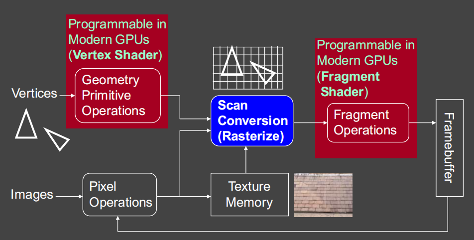

## shadow mapping（阴影生成）

- 2通道算法

  - 从光的角度来看，得到深度缓冲器

  - 从相机角度来看，将深度贴图投影到相机的视图上

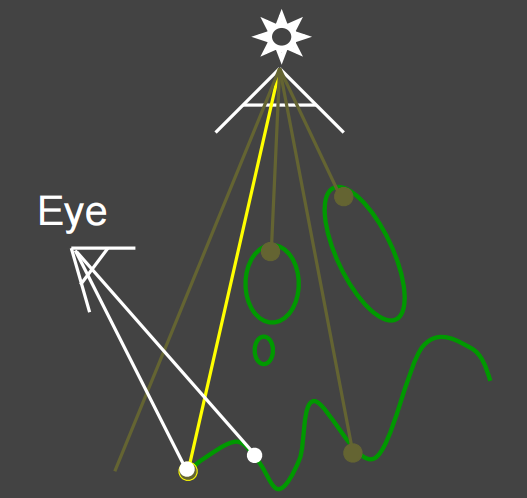

- 自遮挡问题

  - SM记录的是每个像素的深度，不是连续的，像素间的记录互相遮盖

  - 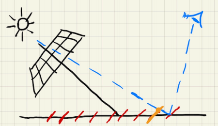

  - 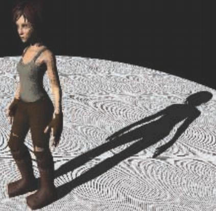

  - 解决方法：障碍物在一定小的范围内不做记录，可根据夹角改变范围大小

    - 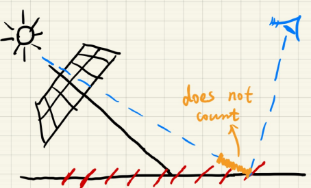

    - 新的问题：阴影偏移

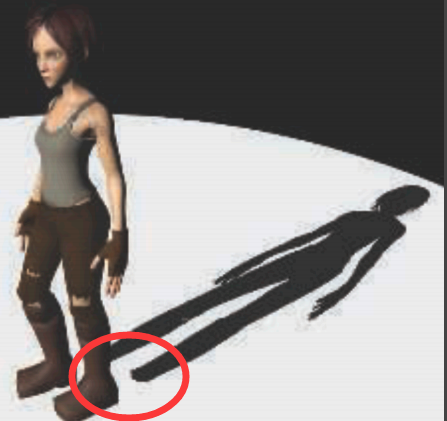

- 锯齿问题

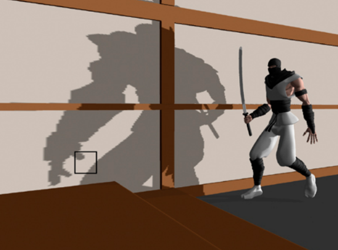

- Shadow map ≈ Visibility×shading

  - 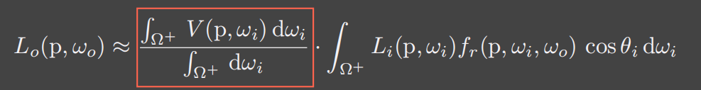
  - 准确的条件
    - 点光源/平行光
    - 漫射brdf/恒定辐射区域照明

  - 生成的是硬阴影

- PCF（Percentage Closer Filtering）用于处理阴影的锯齿，生成软阴影
  - 每个像素都取周围像素做一个平均
  - 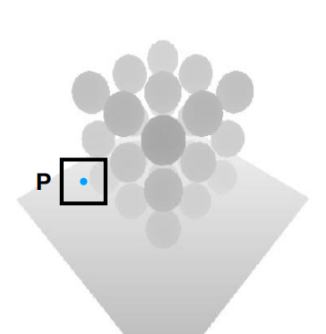

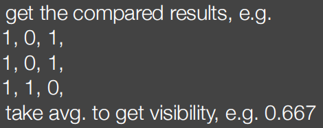

- 生活中观察，物体和阴影近的地方阴影较硬，远的地方阴影变软

  - 

  - 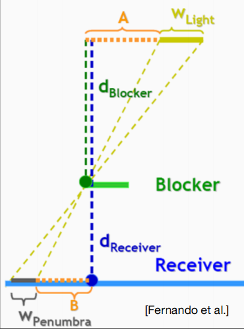

  - $$
    相似三角形计算 \\
    W_{penumbra}=(d_{Receiver}-d_{Blocker})\sdot W_{Light}/d_{Blocker}
    $$

- PCSS(Percentage Closer Soft Shadows) ：适应性的PCF
  - 步骤
    - 遮挡区搜索：获得某一区域的平均阻挡深度
    - 使用遮挡区的深度计确定滤波范围（和周围像素取平均的范围）
    - PCF
  - 问题：开销大
  - 解决方法1：当区域太大的时候，可以不对所有Texel进行采样，在这中间随机取一些样本，同样会产生一个近似的结果，虽然速度更快但是近似的结果会产生噪声（noise），工业界的正常处理方式1、3两步都是采用的这种方法，进行稀疏的采样，自然会降低访问Texel的次数，最后得到的结果是有噪声的，最后进行图像空间的降噪。
  - 解决方法2：VSSM

- VSSM提升第三步：

  - 计算有多少百分比的纹素（Texel）位于Shading point 之前，用一个正态分布，获得一个近似的结果。 

  - 关键思想-快速计算一个区域的深度的平均值和方差平均值（平均）

  - 求平均值采用下面两个方法：

    方法1：使用MIPMAP(Hardware MIPMAPing),但是MIPMAP只能求正方形区域;

    方法2：通过更精准的一种数据结构，可以求任意矩形区域平均值，Summed Area Tables (SAT)。

    - 方差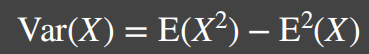
    - 需要额外的一个Shadow Map来记录深度的平方数据（Square-depth Map），然后再将两个Map在一定区域内求均值之后相减就可以求得方差。
    - CDF计算有多少百分比的像素是比Shading point大（小）也就是不会（会）挡住Shading point

    - 切比雪夫不等式近似，知道一个函数，不管是不是正态分布，图中红色面积不会超过等式右边 。因此就可以不用计算ERF了，只要用均值和方差就可以来计算了。
      - 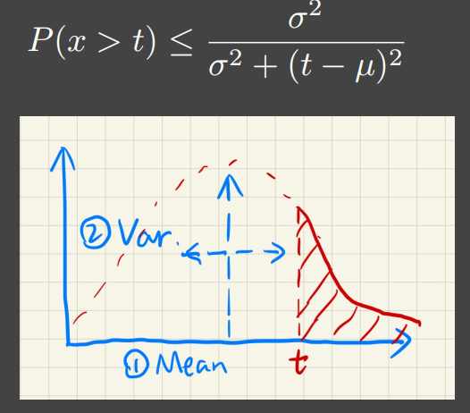

  - 总之，VSSM来提升第三步的质量需要做如下额外工作：

    1 生成“Square depth map”深度的平方来获得方差；

    2 通过MIPMAP 或者SAT来获得均值；

    3 通过切比雪夫不等式进行近似。 

- VSSM提升第一步：

  - 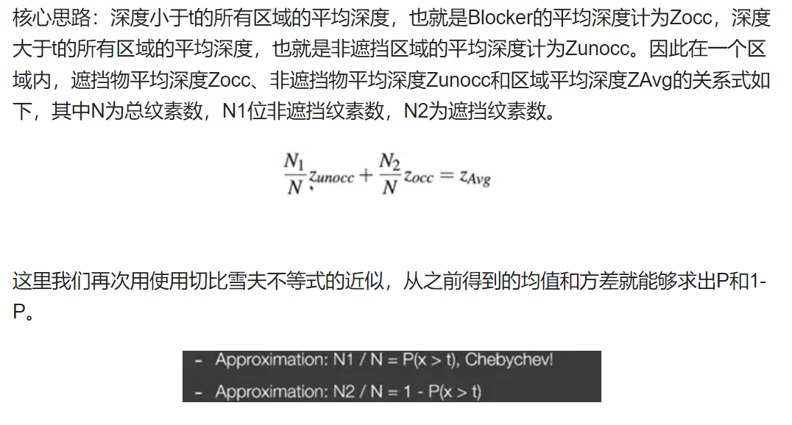

  - 我们可以再次进行假设：非遮挡物深度和Shading point的深度一致也就是Zocc=t 作者：沙滩Beachc_ https://www.bilibili.com/read/cv10716619/ 出处：bilibili

- 总和面积方差阴影图SAT：二维的前缀和

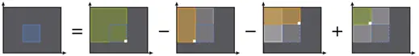

- VSMM的问题：漏光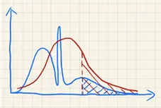

  - 由于切比雪夫“近似等式”只在t大于平均深度Zavg时有效，那么优化VSSM问题的关键就是如何更好的来描述遮挡物的分布，但是又不会过于增加消耗。

  - 解决核心思路：使用更高阶的moment 矩,来对分布情况进行描述。这里采用了矩估计的概念进行了近似。（泰勒展开）

    Moment shadow mapping就是通过深度Z的前n阶矩对CDF有一个更精准的估计

  - 如果保留前m阶的矩，就能表示有m/2个台阶的阶跃函数，通常来说 4阶的矩就已经足够准确的来近似CDF的结果，与PCF做比较  4阶就已经很准了，而其实2阶的估计结果其实就是PCSS所采用的算法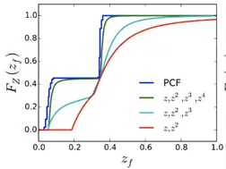

