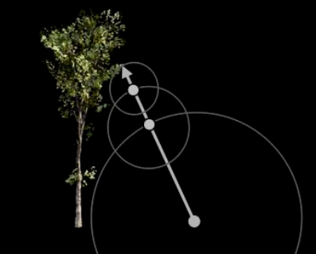
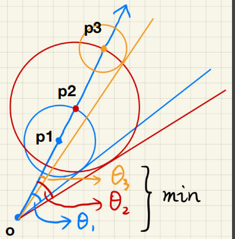
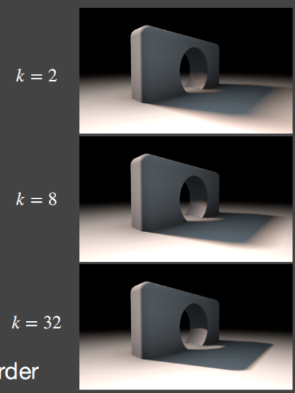
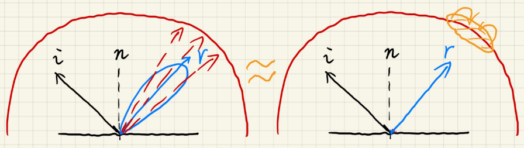
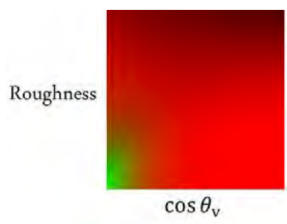
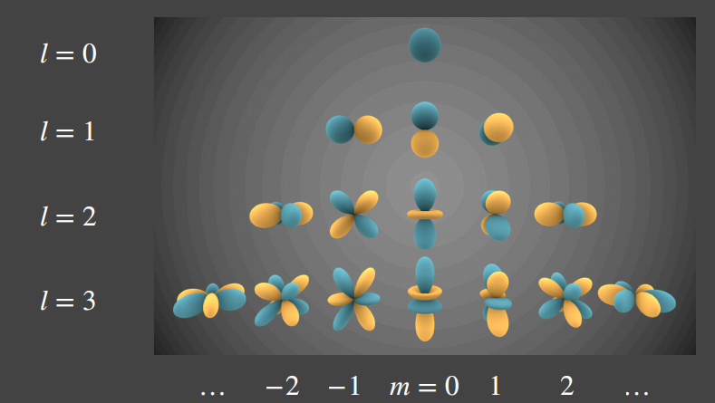
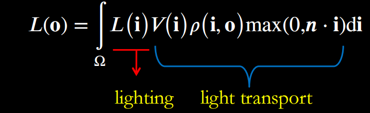
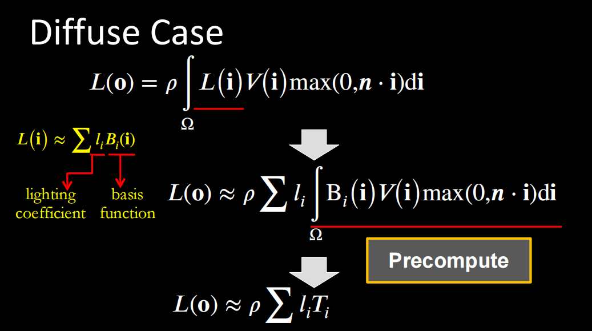

# 高质量实时渲染

- 高质量：真实感

- 实时：30+FPS（每秒生成至少30张图）

- 渲染：模拟光源进入眼睛

## Programmable graphics hardware (shaders)

## shadow mapping（阴影生成）

- 2通道算法

  - 从光的角度来看，得到深度缓冲器

  - 从相机角度来看，将深度贴图投影到相机的视图上

- 自遮挡问题

  - SM记录的是每个像素的深度，不是连续的，像素间的记录互相遮盖

  - 

  - 

  - 解决方法：障碍物在一定小的范围内不做记录，可根据夹角改变范围大小

    - 

    - 新的问题：阴影偏移

- 锯齿问题

- Shadow map ≈ Visibility×shading

  - 
  - 准确的条件
    - 点光源/平行光
    - 漫射brdf/恒定辐射区域照明

  - 生成的是硬阴影

## PCF（Percentage Closer Filtering） 

- 用于处理阴影的锯齿，生成软阴影

- 每个像素都取周围像素做一个平均
- 

- 生活中观察，物体和阴影近的地方阴影较硬，远的地方阴影变软

  - 

  - 

  - $$
    相似三角形计算 \\
    W_{penumbra}=(d_{Receiver}-d_{Blocker})\sdot W_{Light}/d_{Blocker}
    $$

## PCSS(Percentage Closer Soft Shadows) 

- 适应性的PCF

- 步骤
  - 遮挡区搜索：获得某一区域的平均阻挡深度
  - 使用遮挡区的深度计确定滤波范围（和周围像素取平均的范围）
  - PCF
- 问题：开销大
- 解决方法1：当区域太大的时候，可以不对所有Texel进行采样，在这中间随机取一些样本，同样会产生一个近似的结果，虽然速度更快但是近似的结果会产生噪声（noise），工业界的正常处理方式1、3两步都是采用的这种方法，进行稀疏的采样，自然会降低访问Texel的次数，最后得到的结果是有噪声的，最后进行图像空间的降噪。
- 解决方法2：VSSM(方差软阴影映射)

## VSSM

- 提升PCSS的第三步

- 计算有多少百分比的纹素（Texel）位于Shading point 之前，用一个正态分布，获得一个近似的结果。 

- 关键思想-快速计算一个区域的深度的平均值和方差平均值（平均）

- 求平均值采用下面两个方法：

  方法1：使用MIPMAP(Hardware MIPMAPing),但是MIPMAP只能求正方形区域;

  方法2：通过更精准的一种数据结构，可以求任意矩形区域平均值，Summed Area Tables (SAT)。

  - 方差
  - 需要额外的一个Shadow Map来记录深度的平方数据（Square-depth Map），然后再将两个Map在一定区域内求均值之后相减就可以求得方差。
  - CDF计算有多少百分比的像素是比Shading point大（小）也就是不会（会）挡住Shading point

  - 切比雪夫不等式近似，知道一个函数，不管是不是正态分布，图中红色面积不会超过等式右边 。因此就可以不用计算ERF了，只要用均值和方差就可以来计算了。
    - 

- 总之，VSSM来提升第三步的质量需要做如下额外工作：

  1 生成“Square depth map”深度的平方来获得方差；

  2 通过MIPMAP 或者SAT来获得均值；

  3 通过切比雪夫不等式进行近似。 

- VSSM提升PCSS的第一步：

  - 

  - 我们可以再次进行假设：非遮挡物深度和Shading point的深度一致也就是Zocc=t 

- 总和面积方差阴影图SAT：二维的前缀和

- VSSM的问题：漏光

  - 由于切比雪夫“近似等式”只在t大于平均深度Zavg时有效，那么优化VSSM问题的关键就是如何更好的来描述遮挡物的分布，但是又不会过于增加消耗。

  - 解决核心思路：使用更高阶的moment 矩,来对分布情况进行描述。这里采用了矩估计的概念进行了近似。（泰勒展开）

    Moment shadow mapping就是通过深度Z的前n阶矩对CDF有一个更精准的估计

  - 如果保留前m阶的矩，就能表示有m/2个台阶的阶跃函数，通常来说 4阶的矩就已经足够准确的来近似CDF的结果，与PCF做比较  4阶就已经很准了，而其实2阶的估计结果其实就是PCSS所采用的算法

## SDF 符号距离函数Signed Distance Function

- SDF > 0 在物体外部 ；SDF< 0在物体内部 ； SDF = 0 在边界

- 每个点都保存一个到场景中任意表面的最小距离

- 用法
  - SDF是一个安全距离，在这个距离内不会与其他物体发生碰撞，可以利用这个特性不断的朝一个方向前进,以P0开始朝一方向走SDF到达P1 点,若仍与物体表面相距甚远,则以P1点为新起点继续走SDF到达 p2 点,假设此处 p2 点的SDF足够小,也就是代表离物体表面足够接近了,则进行求交操作.如果走了很长距离没碰到物体则舍弃这条光线
  - 在任意一点的SDF可以获得一个safe angle，找到最小的角度，近似软阴影范围
    - 计算θ角度用arcsin开销大，用下式近似，k控制阴影的软硬程度

$$
min{\{\frac{k\sdot SDF(p)}{p=o},1.0}\}
$$

- 优点
  - 快
  - 高质量
- 缺点
  - 需要预先计算
  - 需要大量的存储空间

## 根据环境光着色IBL

- 用BRDF计算费时间
- 采用预计算环境光，然后再镜面反射方向直接取值更快
- （左图BRDF，右图pre-filtering）

- Split sum：避免了采样，降低了存储维度，预计算存储粗糙度、入射角数值存入纹理图使用

## 环境光阴影

- 工业界选择最亮的光源生成阴影
- PRT算法

## 球谐函数（SH）

- L 是阶

- 2 L +1种SH基函数
- 蓝色表示正，黄色表示负，越亮的地方值越大

- 最多用三阶描述光照足矣
- 

- SH有很好的性质：
  - 标准正交：任何基函数投影到其他基函数都是0
  - 简单投影/重建
  - 简单旋转：旋转任何一个SH  basis函数，都可以被同阶的SH basis 函数得到
  - 简单卷积
  - 少数基函数：低频率

## PRT（Precomputed Radiance Transfer ）预计算辐射传输（不懂啊~~~~~~~~~~~）

- 处理环境光

- 代价
  - 场景不能动,因此只能对静止物体进行计算.
  - 光源不能旋转

- 在计算shading 和 shadow时只需要进行向量li和ti的点乘即可得到结果.现在就能环境光的情况下,通过使用PRT来计算出diffuse物体的shading 和 Shadow了.

### 总结

- 近似照明和光传输使用基函数(SH)

  - 照明->照明系数

  - 光传输->系数/矩阵

- 预先计算和存储光传输

- 渲染简化为：
  - 漫射：点积
  - 光泽：向量矩阵乘法

## RSM（Reflective Shadow Maps）
