# 渲染管线

## 功能

- 在给定虚拟相机，物体，光源，照明模式以及纹理等诸多条件下，生成一幅二维图像

- 渲染管线是实时渲染的底层工具

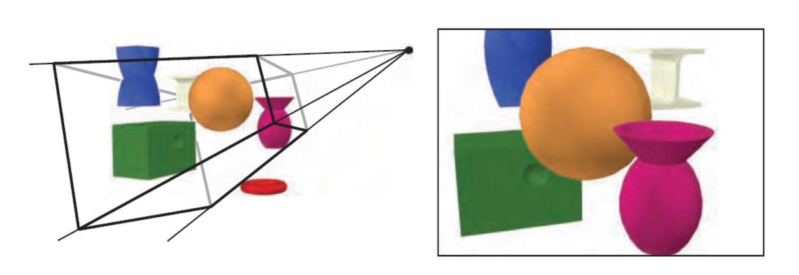

## 三个阶段

- 应用程序阶段

  - 主要任务：将需要在屏幕上显示绘制出来的图元（点线面）输入到下一阶段
  - 通常用于实现碰撞检测，加速算法，输入检测，动画，力反馈，纹理动画，变换仿真，几何变形等方法。

- 几何阶段

  - 主要任务：多边形和顶点的操作

  - 细分

    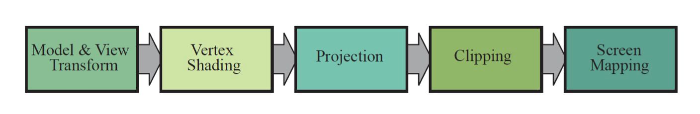

    - 模型视点变换
      - 目的：便于投影和裁剪
      - 效果：相机放在坐标原点，前-z，上y，右x，得到相机空间，模型变换到适合渲染的地方

    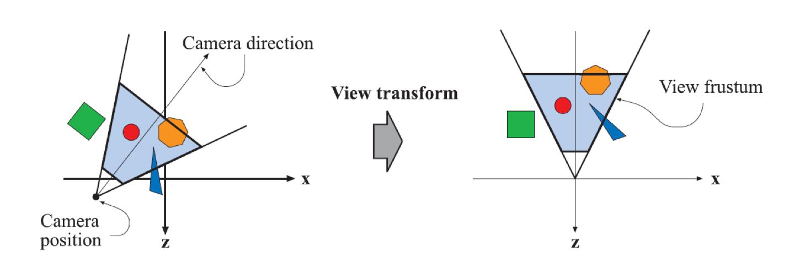

    - 顶点着色
      - 目的：根据光源材质等对物体顶点上色
      - 方式：对每个点计算着色方程
    - 投影
      - 目的：降维：将模型从三维空间投射到二维空间
      - 两种投影变换：
        - 正交投影
        - 透视投影

    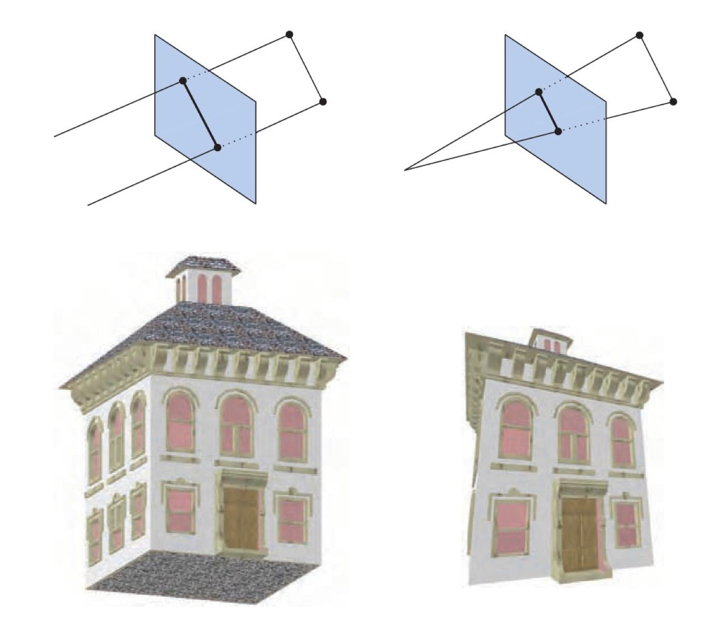

    - 裁剪
      - 目的：对部分位于视体的图元裁剪
      - 图元相对视体的三个位置
        - 完全位于视体内，直接进入下一阶段
        - 部分位于视体内，裁剪
        - 不位于视体内，丢弃

    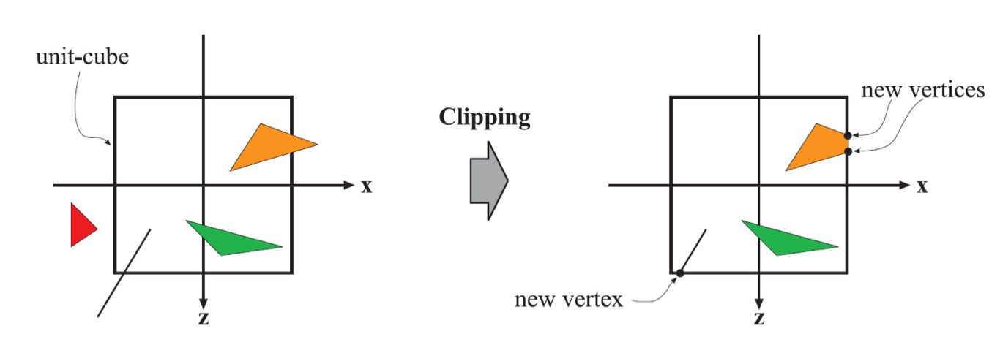

    - 屏幕映射
      - 目的：将之前步骤得到的坐标映射到对应的屏幕坐标

  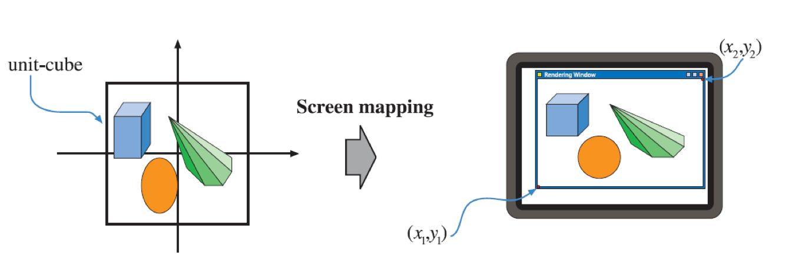

- 光栅化阶段

  - 细分：

    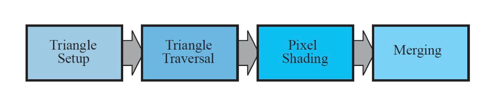

    - 三角形设定阶段
      - 计算三角形表面的数据
    - 三角形遍历阶段
      - 找到哪些采样点或者像素在三角形中
    - 像素着色阶段
      - 逐像素的着色计算，纹理贴图在这阶段进行。

    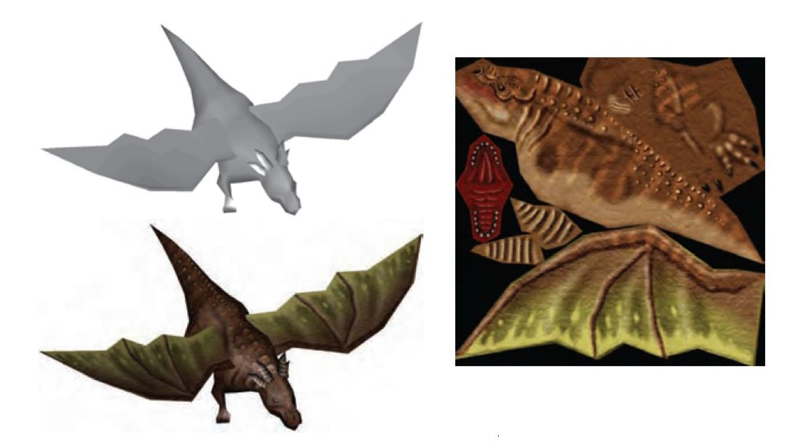

    - 融合阶段
      - 从z缓冲器，颜色缓冲器，alpha通道，模板缓冲器，帧缓冲器，，累计缓冲器得到数据融合出图像到屏幕上

   

## 思维导图

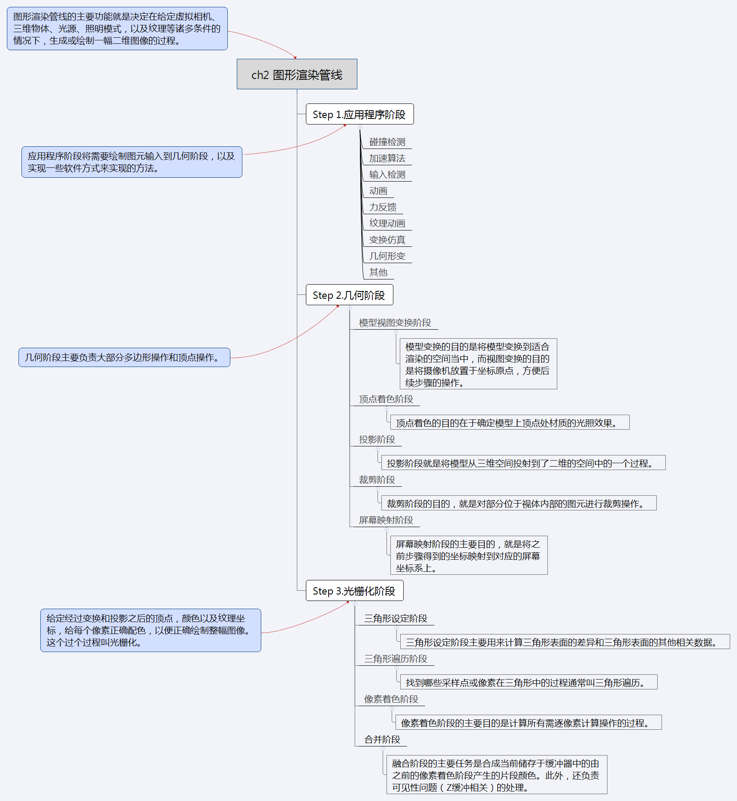

# GPU渲染管线

## 描述

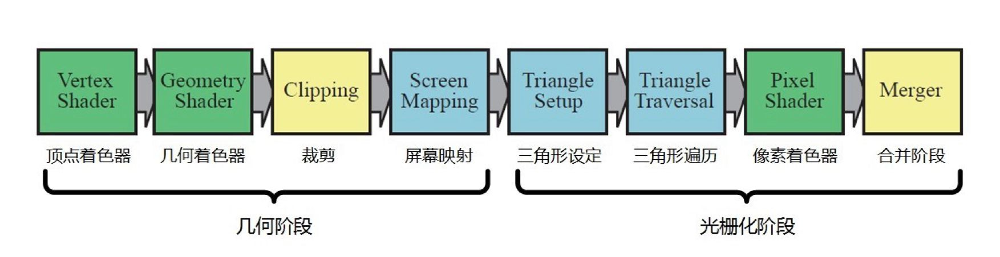

绿色：完全可编程

黄色：可配置，不可编程

蓝色：完全固定

## 流程概览

- 顶点着色器
  - 目标：将顶点从模型空间转换到齐次裁剪空间
  - 操作：对顶点进行变换，提供了修改顶点属性（颜色，法线，位置，纹理坐标）的功能
- 几何着色器（可选）
  - 目标：高效创建，销毁图元
  - 操作：对图元（点，线，三角面）的顶点进行操作
- 裁剪
  - 可选运行的裁剪方式，以及添加自定义裁剪面
- 屏幕映射
- 三角形设定
- 三角形遍历
- 像素着色器（片段着色器，片元着色器）
  - 在每个像素执行着色方程
- 合并阶段
  - 负责合并，颜色修改，Z缓冲，混合，模板和相关缓冲的处理

# 渲染的视觉物理现象

光线直接传播给物体发生折射传播到人眼

## 光照分类

平行光，点光源，聚光灯

## 光照现象
### 散射和吸收

- 散射
  - 反射
  - 折射
- 吸收发生在物质内部，减少光量，但不改变方向
- 镜面反射表示在表面反射的光，漫反射表示经过透射，吸收，散射的光

## 表面

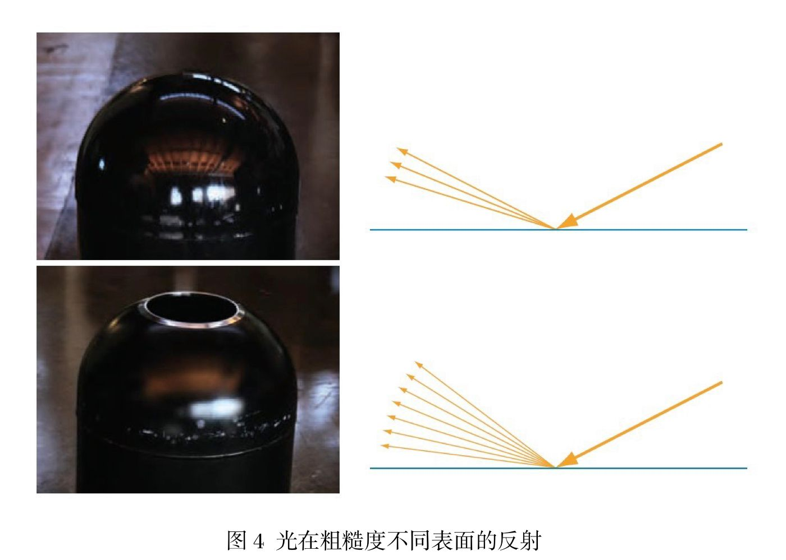

## 着色

### 着色方程

- 镜面反射项

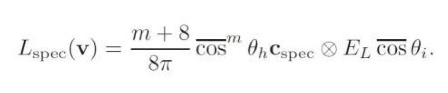

- 漫反射项
  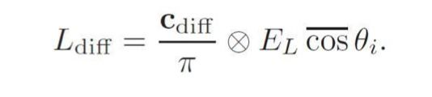

- 着色方程
  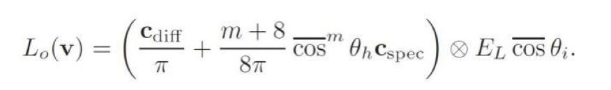

- Blinn-Phong模型
  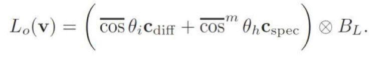

### 三种着色处理方法

- 平滑着色：每个平面的颜色都和代表定点颜色一致

- 高洛德着色：根据顶点线性插值计算颜色

- 冯氏着色：对着色方程进行完全的像素求值
  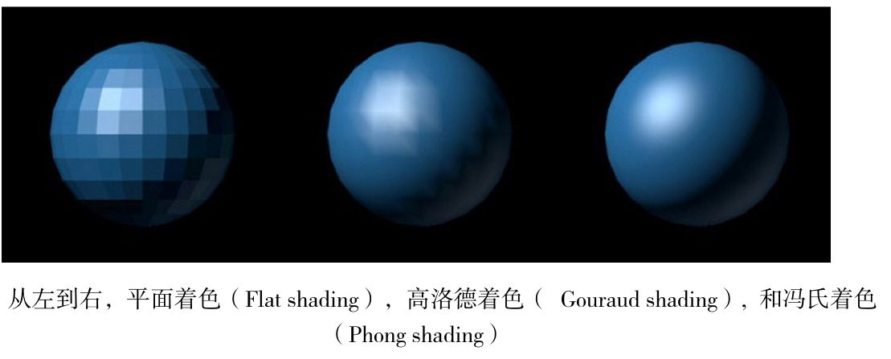

> 注意：冯氏着色模型考虑的是在三个顶点中填充颜色，冯氏光照模型考虑的是物体被光照的效果

# 抗锯齿（AA）
## 描述

消除显示器输出画面物体边缘凹凸的技术，通常原因是高分辨率信号以低分辨率表示或者无法准确计算3D图形的坐标定位导致图形混叠

## 类型

- 超级采样抗锯齿（SSAA）
  - 特点：消耗性能，简单直接
  - 步骤：把图像放大，和附近的像素点混叠，还原到原来大小
  - 常用方法：
    - OGSS顺序栅格超级采样(采样邻近的2个像素点)
    - RGSS旋转栅格超级采样(采样邻近的4个像素点)
- 多重采样抗锯齿（MSAA）
  - 特点：只对图形边缘进行抗锯齿处理，消耗较小，但效果差些
- 覆盖采样抗锯齿（CSAA）
  - 特点：进一步高效执行边缘取样
  - 步骤：将需要取样的子像素覆盖掉，把原像素强制安置在硬件和驱动程序预先算好的坐标中

- 高分辨率抗锯齿（HRAA）
  - 步骤：取样点四点在正方形角上，一点在正方形中心

- 可编程过滤抗锯齿（CFAA）
  - 特点：可灵活选择边界大小的MSAA
- 形态抗锯齿（MLAA）
  - 用边缘的前景和背景混合后的颜色填充边界像素
- 快速近似抗锯齿（FXAA）
  - 是MSAA的高性能快速近似，只是单纯的后期处理着色器
- 时间性抗锯齿（TXAA）
  - 将MSAA，时间滤波，后期处理相结合，呈现高保真度
- 多帧采样抗锯齿（MFAA）
  - MSAA的优化，提升性能表现

# 透明

## 透明渲染

- Screen-Door Transparency方法：棋格填充模式
  - 像素紧凑时效果好
  - 在50%效果最好
  - 每个区域与只能有一个透明物体

- Alpha混合：按照Alpha混合向量的值来混合源像素
  - A通道为1表示不透明，反之为透明

## 透明排序

要将透明物体正确渲染到屏幕，需要对透明物体进行排序

- 深度缓存（Z-Buffer）
  - 解决可见性问题
  - 但只能存储一个颜色
  - A-Buffer（深度像素）：单个像素存储一系列呈现在所有对象被解析为单个像素颜色的多个片段
- 画家算法
  - 效率较低
  - 由远及近绘制屏幕，近处覆盖远处
- 加权平均值算法
  - 使用透明混合公式来实现无序透明渲染的算法
- 深度剥离
  - 多遍渲染，第一次渲染z-buffer中z值最小的像素，然后把这些像素剥离，再进行n次此操作

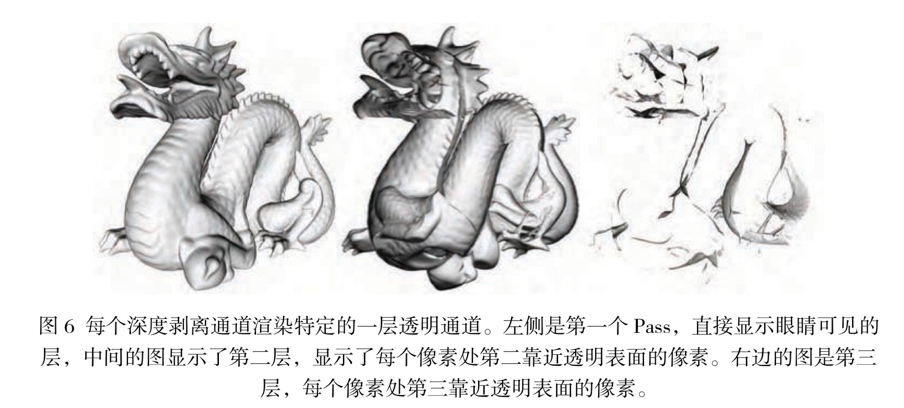

# 纹理贴图

- 纹理是针对物体表面属性进行建模的技术

- 纹理中的像素被称为纹素
- 通过投影方程对空间点变换得到的关于纹理的数值，称为贴图（映射）

## 纹理管线

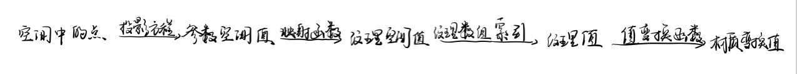

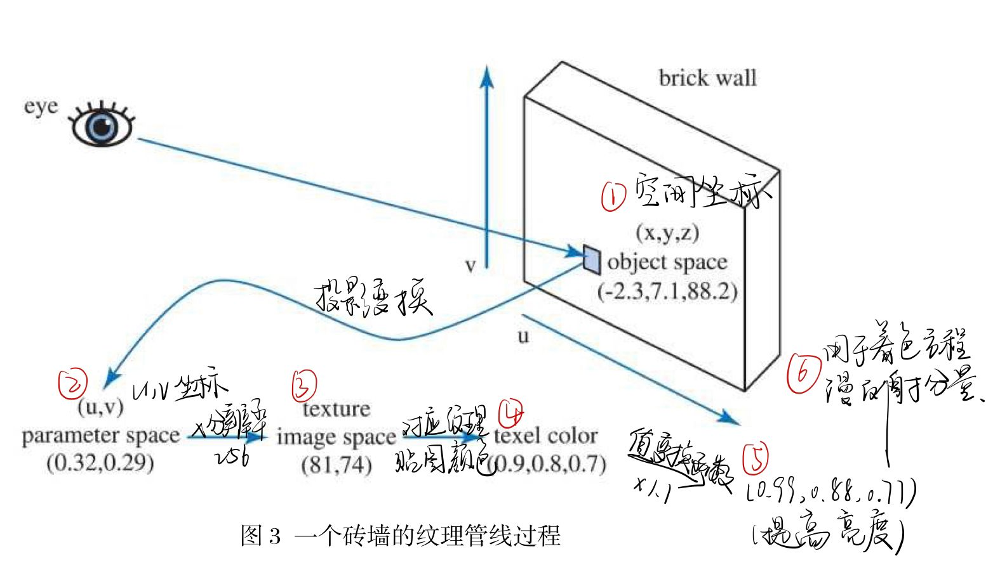

## 投影函数

将空间的三维点转换到纹理UV坐标

## 映射函数

- 将参数空间坐标转换为纹理空间位置

- 用于处理超出正常UV [0,1]之间的内容
- 常见的映射函数
  - 重复寻址模式：图像在表面重复出现，方向一致
  - 镜像寻址模式：图像在表面重复出现，重复的图像镜像或者反转
  - 夹取寻址模式：[0，1]正常显示，边沿uv延伸填充超过的部分
  - 边框颜色寻址方式：[0，1]正常显示，边框颜色填充超过的部分

- 不同的轴可以选择不同映射方式

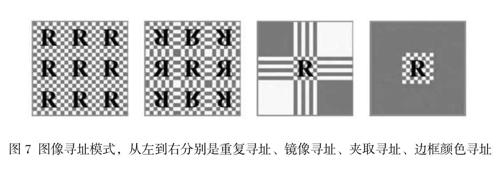

## 三维纹理（体纹理）

- 比二维纹理效果更好
- 直接映射模型坐标，简单
- 低效，很多样本起不到作用

## 立方体贴图

- 贴图接缝问题
- 采用来自其他免得相邻样本创建mipmap链，并考虑每个纹素的角度范围，可得到不错效果

## 纹理缓存

- 一个游戏可能需要相当数量的纹理，有着各种各样的纹理存储技术，但它们永远不够用。

- 建议：保持纹理在不需要放大再用的前提下尽可能小，并尝试基于多边形将纹理分组。
- 策略：
  - 最近最少使用策略LRU：加载到图形加速器内存的每个纹理都会上一个时间戳，记录最后一次渲染的时间。加载新的纹理时先卸载最旧的纹理
  - 最近最常使用策略MRU：如果画面没有纹理切换，LRU会发生画面抖动影响，用MRU策略直到画面没有纹理交换为止切换为LRU
  - 预取策略：预先加载纹理
  - 裁剪图策略：适用于图像数据集巨大的情况，如飞行模拟，地形模拟。将整个数据集视为一个mipmap，对于任何特定的视图，只需要mipmap的较低级别的一小部分即可。

## 纹理压缩

- 解决内存和带宽问题的方法之一

- 方法
  - DXT
  - ATI
  - ETC

## 程序贴图纹理

- 用于创建纹理映射的自然元素
- 常用到分形噪声和湍流扰动函数
- 计算量大

## 凹凸贴图发展

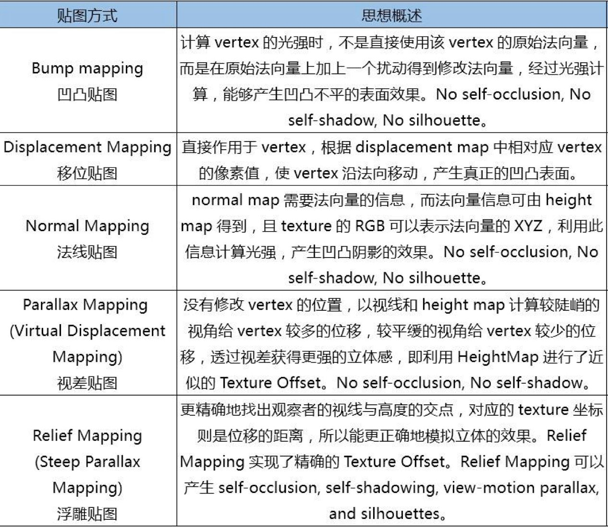

### 凹凸贴图

- 两种方法

  - 通过改变表面光照方程的法线（非几何法线），产生表面凹凸不平的视觉效果

  - 使用高度图修改法线方向，白色表示高，黑色表示低

### 移位贴图

- 每个纹素存了一个向量，代表对应顶点的位移

### 法线贴图

- 凹凸贴图和纹理贴图通常是在现有的模型发现上添加扰动，而法线贴图完全更新法线
- 法线贴图就是直接将法线保存到一张纹理，使用时取用即可

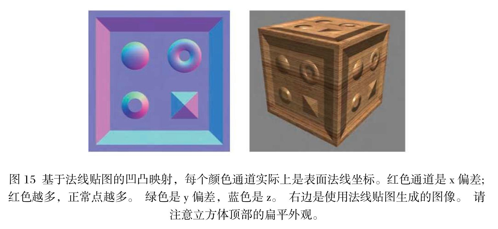

### 视差贴图

- 通过替换渲染多边形上的顶点处的纹理坐标实现，得到的效果比凹凸贴图更真实

- 需要用到切线空间和高度图的方程

### 浮雕贴图

- 极至的凹凸贴图
- 能比视差贴图提供更深的深度

- 计算量大，在shader里做光线追踪
- 拥有自遮挡

# BRDF双向反射分布函数

- 反映了入射光经过某个表面反射后如何在各个出射方向上分布