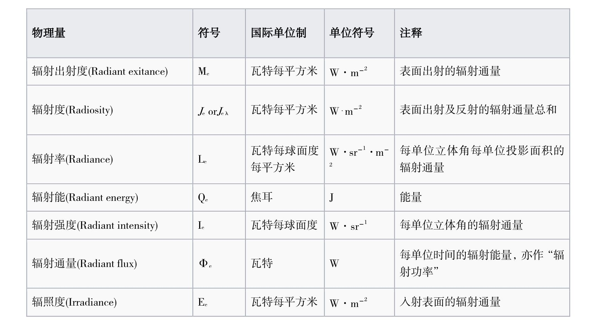
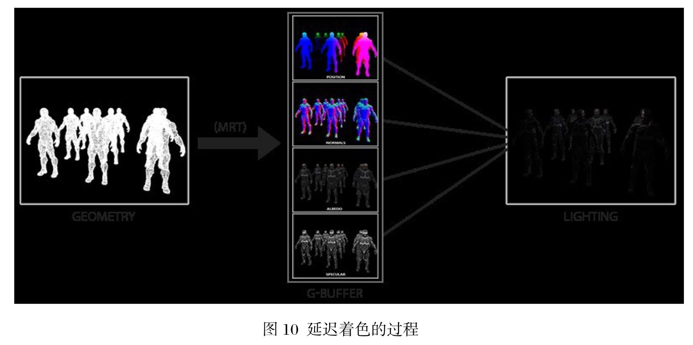
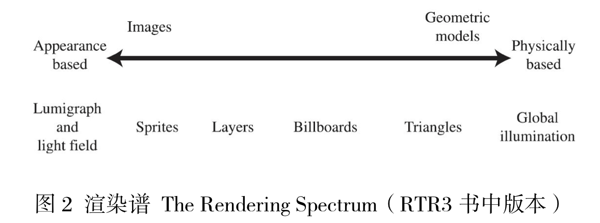
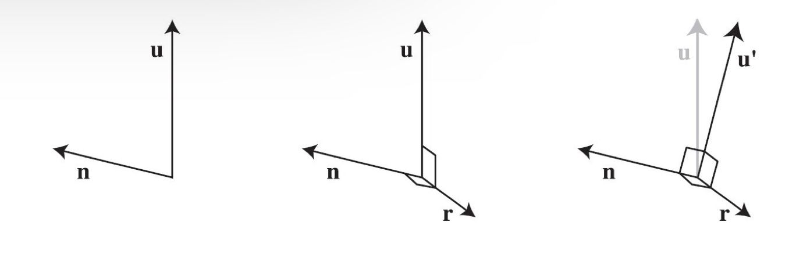
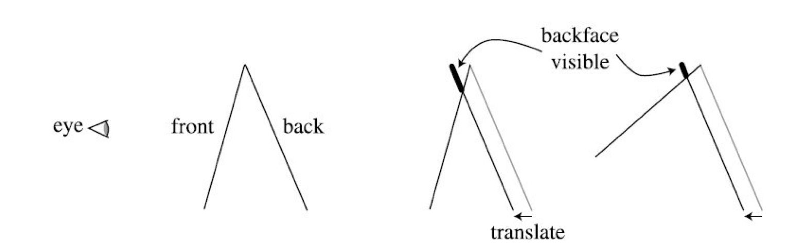
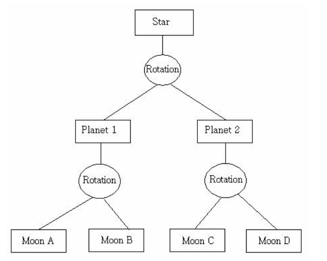

# 渲染管线

## 功能

- 在给定虚拟相机，物体，光源，照明模式以及纹理等诸多条件下，生成一幅二维图像

- 渲染管线是实时渲染的底层工具

## 三个阶段

- 应用程序阶段

  - 主要任务：将需要在屏幕上显示绘制出来的图元（点线面）输入到下一阶段
  - 通常用于实现碰撞检测，加速算法，输入检测，动画，力反馈，纹理动画，变换仿真，几何变形等方法。

- 几何阶段

  - 主要任务：多边形和顶点的操作

  - 细分

    

    - 模型视点变换
      - 目的：便于投影和裁剪
      - 效果：相机放在坐标原点，前-z，上y，右x，得到相机空间，模型变换到适合渲染的地方

    

    - 顶点着色
      - 目的：根据光源材质等对物体顶点上色
      - 方式：对每个点计算着色方程
    - 投影
      - 目的：降维：将模型从三维空间投射到二维空间
      - 两种投影变换：
        - 正交投影
        - 透视投影

    

    - 裁剪
      - 目的：对部分位于视体的图元裁剪
      - 图元相对视体的三个位置
        - 完全位于视体内，直接进入下一阶段
        - 部分位于视体内，裁剪
        - 不位于视体内，丢弃

    

    - 屏幕映射
      - 目的：将之前步骤得到的坐标映射到对应的屏幕坐标

  

- 光栅化阶段

  - 细分：

    

    - 三角形设定阶段
      - 计算三角形表面的数据
    - 三角形遍历阶段
      - 找到哪些采样点或者像素在三角形中
    - 像素着色阶段
      - 逐像素的着色计算，纹理贴图在这阶段进行。

    

    - 融合阶段
      - 从z缓冲器，颜色缓冲器，alpha通道，模板缓冲器，帧缓冲器，，累计缓冲器得到数据融合出图像到屏幕上

   

## 思维导图

# GPU渲染管线

## 描述

绿色：完全可编程

黄色：可配置，不可编程

蓝色：完全固定

## 流程概览

- 顶点着色器
  - 目标：将顶点从模型空间转换到齐次裁剪空间
  - 操作：对顶点进行变换，提供了修改顶点属性（颜色，法线，位置，纹理坐标）的功能
- 几何着色器（可选）
  - 目标：高效创建，销毁图元
  - 操作：对图元（点，线，三角面）的顶点进行操作
- 裁剪
  - 可选运行的裁剪方式，以及添加自定义裁剪面
- 屏幕映射
- 三角形设定
- 三角形遍历
- 像素着色器（片段着色器，片元着色器）
  - 在每个像素执行着色方程
- 合并阶段
  - 负责合并，颜色修改，Z缓冲，混合，模板和相关缓冲的处理

# 渲染的视觉物理现象

光线直接传播给物体发生折射传播到人眼

## 光照分类

平行光，点光源，聚光灯

## 光照现象
### 散射和吸收

- 散射
  - 反射
  - 折射
- 吸收发生在物质内部，减少光量，但不改变方向
- 镜面反射表示在表面反射的光，漫反射表示经过透射，吸收，散射的光

## 表面

## 着色

### 着色方程

- 镜面反射项

- 漫反射项
  

- 着色方程
  

- Blinn-Phong模型
  

### 三种着色处理方法

- 平滑着色：每个平面的颜色都和代表定点颜色一致

- 高洛德着色：根据顶点线性插值计算颜色

- 冯氏着色：对着色方程进行完全的像素求值
  

> 注意：冯氏着色模型考虑的是在三个顶点中填充颜色，冯氏光照模型考虑的是物体被光照的效果

# 抗锯齿（AA）
## 描述

消除显示器输出画面物体边缘凹凸的技术，通常原因是高分辨率信号以低分辨率表示或者无法准确计算3D图形的坐标定位导致图形混叠

## 类型

- 超级采样抗锯齿（SSAA）
  - 特点：消耗性能，简单直接
  - 步骤：把图像放大，和附近的像素点混叠，还原到原来大小
  - 常用方法：
    - OGSS顺序栅格超级采样(采样邻近的2个像素点)
    - RGSS旋转栅格超级采样(采样邻近的4个像素点)
- 多重采样抗锯齿（MSAA）
  - 特点：只对图形边缘进行抗锯齿处理，消耗较小，但效果差些
- 覆盖采样抗锯齿（CSAA）
  - 特点：进一步高效执行边缘取样
  - 步骤：将需要取样的子像素覆盖掉，把原像素强制安置在硬件和驱动程序预先算好的坐标中

- 高分辨率抗锯齿（HRAA）
  - 步骤：取样点四点在正方形角上，一点在正方形中心

- 可编程过滤抗锯齿（CFAA）
  - 特点：可灵活选择边界大小的MSAA
- 形态抗锯齿（MLAA）
  - 用边缘的前景和背景混合后的颜色填充边界像素
- 快速近似抗锯齿（FXAA）
  - 是MSAA的高性能快速近似，只是单纯的后期处理着色器
- 时间性抗锯齿（TXAA）
  - 将MSAA，时间滤波，后期处理相结合，呈现高保真度
- 多帧采样抗锯齿（MFAA）
  - MSAA的优化，提升性能表现

# 透明

## 透明渲染

- Screen-Door Transparency方法：棋格填充模式
  - 像素紧凑时效果好
  - 在50%效果最好
  - 每个区域与只能有一个透明物体

- Alpha混合：按照Alpha混合向量的值来混合源像素
  - A通道为1表示不透明，反之为透明

## 透明排序

要将透明物体正确渲染到屏幕，需要对透明物体进行排序

- 深度缓存（Z-Buffer）
  - 解决可见性问题
  - 但只能存储一个颜色
  - A-Buffer（深度像素）：单个像素存储一系列呈现在所有对象被解析为单个像素颜色的多个片段
- 画家算法
  - 效率较低
  - 由远及近绘制屏幕，近处覆盖远处
- 加权平均值算法
  - 使用透明混合公式来实现无序透明渲染的算法
- 深度剥离
  - 多遍渲染，第一次渲染z-buffer中z值最小的像素，然后把这些像素剥离，再进行n次此操作

# 纹理贴图

- 纹理是针对物体表面属性进行建模的技术

- 纹理中的像素被称为纹素
- 通过投影方程对空间点变换得到的关于纹理的数值，称为贴图（映射）

## 纹理管线

## 投影函数

将空间的三维点转换到纹理UV坐标

## 映射函数

- 将参数空间坐标转换为纹理空间位置

- 用于处理超出正常UV [0,1]之间的内容
- 常见的映射函数
  - 重复寻址模式：图像在表面重复出现，方向一致
  - 镜像寻址模式：图像在表面重复出现，重复的图像镜像或者反转
  - 夹取寻址模式：[0，1]正常显示，边沿uv延伸填充超过的部分
  - 边框颜色寻址方式：[0，1]正常显示，边框颜色填充超过的部分

- 不同的轴可以选择不同映射方式

## 三维纹理（体纹理）

- 比二维纹理效果更好
- 直接映射模型坐标，简单
- 低效，很多样本起不到作用

## 立方体贴图

- 贴图接缝问题
- 采用来自其他免得相邻样本创建mipmap链，并考虑每个纹素的角度范围，可得到不错效果

## 纹理缓存

- 一个游戏可能需要相当数量的纹理，有着各种各样的纹理存储技术，但它们永远不够用。

- 建议：保持纹理在不需要放大再用的前提下尽可能小，并尝试基于多边形将纹理分组。
- 策略：
  - 最近最少使用策略LRU：加载到图形加速器内存的每个纹理都会上一个时间戳，记录最后一次渲染的时间。加载新的纹理时先卸载最旧的纹理
  - 最近最常使用策略MRU：如果画面没有纹理切换，LRU会发生画面抖动影响，用MRU策略直到画面没有纹理交换为止切换为LRU
  - 预取策略：预先加载纹理
  - 裁剪图策略：适用于图像数据集巨大的情况，如飞行模拟，地形模拟。将整个数据集视为一个mipmap，对于任何特定的视图，只需要mipmap的较低级别的一小部分即可。

## 纹理压缩

- 解决内存和带宽问题的方法之一

- 方法
  - DXT
  - ATI
  - ETC

## 程序贴图纹理

- 用于创建纹理映射的自然元素
- 常用到分形噪声和湍流扰动函数
- 计算量大

## 凹凸贴图发展

### 凹凸贴图

- 两种方法

  - 通过改变表面光照方程的法线（非几何法线），产生表面凹凸不平的视觉效果

  - 使用高度图修改法线方向，白色表示高，黑色表示低

### 移位贴图

- 每个纹素存了一个向量，代表对应顶点的位移

### 法线贴图

- 凹凸贴图和纹理贴图通常是在现有的模型发现上添加扰动，而法线贴图完全更新法线
- 法线贴图就是直接将法线保存到一张纹理，使用时取用即可

### 视差贴图

- 通过替换渲染多边形上的顶点处的纹理坐标实现，得到的效果比凹凸贴图更真实

- 需要用到切线空间和高度图的方程

### 浮雕贴图

- 极至的凹凸贴图
- 能比视差贴图提供更深的深度

- 计算量大，在shader里做光线追踪
- 拥有自遮挡

# BRDF双向反射分布函数

- 反映了入射光经过某个表面反射后如何在各个出射方向上分布

## 辐射度量学概念

## BRDF的定义

$$
f(l,v) = dL_0(v)/dE(l)
$$

- 出射辐射率的微分和入射辐照度的微分之比

- 描述了入射光线经过某个表面反射后如何在各个出射方向上分布，给定了入射方向和出射方向能量的相对量

- 非微分形式

$$
f(l,v)=L_0(v)/E(l)\overline\cos{\theta_i}
$$

##  BRDF和着色方程

$$
L_0(v)=\sum_{k=1}^{n}{f(l_k,v)\otimes E_{L_k}\cos{\theta_{i_k}}}
$$

## BRDF可视化表示

- 左图表示漫反射，右图表示镜面反射

## BRDF性质

- 可逆性：光路可逆

$$
f(l,v)=f(v,l)
$$

- 能量守恒：入射光总能量 = 出射光总能量

$$
Q_{入射}=Q_{反射}+Q_{吸收}+Q_{透射}
$$

- 线性（叠加）：一点的反射量 = 各BRDF反射量之和

## BRDF模型的分类

- 经验模型：用于反射快速计算的近似，不一定满足物理定律

  - Phong

  - Blinn-Phong
  - Lambert漫反射
  - 快速Phong
  - 可逆Phong

- 数据驱动模型：记录大量的BRDF模型，通过查表直接套用渲染结果

  - A Data-Driven Reflectance Model

- 基于物理的模型：

  - Cook-Torrance

  - Ward

## BRDF的分类

- 各向同性BRDF
  - 反射不受与给定表面法向量夹角的约束
  - 随机表面微结构

- 各向异性BRDF
  - 反射比随着与某个给定的表面法向量的夹角的变化而变化
  - 图案的表面微结构
  - 金属丝，绸缎，毛发等

## 基于物理的BRDF 前置知识

### 次表面散射（SSS）

光摄入半透明材质在内部发生散射，最后射出物体的过程

### 菲涅尔反射

- 菲涅尔方程：用来描述光在两种不同介质中传播的反射折射光学方程

- 菲涅尔反射：光入射到两种不同介质的分界时，一部分光被反射，反射光强会根据我们的观察角度变化
- 理解：垂直看向水池，反射较弱，可见池底，接近平行水池表面的高光反射会变得非常强，不可见池底

### 法线分布函数(NDF)

$$
D(h)=\frac{\alpha^2}{\pi((n\sdot h)^2(\alpha^2-1)+1)^2}
$$

- 输入一个朝向h，NDF返回朝向h的微表面占总面积的比例

- 微观的不规则表面造成光的漫反射，产生宏观上模糊的反射

## BRDF常见模型

- Cook-Torrance BRDF模型
  - 又称Cook-Torrance微表面着色模型

$$
f(l,v)=\frac{F(l,h)G(l,v,h)D(h)}{4(n\sdot h)(n\sdot v)},其中\left \{ 
\begin{array}{c}
F 表示菲涅尔反射函数\\ 
G表示 阴影遮罩函数\\ 
D 表示法线分布函数
\end{array}
\right.
$$

- Ward BRDF模型

  - 可以处理各向异性效果

  - 但没有考虑菲涅尔因子和几何衰减因子

$$
\rho_{bd\space iso}(\theta_i,\phi_i,\theta_r,\phi_r)=\frac{\rho_d}{\pi}+\rho_s\sdot\frac{1}{\sqrt{\cos{\theta_i}\cos{\theta_r}}}\sdot \frac{exp[-tan^2\delta /\alpha^2]}{4\pi\alpha^2}
$$

## BRDF引申

- BSSRDF：双向表面散反射分布函数
  - 描述了沿入射方向从物体表面的一点到另外一点，最后顺着出射方向出去的光线相对量
- SBRDF：空间BRDF
  - 捕获基于空间位置BRDF变化的函数
- BTDF：双向透射分布函数
  - 处理表面透射分量

- BSDF：双向散射分布函数
  - 处理表面散射分量

# 延迟渲染

- 将着色计算延迟到深度测试之后
- 在很多光源的场景中也能保持高帧率
- 利用几何缓冲区G-buffer将所有模型整合成一个模型再着色
  - G-buffer主要用于存储每个像素点对应的位置，法线，反射率，镜面反射参数，漫反射颜色以及其他有用的材质参数
  - G-buffer存储的是深度测试最顶层的片段

- 正向渲染O(m*n),延迟渲染O(m+n)

- 步骤
  - 几何处理阶段：获取几何信息，将第二步所需的各种数据存储在多个G-buffer中
  - 光照处理阶段：只需渲染屏幕大小的二维矩形，利用G-buffer的数据对每个光源计算光照

- 正向渲染vs延迟渲染

|                          | 正向渲染                                                     | 延迟渲染                                                     |
| ------------------------ | ------------------------------------------------------------ | ------------------------------------------------------------ |
| 步骤                     | 先着色，后进行深度测试                                       | 先进行深度测试，后着色                                       |
| 复杂度(m个物体，n个光源) | O(m*n)                                                       | O(m+n)                                                       |
| 渲染管线                 | 顶点生成和处理->图元生成处理->栅格化(片段生成)->片段处理->帧缓冲操作->帧缓冲 | 顶点生成和处理->图元生成和处理->栅格化(片段生成)->几何处理->帧缓冲操作->G-buffer->渲染->帧缓冲器 |

~~~cpp
//伪代码
	//正向渲染
for each light :
	for each object affected by the light:
		framebuffer += object*light;
	//延迟渲染
for each object:
	render to multiple targets
for each light:
	apply light as a 2D postprocess
~~~

- 延迟渲染属于用空间换时间的算法
  - G-buffer存了大量的物体信息
- 延迟渲染对透明物体存在渲染问题
  - 无法对物体排行
- 对多重采样抗锯齿不友好
  - MSAA需要找到物体的边缘，需要支持MRT
- 改进：
  - 将G-buffer的数据结构最小化，称为**延迟光照**
  - 将多个光线划分为一组一起处理，称为**分块延迟渲染**

## 延迟光照

- 思路
  - 渲染非透明几何体。将法线向量n和镜面扩展因子m写入缓冲区（类似一个轻量级G-buffer）
  - 渲染光照。计算漫反射和镜面着色方程，将结果写入不同漫反射和镜面反射累计缓冲区
  - 用上一步计算的两个值对不透明模型二次渲染，将最终颜色输入到颜色缓冲区
  - 使用非延迟着色方法渲染半透明几何体
- 有利于MSAA采样

## 分块延时渲染TBDR

- 延迟渲染会对每个光源全部调用一次G-buffer的内容，消耗大
- 分块延迟渲染将屏幕分成小块，计算每块会受到哪些光源的影响，把光源信息存到分块的光源列表（**光源剔除**）
- 对每个分块着色

特点：

- 减少了所需考虑光源的个数
- 减少了存储的带宽
- 增加了光线和分块求交的计算量

# 环境映射

- 对反射的近似
- 不考虑自身反射
- 分类
  - 球形环境映射
  - 立方体环境映射
  - 抛物线环境映射
  - 光泽反射环境映射
  - 基于视角的反射映射
  - 辐照度环境映射

# 全局光照GI

- 既考虑直接光照，又考虑经过场景中其他物体反射后的光照的一种渲染技术。

- 主要算法
  - 光线追踪
    - 递归式
    - 分布式
    - 蒙特卡洛
  - 路径追踪（基于光线追踪，结合蒙特卡洛方法形成）
    - 蒙特卡洛
    - 双向
    - 能量再分配
  - 光子映射
  - 基于点的全局光照
  - 辐射度
  - 梅特波利斯光照传输
  - 球谐光照
  - 环境光遮蔽
  - 基于体素的全局光照
  - ......

## 全局光照发展史

- 光线投射：从每个像素射出一条射线，找到最接近物体挡住射线的路径，视平面上的每个像素的颜色取决于可见光表面产生的亮度。

- 光线追踪：先光线投射，在和物体相交的地方反射，折射，散射之后继续传播，直到和光源相交
  - 思想：
    - 从视点向成像平面的像素点发射光线，找到和该光线相交的最近的交点	
      - 如果该点是散射面，则直接返回光源直射该点的颜色
      - 如果该点是镜面或者折射面，则继续向反射或折射方向跟踪另一条光线
    - 递归上述过程直到逃逸出场景或者到达设定的最大递归深度

- 分布式光线追踪
  - 可以模拟更多效果：软阴影，金属光泽，景深，运动模糊
- 渲染方程
  - 描述了光能在场景传播

$$
L_0(x,\vec{\omega})=L_e(x,\vec{\omega})+\int_\Omega{f_r(x,\vec{\omega'},\vec{\omega})L_i(x,\vec{\omega'})(\vec{\omega'}\sdot\vec{n})}d\vec{\omega'}
$$

- 路径追踪
  - 无偏渲染方程
  - 思想：
    - 从视点发射一条光线，光线和物体表面相交
    - 根据表面材质属性继续采样一个方向，发出另一条光线
    - 迭代上述两步，直到光线打在光源上或者溢出场景
    - 通过蒙特卡洛方法，计算其贡献，作为像素的颜色值
- 双向路径追踪
  - 思想
    - 从视点，光源打出射线
    - 经过若干次反弹后，将视点子路径和光源子路径的顶点连接起来，以快速产生很多路径
  - 有效降噪
- 梅特波利斯光照传输
  - 自适应生成贡献大的路径，或者说避开贡献小的路径
  - 再贡献大的路径旁边变异出一些新的路径
  - 鲁棒性好，特殊光线的噪声小

## 光线追踪

- 计算量巨大，消耗性能
- 抗混叠效果好
- 不是真实的图像效果

~~~cpp
//伪代码
对于屏幕的每个像素
{
    最终颜色 = 0;
    光线 = {起点 ， 方向};
    重复
    {
        对于屏幕中的每个对象
        {
            确定最近的光线物体的交叉点;//可能有多个交点，只取最近的
        }
        如果存在交点
        {
			对于屏幕中的每个光源
            {
                如果光线不在另一个物体的阴影中
                {
                    将此光的贡献添加到计算的颜色中;
                } 
            }
        }
        最终颜色 = 最终颜色 + 计算颜色 * 先前的反射因子;
        反射因子 = 反射因子*表面反射特性;
        增量深度;
    }
    直到反射因子为 0 或达到最大深度
}
~~~

## 路径追踪

- 思想：
  - 从视点发出一条光线，光线和物体表面相交时根据表面的材质继续采样一个方向，发出另一条光
  - 迭代上述步骤，直到达到光源上或者逃逸出场景
  - 使用蒙特卡洛方法计算光线的贡献，作为像素的颜色值

- 无偏的，时间足够长最终能收敛得到正确结果

## 光线投射vs光线追踪vs路径追踪

- **光线投射**：发射光线和物体相交

- **光线追踪**是一种框架——从视点发出光线，与物体相交就根据规则反射折射吸收；遇到光源或者走太远就停住
- **路径追踪**是光线追踪+蒙特卡洛方法。相交后选择一个方向继续追踪，根据BRDF计算颜色

## 环境光遮蔽AO

- 全局光照的近似
- 可产生重要的视觉明暗效果
- 描绘物体间由于遮挡产生的阴影，捕捉场景的细节
- 解决漏光，阴影漂浮问题，改善场景中角落，锯齿，裂缝等细小物体阴影不清问题
- 增强场景深度和立体感
- 直观感觉未开启环境光遮蔽画面亮一些，开启后细节，特别是暗部阴影会更加明显一些

- 常用SSAO（UE4）

# 游戏开发中基于图像的渲染技术

## 渲染谱

- 细节层次技术LOD：根据物体和相机的距离改变物体的质量，可以加快场景渲染速度
- 渲染谱：从简单到复杂，由二维图像到三维模型，从外观特征到物理渲染

## 固定视角的渲染

- 将复杂几何模型转换成可以复用得简单buffer来节省渲染时间

- vr的360度全景图允许摄像机随意转动和倾斜

## 天空盒

- 远景在你移动的时候不会有很大变化

## 环境贴图

- 放置在围绕着观察者的网格上，足够大包含所有场景的对象
- 移动会破坏真实感

## 光场渲染

- 光场：空间任意点发出任意方向的光的集合
- 光场渲染：由相机阵列或者一个相机按路径移动，把场景拍摄下来输出为图集。对于给定的新视点，找出几个近邻的采样点插值就能得到该视点的视图

## 精灵和层

- 精灵：再屏幕上移动的图像
- 可通过一系列精灵生成动画
- 将精灵放在不同的层可以做远近感觉

## 公告板

- 公告板：根据观察方向确定多边形面朝方向的技术
- 适合表示烟雾火焰爆炸等效果
- 三种类型：
  - 对齐屏幕的公告板：n是镜头法线的反方向，u是镜头的上
  - 面向世界的公告板：r=u*n,u=r\*n
  - 轴向公告板：n是镜头法线的反方向，n'=u*n为最终可用的n

## 粒子系统

- 微小物体的集合，可按照某种算法运动

## 替代物

- 将一个复杂物绘制到一幅图像纹理上，再映射到公告板上

## 公告板云

- 一个复杂模型通过一系列公告板集合互相交叉重叠进行表示

## 图像处理

- 后期处理：颜色矫正，镜头炫光，色调映射，景深，运动模糊

- 颜色校正：转换像素的颜色，可用于风格化画面
- 色调映射：将图片的亮度范围映射到计算机屏幕的亮度范围
- 镜头炫光和泛光：
  - 炫光：圆形毛绒彩虹
  - 泛光：光源附近的辉光
- 景深：焦点范围，焦点前后清晰的距离称为景深
- 运动模糊：时间上的抗锯齿
- 体渲染：用于显示离散三维采样数据集的二维投影技术：体积云体积雾

# NRP

## 非真实感渲染NPR

### 卡通渲染

- 三要素：
  - 锐利的阴影
  - 少有或没有高亮的点
  - 对物体轮廓描边

### 轮廓描边的渲染方法

- 基于视点方向的描边
  - 视点方向和法相方向垂直的地方认为是轮廓（点乘接近0的地方

- 基于过程几何方法的描边
  - 先渲染正向表面，再渲染背向表面，从而使轮廓边缘可见
  - 渲染北面的边界线，使用偏置技术让这条线恰好位于正表面之前

- 基于图像处理的描边

  - 寻找z缓冲区不连续的地方

- 基于轮廓边缘检测的描边

  - 检测**朝向相反的相邻三角形的交接处**绘制

  - $$
    (n_0\sdot v>0)!=(n_1\sdot v>0)\\n是三角面的法线，v是实现方向的向量
    $$

- 

- 混合轮廓描边
  - 结合图像处理方法和几何要素方法
    - 找到轮廓边缘，赋予id
    - 根据id找到可见的轮廓，进行重叠性检测
    - 连接起来形成平滑笔触路径
    - 风格化渲染

## 其他风格的NPR渲染技术

- 纹理调色板
  - 根据反射着色项的不同应用不同的纹理

- 色调艺术图TAM
  - 自动生成纹理，应用到物体表面

- 嫁接
  - 将几何或者贴花应用到物体表面

- 水彩NRP
  - MNRP

# 游戏开发中的渲染加速算法

## 空间数据结构

- 将几何体组织在空间中的一系列数据结构
- 用于实时渲染的加速查询，如场景管理，裁剪算法，相交测试，光线追踪，碰撞检测等

### 常见的空间数据结构

- 层次包围盒BVH：**几何划分**

- 二元**空间分割**树BSP：左子树存当前分割面前面的物体，右子树存当前分割面后面的物体
  - 分类：
    - 轴对齐BSP（**k-d 树**）：将场景用aabb包围盒包裹然后分别沿xyz轴（三个方向各分割一次是一个周期）递归划分成更小的盒子，直到盒子内部的物体数量低于用户设定值
    - 多边形对齐BSP树：创建耗时，计算简单

- 平面方程

$$
Ax+By+Cz+D=0,\\代入点(x_0,y_0,z_0),\\if\space D>0:forward\\if\space D=0:in\\if\space D<0:behind
$$

~~~cpp
\\遍历bsp
traverse_tree(bsp_tree*tree,point eye)
{
    location = tree->find_location(eye);
    if(tree->empty())	return;
    if(location>0)
    {
        traverse_tree(tree->back,eye);
        display(tree->polygon_list);
        traverse_tree(tree->front,eye);
    }
    else if(location<0)
    {
        traverse_tree(tree->front,eye);
        display(tree->polygon_list);
        traverse_tree(tree->back,eye);
    }
    else
    {
        traverse_tree(tree->front,eye);
        traverse_tree(tree->back,eye);
    }
}
~~~

- 四叉树，八叉树

  - 

  - 松散八叉树：选择长方体的大小比较宽松：k=1.5就是把每个长方体放大50%，稍微移动来区分它们

- 场景图
  - 组织管理三维场景的数据结构，是一个有向无环图，父节点发生变换子节点也变换
  - 

## 裁剪技术

- 背面裁剪

- 视锥裁剪
  - 结合bvh先序遍历

- 遮挡裁剪
  - 通过查看zbuffer裁剪不再buffer的物品

~~~cpp
Or = empty;
P = empty;
for rach object g in G{
    if(isOccluded(g,Or))
        skip(g);
    else{
        Render(g);
        Add(g,P);
        if(LargeEnough(P))
        {
			update(Or,P);
            P=empty;
        }
    }
}
~~~

- 对比上面三种裁剪

- 入口裁剪
  - 在入口处减小视锥，使其和入口紧密贴合

- 细节裁剪
  - 当视点运动时，场景的微小细节对渲染图贡献甚微，此时可以裁剪这些细节。

## 遮挡剔除算法

