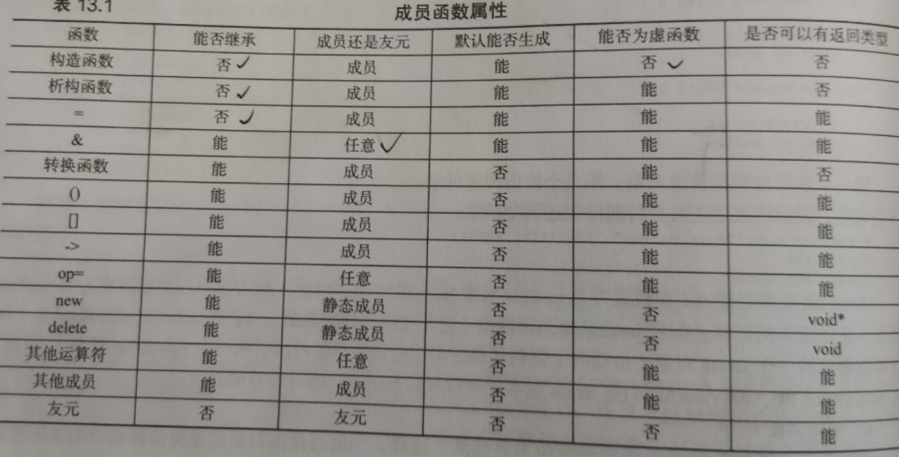
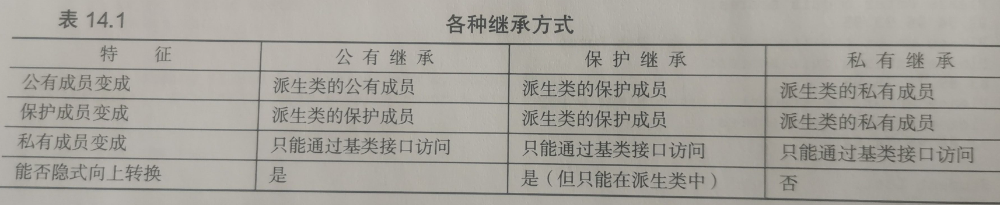

- `.\`表示当前目录

- `echo`获取main命令的返回值

- `iostream`标准库的IO机制，包含输入流`istream`，输出流`ostream`

- `cerr` 标准错误，输出警告和错误信息

- `clog` 输出程序运行时的一般性信息

- `::`作用域运算符

- 读取数量不定的输入数据`while(std::cin>>val) sum+=val;`

- `()`调用成员函数(方法)，`if(item1.isEqual() == item2.isEqual())`

  ## 转义序列

  \n	换行符		 	   \'  单引号
  \t	横向制表符		  \"  双引号
  \a	响铃				\f	进纸符
  \v	纵向制表符		  \?	问号
  \\	反斜线				\b	退格符
  \r	回车符

  ## `extern`只想声明而不定义使用，且不要显式初始化。可以给extern显式初始化，一旦这样做，就成了定义。在函数体内部初始化extern标记的变量，将引发错误

~~~cpp
extern int i; //声明
int j;        //声明并定义
extern double pi-3.1416 //定义
~~~

## void* 指针是一种特殊的指针类型，可存放任意类型对象的地址

void* 指针能做的事：与其他指针比较大小  作为函数的输入输出传递  赋值给另一个void *指针

void* 指针不能直接操作void*指针所指的对象，因为不知对象类型

## const

默认状态下，const对象仅在文件内有效

在编译期将const变量都替换为对应的值

当多个文件出现了同名的const变量时，等同于在不同文件中分别定义了独立的变量。

如果要在文件间共享const对象，就必须在声明和定义中都用extern，即将所有该对象都声明为文件外可见。

~~~cpp
// .h
extern const int a;

// .cpp
extern const int a = 0;
~~~

const的引用，对常量的引用不可修改其绑定的对象。

~~~cpp
const int ci = 1024;
const int &r1 = ci;
r1 = 2048;//error，r1是对常量的引用
int &r2 = ci;//error,非常量引用指向一个常量引用
~~~

引用的类型必须严格匹配

若不匹配，编译器会如下处理

~~~cpp
double a = 10.3;
const int &b = a;

//编译器执行过程
//const int c = a;
//const int&b = c;
~~~

可将常量引用绑定到非常量对象。此时对象仍可修改，只是不能被这个引用修改。

~~~cpp
int i = 42;
int &r1 = i; 
const int& r2 = i;
std::cout << r2 << std::endl; //输出42
r1 = 0;
std::cout << r2 << std::endl; //输出0
i = 10;
std::cout << r2 << std::endl; //输出10
~~~

## 指向常量的指针&常量指针

~~~cpp
//定义“常量指针”，存放的地址不能修改，但其所指对象的值可以修改
int errNumb=0;
int *const curErr=&errNumb;   //常量指针。curErr是const，是指针，指向int对象
//定义“指向常量的指针”和“指向常量的常量指针”
const double pi=3.14;
const double *cptr=&pi;       //指向常量的指针。cptr是指针，指向const double对象
const double *const pip=&pi;  //指向常量对象的常量指针。pip是const，是指针，指向const double对象

~~~

## 顶层const && 底层const

顶层const是指const指针本身是个常量：常量指针，拷贝是不受影响

底层const是指const指的对象是个常量：指向常量的指针，拷贝时底层类型严格匹配，或者能相互转换。

## constexpr && 常量表达式

常量表达式：指不会改变，且在编译期就能得到结果的表达式（两个条件缺一不可）

用常量表达式初始化的const对象也是常量表达式。

~~~cpp
const int max_files=20; //是常量表达式
const int limit =max_files+1;//是常量表达式
int staff_size=27; //不是，因为类型不是const int
const int sz =get_size(); //不是，因为get_size()运行时才确定
~~~

constexpr：由编译器来验证变量是否是一个常量表达式

~~~cpp
constexpr int mf=20;  //是常量表达式
constexpr int limit=mf+1;//是常量表达式
constexpr int sz=size();//只有当函数size()是constexpr函数时，才是初始化constexpr变量
~~~

## 字面值类型

算术类型、引用和指针属于字面值类型

自定义类Sales_item、IO库、string类型不属于字面值类型

## 类型别名

定义方法：

旧版：typedef

新版：using

~~~cpp
typedef double wages;   //wages是double的同义词
typedef wages base, *p;  //base是double的同义词，p是double *的同义词

using SI=Sales_item;    //SI是Sales_item的同义词
~~~

## 用+拼接两个string对象

~~~cpp
string s1 = "Hello ", s2 = "World";
string s3 = s1 + "World";//right
String s4 = "HEllo "+"World";//error
//因为string 和 字面值时不同的类型
~~~

## decltype推测类型

~~~cpp
for(decltype(s.size())index = 0;index!=s.size()&&!isspace(s[index];index++)
    s[index] = toupper(s[index]);
~~~

## 迭代器

~~~cpp
*iter//返回iter所指得元素引用
~~~

## 连续赋值

~~~cpp
int x, y, z;
x = y = z = 1;
//顺序从右到左，z=1, y=z=, x=y
~~~

## sizeof对类型名必须用括号，变量名可以省略

~~~cpp
int n_max = INT_MAX;
cout<<sizeof(int)
    <<" "<<sizeof(n_max)
    <<sizeof n_max;
	//<<sizeof int //error
~~~

## cout.put()

~~~cpp
//用于显示一个字符
char ch = 77;
//char ch = 'M';
cout.put(ch);
cout.put('!');
~~~

## char

~~~cpp
char ch;//maybe unsigned or signed
unsigned char uch;//0~255
signed char sch;//-128~127
~~~

## wchar_t宽字符类型

wchar_t 16位字符型

wchar_t常用于表示扩展字符集

char表示基本字符集

~~~cpp
wchar_t bob = L'p';//L表示宽字符常量，宽字符串
wcout<<L"tall"<<endl;
~~~

## const比#define好

1. const 指定了常量的类型
2. const可以使用c++的作用域将常量限定在某个函数or文件内
3. const可用于更复杂的类型

## cout.setf

 ios_base::fixed 表示：用正常的记数方法显示浮点数 (与科学计数法相对应)； ios_base::floatfield 表示小数点后保留6位小数。

~~~cpp
cout.setf(ios_base::fixed,ios_base::floatfield);
~~~

## 数据类型转化

~~~cpp
	int y = int(1.66);//c++把int() 当作类型转换的函数
	y = (int)1.55;//c的写法
	y = static_cast<int>(1.44);//上面的转换有危险
~~~

## 数组的初始化

~~~cpp
int s1[3] = {1,2,3};

int s2[3];
s2[3] = {1,2,3};//error
s2[0] = 1;
s2[1] = 2;
s2[2] = 3;

int s3[] = {1,2,3}//自动推测个数为3
int nums = sizeof s3 / sizeof(in)

int s4[3] = {1};//第一个赋值为1，其余为0

int s5[3] = {0};//全部赋值为0
~~~

## 数组中的string

~~~cpp
const int Size = 15;
char name[Size] = "RenBiao";
cout<<name<<endl;//RenBiao
int nums = strlen(name);
cout<<nums;//7
name[4] = '\0';//遇到\0认为字符串结束
cout<<name<<endl;//RenB
nums = strlen(name);
cout<<nums;//4
~~~

## 读取一行输入

~~~cpp
cin.getline(name,Size); //到换行符结束，并用空字符替换换行符

cin.getline(name1,Size).getline(name2,Size);//把连续两行分别给name1，name2

cin.get(name,Size);  //到换行符结束，但不丢弃换行符，下次输入仍然停在这里
cin,get()//换行,否则一直停留在上一个的换行符处
    
cin.get(name,Size).get();//和上面等价
~~~

## string 的操作

~~~coo
//c风格
strcpy(s3,s1);//复制
strcat(s3,s2);//末尾附加
//等价于
s3 = s1 + s2;

strlen(s1);

s1.size()
~~~

## 结构体的创建和初始化

~~~cpp
//1. 定义两个结构体变量RB ，YK
struct People{
  int age;
  bool isStudent;
  string name;
}RB,YK;

//2.定义后直接赋值
struct People{
  int age;
  bool isStudent;
  string name;
}RB = {
    16,
    false,
    RenBiao;
};

//3.提前创建好结构体变量，后续不能再创建
struct {
	int age;
	bool isStudent;
	string name;
}RB, YK;
RB = {12,false,"dad"};
YK = RB;
~~~

## 结构数组

~~~cpp
struct People {
	int age;
    bool isMarried;
};

People Studets[2] =
{
	{18,false},
    {20,true}
};

cout<<Students[1].age<<endl;//20
~~~

## 结构中的位字段

~~~cpp
//字段类型 : 位数
struct test {
	unsigned int SN : 4;
    bool goodIn : 1;
};

test TT = {13,true};
~~~

## 共用体

~~~cpp
//共用体可以包含很多类型，但同一时间只能体现为一个类型
//适用于需要节省空间的地方，如嵌入式
struct widget 
{
    char brand[20];
    int type;
    union id
    {
    	long id_num;
        char id_char[20];
    }id_val;
};

widget price;

if(price.type == 1)
    cin >> price.id_val.id_num;
else
    cin >> price.id_val.id_char;

///////////////////////////////
//匿名共用体
struct widget
{
  	char brand[20];
    int type;
    union//由于是匿名的 id_num id_char被视为两个地址相同的widget的成员
    {
        long id_num;
        char id_char[20];
    };
};
widget price;
if(price.type == 1)
    cin>>id_num;
else 
    cin>>id_char;
~~~

## 枚举

~~~cpp
//没有被初始化的枚举量将比前一个大一
enum numbers{one = 1,two,four =4 ,five};//two =2  five = 5
//enum 的范围 ：
//			(-2^n-1||0) —— 2^n-1
~~~

## 指针的危险

~~~cpp
long *pt;
*pt = 334;
//计算机回分配地址的内存，但不会分配数据的内存，334可能会覆盖指向的地址的数据
//使用指针前一定要分配合适的地址
~~~

## new申请内存

~~~cpp
int *p = new int;
*p = 100;
//在内存中开辟一块地址为p大小为int的空间存放*p
//*p的值为 100
~~~

## delete释放内存

delete用于将new的内存还给内存池，但不会删除指针本身，new之后不delete会发生内存泄漏

~~~cpp
int *p = new int;
delete p;
delete p;//error,多次删除结果不确定
int *q = &a;
delete q;//error，delete和new配套使用
~~~

## 静态联编&动态联编

编译期分配数组的内存，且需要指定长度，始终占有内存

new运行期分配数组的内存，自动确定数组的长度，需要时才分配内存

~~~cpp
int * pArr = new int[10];
*pArr = 12;//pArr[0] = 12;
pArr[1] = 2;
*(pArr+2) = 3;//pArr[2] = 3
delete [] pArr;
~~~

## new delete 使用规则

不要用delete释放非new的内存

不要delete一块内存两次

new一个数组就要 delete[]，new一个数据就delete

delete空指针是安全的

new一个实体，用delete释放

## 数组名 == 第一个元素的地址

例外： sizeof(数组名)返回的是整个数组的长度

~~~cpp
int arr[3] = {1,2,3};
int *p = arr;
//equal to
//int *p = &arr[0];

//arr是首个元素的地址，arr+1 指针向后移动一个元素大小
//&arr 是整个数组的地址 &arr+1指针向后移动arr的大小
~~~

## 管理数据内存的方式

1. 自动存储：局部变量，函数结束时释放内存
2. 静态存储：函数外定义 or 使用static声明，程序结束时释放内存
3. 动态存储：new delete 管理了一个内存池，称为自由存储空间 or 堆。new和delete可以在一个函数中分配内存，在另一个函数中释放，不完全受程序、函数的限制，自由度大。delete释放内存
4. 线程存储：thread_local声明，其生命周期和所属线程一样长

## 数组，结构，指针

~~~cpp
	aye s1,s2,s3;
	s1.year = 1998;//结构用 .
	aye * pa = &s2;
	pa->year = 1999;//指针用 ->
	aye trio[3];
	trio[1].year = 2000;//数组元素也是结构
	cout << (trio+1)->year<<endl;//数组名是指针，指向首元素的地址
	const aye *arp[3] = {&s1,&s2,&s3};
	cout<<arp[0]->year<<endl;//指针数组每个元素都是指针
	//const aye **ppa = arp;//ppa是一个指向arp首元素的指针 *ppa=&arp[0],**ppa = arp[0]
	//const aye **ppa = &arp[0];//equal to upper
	auto ppa = arp;//equal to upper
	cout<<(*ppa)->year<<(*(ppa+1))->year<<endl;
	cout<<(**ppa).year<<endl;
~~~

## madis = (cooks = 4)+3;

madis = 7;

## if(=)

~~~cpp
	int x;
	if(x = 0)//0，假，不进入
		cout<<x;
	if(x = 1)//1，真，进入
		cout<<x;
~~~

## 判断字符类型

~~~CPP
#include <cctype>
isalpha()//字母
ispunct()//符号
isspace()//空格
isupper()
toupper()
islower()
~~~

## switch

~~~cpp
switch(choice)
{
    case 'a':
    case 'A':
        ...
            break;
    case 'b':
    case 'B':
        ...
            break;
    default: ...
}

//配合枚举类
enum{red,blue,green,orange};

while(code>=red&&code<=orange) 
{
    switch(code)
    {
        case red:...break;
        case blue :...break;
        case green :...break;
            ...
                default:...;
    }
}
~~~

## 按值传递

~~~cpp
int func (int arr[]);
//虽然按值传递，但传入的是一个arr指针，指向一个地址，这个指针不能改变，但指向的内容可以改变
//如果不希望改变
int func (const int arr[])
~~~

## 指针&const

~~~cpp
int age = 35;
int *p = &age;
const int *pt = &age;

const int b = 2;
const int* p1 = &b;
//int* p2 = &b;//error,可变指针指向一个常数是不可取的
~~~

## const的位置

~~~cpp
int x = 0;
int *p1 = &x;
const int *p2 = &x;//不能修改p3指向的值
int* const p3 = &x;//不能修改p3指向的地址
const int* const p4 = &x;//都不能改
~~~

## 二维数组

~~~cpp
//数组名是一个地址，指向内部元素
//二维数组的数组名，指向列数组的指针

//说明ar2是一个由4个指针构成的指向4个int的的指针数组
int sum(int ar2[][4],int size);
int sum(int(*ar2)[4],int size);

int a[12][4];
int b = sum(a,12);

ar2[r][c] = *(*(ar2+r)+c)
//ar2指向第一个4 int数组
//ar2+r指向第r个4 int数组
//*(ar2+r)拿到第r个4 int数组，自己本身又是该数组的名字，指向第一个int
//*(ar2+r)+c //指向第r个数组中第c个int
//*(*(ar2+r)+c)//拿到该int
~~~

## string表示

~~~cPP
char str1[10] = "abcde";
char *str2 = "abcde";
string str3 = "abcde";
//strlen(str1)==strlen(str2)==strlen(str3)
~~~

## 引用解决了效率和表示法两方面的问题

## 函数指针

~~~cpp
process(think);//把think函数的地址传给process
thought(think());//把think的return value传给thought

double pam(int);//普通函数
double *rpf(int);//返回指针的函数
double (*pf)(int);//指针函数的声明，pf是函数指针

pf = pam;//pf指向pam函数，返回值和参数必须一致才能使用
//以下都对，都是调用pam(0)
double x = pam(0);
double y = (*pf)(0);
double z = pf(0);

void estimate(double (*pf)(int));
estimate(pam);//estimate可以使用pam函数了
~~~

## 数组名

~~~cpp
int arr[];
//arr表示&arr[0]
//&arr表示整个数组的地址
//arr+1表示&arr[1]
//&arr+1表示下一个数组大小的空间
//*arr表示arr[0]
//*&arr表示&arr[0]
//**&arr表示arr[0]
~~~

## 内联函数

inline

空间换时间，每次调用都产生一个函数副本

无需跳到函数调用，编译期用相应的代码块替换函数

不能递归调用

适用于小的函数，函数过大编译器可能不允许内联

类似c语言中的#define，但宏定义不能按值传递

## 指针&引用

引用在声明的时候必须初始化，类似const *，一旦初始化，就不能修改

~~~cpp
int rat ;
int & rodent = rat;
int *const pr = &rat;//equal to upper
~~~

## 引用&常量引用

~~~cpp
//引用不能使用类型不匹配的参数和非左值参数，因为如果产生临时变量回影响传引用改变原始数据的目的
//常引用可以，会生成一个临时变量，因为const代表不能修改原始数据，所以用临时变量也无妨
~~~

应尽量使用const

1. 防止原始数据被修改
2. const可以处理const&&非const的数据，而不加const只能处理非const的数据
3. const能使函数正确生成临时变量

- 传参方式的选择

  - 数据需要修改？

    - 需要修改

      - 数组 or 内置数据类型：传指针
      - 类：传引用
      - 结构体：传指针 or 传引用
  - 不需要修改
    
    - 数据对象小？
    
      - 小：传值
        - 大
      
          - 是数组：传指向const的指针
      - 是类对象:传引用

## 函数重载

~~~cpp
int x = 0;
//void print(int x);
void print(int& x);
//由于调用的时候两种声明没法区分
//所以编译期把类型引用和类型本身视作同一特征标，防止歧义发生

void print(const int x);//override

//重载会选择最匹配的来使用
void print(const int x);
void print(int&&x);

int a = 0;
const int b = 3;
print(a);//void print(int& x);
print(b);//void print(const int x);
print(a+b);//void print(int&&x);
~~~

c++由名称修饰和名称矫正，我们看起来同样的函数，在编译器里不同

## 函数模板

~~~cpp
template <typename T>//<class T>等价
void func(T &a);
~~~

## 函数模板的重载

~~~cpp
template<typename T>
void func(T&a);

template<>void func(T a[]);

//实例化
int a = 0;
func(a);//隐式，若果有w
func<>(a);//表示必须用模板函数
//显式
template<> func<int>(int a);
template<> func(int a);
~~~

## 编译器面对函数重载的处理方法

1. 创建候选函数列表，包含函数名相同的函数
2. 创建可行函数列表，包含参数数目正确的函数
3. 确定是否有最佳可行函数：判断依据：一等：完美匹配，二等：提升转换，三等：标准转换，四等：自定义转换

提升转换：char short ->int   float->double

标准转换：int->char  long->double

完美匹配允许一些无关紧要的转换

Type<->Type& 

Type[] <->*Type

Type(argument_list) <-> Type(*)(argument_list)

Type <-> const Type

Type <-> volatile Type

Type* <->const Type

Type* <-> volatile type*

## 静态持续变量

分配固定的内存管理，程序运行期间始终存在

~~~cpp
int x = 10;//外部链接性，可在其他文件中访问
static int y = 9;//内部连接性，只能在当前文件访问
void func()
{
    int m;//自动变量，当前代码k结束就释放内存
    static int z = 8;//无链接性，只能在当前函数or代码块访问
}
~~~

## 五种变量的存储方式

| 存储描述         | 持续性 | 作用域   | 链接性 | 声明方式         |
| ---------------- | ------ | -------- | ------ | ---------------- |
| 自动             | 自动   | 代码块   | 无     | 代码块内         |
| 寄存器           | 自动   | 代码块   | 无     | 代码块内register |
| 静态，无链接性   | 静态   | 代码块   | 无     | 代码块内static   |
| 静态，内部链接性 | 静态   | 当前文件 | 内部   | 文件内static     |
| 静态，外部链接性 | 静态   | 文件     | 外部   | 文件内           |

## extern

引用声明：extern 且不初始化

如果初始化，就是定义，分配内存（单定义规则：只能在一个文件定义）

~~~cpp
//file1
int x = 0;
extern int y;

//file2
extern x;
extern y = 1;//定义

//file3
extern x;
//没有extern y;不能使用y
~~~

~~~cpp
//file1
extern int x = 0;
void func()
{
	int x = 1;
    cout<<x<<::x;
    //x是1，隐藏了全局变量
    //::x是0，表示当前作用域的数据
}

//file2
//int x = 2;//error,违背单定义原则
static int x = 1;//right，在当前文件中隐藏外部x，使用自己的x
~~~

## volatile

~~~cpp
//改善编译器的优化能力
//没有修改变量值，它也可能发生变化，阻止编译器将改变多次的数据放在寄存器，而是每次都重新取数据
~~~

## mutable

~~~cpp
//即使声明为const的结构/类，这个变量也可以修改
struct data 
{
    int x;
    mutable int y;
}

const data d {1,2};
d.x++;//error
d.y++;//right
~~~

## const的链接性

~~~c'p'p
//内部链接性
const int x;
//equal to
static const int x;

//外部链接性
extern const int x;
~~~

## 函数的链接性

~~~cpp
//默认情况下，函数是外部链接的,可以文件之间共享
extern void func();
void func();

//内部链接性
static void func();
~~~

## 语言的链接性

由于重载函数的存在，每个函数名都可能对应对多个函数，他们在编译器的名称修饰就会不同

~~~cpp
//默认c++风格
int func(int x ,int y);//_func_i_i
int func(double x);//_func_d

//显式指定链接性
extern "C" void func(int);//_func,C风格
extern void func(int);//_func_i，c++风格
extern "C++" void func(int);//_func_i，c++风格
~~~

## size_t 对应于合适的整型

## 定位new的用法

~~~cpp
#include <new>
struct chaff
{
    char dross[20];
    int slag;
};

char buffer1[50];
char buffer2[500];

int main()
{
	chaff*p1,*p2;
    p1 = new chaff;//调用 new(sizeof(chaff));
    p3 = new int[20];//在堆/自由存储区分配内存  调用new(sizeof(int)*20);
    p2 = new(buffer1)chaff;//从buffer1中分配内存给chaff   调用new(sizeof(chaff),buffer1);
    p4 = new(buffer2)int[20];//从buffer2中分配内存给int[20]   调用new(sizeof(int)*20,buffer2);
}
~~~

## 类的默认访问控制是private

## 结构的默认访问控制是public

## 类

私有部分体现了封装

公共部分是接口or抽象

## 构造函数

构造函数用了new，析构函数必须有delete

~~~cpp
class Stock
{
public:
    Stock(const string& company,long shares)
    {
	}
private:
    string m_company;
    long m_shares;
};

Stock garment("sda",21);
Stock garment = Stock("sda",21);
~~~

~~~cpp
Stock st1 = Stock("sasd",23);//c
Stock st2 ;
st2 = Stock("sad",23);
~~~

## const成员函数

~~~cpp
class Stock
{
    ...
public:
 	void land()const;  //限定自己 this指针不可修改
    void arrive();
}

const Stock St1 {};
St1.land();
St1.arrive();//error 无法确保该d
~~~

## this

this 是调用它的对象的地址

*this是对象本身

~~~cpp
const Stock& Stock::topval(const Stock&s)const
{//返回const引用，const显式访问对象，const隐式访问对象()
	if(s.val>val)//equal to   s.val>this->val
        return s;
    else return *this;
}
~~~

## 操作符重载

~~~cpp
class Time
{
  	Time operatpr+(const Time&t)const;  
};

Time a,b,c;
Time d = a+b;
Time d = a.operator+(b);//ditto

Time d = a+b+c;
Time d = a.operator+(b+c);//ditto
Time d = a.operator(b.operator+(c));//ditto
~~~

重载的限制：

1. 至少有一个书是用户自定义的类型 ：不能重载 - 为两个doube的和
2. 不能违反运算符原来的句法规则：%不能重载成操作数
3. 不能修改运算符的优先级
4. 不能创建新的运算符
5. 不能重载下面的运算符`sizeof  .  *(指针)  ::  ?:  typeid  const_cast  dynamic_cast  reinterpret_cast  static_cast`
6. 这些符号只能通过成员函数重载：`=  ()  []  ->`

## 友元函数

在类声明加friend，定义时不加，也不要class::

操作符重载，形参小于等于1 用类成员函数，形参大于1用友元函数

~~~cpp
class sd
{
    public:
    friend sd operator*(const sd&s,const double a);
}
sd opeator*(const sd&s,const double a)
{
}

//一般来说，要重载<<运算符，可使用友元函数
ostream& operator<<(ostream&os,const Time &obj)
{
    os<<...;
    return os;
}
~~~

## 随机值

~~~cpp
#include <cstdlib>
#include <ctime>
rand()//固定随机数
srand(time(0))//可刷新的随机数
~~~

## explicit

只接受一个参数的构造函数定义了类型自动转换

explicit阻止自动转换，需要显式调用

~~~c'p'p
Stone (double da);//可自动将double转换成Stone
explicit Stone(double da);//阻止自动类型转换
~~~

## 反向转换需要转换函数

~~~cpp
Stone w(12);
double a = double(w);
~~~

转换函数:

1. 必须是类方法
2. 不能有参数
3. 不能有返回类型

~~~cpp
//operator TypeName();

class Stone{
private:
    int x;
public:
	operator double()const;
	operator int()const; 
    explicit operator long()const//显式调用
};
Stone::operator double()const
{
    return double(x);
}
~~~

## 特殊成员函数

~~~cpp
class Klunk{
	//默认构造函数
	Klunk();
    
	//默认析构函数
	~Klunk();
    
	//复制构造函数:调用时不执行构造函数，直接复制副本，因此要吧构造函数的一些变化写在复制构造函数里
    //复制的时指向变量的指针，可能引发释放多次的问题，称为浅拷贝
	Klunk(const Klunk&);
	//深拷贝解决了上诉问题
    Klunk (const Klunk&kk)
    {
        num_strings ++;
        len = kk.len;
        str = new char[len+1];
        strcpy(str,kk.str);
    }
    
    //赋值运算符，也应该深赋值，而不是仅仅传递指针 
	Klunk & operator = (const Klunk &);
    //默认赋值也时浅拷贝
    //深赋值
    Klunk & operator=(const Klunk &kk)
    {
		if(&kk = this) return *this;
        delete[]str;
        len = kk.len;
        str = new char[len+1];//先清除str的内容 后开辟新的地址，防止内存泄漏
        strcpy(str,kk.str);
        return *this;
    }
    
	//地址运算符

	//移动构造函数

	//移动赋值运算符  
};

//复制构造调用方式
Klunk a;
Klunk b(a);
Klunk c = a;
Klunk d = Klunk(a);
Klunk *e = new Klunk(a);
~~~

## 静态类成员函数

不能通过对象调用该函数，没有this指针，只能使用类静态成员

~~~cpp
static int func();

int x = ClassName::func();
~~~

## 构造函数注意事项

如果类构造函数用了 new关键字

那么它的赋值运算符，拷贝构造也该显式new，析构函数delete

~~~cpp
String::String()
{	
	len = 0;
    
	str = new char[1];//由于每个构造函数都是[]类型，析构函数时delete[]，所以一定不能用str = new char;
	str[0] = '/0';
	//str = 0;//str = nullptr;同上两行
}

String::String(const String&st)//深拷贝
{
    len = st.len;
    str = new char[len+1];
    strcpy(str,st.str);
}
~~~

## 初始化列表

~~~cpp
class Queue
{
private:
    //被声明为非静态常量，引用的类成员，必须用初始化列表初始化
    Queue& sd;
    const int x;

public:
    Queue(int qs,queue&d):x(qs),sd(d){}
    
    //Queue(int qs,queue&d){x = qs;s}//error，const常量只能初始化不能赋值
};
~~~

## 继承

构造先执行初始化列表，构造父类，再构造自己。析构先析构自己，再析构父类

子类可以使用父类方法，条件是父类方法不是私有的

父类指针可以在不进行显式转换的情况下指向子类对象，父类引用可以在不进行显示转换的情况下引用子类对象。但只能使用子类的父类方法，子类新定义的方法父类无权调用。

构造函数，析构函数，赋值运算符不能继承

默认继承是private

~~~cpp
class Father
{
private:
    int m_x;
public:
    Father();
    Father(int x);
};

class Son : public Father
{
private:
    int m_y;
public:
    Son(int x,int y):Father(x),m_y(y);//在自己构造之前调用夫欸的构造函数,形参同名的一一对应传入
    //如果不显式写调用那个父类构造函数，将调用默认父类构造函数
    //Son(int x):Father();
};
~~~

## 基类声明一个虚析构函数是为了按顺序调用析构函数

如果一个函数没有被声明为虚的，那么任何时候都只调用指针类型的函数，如果是虚的，就调用对应类型的函数

所以当析构函数不是虚的，那只调用父类的析构函数，而不调用子类的析构函数

当析构函数是虚的，就调用子类的析构函数，然后自动调用父类的析构函数

## 静态编联&&动态编联

编译期编联称为静态编联

由于虚函数的存在，编译器不能早早选择函数类型，需要在运行时动态选择，称为动态编联

默认为静态编联，效率高。动态编联需要在运行时找到需要的函数，有系统开销

## 向上强制转换（安全）

~~~cpp
Son s;
Father *p = &s;
Father &t = s;
//父类可以使指针和引用调用子类，且这种转换是可传递的，父类也可指向孙类
GrandSon gs;
Father *q = &gs;
~~~

## 向下强制转化（不安全）

不经过显式强制转换，这种行为不被允许

~~~cpp
Father f;
Son *s = (Son*)&f;
Son &d = (Son)f;
//父类可能没有子类的某些方法，转换成子类可能有问题
~~~

## 虚函数的工作原理

每个对象有一个隐藏的成员——一个指向函数地址数组（虚函数表）的指针，虚函数表里保存着类内声明的虚函数的地址，派生类和基类各有一个虚函数表，如果派生类提供了虚函数的新定义，那么虚函数表保存的就是新函数的地址，否则保存原函数的地址。

## 虚函数的函数限制

构造函数不能是虚函数，调用派生类的构造函数将调用一个父类构造函数，但这种调用顺序不同于继承

基类析构函数应该是虚函数，如果不是，析构的时候只析构父类，子类不被析构。通常给一个基类提供虚析构函数，即使它不需要析构函数

友元函数不能是虚函数，友元函数不是类成员，不能是虚函数，但可以调用类内的虚函数

当子类写了父类虚函数的同名函数，不论参数是否相同，它都会覆盖父类的虚函数，虚函数不是函数重载

返回值协变，允许返回值的类型随类类型发生变化

基类中的虚函数被重载了，派生类应该重新定义所有的基类版本

## 保护类

对于派生类 protected==public

对于外部protect==private

建议成员变量都为private，成员函数可以有protected，通过函数来访问私有变量

## 子类友元访问父类private

~~~cpp
//强制类型转换
//Son的友元函数↓
ostream&operator<<(ostream&os,const Son&s)
{
    os<<(const Father&)f;
    return os;
}
~~~

## 初始化顺序

初始化列表的初始化顺序和声明顺序一致，和初始化列表顺序无关

## is a && has a 

公共继承实现 is a，可以是接口

类包含，私有继承实现has a，不会成为接口

一般用包含建立has a关系，他能同时包含多个相同的类的对象，但是当需要访问原有的保护成员，或者需要重新定义虚函数，则使用私有继承。

## 访问权限的重定义

~~~cpp
//私有继承，保护继承要想使父类的方法Sum在类外可用
//方法一：声明一个调用父类方法的接口
double Son::Sum()const
{
    return Father::Sum();
}
//方法二：using声明,只适用于继承，不适用于包含
class Son{
public:
  using Father::Sum;  
};
~~~

## 虚基类

不使用虚基类就要有很多限定符来指定调用的函数

继承自同一个类的两个子类，第三个类同时继承自他们，就会发现第三个类中有两个基类。

这时候使用虚基类使从多个类（他们的基类相同）派生出的对象只继承一个基类对象。

~~~cpp
class BaseFather{};
class Father_1:virtual public BaseFather{};
class Father_2:virtual public BaseFather{};
class Son:public Father_1,public Father_2{};
//这样，Son中只包含了一个BAseFAther的副本，可以正常使用多态
~~~

~~~cpp
//子类构造函数时，普通积累可以自动调用父类的构造，并且延续上去
//虚基类不允许这样，因为有两条父类的路可以选，出现歧义。构造函数需要显式完成初始化列表的父类构造
//该方法虚基类必须用，但普通类是非法的，不允许使用
class Son:public Father_1,public Father_2
{
public:
    Son(...):Father_1(...),Father_2(...),BaseFather(...){}
};
~~~

~~~cpp
//MI（多重继承）可能导致函数的多义性
//两个直接父类都有同一个函数，儿子类没有重定义，调用这个函数将出现问题
//调用方法
Son s;
s.Father_1::show();

//重新定义最好
void show()
{
    Father_1::show();
    Father_2::show();//如果同时递增调用两个父类的函数，会调用BaseFather.show()两次
}

//用模块化方法处理上述问题

~~~

## 同名函数的优先级

重新定义的优先

优先级高的可以直接使用，不需要限定符

同优先级的函数必须有限定符

私有性不能改变优先级

## 模板类

模板必须和特定顶的模板实例化一起使用

~~~cpp
template <typename Type>
class Stack
{
private:
    Type item[10];
public:
    bool pop(Type&item);
};

template <typename Type>
bool Stack<Type>::pop(Type&item)
{
    ......
}
~~~

~~~cpp
//使用模板类
Stack<int>kernels;
Stack<string>colonels;
~~~

~~~cpp
//多类型参数
template<typename T1,typename T2>
...
~~~

~~~cpp
//默认类型模板参数
template<typename T1,typename T2 = int>
...
Tp<double>m2;//使用double int
Tp<double,double>m3;//使用double double
~~~

## 非类型（表达式参数）

~~~cpp
template<typename,int x>
//可使用整型，枚举，指针，引用
ArrayTP<double,12>enig;
//x的值不能修改，也不能取地址
//存储方式不是堆，而实为自动变量维护的内存栈，执行速度更快
~~~

## 显式实例化

隐式实例化

~~~cpp
Arraytp<int,100>*pt;
pt = new Arrtp<double,100>;
~~~

显式实例化

~~~cpp
template class Arraytp<string,30>;
//虽然没有创建对象，但是这个声明将使用通用模板生成具体化
~~~

显式具体化

用特定的类型替换模板的泛型的定义

~~~cpp
//泛型
template<typename T>
class SortArray{};
//具体化
template<>class SortArray<const char*>{};

SortArray<int>sc;//调用泛型
SortArray<const char*>sf;//调用具体化
////////////////////////////////////////////
//部分具体化
//泛化
template<typename T1,typename T2>
class SortArray{};
//具体化，<>里留的是没被具体化的参数
template<typename T1>class SortArray<T1,int>{};
~~~

成员模板,嵌套模板

~~~cpp
template <typename T>
class A{
public:
    template<typename N>
    class B;
};

template<typename T>
	template<typename N>
	class A<T>::B
    {
	private:
        N x;
    };
~~~

将模板用作参数

~~~cpp
template<template<typename T>class Thing>
class Crab
{
private:
    Thing<int>s1;
    Thing<double>s2;
};

//混合使用模板参数和常规参数
template<template<typename>class Thing,typename U,typename V>
class Crab
    {
private:
    Thing<U>s1;
    Thing<V>s2;
};
~~~

## 模板类和友元

~~~cpp
//模板类的非模板友元
template<class T>
class RB
{
public:
  friend void LZH();//模板所有实例化的友元  
  friend void SSR(RB<T>&);//必须显式具体化
};
void SSR(RB<int>&hzk){}
void SSR(RB<double>&hzk){}

//约束模板友元：友元的类型取决于类被实例化时的类型
//友元函数本身就是模板，类外声明
template<typename T>void func();

template<typename TT>
class CS
{
public:
    friend void func<TT>();
}

template <typename T>
void func()
{
	...
}
//非约束类友元，友元的所有具体化都是类的每一个具体化的友元
//类内声明友元模板函数
template<typename T>
class cs
{
public:
    template<typename A,typename B>friend void show(A)
}
~~~

