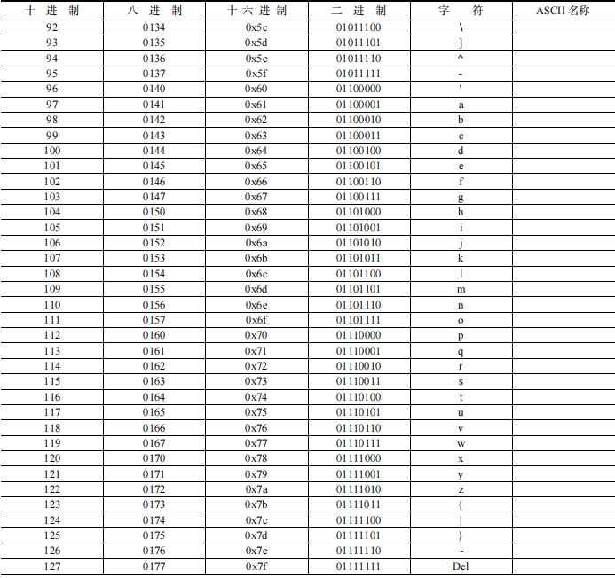
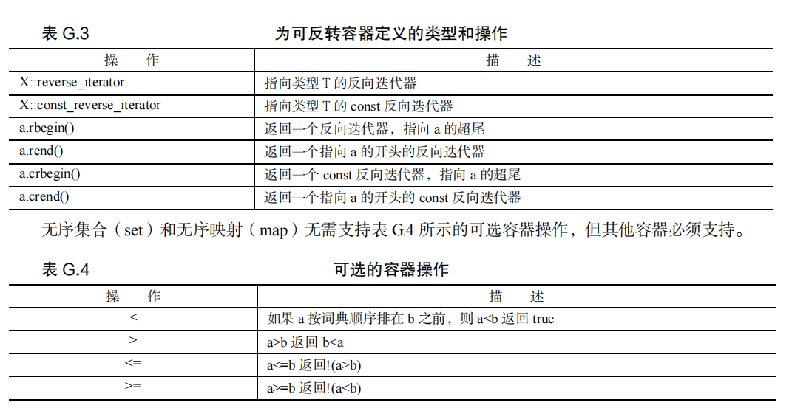

## 关键字

## 替代标记

## ASCII字符集

## 运算符的优先级

## 按位运算符

<<  >> & | ^ ~

- << 和 >>

*value* << *shift* 

其中，value 是要被操作的整数值，shift 是要移动的位数。

- ~

非运算符（!）和位非（或求反）运算符（～）。!运算符将 true（或非零值）转换为 false，将 false 值转换为

true。～运算符将每一位转换为它的反面（1 转换为 0，0 转换为 1）。

- |或

- ^ 异或

- &与

## string方法

## 容器方法

## 标准c++

~~~cpp
//使用 const 而不是#define 来定义常量
#define Max_Size 100
const int Max_Size = 100;//better

//使用 inline 而不是# define 来定义小型函数
#define Cube(X) X*X*X
inline int ClassName::Cube(x)const
{
	return x*x*x;
}

//尽可能在函数原型和函数头中使用 const。接受 const指针或引用的函数能够同时处理 const 数据和非 const 数据，而不使用 const 指针或引用的函数只能处理非const 数据

//malloc()和 free()，请改用 new 和 delete

//使用 setjmp()和 longjmp()处理错误，则请改用 try、throw 和 catch。

//使用智能指针来保证new d
~~~

