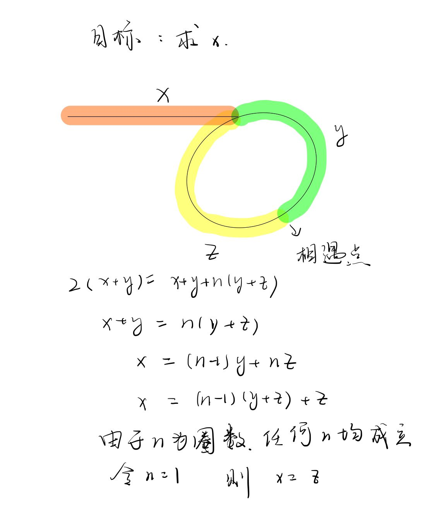

# 快速幂(二分思想)

## 求x的n次方

~~~cpp
/////////////////////////////////////////////////////////////////////
int func1(int x,int n)
{
    int ans = 1;
    for(int i = 0;i<n;++i)//循环的时间复杂度O(n)
        ans *= x;
    return ans;
}
/////////////////////////////////////////////////////////////////////
int func2(int x,int n)
{
	if(n == 0)return 1;
    return func2(x,n-1)*x;//同上
}
/////////////////////////////////////////////////////////////////////
int func3(int x,int n)
{
    if(n == 0)return 1;
    if(n%2 == 1) return func3(x,n/2)*func(x,n/2)*x;//左右都递归调用
    return func3(x,n/2)*func3(x,n/2);
}
//						      17							2^0	
//							 /	\							 +
//							8	 8  //*x是O(1)忽略			  2^1
//						   / \	...							 +
//						  4   4	  ...						2^2
//                      /  \	    ...						 +
//                     2    2		  ...   				2^3
//					等比数列求和， 仍是O(n)
/////////////////////////////////////////////////////////////////////
int func4(int x,int n)
{
	if(n == 0)return 1;
    int t = func4(x,n/2);//仅一次递归调用，然后把值存下
    if(n%2 == 1)
        return t*t*x;
    return t*t;
}//O(logn)
/////////////////////////////////////////////////////////////////////
~~~

# 遇到相同的递归操作，可以将这个值存下，可以减少递归操作量。

## 斐波那契数列

~~~cpp
//递归不剪枝	时间复杂度O(2^n)
int fib(int n)
{
	if(n <= 0) return 0;
    if(n < 3) return 1;
    return fib(n-1)+fib(n-2);
}

//递归剪枝	O(n)
int fib(int first,int second,int n)
{
	if(n <= 0) return 0;
    if(n < 3) return 1;
    else if(n == 3) return first + second;
    return fib(second,first+second,n-1);
}

//非递归	O(n)
int fib(int n)
{
    if(n < 1) return 0;
    else if(n == 1 || n == 2) return 1;
    int res = 1;
    int pre = 1;
    int temp = 0;
    for(int i = 3; i < n; i++) {
        temp = res;
        res = pre + res;
        pre  = temp;
    }
    return res;
}
~~~

# 多指针法，在一个循环里做多个循环事件

数组链表的题常见

### 移除数组中的元素，返回size

~~~cpp
//暴力
int RemoveElement(vector<int>&nums,int val)
{
    int size = nums.size();
    for(int i = 0; i < nums.size() ;++i)
    {
        if(nums[i] == val)
        {
			for(int j = i;j<nums.size()-1;++j)
            {
				nums[j] = nums[j+1];
            }
            i--;
            size--;
        }
    }
    return size;
}

//双指针
int RemoveElement(vector<int>&nums,int val)
{
	int size = nums.size();
    int SlowPtr = 0;
    for(int FastPtr = 0;FastPtr<nums.size();++FastPtr)
    {
        if(nums[FastPtr]!=val)
        {
			nums[SlowPtr] = nums[FastPtr];
            ++SlowPtr;
        }
    }
    return SlowPtr;
}
~~~

## 滑动窗口也是一种双指针法

常用于找合适大小的字串

### 最小连续子串的和大于等于s

~~~cpp
//暴力美学
int minSubArrayLen(int s,vector<int>&nums)
{
    int res = INT_MAX;
    int sum = 0;
    int Len = 0;
    for(int i = 0;i<nums.size();++i)
    {
        sum = 0;
		for(int j = i;j<nums.size();++j)
        {
			sum += nums[j];
            if(sum >= s) 
            {	
                Len = j-i+1;
        		result = result>Len?Len:result;
                break;
            }
        }//break to here
    }
    return result == MAX_INT? 0:result;
}

//滑动窗口，时刻保证窗口内部满足条件
int minSubArrLen(int s,vector<int>&nums)
{
    int size = MAX_INT;
    int sum = 0;
    int len = 0;
    int l = 0;
    for(int r = 0;r<nums.size();++r)
    {
        sum += nums[r];
        while(sum >= s)
        {
            len = (r-l+1);
            size = size<len?size:len;
            sum -= nums[l];
            ++l;
        }
    }
    return size == INT_MAX? 0:size;
}
~~~

## 矩阵每一个维度都有双指针，所以是四个指针

### 螺旋矩阵

给你一个正整数 `n` ，生成一个包含 `1` 到 `n2` 所有元素，且元素按顺时针顺序螺旋排列的 `n x n` 正方形矩阵 `matrix` 。

~~~cpp
vector<vector<int>>generateMatrix(int n)
{
    vector<vector<int>res(n,vector<int>(n,0));
    int start_x = 0,start_y = 0;
    int loop = n/2 , mid = n/2;
    int count = 1 , offset = 1;
    int i , j;
    while(loop--)
    {
        i = start_x;
        j = start_j;
        for(; j < start_y+n-offset;++j)
            res[start_x][j] = count++;
        for(; i < start_y+n-offset;++i)
            res[i][start_y] = count++;
        for(; j > start_y ; --j)
            res[start_x][j] = count++;
        for(; i > start_x ; --i)
            res[i][start_j] = count++;
        offset += 2;
        ++start_x,++start_y;
    }
    if(n%2 == 1)
        res[mid][mid] = count;
    return res;
}
~~~

# 链表

链表节点的结构

~~~cpp
struct Node
{
	int val;
    Node* next;
    Node(int x):val(x),next(nullptr){}
}
~~~

~~~cpp
//给你一个链表的头节点 head 和一个整数 val ，请你删除链表中所有满足 Node.val == val 的节点，并返回 新的头节点 。
/**
 * Definition for singly-linked list.
 * struct ListNode {
 *     int val;
 *     ListNode *next;
 *     ListNode() : val(0), next(nullptr) {}
 *     ListNode(int x) : val(x), next(nullptr) {}
 *     ListNode(int x, ListNode *next) : val(x), next(next) {}
 * };
 */
class Solution {
public:
    ListNode* removeElements(ListNode* head, int val) {
        //头节点特殊处理
        // while(head!=nullptr&&head->val == val)
        // {
        //     auto tmpHead = head;
        //     head = head->next;
        //     delete tmpHead;
        // }
        // auto tmp = head;
        // while(tmp != nullptr && tmp->next != nullptr)
        // {
        //     if(tmp->next->val == val)
        //     {
        //         auto deleteTmp = tmp->next;
        //         tmp->next = tmp->next->next;
        //         delete deleteTmp;
        //     }else tmp = tmp->next;
        // }
        //return head;

        //加虚头来统一处理节点
        ListNode*virtualHead = new ListNode;
        virtualHead->next = head;
        auto tmp = virtualHead;
        while(tmp!=nullptr&&tmp->next!=nullptr)
        {
            if(tmp->next->val==val)
            {
                auto deleteTmp = tmp->next;
                tmp->next = tmp->next->next;
                delete deleteTmp;
            }else tmp = tmp->next;
        }
        return virtualHead->next;
    }
};
~~~

## 反转链表

~~~cpp
ListNode* reverseList(ListNode* head) {
        ListNode*tmp;
        ListNode*cur = head;
        ListNode*pre = nullptr;
        while(cur)
        {
            tmp = cur->next;
            cur->next = pre;
            pre = cur;
            cur = tmp;
        }
        return pre;
    }
~~~

## 删除倒数第n个节点

~~~cpp
    ListNode* removeNthFromEnd(ListNode* head, int n) {
        ListNode* virHead = new ListNode(0);
        virHead->next = head;
        auto right = virHead;
        while(n-- ) right = right->next;
        auto left = virHead;
        right = right->next;
        while(right!=nullptr)
        {
            left = left->next;
            right = right->next;
        }
        auto tmp = left->next;
        left->next = left->next->next;
        delete tmp;
        return virHead->next;//head可能被删掉，不能直接returnhead
    }
~~~

## 找到链表环的入口，如果没有环，返回nullptr

~~~cpp
ListNode *detectCycle(ListNode *head) {
        //特殊处理
        //if(head == nullptr)return nullptr;
        //if(head->next == nullptr) return nullptr;
        //判断有环？
        auto fast = head , slow = head;
        while(fast!=nullptr)
        {               
            fast = fast->next;
            if(fast == nullptr)return nullptr;            
            fast = fast->next;
            if(fast == nullptr)return nullptr;

            slow = slow->next;
            if(fast == slow) break;
        }
        //找到入口？
        fast = head;
        while(fast!=slow)
        {
            fast = fast->next;
            slow = slow->next;
        }
        return slow;
    }
~~~

## 链表常用思路

虚头

双指针

# 哈希表

- 哈希冲突
  如果两个数据通过哈希函数映射到哈希表后位置重合，就产生哈希冲突
  解决方法：
  1. 拉链法：在相同位置后通过链表来存储数据
  2. 线性探测法：相同的数据在一个位置放不下就顺延到下一个位置
     - set multiset map multimap的底层是红黑树,unordered_set unordered_map的底层是哈希表
     - 优先使用unordered_set,他的查找效率最高，如果有序使用set,如果有序且可重复使用multi_set
       \### 求解n数之和

~~~cpp
//三数之和
   vector<vector<int>> threeSum(vector<int>& nums) {
    sort(nums.begin(),nums.end());
    vector<vector<int>> res;
    for(int i = 0; i<nums.size();++i)
    {
      if(nums[i]>0) return res;
      if(i>0 && nums[i]==nums[i-1]) continue; 
      int left = i+1;
      int right = nums.size()-1;
      while(left<right)
      {
        if((nums[i]+nums[left]+nums[right]) == 0)
        {
          res.push_back(vector<int>{nums[i],nums[left],nums[right]});
          while(right>left && nums[right] == nums[right-1]) right--;
          while(right>left && nums[left] == nums[left+1]) left++;
          left++,right--;
        }
        else if(nums[i]+nums[left]+nums[right]>0) right--;
        else left++;
        
      }
    }  
    return res; 
  }

~~~

~~~cpp
class Solution {
public:
  vector<vector<int>> threeSum(vector<int>& nums) 
  {
    int n = nums.size();
    sort(nums.begin(),nums.end());
    vector<vector<int>> ans;
    for(int first = 0;first<n;++first)
    {
      if(first>0&&nums[first]==nums[first-1])
        continue;
      int third = n-1;
      int target = -nums[first];
      for(int second = first+1;second<n;++second)
      {
        if(second>first+1 && nums[second]==nums[second-1])
          continue;
        while(second<third&&nums[second]+nums[third]>target)
          --third;
        if(second==third)
          break;
        if(nums[third]+nums[second]==target)
          ans.push_back({nums[first],nums[second],nums[third]});
      }
    }
    return ans;
  }
};
~~~

# 字符串
