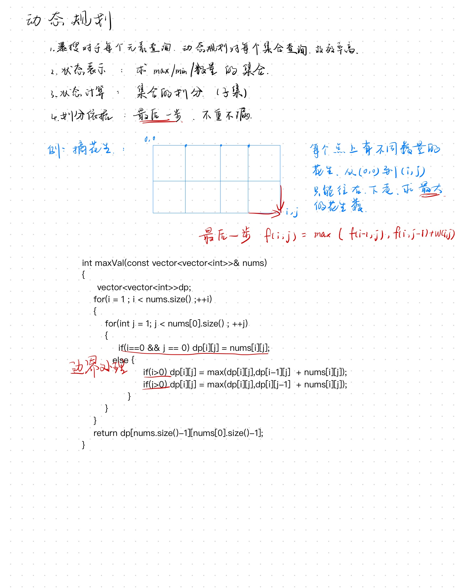

# 动态规划

- 动规五部曲：
  - 确定dp数组及下标的含义
  - 确定递推公式
  - dp数组如何初始化
  - 确定遍历顺序
  - 举例推导dp数组

## 01背包

- 将n件物品放到能承受重量为w的背包内。第i件物品的重量为weight[i]，得到的佳置value[i]。每件物品只能用一次，求解背包里物品最大价值总和。

~~~cpp
//二维dp
int zeroOneBag(vector<int>&weight,vector<int>&value,int bagWeight){
    vector<vector<int>>dp(weight.size(),vector<int>(bagWeight+1,0));
    for(int j = weight[0];j <= bagWeight ;++j)
    {
        dp[0][j] = value[0];
    }
    
    for(int i = 1;i < weight.size();++i)
    {
        for(int j = 0 ; j<= bagWeight ;++j)
        {
            if(j < weight[i]) dp[i][j] = dp[i-1][j];
            else dp[i][j] = max(dp[i-1][j],dp[i-1][j-weight[i]]+value[i]);
        }
    }
    return dp[weight.size()-1][bagWeight];
}
~~~

~~~cpp
//一维dp

//dp数组定义：dp[j]表示容量为j的背包所容纳的最大价值为dp[j]
//dp数组的递推公式：dp[j] = max(dp[j],dp[j-weight[i]]+value[i]);
//dp数组的初始化：vector<int>dp(bagWeight+1,0);
//dp数组的遍历顺序：
	//for(int i = 0;i < weight.size(); ++i)//遍历物品
	//{
	//	for(int j = bagWeight; j>= weight[i];--j)//遍历背包，倒序是为了防止前面的初始化数据被后面使用
	//	{
    //		dp[j] = max(dp[j],dp[j-weight[i]]+value[i]);
	//	}
	//}
//举例推导dp数组

int zeroOneBag(vector<int>&weight,vector<int>&value,int bagWeight){
    //dp数组的初始化
    vector<int>dp(bagWeight+1,0);
    //dp数组的遍历
	for(int i = 0;i < weight.size(); ++i)//遍历物品
	{
		for(int j = bagWeight; j>= weight[i];--j)//遍历背包，倒序是为了防止前面的初始化数据被后面使用
		{
    		dp[j] = max(dp[j],dp[j-weight[i]]+value[i]);//递推公式
		}
	}
    return dp[bagWeight];
}
~~~

# 快速幂(二分思想)

## 求x的n次方

~~~cpp
/////////////////////////////////////////////////////////////////////
int func1(int x,int n)
{
    int ans = 1;
    for(int i = 0;i<n;++i)//循环的时间复杂度O(n)
        ans *= x;
    return ans;
}
/////////////////////////////////////////////////////////////////////
int func2(int x,int n)
{
	if(n == 0)return 1;
    return func2(x,n-1)*x;//同上
}
/////////////////////////////////////////////////////////////////////
int func3(int x,int n)
{
    if(n == 0)return 1;
    if(n%2 == 1) return func3(x,n/2)*func(x,n/2)*x;//左右都递归调用
    return func3(x,n/2)*func3(x,n/2);
}
//						      17							2^0	
//							 /	\							 +
//							8	 8  //*x是O(1)忽略			  2^1
//						   / \	...							 +
//						  4   4	  ...						2^2
//                      /  \	    ...						 +
//                     2    2		  ...   				2^3
//					等比数列求和， 仍是O(n)
/////////////////////////////////////////////////////////////////////
int func4(int x,int n)
{
	if(n == 0)return 1;
    int t = func4(x,n/2);//仅一次递归调用，然后把值存下
    if(n%2 == 1)
        return t*t*x;
    return t*t;
}//O(logn)
/////////////////////////////////////////////////////////////////////
~~~

# 遇到相同的递归操作，可以将这个值存下，可以减少递归操作量。

## 斐波那契数列

~~~cpp
//递归不剪枝	时间复杂度O(2^n)
int fib(int n)
{
	if(n <= 0) return 0;
    if(n < 3) return 1;
    return fib(n-1)+fib(n-2);
}

//递归剪枝	O(n)
int fib(int first,int second,int n)
{
	if(n <= 0) return 0;
    if(n < 3) return 1;
    else if(n == 3) return first + second;
    return fib(second,first+second,n-1);
}

//非递归	O(n)
int fib(int n)
{
    if(n < 1) return 0;
    else if(n == 1 || n == 2) return 1;
    int res = 1;
    int pre = 1;
    int temp = 0;
    for(int i = 3; i < n; i++) {
        temp = res;
        res = pre + res;
        pre  = temp;
    }
    return res;
}
~~~

# 多指针法，在一个循环里做多个循环事件

数组链表的题常见

### 移除数组中的元素，返回size

~~~cpp
//暴力
int RemoveElement(vector<int>&nums,int val)
{
    int size = nums.size();
    for(int i = 0; i < nums.size() ;++i)
    {
        if(nums[i] == val)
        {
			for(int j = i;j<nums.size()-1;++j)
            {
				nums[j] = nums[j+1];
            }
            i--;
            size--;
        }
    }
    return size;
}

//双指针
int RemoveElement(vector<int>&nums,int val)
{
	int size = nums.size();
    int SlowPtr = 0;
    for(int FastPtr = 0;FastPtr<nums.size();++FastPtr)
    {
        if(nums[FastPtr]!=val)
        {
			nums[SlowPtr] = nums[FastPtr];
            ++SlowPtr;
        }
    }
    return SlowPtr;
}
~~~

## 滑动窗口也是一种双指针法

常用于找合适大小的字串

### 最小连续子串的和大于等于s

~~~cpp
//暴力美学
int minSubArrayLen(int s,vector<int>&nums)
{
    int res = INT_MAX;
    int sum = 0;
    int Len = 0;
    for(int i = 0;i<nums.size();++i)
    {
        sum = 0;
		for(int j = i;j<nums.size();++j)
        {
			sum += nums[j];
            if(sum >= s) 
            {	
                Len = j-i+1;
        		result = result>Len?Len:result;
                break;
            }
        }//break to here
    }
    return result == MAX_INT? 0:result;
}

//滑动窗口，时刻保证窗口内部满足条件
int minSubArrLen(int s,vector<int>&nums)
{
    int size = MAX_INT;
    int sum = 0;
    int len = 0;
    int l = 0;
    for(int r = 0;r<nums.size();++r)
    {
        sum += nums[r];
        while(sum >= s)
        {
            len = (r-l+1);
            size = size<len?size:len;
            sum -= nums[l];
            ++l;
        }
    }
    return size == INT_MAX? 0:size;
}
~~~

## 矩阵每一个维度都有双指针，所以是四个指针

### 螺旋矩阵

给你一个正整数 `n` ，生成一个包含 `1` 到 `n2` 所有元素，且元素按顺时针顺序螺旋排列的 `n x n` 正方形矩阵 `matrix` 。

~~~cpp
vector<vector<int>>generateMatrix(int n)
{
    vector<vector<int>res(n,vector<int>(n,0));
    int start_x = 0,start_y = 0;
    int loop = n/2 , mid = n/2;
    int count = 1 , offset = 1;
    int i , j;
    while(loop--)
    {
        i = start_x;
        j = start_j;
        for(; j < start_y+n-offset;++j)
            res[start_x][j] = count++;
        for(; i < start_y+n-offset;++i)
            res[i][start_y] = count++;
        for(; j > start_y ; --j)
            res[start_x][j] = count++;
        for(; i > start_x ; --i)
            res[i][start_j] = count++;
        offset += 2;
        ++start_x,++start_y;
    }
    if(n%2 == 1)
        res[mid][mid] = count;
    return res;
}
~~~

# 链表

链表节点的结构

~~~cpp
struct Node
{
	int val;
    Node* next;
    Node(int x):val(x),next(nullptr){}
}
~~~

~~~cpp
//给你一个链表的头节点 head 和一个整数 val ，请你删除链表中所有满足 Node.val == val 的节点，并返回 新的头节点 。
/**
 * Definition for singly-linked list.
 * struct ListNode {
 *     int val;
 *     ListNode *next;
 *     ListNode() : val(0), next(nullptr) {}
 *     ListNode(int x) : val(x), next(nullptr) {}
 *     ListNode(int x, ListNode *next) : val(x), next(next) {}
 * };
 */
class Solution {
public:
    ListNode* removeElements(ListNode* head, int val) {
        //头节点特殊处理
        // while(head!=nullptr&&head->val == val)
        // {
        //     auto tmpHead = head;
        //     head = head->next;
        //     delete tmpHead;
        // }
        // auto tmp = head;
        // while(tmp != nullptr && tmp->next != nullptr)
        // {
        //     if(tmp->next->val == val)
        //     {
        //         auto deleteTmp = tmp->next;
        //         tmp->next = tmp->next->next;
        //         delete deleteTmp;
        //     }else tmp = tmp->next;
        // }
        //return head;

        //加虚头来统一处理节点
        ListNode*virtualHead = new ListNode;
        virtualHead->next = head;
        auto tmp = virtualHead;
        while(tmp!=nullptr&&tmp->next!=nullptr)
        {
            if(tmp->next->val==val)
            {
                auto deleteTmp = tmp->next;
                tmp->next = tmp->next->next;
                delete deleteTmp;
            }else tmp = tmp->next;
        }
        return virtualHead->next;
    }
};
~~~

## 反转链表

~~~cpp
ListNode* reverseList(ListNode* head) {
        ListNode*tmp;
        ListNode*cur = head;
        ListNode*pre = nullptr;
        while(cur)
        {
            tmp = cur->next;
            cur->next = pre;
            pre = cur;
            cur = tmp;
        }
        return pre;
    }
~~~

## 删除倒数第n个节点

~~~cpp
    ListNode* removeNthFromEnd(ListNode* head, int n) {
        ListNode* virHead = new ListNode(0);
        virHead->next = head;
        auto right = virHead;
        while(n-- ) right = right->next;
        auto left = virHead;
        right = right->next;
        while(right!=nullptr)
        {
            left = left->next;
            right = right->next;
        }
        auto tmp = left->next;
        left->next = left->next->next;
        delete tmp;
        return virHead->next;//head可能被删掉，不能直接returnhead
    }
~~~

## 找到链表环的入口，如果没有环，返回nullptr

~~~cpp
ListNode *detectCycle(ListNode *head) {
        //特殊处理
        //if(head == nullptr)return nullptr;
        //if(head->next == nullptr) return nullptr;
        //判断有环？
        auto fast = head , slow = head;
        while(fast!=nullptr)
        {               
            fast = fast->next;
            if(fast == nullptr)return nullptr;            
            fast = fast->next;
            if(fast == nullptr)return nullptr;

            slow = slow->next;
            if(fast == slow) break;
        }
        //找到入口？
        fast = head;
        while(fast!=slow)
        {
            fast = fast->next;
            slow = slow->next;
        }
        return slow;
    }
~~~

## 链表常用思路

虚头

双指针

# 哈希表

- 哈希冲突
  如果两个数据通过哈希函数映射到哈希表后位置重合，就产生哈希冲突
  解决方法：
  1. 拉链法：在相同位置后通过链表来存储数据
  2. 线性探测法：相同的数据在一个位置放不下就顺延到下一个位置
     - set multiset map multimap的底层是红黑树,unordered_set unordered_map的底层是哈希表
     - 优先使用unordered_set,他的查找效率最高，如果有序使用set,如果有序且可重复使用multi_set
       \### 求解n数之和

~~~cpp
//三数之和
   vector<vector<int>> threeSum(vector<int>& nums) {
    sort(nums.begin(),nums.end());
    vector<vector<int>> res;
    for(int i = 0; i<nums.size();++i)
    {
      if(nums[i]>0) return res;
      if(i>0 && nums[i]==nums[i-1]) continue; 
      int left = i+1;
      int right = nums.size()-1;
      while(left<right)
      {
        if((nums[i]+nums[left]+nums[right]) == 0)
        {
          res.push_back(vector<int>{nums[i],nums[left],nums[right]});
          while(right>left && nums[right] == nums[right-1]) right--;
          while(right>left && nums[left] == nums[left+1]) left++;
          left++,right--;
        }
        else if(nums[i]+nums[left]+nums[right]>0) right--;
        else left++;
        
      }
    }  
    return res; 
  }

~~~

~~~cpp
class Solution {
public:
  vector<vector<int>> threeSum(vector<int>& nums) 
  {
    int n = nums.size();
    sort(nums.begin(),nums.end());
    vector<vector<int>> ans;
    for(int first = 0;first<n;++first)
    {
      if(first>0&&nums[first]==nums[first-1])
        continue;
      int third = n-1;
      int target = -nums[first];
      for(int second = first+1;second<n;++second)
      {
        if(second>first+1 && nums[second]==nums[second-1])
          continue;
        while(second<third&&nums[second]+nums[third]>target)
          --third;
        if(second==third)
          break;
        if(nums[third]+nums[second]==target)
          ans.push_back({nums[first],nums[second],nums[third]});
      }
    }
    return ans;
  }
};
~~~

# 字符串

## KMP字符串匹配算法

### 描述

- 前缀表next数组，用来回退，当模式串和主串不匹配，知道回退到哪里

- 前缀：不包含最后一个字符的所有子字符串，后缀反之。
- 寻找最长相等前后缀

~~~cpp
//给你两个字符串 haystack 和 needle ，请你在 haystack 字符串中找出 needle 字符串出现的第一个位置（下标从 0 开始）。如果不存在，则返回  -1 。
class Solution {
public:
    int strStr(string haystack, string needle) {
        if(needle.size() == 0) return 0;
        int next[needle.size()];
        getNest(next,needle);
        int j = 0;
        for(int i = 0 ;i< haystack.size();++i)
        {
            while(j>0 && haystack[i]!=needle[j])
                j=next[j-1];
            if(haystack[i] == needle[j])
                ++j;
            if(j == needle.size())
                return (i-needle.size()+1);
        }
        return -1;
    }
    void getNest(int*next,const string &s)
    {
        int j = 0;
        next[0] = 0;
        for(int i = 1 ;i< s.size();++i)
        {
            while(j>0 && s[i]!=s[j])
                j=next[j-1];
            if(s[i] == s[j])
                ++j;
            next[i] = j;
        }
    }
};
~~~

~~~cpp
//给定一个非空的字符串，判断它是否可以由它的一个子串重复多次构成。给定的字符串只含有小写英文字母，并且长度不超过10000。
class Solution {
public:
    void getNext(int* next,const string &s) {
        int j = 0;
        next[0] = 0;
        for(int i = 1;i < s.size();++i) {
            while(j>0 && s[i] != s[j])
                j = next[j-1];
            if(s[i] == s[j])
                ++j;
            next[i] = j;
        }
    }
    bool repeatedSubstringPattern(string s) {
        if(s.size()==0) return false;
        int next[s.size()];
        getNext(next,s);
        int len = s.size();
        if(next[len-1]!=0 && len%(len-(next[len-1]))==0)
            return true;
        return false;
    }   
};
~~~

# 栈和队列

用一个队列实现栈

~~~cpp
class MyStack {
private:
    queue<int>Queue;
public:
    MyStack() {

    }
    
    void push(int x) {
        Queue.push(x);
    }
    
    int pop() {
        int size = Queue.size();
        size--;
            while(size--)
            {
                Queue.push(Queue.front());
                Queue.pop();
            }
        int res = Queue.front();
        Queue.pop();
        return res;
    }
    
    int top() {
        return Queue.back();
    }
    
    bool empty() {
        return Queue.empty();
    }
};

~~~

~~~cpp
//给你一个整数数组 nums，有一个大小为 k 的滑动窗口从数组的最左侧移动到数组的最右侧。你只可以看到在滑动窗口内的 k 个数字。滑动窗口每次只向右移动一位。返回滑动窗口中的最大值。

class Solution {
    class MyQueue{
        deque<int> que; 
    public:
        void pop(int value)
        {
            if(!que.empty() && value == que.front())
                que.pop_front();
        }

        void push(int value)
        {
            while(!que.empty() && value > que.back())
            {
                que.pop_back();
            }
            que.push_back(value);
        }

        int front (){return que.front();}
    };

public:    
    vector<int> maxSlidingWindow(vector<int>& nums, int k) {
        MyQueue que;
        vector<int>result;
        for(int i = 0;i< k ;++i)
        {
            que.push(nums[i]);
        }
        result.push_back(que.front());
        for(int i = k;i<nums.size();++i)
        {
            que.pop(nums[i-k]);
            que.push(nums[i]);
            result.push_back(que.front());
        }
        return result;
    }
};
~~~

~~~cpp
//top k 问题
//给你一个整数数组 nums 和一个整数 k ，请你返回其中出现频率前 k 高的元素。你可以按 任意顺序 返回答案。
 
class Solution {
public:
    // 小顶堆
    class mycomparison {
    public:
        bool operator()(const pair<int, int>& lhs, const pair<int, int>& rhs) {
            return lhs.second > rhs.second;
        }
    };
    vector<int> topKFrequent(vector<int>& nums, int k) {
        // 要统计元素出现频率
        unordered_map<int, int> map; // map<nums[i],对应出现的次数>
        for (int i = 0; i < nums.size(); i++) {
            map[nums[i]]++;
        }

//根据频率大小自动排序的优先级队列
        priority_queue<pair<int, int>, vector<pair<int, int>>, mycomparison> pri_que;

        // 用固定大小为k的小顶堆，扫面所有频率的数值
        for (unordered_map<int, int>::iterator it = map.begin(); it != map.end(); it++) {
            pri_que.push(*it);
            if (pri_que.size() > k) { // 如果堆的大小大于了K，则队列弹出，保证堆的大小一直为k
                pri_que.pop();
            }
        }

        // 找出前K个高频元素，因为小顶堆先弹出的是最小的，所以倒序来输出到数组
        vector<int> result(k);
        for (int i = k - 1; i >= 0; i--) {
            result[i] = pri_que.top().first;
            pri_que.pop();
        }
        return result;

    }
};
~~~

# 二叉树

## 遍历

- 深度优先（递归，迭代）

- 广度优先（迭代）

~~~cpp
//递归深度遍历
    void inorder(TreeNode* root,vector<int>&res)
    {
        if(root == nullptr)return;
        //下面三者顺序决定前序中序后序
        inorder(root->left,res);
        res.push_back(root->val);
        inorder(root->right,res);
    }
    vector<int> inorderTraversal(TreeNode* root) {
        vector<int>res;
        inorder(root,res);
        return res;
    }
~~~

~~~cpp
//迭代深度优先遍历
class Solution {
public:
    vector<int> inorderTraversal(TreeNode* root) {
        vector<int> result;
        stack<TreeNode*> st;
        if (root != NULL) 
            st.push(root);
        while (!st.empty()) {
            TreeNode* node = st.top();
            if (node != NULL) {
                st.pop(); // 将该节点弹出，避免重复操作，下面再将右中左节点添加到栈中
                if (node->right) 
                    st.push(node->right);  // 添加右节点（空节点不入栈）
//下面两行的位置决定遍历顺序
                st.push(node);                          // 添加中节点
                st.push(NULL); // 中节点访问过，但是还没有处理，加入空节点做为标记。

                if (node->left) 
                    st.push(node->left);    // 添加左节点（空节点不入栈）
            } else { // 只有遇到空节点的时候，才将下一个节点放进结果集
                st.pop();           // 将空节点弹出
                node = st.top();    // 重新取出栈中元素
                st.pop();
                result.push_back(node->val); // 加入到结果集
            }
        }
        return result;
    }
};
~~~

~~~cpp
//层序遍历
vector<vector<int>> levelOrder(TreeNode* root) {
        queue<TreeNode*>insertQueue;
        vector<vector<int>>res;
        if(root!=nullptr)
            insertQueue.push(root);
        while(!insertQueue.empty())
        {
            int layerSize = insertQueue.size();//不能直接用queue.size()，他是个变量
            vector<int>layerVac;//如果不
            for(int i = 0;i<layerSize;++i)
            {
                if(insertQueue.front()->left!=nullptr)
                    insertQueue.push(insertQueue.front()->left);
                if(insertQueue.front()->right!=nullptr)
                    insertQueue.push(insertQueue.front()->right);  
                layerVac.push_back(insertQueue.front()->val);
                insertQueue.pop();
            }
            res.push_back(layerVac);
        }
        return res;
    }
~~~

~~~cpp
//给定一个二叉树，判断它是否是高度平衡的二叉树。
class Solution {
public:
    int getDepth(TreeNode*node)
    {
        if(node == nullptr) return 0;
        int leftDepth = getDepth(node->left);
        if(leftDepth == -1) return -1;
        int rightDepth = getDepth(node->right);
        if(rightDepth == -1) return -1;
        return abs(leftDepth - rightDepth) > 1 ? -1:1+max(leftDepth,rightDepth);
    }
    bool isBalanced(TreeNode*root)
    {
        return getDepth(root) == -1 ? false:true;
    }
};
~~~

## 二叉树回溯

~~~cpp
/*
给你一个二叉树的根节点 root ，按 任意顺序 ，返回所有从根节点到叶子节点的路径。
 */
class Solution {
private:
    void Travelsal(TreeNode*cur,vector<int>&path,vector<string>&res)
    {
        path.push_back(cur->val);
        if(cur->left == nullptr && cur->right == nullptr)
        {
            string sPath;
            for(int i = 0;i < path.size()-1 ; ++i)
            {
                sPath += to_string(path[i]);
                sPath += "->";
            }
            sPath += to_string(path[path.size()-1]);
            res.push_back(sPath);
            return;
        }
        if(cur->left)
        {
            Travelsal(cur->left,path,res);
            path.pop_back();//回溯
        }
        if(cur->right)
        {
            Travelsal(cur->right,path,res);
            path.pop_back();//回溯
        }
    }
public:
    vector<string> binaryTreePaths(TreeNode* root) {
        vector<int>path;
        vector<string>res;
        if(root == nullptr)return res;
        Travelsal(root,path,res);
        return res;
    }
};
~~~

# 回溯算法

- 回溯是递归的副产品
- 暴力搜索，不高效，最多剪枝一下
- 能解决的问题：
  - 排列组合问题
  - 切割问题
  - 子集问题
  - 棋盘问题：N皇后，数独

~~~cpp
//模板
void backTracking(parameters)
{
    if(condition){
        res.push_back(...);
        return;
    }
    
    for(层内元素)
    {
        处理节点;
        backTracking();
        回溯，撤销处理节点
    }
}
~~~

