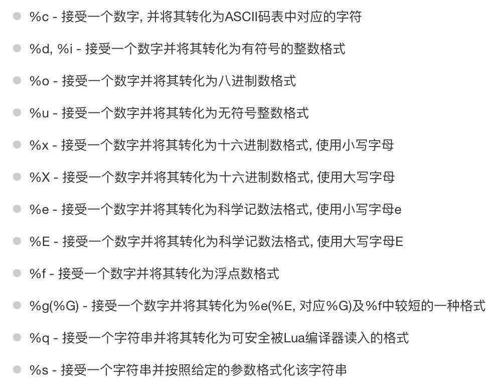

# 变量

- 三种类型：全局变量，局部变量，表中的域
- 多变量同时赋值：`a , b = 10 , 2*x`
- 交换值：`a , b = b , a`
- 函数返回值：`a, b = f()`，f()的第一个返回值给a，第二个返回值给b

## 全局变量

- 默认情况下，变量总是全局的
- 全局变量不需要声明
- 想删除一个全局变量，只需要将它赋值为nil

~~~lua
>print(b)
nil
>b = 10
>print(b)
10
>b = nil
~~~

## 局部变量

- 能避免命名冲突
- 访问局部变量速度比全局变量快

~~~lua
--默认lua的变量都是全局变量
a = 5
--局部变量现需要显式声明 local
local b =3

function joke()
    c = 1 -- global 
    local d = 2 -- local
    d = 2 -- 对local变量重新赋值
end
~~~

# 数据类型

| 数据类型 | 描述                                    |
| -------- | --------------------------------------- |
| nil      | 表示一个无效值，条件表达式中相当于false |
| boolean  | true/false                              |
| number   | 双精度类型的实浮点数                    |
| string   | 字符串                                  |
| function | 由c或者lua编写的函数                    |
| userdata | 表示任意存储在变量中的c数据结构         |
| thread   | 表示执行的独立线路，用于执行协同程序    |
| table    | 关联数组，索引可以是数字，字符串或表。  |

- nil：作比较时加双引号

~~~lua
type(x) -- nil
type(x) == nil --false
type(x) == "nil" -- true
~~~

- boolean：把false和nil看作假，其他都是真，包括0

- string：由双引号or单引号表示，也可以用两个方括号表示一块字符串

~~~lua
html = [[
a
aa
aaa
]]
~~~

- 对数字字符串进行算数操作时，lua会尝试将字符串转成数字

~~~lua
print("3"+4) -- 7
print("-2e2"*"6") -- -1200
~~~

- 字符串连接用`..`

~~~lua
print("a".."b") -- ab
~~~

- 用#计算字符串长度

~~~lua
len = "addaf"
print(#len) -- 5

print(#"asd") -- 3
~~~

- table的初始化

~~~lua
local tbl1 = {} -- 空表
local tbl2 = {"apple","pear"} -- 直接初始化
~~~

- table是一个关联数组，索引可以是数字或字符串

~~~lua
a = {}
a["key"] = "value"
key = 10
a[key] = 22
for k,v in pairs(a) do
    print(k..":"..v)
end
-- key:value
-- 10:22
~~~

- lua的默认初始索引是1
- 当table的索引是字符串

~~~lua
t["i"] = "hello"
print(t["i"])
--等价
print(t.i)
~~~

- lua的函数可存在变量里

~~~lua
function factorial1(n)
    if n == 0 then
        return 1
    else
        return n * factorial1(n-1)
    end
end

print(factorial1(5)) -- 120
factorial2 = factorial1
print(factorial2(5)) -- 120
~~~

- function可以以匿名函数的方式通过参数传递

~~~lua
function testFun(tab,fun)
    for k,v in pairs(tab) do
        print(fun(k,v))
    end
end

tab={key1="val1",key2="val2"}
testFun(tab,function(key,val)
    			return key.."="..val
  			end)
~~~

- thread：lua里最主要的线程是协同程序。协程和线程差不多，拥有自己独立的栈，局部变量，和指针，可以和其他协程共享全局变量和其他大部分东西
- 线程可以运行多个，而协程任意时刻只能运行一个，并且处于运行状态的协程只有被挂起才会暂停

# 循环

## 循环类型

- while：真时执行
- for：定次数执行
- repeat...until：结束条件为止
- 循环嵌套：上述循环互相嵌套

## 循环控制语句

- break：跳出当前循环
- goto：跳转到标签处

# 流程控制

- if

~~~lua
if(0)
then
    print("0 is true")
end
~~~

- if else
- if 嵌套语句

# 函数

~~~lua
-- 格式
optional_function_scope function function_name(arguments...) -- optional_function_scope决定函数全局or局部 局部加local
    function_body
    return result_params_comma_separated
end

function max(num1 , num2)
    if(num1 > num2)
        res = num1
    else 
        res = num2
    end
    
    return res
end

print(max(10,4))
~~~

- 函数可以作为参数传递

~~~lua
myprint = function(param)
    print("这个是"..param)
end

function add(num1,num2,functionPrint)
    res = num1+num2
    functionPrint(res)
end

myprint(10) -- 10
add(1,2,myprint) -- 3
~~~

- 多返回值

~~~lua
function maxmun(a)
    local mi = 1 -- 最大值的索引
    local m = a[mi] -- 最大值
    for i,val in ipairs(a) do
        if val > m then
            mi = m
            m = val
        end
    end
    return m,mi
end

print(maxmun({8，12，4，3，2})) -- 12 2
~~~

- 可变参数

~~~Lua
-- ...表示函数有可变参数
function add(...)
    local s = 0
    for i,v in ipairs{...} do
        s = s + v
    end
    return s
end

print(add(3,4,5,6,7)) -- 25
~~~

- 可变参数赋值给变量

~~~lua
function average(...)
    res = 0
    local arg = {...} -- {...}用于遍历变长参数
    for i,v in ipairs(arg) do
        res = res + v
    end
    print("传入了"..#arg.."个参数") -- # == .length
    return res/#arg
end

print("平均值是"..average(12,3,32,45))
~~~

- 固定参数必须放在可变参数之前

~~~lua
function fwrite(fmt,...)
    return io.write(string.format(fmt,...))
end

fwrite("%d%d\n",1,2) -- 12
~~~

- select函数访问变长参数

~~~lua
select('#',...) -- 返回可变参数的长度
select(n,...) -- 返回从n到末尾的参数

function f(...)
    a = select(3,...) -- a是右边列表的首个参数
    print(a)
    print(select(3,...)) -- 输出的是右边列表
 end

f(0,1,2,3,4)
 -- 2
 -- 2 3 4

do 
    function foo(...)
    	for i = 1,select('#',...) do -- 从1 到总长度
        	local arg = select(i,...);
        	print("arg",arg)
        end
    end
	foo(1,2,3,4)
end
 -- arg 1
 -- arg 2
 -- arg 3
 -- arg 4
~~~

# 运算符

- `~=`：表示不等于

- 逻辑运算符 
  - and
  - or
  - not
- 其他运算符
  - `..`：连接字符串
  - `#`：返回字符串或表的长度
- 运算符的优先级

| 高                             |
| ------------------------------ |
| ^                              |
| not    -(unary)                |
| *    /    %                    |
| +    -                         |
| ..                             |
| <    >    <=    >=    ~=    == |
| and                            |
| or                             |
| 低                             |

# 字符串

## 字符串操作

| 方法                                                 | 用途                                                         |
| ---------------------------------------------------- | ------------------------------------------------------------ |
| string.upper(argument)                               | 转大写字母                                                   |
| string.lower(argument)                               | 转小写字母                                                   |
| string.gsub(mainString,findString,replaceString,num) | 在mainstring中找到findstring替换成replacestring，从头往后替换num个 |
| string.find(str,substr,[init,[end]])                 | 在str中查找substr，返回起始和结束的索引                      |
| string.reverse(arg)                                  | 字符串反转                                                   |
| string.format(...)                                   | 返回一个类似printf的格式化字符串                             |
| string.char(arg)    string.byte(arg,[int])           | char将整数转换成字符并连接，byte将num个字符转换成整数值      |
| string.len(arg)                                      | 计算字符串长度                                               |
| string.rep(string,n)                                 | 返回字符串的n个拷贝                                          |
| ..                                                   | 连接两个字符串                                               |
| string.gmatch(str,pattern)                           | 在str找满足pattern的子串                                     |
| string.match(str,pattern,init)                       | 在str查找首个配对，init（可选）指定起点。配对成功返回捕获内容 |
| string.sub(str,i,[j])                                | 在str截取  i  到  j（默认最后） 的内容                       |

- 字符串格式化

- 进一步细化格式

  

~~~lua
string1 = "lua"
string2 = "test"
num1 = 10
num2 = 20

print(string.format("基本格式化 %s %s",string1,string2)) -- 基本格式化 lua test

date , month , year = 22 , 2 , 2022
print(string.format("数字格式化 %02d/%02d/%03d",date,month,year)) -- 数字格式化 22/2/2022
~~~

- 字符串匹配

# 数组

- 默认索引从1开始
- 我们可以指定索引从0，甚至是负数开始

~~~lua
array = {}
for i = -2,2 do
    array[i] = i*2
end

for i = -2,2 do
    print(array[i])
end
-- -4 -2 0 2 4
~~~

- 高维数组

~~~lua
array = {}
-- 初始化 1
for i = 1,3 do
    array[i] = {}
    	for j = 1,3 do
        	array[i][j] = i*j
        end
end
-- 初始化 2
maxRows = 3
maxCols = 3
for row = 1,maxRows do
    for col = 1,maxCols do
        array[row*maxCols+col] = row*col
    end
end

-- 访问 1
for i = 1 ,3 do
    for j = 1,3 do
        print(array[i][j])
    end
end

-- 访问 2
for row = 1,maxRows do
    for col = 1,maxCols do
        print(array[row*maxCols + col])
    end
end
~~~

# 迭代器

- 泛型for迭代器

~~~lua
array = {"A","B"}

for key,val in ipairs(array)
do
    print(key,val)
end

-- 1 A
-- 2 B
~~~

# table

- table的构造

~~~Lua
tab = {}
tab[1] = "lua"
tab = nil -- 垃圾回收机制自动回收释放内存
~~~

- table的赋值是指向同一块内存
- table的操作

| 方法                                    | 用途                                                         |
| --------------------------------------- | ------------------------------------------------------------ |
| table.concat(table[,sep[,start[,end]]]) | 列出table从start到end的所有元素，中间按sep分割               |
| table.insert(table,\[pos,]\[value])     | 在table的pos插入value                                        |
| table.maxn(table)  （lua5.2以移除）     | 返回最大的正值，没有正值返回0                                |
| table.remove(table[,pos])               | 返回table位于pos的元素，后面的元素前移，默认删除最后一个元素 |
| table.sort(table[,comp])                | 对给定的table升序排序                                        |

~~~ lua
-- table_maxn的实现

function table_maxn(t)
    local mn = nil
    for k,v in ipairs(t) do
        if(mn == nil) then
            mn = v 
        end
        if mn < v then
            mn = v
        end
    end
    return mn
end
~~~

# 模块

- 模块类似封装库，将一些代码放进文件，以API的方式调用
- 模块的创建，模块就是一个table，可用table的调用来处理模块

~~~lua
module = {} -- 定义一个名为module的模块
--定义常量
module.constant = "这是一个常量"
--定义函数
function module.func1()
    io.write("这是一个公有函数\n")
end

local function func2()
    print("这是一个私有函数\n")
end

function module,func3() -- 私有函数的接口
    func2()
end

return module
~~~

- 模块的加载

~~~lua
-- require("<模块名>")
require ("module")

print(module.constant)

module.func3()
~~~

- 模块的别名

~~~Lua
local m =require("module")
print(m.constant)
m.func3()
~~~

# 元表metatable

- 用于对table的操作

~~~lua
setmetatable(table,metatable) -- 对指定的table设置元表，如果元表中存在__metatable键值，setmetatable会失败
getmetatable(table) -- 返回对象的元表

--eg
myTable = {}
myMetaTable = {}
setmetatable(myTable,myMetaTable)
getmetatable(myTable)
~~~

## 元方法

### `__index`

~~~lua
myTable = setmetatable({key1 = "value1"},{ --键值为key1，返回value1
    __index = function(myTable,key) -- 键值不是key1，就在元表查找
        if key == "key2" then -- 如果键值是key2 ...
            return "metatablevalue"
        else
            return nil
        end
    end
})

-- 上述简写为
mytable = ({key1 = "value1"},{__index = {key2 = "metatablevalue"}})

print(myTable.key1,myTable.key2)
-- value1  metatablevalue
~~~

- 查找元表的步骤
  - 在表中查找，如果找到就返回该元素，找不到继续
  - 判断该表是否有元表，如果没有元表，返回nil，有元表继续
  - 判断元表有无__index方法，如果\_\_index方法为nil，返回nil；如果\_\_index方法是一个表，则重复上述步骤；如果\_\_index方法是一个函数，则返回该函数的返回值

### __newindex

- __newindex用来对表更新，\_\_index用于对表访问

~~~lua
mymetatable = {}
mytable = setmetatable({key1 = "value"},{__newindex = mymetatable})

print(mytable.key1) -- value

mytable.newkey = "newval2" -- 创建新的值
print(mytable.newkey,mymetatable.newkey) -- nil  newval2

mytable.key1 = "newval1" -- 更新key1的值
print(mytable.key`,mymetatable.key1) -- newval1 nil

--使用rawset更新表,不用考虑数值在metatable 还是table
mytable = setmetatable({key1 = "value"},
    {__newindex = function(mytable,key,value)
    				rawset(mytable,key,"\""//value.."\"")
        			end
    })

mytable.key1 = "newval"
mytable.key2 = 4
print(mytable.key1,mytale.key2)
~~~

### 为表添加操作符

~~~lua
function table_maxn(t)
    local mn = 0
    for k,v in pairs(t) do
        if mn < k then
            mn = k
        end
    end
    return mn
end
        
mytable = setmetatable({1,2,3},{__add = function(mytable,newtable)
    for i = 1 ,table_maxn(newtable) do
        table.insert(mytable,table_maxn(mytable)+1,newtable[i])
    end
    return mytable
end
})

secondtable = {4,5,6}
mytable = mytable + secondtable
	for k,v in ipairs(mytable) do
	print(k,v)
end
~~~

### __call

- __call在调用一个值时调用

~~~lua
function table_maxn(t)
    ...
end

mytable = setmetatable({10},{__call = function(mytable,newtable)
		...
    end
end
})

newtable = {10,20,30}
print(mytable(newtable))
~~~

### __tostring

- 修改表的输出行为

~~~lua
mytable = setmetatable({10,20,30},{__tostring = function(mytable)
        sum = 0
        for k,v in pairs(mytable) do
            sum = sum +v
        end
 		return sum
end
})

print(mytable)
~~~

# 协同程序

- 协程类似线程，拥有独立的堆栈，独立的局部变量，独立的指针指令，同时和其他线程共享全局变量和其他大多数东西

- 一个程序可以运行几个线程，二协程需要彼此协作运行
- 任意时刻只有一个协程在运行，并且这个在运行的协程只有在被明确要求挂起时才会被挂起
- 协程类似同步的多线程，在等同一个线程锁的几个线程类似协程
- 底层是一个线程，新的协程就是在新线程注册了一个事件

## 基本语法

| 方法                | 描述                                                         |
| ------------------- | ------------------------------------------------------------ |
| coroutine.create()  | 创建协程，返回协程，参数是一个函数，当和resume配合使用时唤醒函数调用 |
| coroutine.resume()  | 重启协程，和create配合使用                                   |
| coroutine.yield()   | 挂起协程，和resume配合有很多效果                             |
| coroutine.status()  | 查看协程状态（dead/suspended/running）                       |
| coroutine.wrap()    | 创建协程，返回函数，一旦调用这个函数就进入协程               |
| coroutine.running() | 返回正在跑的协程，一个协程就是一个线程，当使用running的时候，就返回一个协程的线程号 |

~~~Lua
co = coroutine.create( -- 创建时调用函数
	function(i)
        print(i)
    end
)

coroutine.resume(co,1) -- 唤醒输出 1
print(coroutine.status(co)) -- dead

co = coroutine.wrap{
    function(i)
        print(i);
    end
}

co(1) -- 调用函数，进入协程

co2 = coroutine.create(
	function()
        for i = 1,10 do
            print(i)
            if i== 3 then
                print(coroutine.status(co2)) -- running
                print(coroutine.running()) -- thread:xxxx
            end
            coroutine.yield()
        end
    end
)

coroutine.resume(co2) -- 1
coroutine.resume(co2) -- 2
coroutine.resume(co2) -- 3

print(coroutine.status(co2)) --suspened 暂停
print(coroutine.running())
~~~

- 生产者-消费者问题

~~~lua
local newProductor

function productor()
    local i = 0
    while true do
        i = i + 1
        send(i) -- 5发送物品
    end
end

function consumer()
    while true do
        local i = receiver()-- 3.从生产者那里接收
        print(i)
    end
end

function receive()
    local status,value = coroutine.resume(newProductor) -- 4.唤醒协程 调用productor
    return value
end

function send(x)
    coroutine.yield(x) -- 发送后挂起协程
end

newProductor = coroutine.create(productor) --1.创建协程
consumer() -- 2.消费者开始接收
~~~

