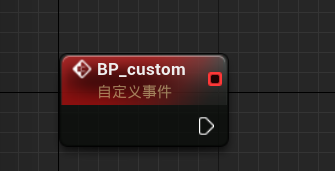

# unlua主要功能

- 零胶水代码替换
- 借助lua的热重载性质，获得快得多的游戏逻辑迭代速度。

# unlua功能清单

- 静态绑定和动态绑定
- 编译器环境下模拟服务端/客户端
- 蓝图模板生成与导出
- 手动静态导出
- 结构体访问优化
- 可选的UE命名空间

# lua可替换实现

- 蓝图里所有标记了`BlueprintImplementableEvent`和`BlueprintNativeEvent`的蓝图事件
- 所有网络复制事件通知
- 所有动画事件通知
- 所有输入事件通知

# lua调用

- lua调用蓝图
  - 支持访问所有UCLASS，UPROPERTY，UFUNCTION，USTRUCT，UENUM
  - 支持访问已被覆盖的原蓝图逻辑
  - 支持所有标记了BlueprintCallable或者Exec的UFUNCTION的默认参数
  - 支持在协程调用Latent函数
- lua调用c++
  - 单播委托的绑定，解绑，出发
  - 多播委托的绑定，解绑，清理，广播
  - 访问UENUM
  - 支持自定义碰撞枚举
  - 成员变量
  - 成员函数
  - 静态成员变量
  - 静态成员函数
  - 全局函数
- c++调用lua
  - 全局函数
  - 全局表里的函数

# 使用unlua插件

1. 复制plugins目录到UE根目录
2. 重启UE工程
3. 在蓝图添加接口`UnluaInterface`
4. 在接口的`GetModule`函数中填入Lua文件路径
5. 点击`Lua Template`生成lua模块文件
6. 打开lua文件编写代码

## Lua使用前的三步走

1. 点击生成lua文件
2. 添加unlua的接口
3. 添加返回路径，以Script为根路径，文件层级之间用点（.）隔开

# lua和引擎的绑定

- lua文件路径：相对于`/Content/Script`的路径

## 静态绑定

- c++

  - build.cs添加UnLua

  - ~~~cpp
    #include "UnLuaInterface.h"//1
    
    UCLASS()
    class LUATESTDEMO_API ACppTestActor : public AActor , public IUnLuaInterface//2
    {
    	GENERATED_BODY()
    public:	
    	virtual FString GetModuleName_Implementation() const override//3
    	{
    		return TEXT("CppTestActor_C");
    	}
    };
    ~~~

  - 在\Content\Script创建CppTestActor_C

- 蓝图
  - 在Get Module Name 返回要创建的lua文件路径，然后lua template即可

## 动态绑定

- 适用于运行时spawn出来的actor和object

~~~lua
    --spawn actor
    local SpawnActorClass = UE4.UClass.Load("/Game/BP_SpawnActor.BP_SpawnActor")
	local newSpawn = World:SpawnActor(SpawnActorClass,self:GetTransform(),UE4.ESpawnActorCollisionHandlingMethod.AlwaysSpawn,self,self,"BPSpawnActor_C")--最后一个参数是在spawn的时候动态绑定
    
    --object
    local newObject = newObject(SpawnActorClass,nil,nil,"BPSpawnActor_C")
~~~

# 从lua调用引擎

- 两种方式
  - 使用反射系统动态导出
  - 绕过反射系统，静态导出诸如类，成员变量，成员函数，全局函数，枚举等

- 访问UCLASS

~~~lua
local Widget = UWidgetBlueprintLibrary.Create(self,UClass.Load("Game/UMG_Main"))
~~~

- 访问UFUNCTION

~~~lua
Widget:AddToViewport(0)
--如果UFUNCTION标记了BlueprintCallable or Exec 的某个参数有默认值 可以忽略不传
Widget:AddToViewport()
~~~

- 处理f非常量参数

  - 基本类型 bool,integer,number,string

  - ~~~lua
    -- cpp
    -- UFUNCTION()
    -- void GetPlayerBaseInfo(int32& level,float& Health,Fstring& Name)const;
    
    local Level,Health,Name = self:GetPlayerBaseInfo()
    ~~~

  - 非基本类型

  - ~~~lua
    -- cpp
    -- UFUNCTION()
    -- void GetHitResult(FHitResult& HitRes)const;
    
    --法一：性能高
    local HisRes = FHitResult()
    self:GetHitResult(HitRes)
    --法二
    local HitRes = self:GetHitResult()
    ~~~

- 处理返回值

  - 基本类型

  - ~~~Lua
    -- cpp
    -- UFUNCTION()
    -- float GetDamage() const;
    
    local Damage = self:GetDamage();
    ~~~

  - 非基本类型

  - ~~~Lua
    -- cpp
    -- UFUNCTION()
    -- FVector GetLocation() const;
    
    --法一
    local Location = self:GetLocation()
    
    --法二
    local Location = FVector()
    self:GetLocation(Location)
    
    --法三
    local Location = FVector()
    local LocationCopy = self:GetLocation(Location)
    
    --法四
    local Location = FVector()
    self:GetLocation(Location)
    local LocationCopy = Location;
    ~~~

- Latent函数

  - Latent函数：允许开发者用同步代码的风格写异步逻辑

  - ~~~lua
    --cpp
    --Delay函数
    --UFUNCTION(BlueprintCallable, Category="Utilities|FlowControl", meta=(Latent, WorldContext="WorldContextObject", LatentInfo="LatentInfo", Duration="0.2", Keywords="sleep"))
    --	static void	Delay(const UObject* WorldContextObject, float Duration, struct FLatentActionInfo LatentInfo );
    
    --在lua协程调用latent函数
    coroutine.resume(coroutine.create(function(GameMode,Duration)UKismetSystemLibrary.Delay(GameMode,Duration)end),self,5.0)
    ~~~

- 访问USTRUCT

  - ~~~lua
    local Position = FVector()
    ~~~

- 访问UPROPERTY

  - ~~~lua
    local Position = FVector()
    Position.X = 256.0
    ~~~

- 委托

  - Bind

  - Unbind

  - Execute

  - ~~~lua
    FloatTrack.InterpFunc:Bind(self,BP_PlayerCharacter_C.OnZoomInOutUpdate) -- 绑定
    FloatTrack.InterpFunc:Unbind() -- 解绑
    FloatTrack.InterpFunc:Execute(0.5) -- 执行
    ~~~

- 多播委托

  - Add

  - Remove

  - Clear

  - Broadcast

  - ~~~lua
    self.ExitButton.Onclicked:Add(self,UMG_Main_C.OnClicked_ExitButton)--增加一个回调
    self.ExitButton.Onclicked:Remove(self,UMG_Main_C.OnClicked_ExitButton)--移除一个回调
    self.ExitButton.Onclicked:Clear()--清空所有回调
    self.ExitButton.Onclicked:Broadcast()--调用所有绑定的回调
    ~~~

- 访问UENUM

  - ~~~lua
    Weapen:K2_AttachToComponent(Point,nil,EAttachmentRule,SnapToTarget,EAttachmentRule,SnapToTarget,EAttachmentRule,SnapToTarget)
    ~~~

- 自定义碰撞枚举

  - ~~~lua
    local ObjectTypes = TArray(EObjectTypeQuery)
    ObjectTypes:Add(EObjectTypesQuary.Player)
    ObjectTypes:Add(EObjectTypesQuary.Enemy)
    ObjectTypes:Add(EObjectTypesQuary.Projectile)
    local bHit = UKismetSystemLibrary.LineTraceSingleForObjects(self,Start,End,ObjectTypes,false,nil,EDrawDebugTrace.None,HitResult,true)
    ~~~

- 常用容器

  - TArray

  - TSet

  - TMap

  - ~~~lua
    local Indices = TArray(0)
    Indices:Add(1)
    Indices:Add(3)
    Indices:Remove(0)
    local NbIndices = Indices:Length()
    local Verties = TArray(FVector)
    local Actors = TArray(AActor)
    ~~~

# 静态导出

有些函数不是UFUNCTIO，没法直接调用，需要被ADD_FUNCTION导出，但是导出需要先导出类再导出函数，因此UCLASS也需要被静态导出

- 类

  - 非反射
    - `BEGIN_EXPORT_CLASS(ClassType,...)`
    - `BEGIN_EXPORT_NAMED_CLASS(ClassName,ClassType,...)`

  - 反射类
    - `BEGIN_EXPORT_REFLECTED_CLASS(UObjectType)`
    - `BEGIN_EXPORT_REFLECTED_CLASS(NonUObjectType,...)`

- 成员变量
  - `ADD_PROPERTY(Property)`
  - `ADD_BITFIELD_BOOL_PROPERTY(Property)`(位域布尔型)

- 成员函数

  - 非静态成员函数

    - `ADD_FUNCTION(Function)`
    - `ADD_NAMED_FUNCTION(Name,Function)`

    - `ADD_FUNCTION_EX(Name,RetType,Function,...)`
    - `ADD_CONST_FUNCTION_EX(Name,RetType,Function,...)`

  - 静态成员函数
    - `ADD_STATIC_FUNCTION_EX(Name,RetType,Function,...)`
    - `ADD_STATIC_FUNCTION_EX(Name,RetType,Function,...)`

- 全局函数
  - `EXPORT_FUNCTION(RetType,FUnction,...)`
  - `EXPORT_FUNCTION_EX(Name,RetType,Function)`

- 枚举

  - 不带作用域的枚举

    - ~~~lua
      enum EHand{
          LeftHand,
          RightHand
      };
      
      BEGIN_EXPORT_ENUM(EHand)
      	ADD_ENUM_VALUE(LeftHand)
      	ADD_ENUM_VALUE(RightHand)
      END_EXPORT_ENUM(EHand)
      ~~~

  - 带作用域的枚举

    - ~~~lua
      enum class EHand{
          LeftHand,
          RightHand
      };
      
      BEGIN_EXPORT_ENUM(EHand)
      	ADD_SCOPED_ENUM_VALUE(LeftHand)
      	ADD_SCOPED_ENUM_VALUE(RightHand)
      END_EXPORT_ENUM(EHand)
      ~~~

- 可选的UE命名空间
  - Unlua提供一个可以将所有类和枚举放到UE命名空间下的选项，在Unlua.Build.cs里
  - 启用后在lua这样写：`local Position = UE.FVector()`

# 引擎调用Lua

- 替换蓝图事件
  - 标记为`BlueprintImplementableEvent`的UFUNCTION
  - 标记为`BlueprintNativeEvent`的UFUNCTION
  - 蓝图中定义的事件or函数

- 无返回值的蓝图事件

  - ~~~lua
    --cpp
    UFUNCTION(BlueprintImplementableEvent)
    void ReceiveBeginPlay();
    
    --lua
    function BP_PlayerController_C:ReceiveBeginPlay()
        print("Receive BeginPlay in lua")
    end
    ~~~

- 有返回值的蓝图事件

  - ~~~lua
    --cpp
    UFUNCTION(BlueprintImplementableEvent)
    bool GetCharacterInfo(int32& HP);
    
    --lua
    function BP_PlayerCharacter_C:GetCharacterInfo(HP)
        return 100
    end
    ~~~

- 替换动画事件

  - ~~~lua
    function ABP_PlayerCharacter_C:AnimNotify_NotifyPhysics() -- 函数名必须是AnimNotify_xxx
        UBPI_Interfaces_C.ChangeToRagdoll(self.Pawn)
    end
    ~~~

- 替换输入事件

  - ~~~lua
    --action
    function BP_PlayerController_C:Aim_Pressed()
        UBPI_Interfaces_C.UpdateAimong(self.Pawn,true)
    end
    
    --Axis
    function BP_PlayerController_C:LookUp(AxisValue)
        self:AddYawPitchInput(AxisValue)
    end
    
    --按键输入
    function BP_PlayerController_C:Pressed()
        print("P_Pressed")
    end
    
    --others
    Touch
    AxisKey
    VectorAxis
    Gesture
    ~~~

- 替换replication事件

  - ~~~lua
    --cpp
    UFUNCTION()
    virtual void OnRep_Health();
    
    UPROPERTY(ReplicatedUsing = OnRep_Health)
    int32 Health;
    
    --lua
    function BP_PlayerCharacter_C:OnRep_Health(...)
        print("call OnRep_Health in lua")
    end
    ~~~

- 调用被替换的函数

  - lua覆盖了原来的实现，仍可用overriden访问原来的函数

  - ~~~lua
    function BP_PlayerController_C:ReceiveBeginPlay()
        local Widget = UWidgetBlueprintLibrary.Create(self,UClass.Load("Path"))
        Widget:AddtoViewport()
        self.Overriden.ReceiveBeginPlay(self)
    end
    ~~~

- c++调用lua

  - ~~~cpp
    //全局函数
    template<typename T...>
    FLuaRetValues Call(lua_State*L,const char *FunName,T&&..Args);
    
    //全局表里的函数
    template<typename T...>
    FLuaRetValues CallTableFunc(lua_State*L,const char *FunName,T&&..Args);
    ~~~

    

- 蓝图能扩展的lua就能扩展，蓝图不能扩展的lua也不能扩展

## 访问函数方式

```lua
	print("Index:"..self:GetIndex()) --用  :  调用自身函数
	print(tostring(self.Button_0)) --可访问蓝图内容，用  .  访问自身的变量
	print(UE4.UMyBlueprintFunctionLibrary.GetInt())--用  .  访问静态函数
	self:Func_1()--调用自定义事件
	self:PlayAnimation(self.NewAnimation,0,1)--播放UI动画
```

## 访问c++的变量


```lua
function UI_Test_C:Construct()
	self.Button_0.OnPressed:Add(self,UI_Test_C.OnClickTest)
end

function UI_Test_C:OnClickTest()
	local World=self:GetWorld()
	if not World then
		return 
	end
	local ActorClass=UE4.UClass.Load("/Game/BluePrint/NewBlueprint.NewBlueprint")--引用地址 load一个class
	local Actor=World:SpawnActor(ActorClass,FVector(),
	UE4.ESpawnActorCollisionHandlingMethod.AlwaysSpawn,self,self,"")--动态生成一个actor
	self.Actor=Actor--保存下来
	print("Name is "..self.Actor.Name)--访问函数变量
end
```

## 定义访问蓝图事件



```lua
function NewBlueprint_C:BP_custom()
	print("BP_customEvent")
end

function NewBlueprint_C:ReceiveBeginPlay()
	self.BP_custom()
end
```

## 定义访问c++函数


```lua
function NewBlueprint_C:LuaImp()
--lua实现
	print("this is a c++ implemention in  lua")
end

function NewBlueprint_C:LuaNative() 
--lua 实现该函数以后 c++的实现就失效了
	print("Native Event")
end
```

## 实现继承

BP_CharacterBase_C.lua

```lua
function BP_CharacterBase_C:StartFire()
	print("BP_CharacterBase_C:StartFire")
end
```

BP_Player_C.lua

```lua
local BP_Player_C = Class("BluePrint.BP_CharacterBase_C")--父类路径

function BP_Player_C:StartFire()
	print("BP_Player_C:StartFire")
	self.Super:StartFire()--Super调用父类函数
end
```

## 接口的实现和使用

在蓝图中定义接口，在Pawn里做了实现

```lua
function BP_Player_C:UpdateAiming(isAiming)
	if isAiming then
		self.ZoomInOut:Play()
	else
		self.ZoomInOut:Reverse()
	end
end
```

controller来调用接口

```lua
function BP_PlayerController_C:Aim_Pressed()
	if not self.Pawn then
		return 
	end
	local MyInterface=UE4.UBPI_Interface_C--拿到BPI interface的原表metatable
	MyInterface.UpdateAiming(self.Pawn,true)--第一个参数表示作用对象
end
```

## . 调用 和 : 调用

```lua
	--定义
function Class_C.Test1(param1,param2)
    --" . " 不隐含self的参数，用的时候需要显示传递
    Class_C.msgA = "MsgA:"..tostring(self).." param1:"..param1.." param2:"..param2;
    --self == nil
end

function Class_C:Test2(param1,param2)
    -- " : " 隐含第一个参数self，实际上的参数有(self,param1,param2)
    Class_C.msgB = "MsgB:"..tostring(self).." param1:"..param1.." param2:"..param2;
    --self==调用者
end
--调用：调用:定义的函数需要多一个参数self
--一般多态用点号调用，平常用冒号调用
Class_C.Test1(1,2)
print(Class_C.msgA)--   .->.    定义和调用都无self传入，self=nil,param1=1,param2=2

Class_C:Test1(3,4)
print(Class_C.msgA)--   :->.    定义无self传入，调用有self传入，第一个参数不可用，param1=4,param2=nil,

Class_C.Test2(5,6)
print(Class_C.msgB)--   .->:    定义有self传入，调用无self传入，self=5,param1=6，param2=nil
Class_C.Test2(Class_C,5,6)--   点号调用冒号定义的函数，第一个传入的参数是self self=Class_C
print(Class_C.msgB)

Class_C:Test2(7,8)--    谁调用:定义的函数，谁就是self  self=Class_C
print(Class_C.msgB)--   :->:    定义和调用都有self，self=self,param1=7,param2=8
```

