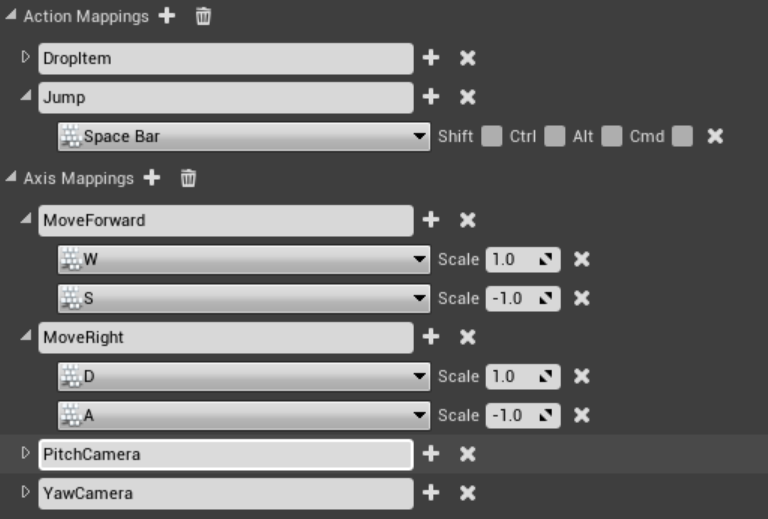

# 添加轴/动作映射

## 方法一：编辑器设置Input映射



## 方法二：从C++添加轴和动作映射


​	

```c++
*//添加、绑定ActionKeyMapping轴映射 方法一*
	FInputActionKeyMapping **onFire**("OnFire", EKeys::LeftMouseButton, 0, 0, 0, 0);
	UPlayerInput::AddEngineDefinedActionMapping(onFire);
	PlayerInputComponent->BindAction("OnFire", IE_Pressed, **this**, &AMyCharacter::OnFire);

	*//添加、绑定ActionKeyMapping轴映射 方法二*				 UPlayerInput::AddEngineDefinedActionMapping(FInputActionKeyMapping("Sprint",EKeys::LeftShift));
	PlayerInputComponent->BindAction("Sprint", IE_Pressed,**this**,&AMyCharacter::StartSprint);
	PlayerInputComponent->BindAction("Sprint", IE_Released,**this**,&AMyCharacter::StopSprint);

	*//添加、绑定AxisMapping轴映射 方法三*
UPlayerInput::AddEngineDefinedAxisMapping(FInputAxisKeyMapping("Turn", EKeys::MouseX, 1.0f));
	PlayerInputComponent->BindAxis("Turn", **this**, &AMyCharacter::OnTurn);
```

# 设置Input绑定

```c++
void AMyCharacter::SetupPlayerInputComponent(UInputComponent* PlayerInputComponent)
{
	Super::SetupPlayerInputComponent(PlayerInputComponent);
//动作绑定  &AMyCharacter::DropItem函数
	PlayerInputComponent->BindAction("DropItem", EInputEvent::IE_Pressed, this, &AMyCharacter::DropItem);
//轴绑定 &AMyCharacter::MoveForward函数
	PlayerInputComponent->BindAxis("MoveForward", this, &AMyCharacter::MoveForward);

}
```

# 实现Input事件

```c++
void AMyCharacter::MoveForward(float AxisValue)
{
	MovementInput.X = FMath::Clamp<float>(AxisValue, -1.f, 1.f);
}
```

