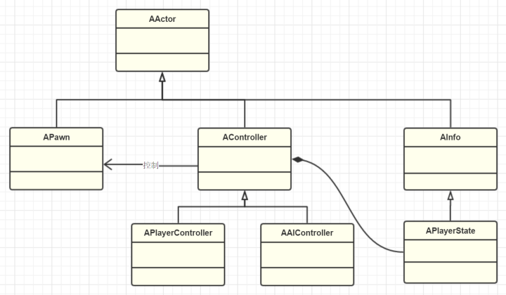

# 文件结构

打*表示可以gitignore

- ***Binaries**：生成的二进制文件
- **Config**：配置文件
- **Content**：资源，蓝图
- **DerivedDataCache（DDC）**：引擎针对平台特化后的资源版本
- ***Intermediate**：中间文件，临时文件

- ***Saved**：自动保存的文件，其他配置文件，日志文件，引擎崩溃日志，硬件信息，烘培信息数据等

- **Source**：代码文件

# 编译类型

- 

- 

- 

# 命名规定

- 模版类以`T`作为前缀，比如`TArray,TMap,TSet `
- `UObject`派生类都以`U`前缀 
- `AActor`派生类都以`A`前缀 
- `SWidget`派生类都以`S`前缀 
- 抽象接口以`I`前缀 
- 枚举以`E`开头 
- `bool`变量以`b`前缀，如`bPendingDestruction `
- 其他的大部分以`F`开头，如`FString,FName `
- `typedef`的以原型名前缀为准，如`typedef TArray FArrayOfMyTypes; `
- 在编辑器里和C#里，类型名是去掉前缀过的 
- `UHT (UnrealHeaderTool)`在工作的时候需要你提供正确的前缀，所以虽然说是约定，但你也得必须遵守。

# 编译系统

- UBT：ue4的自定义工具，来编译ue4的逐个模块并处理依赖。`Target.cs  Build.cs`都是为这个工具服务的
- UHT：ue4的c++代码解析生成工具，`UCLASS  include "xxx.generated.h"`都是为UHT提供信息来生成相应的C++反射代码

# 类型

## UObject

- UObject提供的元数据、反射生成、GC垃圾回收、序列化、编辑器可见，Class Default Object等

## Actor

- 派生自UObject
- 本身不带`transform`,可以用`getactorlocation`获取位置

~~~cpp
template<class T>
static FORCEINLINE FVector GetActorLocation(const T* RootComponent)
{	//实质上获取的是跟组件的位置
    return (RootComponent != nullptr) ? RootComponent->GetComponentLocation() : FVector(0.f,0.f,0.f);
}
bool AActor::SetActorLocation(const FVector& NewLocation, bool bSweep, FHitResult* OutSweepHitResult, ETeleportType Teleport)
{
    if (RootComponent)
    {
        const FVector Delta = NewLocation - GetActorLocation();
        return RootComponent->MoveComponent(Delta, GetActorQuat(), bSweep, OutSweepHitResult, MOVECOMP_NoFlags, Teleport);
    }
    else if (OutSweepHitResult)//检测新位置有碰撞
    {
        *OutSweepHitResult = FHitResult();
    }
    return false;
}
~~~

- Replication（网络复制）,Spawn（生生死死），Tick(有了心跳)

- 一些不在世界里展示的“不可见对象”也可以是Actor，如`AInfo`(派生类`AWorldSetting,AGameMode,AGameSession,APlayerState,AGameState`等)，`AHUD,APlayerCameraManager`等，代表了这个世界的某种信息、状态、规则。

- 能接收处理Input事件的能力，其实也是转发到内部的UInputComponent*

## Component

- 在`actor`内的`TSet<UActorComponent*> OwnedComponents` 保存着这个`Actor`所拥有的所有`Component`,一般其中会有一个`SceneComponent`作为`RootComponent`。
- SceneComponent提供了两大能力：一是Transform，二是SceneComponent的互相嵌套。

> 为什么不允许所有component互相嵌套？如Component之间如何互相依赖，如何互相通信，嵌套过深导致的接口便利损失和性能损耗，真正一个让你随便嵌套的组件模式可能会在使用上更容易出问题

- UE里是通过Child:AttachToActor或Child:AttachToComponent来创建父子连接的。其实是不同Actor的SceneComponent之间有父子关系，而Actor本身其实并不太关心。

~~~cpp
void AActor::AttachToActor(AActor* ParentActor, const FAttachmentTransformRules& AttachmentRules, FName SocketName)
{
    if (RootComponent && ParentActor)
    {
        USceneComponent* ParentDefaultAttachComponent = ParentActor->GetDefaultAttachComponent();
        if (ParentDefaultAttachComponent)
        {
            //将自己的跟组件附加到父类actor的socket上，把当前Actor当作对方哪个SceneComponent的子
            RootComponent->AttachToComponent(ParentDefaultAttachComponent, AttachmentRules, SocketName);
        }
    }
}
void AActor::AttachToComponent(USceneComponent* Parent, const FAttachmentTransformRules& AttachmentRules, FName SocketName)
{
    if (RootComponent && Parent)
    {
        RootComponent->AttachToComponent(Parent, AttachmentRules, SocketName);
    }
}
~~~

~~~cpp
/** 附加组件的规则 - 需要与 EDetachmentRule 保持同步 */
UENUM()
enum class EAttachmentRule : uint8
{
    /** 将当前相对转换保留为对新父项的相对转换。 */
    KeepRelative,
    /** 自动计算相对变换，以便附加的组件保持相同的世界变换。 */
    KeepWorld,
    /** 对齐变换到连接点*/
    SnapToTarget,
};
~~~

~~~cpp
void UChildActorComponent::OnRegister()//注册时
{
    Super::OnRegister();
    if (ChildActor)
    {
        if (ChildActor->GetClass() != ChildActorClass)
        {
            DestroyChildActor();
            CreateChildActor();
        }
        else//已经存在直接添加上去
        {
            ChildActorName = ChildActor->GetFName();
            USceneComponent* ChildRoot = ChildActor->GetRootComponent();
            if (ChildRoot && ChildRoot->GetAttachParent() != this)
            {
				/*将新执行组件附加到此组件
                我们无法在CreateChildActor中附加，因为它设置了中间移动性
                导致移动设置不一致
                所以移动附加到注册中发生*/
                ChildRoot->AttachToComponent(this, FAttachmentTransformRules::SnapToTargetNotIncludingScale);
            }
            //网络复制
            SetIsReplicated(ChildActor->GetIsReplicated());
        }
    }
    else if (ChildActorClass)/
    {
        CreateChildActor();
    }
}
void UChildActorComponent::OnComponentCreated()
{
    Super::OnComponentCreated();
    CreateChildActor();
}
~~~

## Level

- 关卡蓝图本身就是一个看不见的Actor，可以添加组件

~~~cpp
void ALevelScriptActor::PreInitializeComponents()
{
    if (UInputDelegateBinding::SupportsInputDelegate(GetClass()))
    {
        // create an InputComponent object so that the level script actor can bind key events
        InputComponent = NewObject<UInputComponent>(this);
        InputComponent->RegisterComponent();
        UInputDelegateBinding::BindInputDelegates(GetClass(), InputComponent);
    }
    Super::PreInitializeComponents();
}
~~~

## World

- 可以用SubLevel的方式把Level拼装起来

- 也可以WorldComposition的方式自动把项目里的所有Level都组合起来，并设置摆放位置

- 一个World里有多个Level，这些Level在什么位置，是在一开始就加载进来，还是Streaming运行时加载。UE里每个World支持一个PersistentLevel和多个其他Level

> Persistent的意思是一开始就加载进World，Streaming是后续动态加载的意思。Levels里保存有所有的当前已经加载的Level，StreamingLevels保存整个World的Levels配置列表。PersistentLevel和CurrentLevel只是个快速引用。

- 世界设置

~~~cpp
AWorldSettings* UWorld::GetWorldSettings( bool bCheckStreamingPesistent, bool bChecked ) const
{
    checkSlow(IsInGameThread());
    AWorldSettings* WorldSettings = nullptr;
    if (PersistentLevel)//游戏第一个场景（主场景）为主设置其他为辅的Level配置系统
    {
        WorldSettings = PersistentLevel->GetWorldSettings(bChecked);
        if( bCheckStreamingPesistent )
        {
            if( StreamingLevels.Num() > 0 &&
                StreamingLevels[0] &&
                StreamingLevels[0]->IsA<ULevelStreamingPersistent>()) 
            {
                ULevel* Level = StreamingLevels[0]->GetLoadedLevel();
                if (Level != nullptr)
                {
                    WorldSettings = Level->GetWorldSettings();
                }
            }
        }
    }
    return WorldSettings;
}
~~~

- Levels共享着World的一个PhysicsScene，这也意味着Levels里的Actors的物理实体其实都是在World里的

- Level作为Actor的容器，同时也划分了World，一方面支持了Level的动态加载，另一方面也允许了团队的实时协作，大家可以同时并行编辑不同的Level。

## WorldContext

- 世界类型

~~~cpp
namespace EWorldType
{
	enum Type
	{
		None,		// An untyped world, in most cases this will be the vestigial worlds of streamed in sub-levels
		Game,		// The game world
		Editor,		// A world being edited in the editor
		PIE,		// A Play In Editor world
		Preview,	// A preview world for an editor tool
		Inactive	// An editor world that was loaded but not currently being edited in the level editor
	};
}
~~~

- WordContext用来管理跟踪这些World

~~~cpp
struct FWorldContext
{
    [...]
	TEnumAsByte<EWorldType::Type>	WorldType;

	FSeamlessTravelHandler SeamlessTravelHandler;

	FName ContextHandle;
//TravelURL和TravelType就是负责设定下一个Level的目标和转换过程。
	/** URL to travel to for pending client connect */
	FString TravelURL;

	/** TravelType for pending client connects */
	uint8 TravelType;

	/** URL the last time we traveled */
	UPROPERTY()
	struct FURL LastURL;

	/** last server we connected to (for "reconnect" command) */
	UPROPERTY()
	struct FURL LastRemoteURL;

}

// Traveling from server to server.
UENUM()
enum ETravelType
{
	/** Absolute URL. */
	TRAVEL_Absolute,
	/** Partial (carry name, reset server). */
	TRAVEL_Partial,
	/** Relative URL. */
	TRAVEL_Relative,
	TRAVEL_MAX,
};

void UEngine::SetClientTravel( UWorld *InWorld, const TCHAR* NextURL, ETravelType InTravelType )
{
	FWorldContext &Context = GetWorldContextFromWorldChecked(InWorld);
	// set TravelURL.  Will be processed safely on the next tick in UGameEngine::Tick().
	Context.TravelURL    = NextURL;
	Context.TravelType   = InTravelType;
    [...]
}
~~~

- 流程是UE在OpenLevel的时候， 先设置当前World的Context上的TravelURL，然后在UEngine::TickWorldTravel的时候判断TravelURL非空来真正执行Level的切换。

~~~cpp
void UGameplayStatics::LoadStreamLevel(UObject* WorldContextObject, FName LevelName,bool bMakeVisibleAfterLoad,bool bShouldBlockOnLoad,FLatentActionInfo LatentInfo)
{
	if (UWorld* World = GEngine->GetWorldFromContextObject(WorldContextObject))
	{
		FLatentActionManager& LatentManager = World->GetLatentActionManager();
		if (LatentManager.FindExistingAction<FStreamLevelAction>(LatentInfo.CallbackTarget, LatentInfo.UUID) == nullptr)
		{
			FStreamLevelAction* NewAction = new FStreamLevelAction(true, LevelName, bMakeVisibleAfterLoad, bShouldBlockOnLoad, LatentInfo, World);
			LatentManager.AddNewAction(LatentInfo.CallbackTarget, LatentInfo.UUID, NewAction);
		}
	}
}
~~~

## GameInstance

- GameInstance里会保存着当前的WorldConext和其他整个游戏的信息。

- 不管Level怎么切换，还是会一直存在

## Engine

- 分为UGameEngine和UEditorEngine，编辑器也是个游戏

- Standalone Game：会使用UGameEngine来创建出唯一的一个GameWorld，因为也只有一个，所以为了方便起见，就直接保存了GameInstance指针。
- 而对于编辑器来说，EditorWorld其实只是用来预览，所以并不拥有OwningGameInstance，而PlayWorld里的OwningGameInstance才是间接保存了GameInstance.
- GEngine是引擎的根

## GamePlayStatics

- 在Engine层次便利操作蓝图函数库

~~~cpp
UCLASS ()
class UGameplayStatics : public UBlueprintFunctionLibrary 
~~~

- 蓝图里见到的GetPlayerController、SpawActor和OpenLevel等都是来至于这个类的接口。

## Pawn

1. 可被Controller控制
2. PhysicsCollision表示
3. MovementInput的基本响应接口

- SpectatorPawn：观战Pawn（不带重力漫游场景），关闭了StaticMesh显示，碰撞也设为了Spectator

- Character：人形Pawn

## Controller

- 比AActor多了控制Pawn的能力

~~~cpp
//Pawn自身上也可以配置策略
namespace EAutoReceiveInput
{
    enum Type
    {
        Disabled,
        Player0,
        Player1,
        Player2,
        Player3,
        Player4,
        Player5,
        Player6,
        Player7,
    };
}
TEnumAsByte<EAutoReceiveInput::Type> AutoPossessPlayer;
enum class EAutoPossessAI : uint8
{
    /** Feature is disabled (do not automatically possess AI). */
    Disabled,
    /** Only possess by an AI Controller if Pawn is placed in the world. */
    PlacedInWorld,
    /** Only possess by an AI Controller if Pawn is spawned after the world has loaded. */
    Spawned,
    /** Pawn is automatically possessed by an AI Controller whenever it is created. */
    PlacedInWorldOrSpawned,
};
EAutoPossessAI AutoPossessAI;
TSubclassOf<AController> AIControllerClass;
~~~

- 如果是一些Pawn本身固有的能力逻辑，如前进后退、播放动画、碰撞检测之类的就完全可以在Pawn内实现；而对于一些可替换的逻辑，或者智能决策的，就应该归Controller管辖。
- 如果一个逻辑只属于某一类Pawn，那么其实你放进Pawn内也挺好。而如果一个逻辑可以应用于多个Pawn，那么放进Controller就可以组合应用了。

- 从存在性来说，Controller的生命期比Pawn要长一些，比如我们经常会实现的游戏中玩家死亡后复活的功能。Pawn死亡后，这个Pawn就被Destroy了，就算之后再Respawn创建出来一个新的，但是Pawn身上保存的变量状态都已经被重置了。所以对于那些需要在Pawn之外还要持续存在的逻辑和状态，放进Controller中是更好的选择。

~~~cpp
 /** PlayerState containing replicated information about the player using this controller (only exists for players, not NPCs). */
//playerController存储着playerState
    UPROPERTY(replicatedUsing=OnRep_PlayerState, BlueprintReadOnly, Category="Controller")
    class APlayerState* PlayerState;
~~~

## APlayerState

- APlayerState也理所当然是生成在Level中的，跟Pawn和Controller是平级的关系，Controller里只不过保存了一个指针引用罢了。

- PlayerState表示的是玩家的游玩数据

- Controller本身运行需要的临时数据也不应该归PlayerState管理
- 跨关卡的统计数据等就也不应该放进PlayerState里了，应该放在外面的GameInstance，然后用SaveGame保存起来。因为玩家在切换关卡的时候，APlayerState也会被释放掉

## PlayerController && AIController

- camera管理
- input系统
- UPlayer关联：不仅能控制本地的pawn，还能控制网络上的pawn
- HUD显示
- LEVEL的切换
- Voice语音聊天
- playerController代表玩家意志，playerState代表玩家状态

## AAIController

- AI不需要玩家控制，可以自行决策行动，但AI的逻辑也需要一个运行的实体
- 同PlayerController对比，少了Camera、Input、UPlayer关联，HUD显示，Voice、Level切换接口，但也增加了一些AI需要的组件：
- Navigation，用于智能根据导航寻路（MoveTo）
- AI组件，运行启动行为树，使用黑板数据，探索周围环境。
- Task系统，让AI去完成一些任务，也是实现GameplayAbilities系统的一个接口。简单来说GameplayAbilities是为Actor添加额外能力属性集合的一个模块，比如HP，MP等。其中的GamePlayEffect也是用来实现Buffer的工具。另外GamePlayTags也是用来给Actor添加标签标记来表明状态的一种机制。

## Actor的控制逻辑

## GameMode

- UE中认为游戏是有一个个world构成的，world是由一个个level构成的
- 游戏的逻辑操纵者。类似一个world controller

- 主要功能

  - **class登记**：GameMode里登记了游戏里基本需要的类型信息，在需要的时候通过UClass的反射可以自动Spawn出相应的对象来添加进关卡中。
  - **spawn实体**：GameMode既然作为一场游戏的主要负责人，那么游戏的加载释放过程中涉及到的实体的产生，包括玩家Pawn和PlayerController，AIController也都是由GameMode负责。最主要的SpawnDefaultPawnFor、SpawnPlayerController、ShouldSpawnAtStartSpot这一系列函数都是在接管玩家实体的生成和释放，玩家进入该游戏的过程叫做Login（和服务器统一），也控制进来后在什么位置，等等这些实体管理的工作。GameMode也控制着本场游戏支持的玩家、旁观者和AI实体的数目。

  - **游戏的进度**：一个游戏支不支持暂停，怎么重启等这些涉及到游戏内状态的操作也都是GameMode的工作之一，SetPause、ResartPlayer等函数可以控制相应逻辑。
  - **Level的切换**：或者说World的切换更加合适，GameMode也决定了刚进入一场游戏的时候是否应该开始播放开场动画（cinematic），也决定了当要切换到下一个关卡时是否要bUseSeamlessTravel，一旦开启后，你可以重载GameMode和PlayerController的GetSeamlessTravelActorList方法和GetSeamlessTravelActorList来指定哪些Actors不被释放而进入下一个World的Level。
  - **多人游戏的步调同步**：在多人游戏的时候，我们常常需要等所有加入的玩家连上之后，载入地图完毕后才能一起开始逻辑。因此UE提供了一个MatchState来指定一场游戏运行的状态，用了一个状态机来标记开始和结束的状态，并触发各种回调。

~~~cpp
void AGameMode::GetSeamlessTravelActorList(bool bToTransition, TArray<AActor*>& ActorList)
{
	UWorld* World = GetWorld();

	// Get allocations for the elements we're going to add handled in one go
	const int32 ActorsToAddCount = World->GameState->PlayerArray.Num() + (bToTransition ?  3 : 0);
	ActorList.Reserve(ActorsToAddCount);

	// always keep PlayerStates, so that after we restart we can keep players on the same team, etc
	ActorList.Append(World->GameState->PlayerArray);

	if (bToTransition)
	{
		// keep ourselves until we transition to the final destination
		ActorList.Add(this);
		// keep general game state until we transition to the final destination
		ActorList.Add(World->GameState);
		// keep the game session state until we transition to the final destination
		ActorList.Add(GameSession);

		// If adding in this section best to increase the literal above for the ActorsToAddCount
	}
    //UE的流程travelling，GameMode在新的World里是会新生成一个的，即使Class类型一致，即使bUseSeamlessTravel，因此在travelling的时候要小心GameMode里保存的状态丢失。不过Pawn和Controller默认是一致的。
}
~~~

- GameMode应该专注于逻辑的实现，而LevelScriptActor应该专注于本Level的表示逻辑，比如改变Level内某些Actor的运动轨迹，或者某一个区域的重力，或者触发一段特效或动画。而GameMode应该专注于玩法，比如胜利条件，怪物刷新等。

- 同Controller应用到Pawn一样道理，因为GameMode是可以应用在不同的Level的，所以**通用的玩法**应该放在GameMode里。

- GameMode只在Server存在（单机游戏也是Server），对于已经连接上Server的Client来说，因为游戏的状态都是由Sever决定的，Client只是负责展示，所以Client上是没有GameMode的，但是有LevelScriptActor，所以GameMode里**不要写Client特定相关的逻辑**，比如操作UI等。

- gameinstance可用来协调不同gamemode

## GameState

- 在网络中传播同步游戏的状态使用的（记得GameMode在Client并不存在，但是GameState是存在的，所以可以通过它来复制）

- 玩家状态列表，同样的如果在Client1想看到Client2的游戏状态数据，则Client2的PlayerState就必须广播过来，因此GameState把当前Server的PlayerState都收集了过来，方便访问使用。

- 自定义GameState子类来存储本GameMode的运行过程中产生的数据（那些想要replicated的!），如果是GameMode游戏运行的一些数据，又不想要所有的客户端都可以看到，则也可以写在GameMode的成员变量中。重复遍，PlayerState是玩家自己的游戏数据，GameInstance里是程序运行的全局数据。

## 关系

