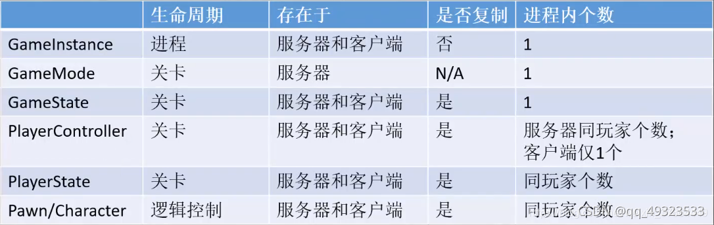
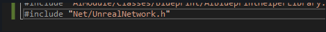
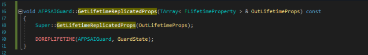
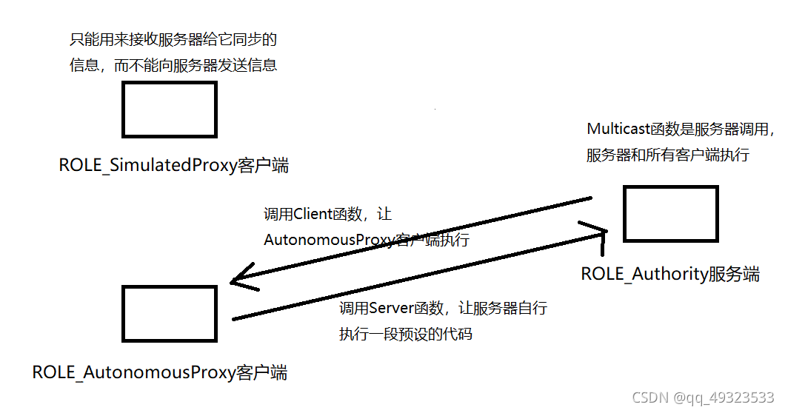
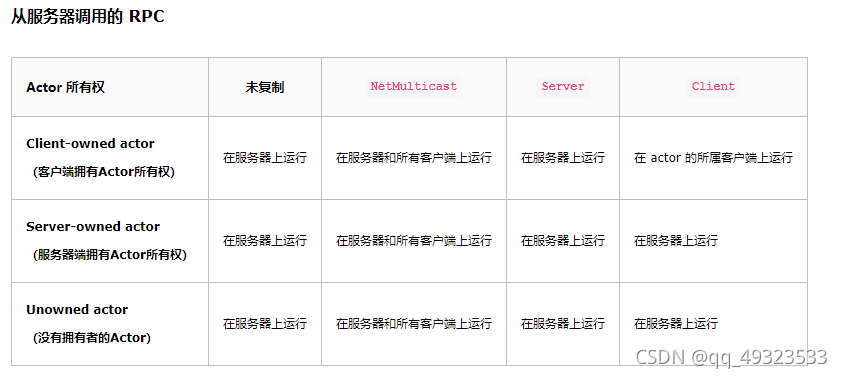
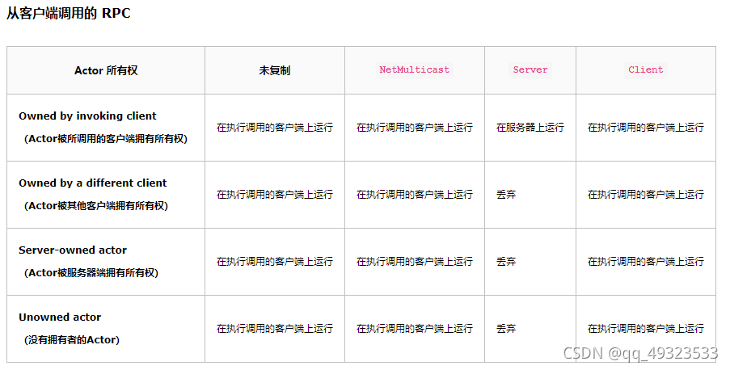
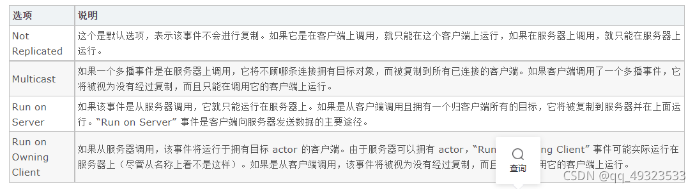

# 前言

接触到了UE4的网络连接的讲解，但是不是很懂，这一段是课程中留下的记录，用于后续学习。

**playerController**服务器端要找到特定的客户端只能通过playerController
**GameMode**只能在服务器运行,控制整个游戏运行规则和流程
**PlayerState**适合于记录所有pawn都共有的属性或方法.在worldSetting的gameMode属性中指定当前关卡的playerState类，游戏运行时白皮书会分发(实例化)到各个pawn中
**gameInstance**，这个类存在于客户端和服务器端中，生命周期自游戏创建以来就一直存在，但没有同步机制，即改变服务器端gameinstance某个成员变量取值不会对客户端的有任何影响。


1. 三种RPC函数的区别：

```cpp
UFUNCTION(Server,Reliable,WithValidation)//客户端请求，服务端执行。适用于涉及数据安全的行为，比如：血量修改，扣血条件
UFUNCTION(Client,Reliable)//服务端请求，客户端/服务端执行。NM_Standalone模式下，Client函数也会执行。适用于表现相关，不涉及数据修改的行为，比如：装备升级，整备的属性修改发生在服务端，升级成功后的外观变化，服务端需要通知客户端替换武器 Mesh 和材质。
UFUNCTION(NetMulticast,Reliable)//服务端先执行，然后连接的客户端再执行。默认情况下只在服务端执行。适用于当前客户端做的表现也希望其他客户端也看到，比如：播放攻击动作，客户端A控制的角色A播放攻击动作，希望所有其他客户端也能看见角色A播放了攻击动作。
//NetMulticast在处理不重要的消息一般可以设置为 Unreliable ，表示如果网络不通畅，不重新发送 UDP 消息，可以节省带宽。
```

1. 服务器变量更新回调函数
   ReplicatedUsing 一般出现在函数的声明中,表示当该变量在服务器上变化时,会调用事先绑定好的回调函数(函数名一般以OnRep开头),需要注意的是服务端不会自动调用绑定好的该回调函数,此时需要通过代码手动调用.
   复制变量还需要在类中添加如下宏和函数。下面的宏里的类和变量名根据使用的需求不同自行更改。
   
   
2. GameMode复制多播函数

gamemode只存在于服务器。GameState就相当于一个小容器里面装的是服务器GameMode中需要复制的东西。然后创建网络组播（多播）的方式复制给每个客户端。

1. UI同步
   UI加载在多人游戏的时候应该写在玩家的PlayerController里面。

///////////////////////////////////////////////////

```
1. 重要东西由服务端下发
if(GetLocalRole()==ROLE_Authority)//服务端
{
	...
}

2. 再由客户端复制
SetReplicates(true);

3. 但是复制客户端仍然拿不到这个变量，需要让变量同步
UPROPERTY(Replicated)
...

4. 以及添加如下函数,把变量同步给所有的客户端
void GetLifetimeReplicatedProps(TArray<FLifetimeProperty>&OutLifetimeProps) const;
#include "Net/UnrealNetwork.h"
void class::GetLifetimeReplicatedProps(TArray<FLifetimeProperty>&OutLifetimeProps) const
{
	Super::GetLifetimeReplicatedProps(OutLifetimeProps);
	DOPEPLIFETIME(同步的类，类的变量);//同步该变量
}

5. 客户端请求服务端执行函数，服务端再下发给所有客户端
UFUNCTION(Server,Reliable,WithValidation)
void ServerFunc();
void Func();
void class::Func()
{
	if(GetLocalRole()<ROLE_Authority)//不是服务器,则请求服务器
	{
		ServerFunc(); 
	}
	...//是服务器则执行函数逻辑
}
void class::ServerFunc_Implementation()
{
	Func();
}

//用于验证是否作弊
bool class::ServerFunc_Validate()
{
	return true;
}
USTRUCT()
struct FHitScanTrace{
	GENERATED_BODY()
public:
	UPROPERTY()
	FVector_NetQuantize TraceTo;//这种类型可以量化网络，减小数据大小
	UPROPERTY()
	uint8 BrustCounter;
}
//FHitScanTrace变量变化时，在客户端执行OnRep_HitScanTrace函数
UPEOPERTY(ReplicatedUsing=OnRep_HitScanTrace)
FHitScanTrace HitScanTrace;

- UFUNCTION(OnRep_HitScanTrace)
void OnRep_HitScanTrace();
void GetLifetimeReplicatedProps(TArray<FLifetimeProperty>&OutLifetimeProps) const;
#include "Net/UnrealNetwork.h"
void Fire()
{	
	FVector EndLocation;
	PlayFireEffect(EndLocation);
	if(GetLocalRole()==ROLE_Authority)
	{
		HitScanTrace.BrustCounter++;
		HitScanTrace.TraceTo = ...;//这两个变量在主机发生变化,客户端调用OnRep_HitScanTrace()
		OnRep_HitScanTrace()//主机要自己调用
	}
}
void class::OnRep_HitScanTrace()//在这里写不重要的同步 ，特效，动画，啥的
{
	PlayFireEffect(HitScanTrace.TraceTo);
}
void class::GetLifetimeReplicatedProps(TArray<FLifetimeProperty>&OutLifetimeProps) const
{
	Super::GetLifetimeReplicatedProps(OutLifetimeProps);
	DOPEPLIFETIME_CONDITION(类，类的变量 ,COND_SKipOwner);//同步给别人 跳过自己
}
```

# 参考资料

https://blog.csdn.net/liulong1567/article/details/73201022
https://zhuanlan.zhihu.com/p/114341957
https://gameinstitute.qq.com/community/detail/121544
https://gameinstitute.qq.com/community/detail/121545
https://www.bilibili.com/video/BV1TJ411N78Z

# UE4的网络同步

## 同步需要考虑的问题

同步的对象：Actor，变量（属性），函数，组件，通用UObject
同步的范围：network relevant
\##同步的方式：和同步的对象放在一起学习
\##同步的间隔：有一些特殊的数据类型用于控制间隔

## Actor的同步

Actor是网络同步的基本单位，RPC和属性复制都是在Actor复制中进行的。
如果需要网络复制这个
如果这个变量的Actor::bReplicates为false，那么Actor下的Property Replication,RPC等等，都是白搭。

```
//以下两种方式都可实现
//方法1：修改.h
	uint8 bReplicates:1;
//方法2：修改.cpp构造函数
	SetReplicates(true);//同步Actor
	SetReplicatingMovement(true);//同步Actor运动
```

Actor 同步相关的属性

```
AActor::NetUpdateFrequency // 用于确定 actor 的复制频度

AActor::PreReplication // 在复制发生前调用

AActor::bOnlyRelevantToOwner // 如果此 actor 仅复制到所有者，则值为 true

AActor::IsRelevancyOwnerFor // 用于确定 bOnlyRelevantToOwner 为 true 时的相关性

AActor::IsNetRelevantFor // 用于确定 bOnlyRelevantToOwner 为 false 时的相关性
```

## 属性的同步

将Actor设置为bReplicates = true后，在进行同步时，并不是将所有的属性进行同步，只有将属性标记为需要复制后，同步时才会同步属性，这样节省性能开销，防止非必要的属性同步。
同步方式有两种：
方法1：当服务器发生变化时，同步到对应客户端，成为Replicated。

```
	UPROPERTY(Replicated)
	float Health;
```

方法2：当属性发生变化时，同步属性并调用OnRep_函数()

> 如果用C++声明此种同步属性，当属性在服务器发生变化时，对应的客户端自动调用OnRep函数，在服务器端，需要手动调用OnRep函数，称作ReplicatedUsing。而在蓝图里声明此种属性时，当属性在服务器发生变化时，服务器和客户端都会自动调用OnRep函数，不需要单独在服务器手动调用，称作RepNotify。

```
	UPROPERTY(ReplicatedUsing=OnRep_Func)
	class AActor *a;
	//当a发生变化，在客户端自动调用OnRep_Func，但服务端需要自己调用
	void OnRep_Func();
```

在C++中实现同步属性，无论是第一种同步方式还是第二种同步方式还需要为属性设置Lifetime。

> 当有多个实例被创建时，GetLifetimeReplicatedProps函数并不会多次执行。这也就是说，Lifetime的设置是基于类本身还不是基于类实例的，如果属性的同步由某一个状态值来定的话，那么所有的实例都会用第一个实例的状态来定，而不是根据自己实例的状态来定。

```
#include "Net/UnrealNetwork.h"
void AAIGuard::GetLifetimeReplicatedProps(TArray<FLifetimeProperty>& OutLifetimeProps) const
{
	Super::GetLifetimeReplicatedProps(OutLifetimeProps);
	DOREPLIFETIME(AAIGuard,GuardSTate);//客户端服务端无条件全部同步
	//DOPEPLIFETIME_CONDITION(类，类的变量 ,COND_SKipOwner);//同步给别人 跳过自己
	//还有很多不同的同步条件
	//目的：网络流量有限，必须节省带宽，防止玩家作弊
	//如果Actor的Net Relevant的作用范围小于属性的条件复制的作用范围，则以Actor的限制为准，毕竟Actor是网络传输的最小单位
	//条件复制属于“静态”生存期，不能跟随程序进行实时的调整
}
```

如果我们想根据程序的实时状态来动态调整属性的生存期，可以重写Actor::PreReplication函数使用DOREPLIFETIME_ACTIVE_OVERRIDE来实现。需要注意的是，这个限制它是基于Actor的，还不是基于连接的。

## 函数的同步(RPC)

```
//源码中，ROLE_Authority之前的函数都在客户端执行，故想要判断是客户端还是服务端只需要判断 GetLocalRole() < ROLE_Authority 
UENUM()
enum ENetRole
{
    /** 表示这个对象不扮演网络角色，不参与同步. */
    ROLE_None,
    /** 表示它是一个远程机器上的一个复制品，它没有权利来改变一个对象的状态，也不能调用RPC. */
    ROLE_SimulatedProxy,
    /** 客户端向服务器发送信息的唯一一种方式，称作Server函数. */
    ROLE_AutonomousProxy,
    /** Authoritative control over the actor. */
    ROLE_Authority,
    ROLE_MAX,
};
void class::Func() {
	if (GetLocalRole() < ROLE_Authority) {//区分服务端和客户端
		ServerFunc();
	}
	//函数功能
}

void ServerFunc() {
	Func();
}
```



```
//若要将某个函数声明为一个要在服务器上调用、但需要在客户端上执行的 RPC，可以这样做
UFUNCTION( Client )
void ClientRPCFunction();

//如果要将某个函数声明为一个要在客户端上调用、但需要在服务器上执行的 RPC，您可以采取类似的方法，但需要使用 Server 关键字
UFUNCTION(reliable, server, WithValidation)//WithValidation用于防止作弊.
//reliable相当于TCP传输，可靠，必达，顺序一定，但是速度慢。
//unreliable则相当于UDP，不可靠，网络不好时有可能出现不可达，但是好处就是速度快。
void ServerFlyUp();

// 多播 RPC 可以从服务器调用，然后在服务器和当前连接的所有客户端上执行。
//要声明一个多播函数，只需使用 NetMulticast 关键字
UFUNCTION( NetMulticast,unreliable )
void MulticastRPCFunction();
UFUNCTION( Client ,reliable,WithValidation)
void OnServerFire();

void OnFire();

//RPC函数的定义需要在函数末尾添加_Impementation
//RPC函数可以添加参数，前提是你的参数类型必须是Replicates的
void AStealthGameCharacter::OnFire() 
{
		if(GetLocalRole()<ROLE_Authority)
	{
		OnServerFire();
	}
	//开火逻辑
}
void AStealthGameCharacter::OnFire_Impementation()
{
	OnFire();
}
//

//有WithValidation的还需要实现这个验证函数,如果客户端的数据不满足验证条件，则客户端这边会直接放弃RPC的调用
bool AStealthGameCharacter::OnFire_Validate()
{
	return true;//表示无错误
}
```





## 组件的同步

Actor同步的时候，静态组件会自动同步创建。
动态组件需通过复制的方式存在于所有客户端，只有当组件中拥有需要复制的属性或事件时，才需进行此操作。

```
//构造函数
//让移动组件可复制
	CharacterMovement->SetNetAddressable(); // Make DSO components net addressable
	CharacterMovement->SetIsReplicated(true); // Enable replication by default
```

## UObject的同步

UObject必须最终被包含在Actor中，只有Actor进行同步时，SubObject才能被同步。

```
 //ReplicatedSubobject.h
 UCLASS()
 class UReplicatedSubobject : public UObject
 {
     GENERATED_UCLASS_BODY()
  
 public:
  
     UPROPERTY(Replicated)
     uint32 bReplicatedFlag:1;
     
  //重写IsSupportedForNetworking()函数
     virtual bool IsSupportedForNetworking() const override
     {
         return true;
     }
 };
 //ReplicatedSubobject.cpp
 //重写UReplicatedSubobject()函数
 UReplicatedSubobject::UReplicatedSubobject(const class FPostConstructInitializeProperties& PCIP) 
 : Super(PCIP)
 {
 }
  
 void UReplicatedSubobject::GetLifetimeReplicatedProps(TArray< FLifetimeProperty > & OutLifetimeProps) const
 {
     DOREPLIFETIME(UReplicatedSubobject, bReplicatedFlag);
 }
//在同步的Actor里，我们需要实现AActor::ReplicateSubobjects() 
UCLASS()
 class AReplicatedActor : public AActor
 {
     GENERATED_UCLASS_BODY()
  
 public:
     virtual void PostInitializeComponents() override;
     virtual bool ReplicateSubobjects(class UActorChannel *Channel, class FOutBunch *Bunch, FReplicationFlags *RepFlags) override;
  
     /** A Replicated Subobject */
     UPROPERTY(Replicated)
     UReplicatedSubobject* Subobject;
 
 };
#include "ReplicatedActor.h"
 #include "UnrealNetwork.h"
 #include "Engine/ActorChannel.h"
 AReplicatedActor::AReplicatedActor(const class FPostConstructInitializeProperties& PCIP)
 : Super(PCIP)
 {
    bReplicates = true;//Actor可复制，UObject才可复制
 }
  
 void AReplicatedActor::PostInitializeComponents()
 {
     Super::PostInitializeComponents()
  
     if (HasAuthority())
     {
         Subobject = NewObject<UReplicatedObject>(this); 
     }
 }
  
 bool AReplicatedActor::ReplicateSubobjects(class UActorChannel *Channel, class FOutBunch *Bunch, FReplicationFlags *RepFlags)
 {
     bool WroteSomething = Super::ReplicateSubobjects(Channel, Bunch, RepFlags);
  
     if (Subobject != nullptr)
     {
         WroteSomething = Channel->ReplicateSubobject(Subobject, *Bunch, *RepFlags);
     }
     return WroteSomething;
 }
  
 void AReplicatedActor::GetLifetimeReplicatedProps(TArray< FLifetimeProperty > & OutLifetimeProps) const
 {
     DOREPLIFETIME(AReplicatedActor, Subobject);
 }
```

## 同步的范围

如果希望特定的Actor所有者得到同步信息，可用“network relevant”
也就是说，只有当一个Actor对于服务器是net relevant的时候，服务器才会同步信息给他。

```
	uint8 bOnlyRelevantToOwner:1;//只想让Actor的所有者得到信息
	float NetCullDistanceSquared;//只想让距离Actor的一定范围的人得到同步
	virtual bool IsNetRelevantFor(const AActor* RealViewer, const AActor* ViewTarget, const FVector& SrcLocation)
	//可通过重载这个函数实现其他的同步范围
```

## 同步的频率

尽量使用已有的量化函数，可优化网络
如 FVector_NetQuantize，它使用了有损压缩技术。在进行网络序列化时，会把向量中的float转换成int传输，减小数据量，反序列化时，再把int恢复成float，再组合成FVector，会损失一些精度，但大部分情况都可接受。
FName 一般不会被压缩，所以在使用它们作为 RPC 的参数时，请记住它们通常会向字符串发送所有调用。这会产生很大的资源消耗。

# UE4中的网络实例分析–Character Movement

## 玩家的瞬移问题

为了解决玩家在两次同步之间的缝隙造成的瞬移，UE4采取本地对角色的移动进行模拟的策略，在UCharacterMovementComponent::SimulateMovement和MoveSmooth中，UE4实现了对SimulatedProxy的移动模拟，而且后者更加的节约性能。

## Speed Hack问题

Speed Hack：玩家用加速齿轮加快机器运行速度，使调用RPC频率加快，让自己的角色移速攻速加快。
在每次客户端调用移动的RPC Server函数时，加入一个TimeStamp的变量用于判断调用的时间差，如果这个差值过于小的话，则RPC函数调用失败。此时，客户端因为先执行了移动的函数，造成了客户端和服务器角色的位置不同步。此时服务器会重新发包给Actor所在客户端进行数据的更新，客户端会在调用PerformMovement进行移动之前，先调用ClientUpdatePostion进行位置的调整与更新。两次RPC函数之间的调用阈值可以在GameNetworkManager中设置。

## RPC Server函数是设计为reliable还是unreliable

游戏注重及时性，reliable的延迟过大，reliable无法满足，用unreliable比较好。
但unreliable也有问题：网卡丢包后的操作被重置。
解决方法：可以在客户端保持一个行动队列，每一次客户端的动作都加到队列里，当服务器确认了一个动作之后，就把动作从行动队列里移除，如果服务器没有确认该动作，则客户端重新发包，客户端这边就不会有“按键失灵”的感觉。

# 网络性能优化

在收集 actor 用于复制时，服务器将检查一些事项，如相关性、更新频度、休眠情况等。可以调整这些检查项以改善性能。

1. 确保那些无需复制的 actor 会有相应标记，关闭他们的复制（AActor::SetReplicates( false )）
2. 减少更新的频率NetUpdateFrequency的值
3. 和公平性无关的最好在客户端生成，如特效
4. 休眠情况
5. 相关性
6. NetClientTickPerSecond