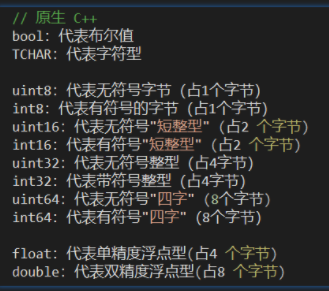

# 原生c++



# FName

常用作标识符等不变的字符串（如：资源路径/资源文件类型/骨骼名称/表格行名等）

比较字符串操作非常快
即使多个相同的字符串，也只在内存存储一份副本，避免了冗余的内存分配操作
不区分大小写

```c++

初始化：
FName TestHUDName = FName(TEXT("ThisIsMyTestFName"));

比较：
CompareFloat = TestFName.Compare(OtherFName);

搜索：
if( FName(TEXT("pelvis"), FNAME_Find) != NAME_None ){}

FString <-> FName
TestHUDName = FName(*TestHUDString);
TestHUDString = TestHUDName.ToString();
```

# FText

FText 是一种静态字符串，在UE4中可以负责处理文本本地化、UI 文本显示等

支持文本本地化
提高文本渲染的性能
较快的copy操作

```

FString <-> FText
TestHUDText = FText::FromString(TestHUDString);
TestHUDString = TestHUDText.ToString();

FName -> FText
TestHUDText = FText::FromName(TestHUDName);
```

# FString

```c++
初始化
FString str1("Hello!");
FString str2 = TEXT("Hello World!");
FString str3 = FString::Printf(TEXT("I am %d years old"), 18);

比较
if(MyFString.Equals(OtherFString, ESearchCase::CaseSensitive)){...} // 大小写敏感
if(MyFString.Equals(OtherFString, ESearchCase::IgnoreCase)){...}
if(MyFString == OtherFString){...}


拼接
FString str4 = TEXT("Hello World!");
str4 += FString("UE4");
float value = 1.0f;
FString str5 = FString::Printf(TEXT("Current Value: %f"),value);

分割
FString str6 = TEXT("Blueprint, C++, Material");
TArray<FString> strList;
str6.ParseIntoArray(strList, TEXT(","), true);


FString 与其他类型字符串转换

// FString -> int32/float
FString TheString = "233";
int32 MyShinyNewInt = FCString::Atoi(*TheString);

FString TheString = "233.3";
float MyStringtoFloat = FCString::Atof(*TheString);

// int32/float -> FString
FString NewString = FString::FromInt(233);
FString NewString = FString::SanitizeFloat(233.3f);

FString <-> TCHAR* 自动隐式转换
const FString MyFString;
const TCHAR *TCharString = *MyFString;
const FString MyFString=TCharString;

FString → char *
// 1
char *plainText= TCHAR_TO_ANSI(*str);

// 2
FString str
string t = TCHAR_TO_UTF8(*str);
char * returnvalue = (char *)malloc(sizeof(char) * (t.length() + 1));
strncpy_s(returnvalue, t.length() , t.c_str(), t.length());  

FString <-> std::string
// FString -> std::string
FString UE4Str = "Flowers";
std::string MyStdString(TCHAR_TO_UTF8(*UE4Str));

// std::string -> FString
std::string TestString = "Happy"; 
FString HappyString(TestString.c_str());

FString <-> TArray
// FString -> TArray<uint8>
FString JsonStr;  
TArray<uint8> content;  
content.SetNum(JsonStr.Len());  
memcpy(content.GetData(), TCHAR_TO_ANSI(*JsonStr), JsonStr.Len()); 

//TArray<uint8> ****-> FString 
TArray<uint8> content;  
const std::string cstr(reinterpret_cast<const char*>(content.GetData()), content.Num());  
FString frameAsFString = cstr.c_str();  
UE_LOG(VRSLog, Warning, TEXT("%s"), *frameAsFString);

FArrayReaderPtr -> FString
uint8 data[512];  
FMemory::Memzero(data, 512);  
FMemory::Memcpy(data, ArrayReaderPtr->GetData(), ArrayReaderPtr->Num());  
FString str = ((const char*)data);  

数值 -> std::to_string
std::string to_string( long value );
std::string to_string( long long value );
std::string to_string( unsigned value );
std::string to_string( unsigned long value );
std::string to_string( unsigned long long value );
std::string to_string( float value );
std::string to_string( double value );
std::string to_string( long double value );

std::string <-> std::wstring
WideCharToMultiByte
// std::wstring -> std::string
std::string WStringToString(const std::wstring wstr)
{
	std::string str;
	int len = WideCharToMultiByte(CP_UTF8, 0, wstr.c_str(), wstr.size(), NULL, 0, NULL,NULL);
	char*buffer = new char[len + 1];
	WideCharToMultiByte(CP_UTF8, 0, wstr.c_str(), wstr.size(), buffer, len, NULL, NULL);
	buffer[len] = '\0';
	str.append(buffer);
	delete[]buffer;
	return str;
}

//  std::string -> std::wstring
std::string str_path=TCHAR_TO_UTF8(*AppPath);
std::wstring wstr_path;
wstr_path.assign(str_path.begin(), str_path.end());
```

