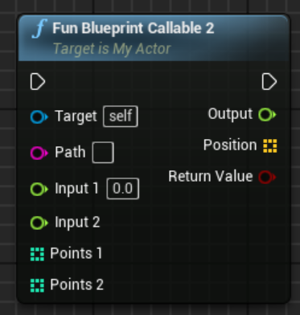
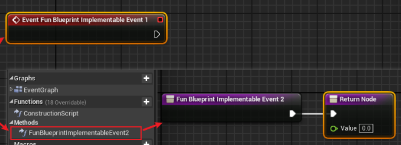
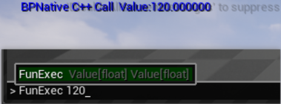

# UPROPERTY

## 位掩码bitmask


```c++
*//使用"bitflags"元标记来创建UENUM*
UENUM(BlueprintType, Meta = (Bitflags))
**enum** **class** **EColorBits** :uint8
{
	ECB_Red,
	ECB_Green,
	ECB_Blue,
};
//使用bitmask把EColorBits作为自己的位掩码
UPROPERTY(BlueprintReadWrite, EditAnywhere, Meta = (Bitmask, BitmaskEnum = "EColorBits"))
	int32 ColorFlags;
```

##  属性说明符

```c++
常用：

VisibleDefaultsOnly
// 仅在 Class Defaults 可见

VisibleInstanceOnly
// 仅在实例化 Detail 可见

VisibleAnywhere
//Class Defaults 和 实例化 Detail 可见

EditDefaultsOnly
//仅在 Class Defaults 可编辑

EditInstanceOnly
//仅在实例化 Detail 可编辑

EditAnywhere
//Class Defaults 和 实例化 Detail 可编辑

BlueprintReadOnly
//Variables 在蓝图只能get

BlueprintReadWrite
//Variables 在蓝图可get set

Category = “Top|Sub”
//用于分组

BlueprintAssignable
//蓝图中可绑定委托

```

## 元数据说明符meta

作用
声明类、接口、结构体、列举、列举值、函数，或属性时，可添加 元数据说明符 来控制其与引擎和编辑器各方面的相处方式。每一种类型的数据结构或成员都有自己的元数据说明符列表

```c++


DisplayName 别名
可以便于蓝图变量搜索，如果变量名不好记的话

UPROPERTY(EditAnywhere, meta = (DisplayName = "ContitionValue 控制 offset3"))
//在蓝图显示名字ContitionValue 控制 offset3
	int32 ContitionValue;


EditCondition 条件可编辑
支持bool、比较等条件判断

UPROPERTY(EditAnywhere, BlueprintReadWrite, meta = (EditCondition = "ContitionValue>0"))
//float Offset3在ContitionValue>0时EditAnywhere, BlueprintReadWrite
	float Offset3;


BindWidget 
和UMG 同名同类型控件绑定

UPROPERTY(EditAnywhere, meta = (BindWidget))
//和Canvas绑定
  UImage* TCanvas;


UMETA扩展宏
使用UMETA中的DisplayName，解决cpp meta里的中文在蓝图经常会乱码
UPROPERTY(EditAnywhere)
	FName ChineseName UMETA(DisplayName="中文名");

UPROPERTY(EditAnywhere)
	EColorBits1 FavoriteColorBits UMETA(DisplayName = "最喜欢的颜色")=EColorBits1::ECB_Blue;
```

# UFUNCTION

```c++
BlueprintCallable
//蓝图可调用
UFUNCTION(BlueprintCallable, Category = "methods")
	bool FunBlueprintCallable2(FString Path,float input1, const float& input2, float& output, TArray<int32> Points1, const TArray<int32>& Points2, TArray<FVector>& Position  );
//参数列表直接传引用 会用做蓝图节点的返回值，如图1所示

BlueprintPure
//蓝图纯函数（必须要有返回值）

BlueprintImplementableEvent 
//蓝图可实现事件(有无返回值表现不同,如图2所示)

BlueprintNativeEvent 
//蓝图原生事件
//C++中定义事件，C++和蓝图中都可以实现(C++必须实现)
//如果蓝图不实现,会执行C++的函数实现
//如果蓝图和C++都实现,蓝图则会覆盖C++实现，只执行蓝图实现.
//C++函数实现,需要额外定义一个名为:函数名+_Implementation的返回值和参数列表都一致的函数.
//BlueprintNativeEvent需要配合BlueprintCallable一起使用,否则蓝图中不可调用
//有返回值和无返回值 表现形式有所区别

UFUNCTION(BlueprintNativeEvent, BlueprintCallable, Category = "methods", meta=(DisplayName="FunBlueprintNativeEvent测试",DeprecatedFunction, DeprecationMessage = "This FunBlueprintNativeEvent 的测试."))
	void FunBlueprintNativeEvent(const FString& str="From C++");

void AMyActor::FunBlueprintNativeEvent_Implementation(const FString& str)
{
	GEngine->AddOnScreenDebugMessage(-1, 1.0f, FColor::Blue, str);

UFUNCTION(Exec, Category = "methods")
	void FunExec(float Value);
void AMyPawn::FunExec(float Value)
{
	GEngine->AddOnScreenDebugMessage(-1, 1.0f, FColor::Blue, FString::Printf(TEXT("BPNative C++ Call  Value:%f"), Value));
}
//如图三所示

meta说明符

ExpandEnumAsExecs
//创建蓝图执行引脚，配合blueprintCallable使用
UFUNCTION(BlueprintCallable, Category = "methods", Meta = (ExpandEnumAsExecs = "Branches"))
		void FunExpandEnumAsExecs(int32 Input, BranchOutput& Branches);


WorldContext 
获取当前世界
UFUNCTION(BlueprintCallable, meta = (WorldContext = "WorldContextObject"), Category = "MyBPAsyncAction")
		static UMyBPAsyncAction* AsyncCountdown(UObject* WorldContextObject, AAsyncTickActor* AsyncTickActor, int32 StartNum);

```







Exec控制台可调函数
Exec命令仅在特定类中声明时才产生作用。包括：
Pawns,
Player Controllers,
Player Input,
Cheat Managers,
Game Modes,
Game Instances,
overriden Game Engine classes,
Huds