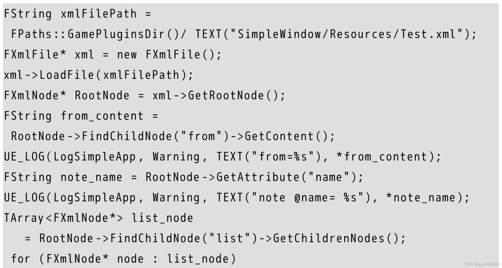
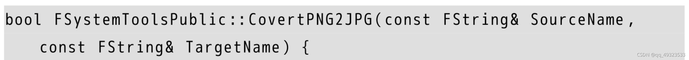

# 五个基类

## UObject

提供了以下功能：

1. Garbage collection
   问题：一个A对象可能被多个其他对象引用，由于不清楚被多少个对象引用，在A不需要使用的时候，该不该释放内存（释放->可能产生野指针，不释放->一旦丢弃这个指针，可能A的内存无法回收）
   解决：(1)继承自UObject类，且指向UObject类实例对象的指针成员变量，使用UPROPERTY宏进行标记，此类变量会被放进垃圾回收系统中，自动进行对象生命周期的管理。(2)非UObject，使用智能指针(shared_ptr)
2. Reference updating
3. Reflection
4. Serialization(序列化)
5. Automatic updating of default property(变量) changes
6. Automatic property initialization
7. Automatic editor integration(和虚幻编辑器的自动交互)
8. Type information available at runtime
   虚幻引擎打开了/GR-编译器参数，无法使用C++标准的RTTI机制：dynamic_cast。希望使用时需要继承自UObject类，然后用Cast<>函数完成。
9. Network replication
   继承自UObject类，其被宏标记的变量能自动完成网络复制的功能。（c/s架构）从服务端复制变量到客户端。

## Actor

能力：能够挂载组件（UComponent）
↓↓↓
Scene Component：坐标和旋转量
静态网格体组件：Actor被渲染
Movement Component：移动

## Pawn

棋子。可以被Controller操纵

## Controller

棋手，操纵Pawn的行为
AI Controller：行为树/EQS
Player Controller：绑定输入，转化成对Pawn的指令。通过Posses/UnPosses来控制or解除控制。

## Character

继承自Pawn类，多了一个Character Movement组件。

# 常见前缀

1. F- 纯c++类
2. U- 继承自UObject
3. A- 继承自Actor
4. S- Slate控件相关类
5. H- HitResult相关类
   Unreal Header Tool 会在编译前检查类名，如果有错则警告并停止编译。

# 对象

## 类对象的产生

在c++中，通过new关键字，一个类产生一个对象，被称为“实例化”。
在ue中有三种情况：

1. 如果类时纯c++类型（F开头），可以new。
2. 如果类继承自UObject，但不继承自Actor，用NewObject函数产生对象。

```cpp
NewObject<T>()
```

1. 如果类继承自AActor，用SpawnActor函数产生对象。

```cpp
GetWorld()->SpawnActor<AYourActorClass>()
```

1. 如果要产生一个Slate类，用SNew函数。（旧版）

## 类对象的获取

获取一个类对象的唯一方法，就是通过某种方法传递到这个对象的指针或者引用。
特别地，获取一个场景中某个Actor的全部实例，借助Actor迭代器：TActorIterator

```cpp
for(TActorIterator<AActor> Iterator(GetWorld());Iterator;++Iterator)
{
	//do something
}
```

获取指向实际对象的指针

```cpp
*Iterator
```

调用需要的成员函数

```cpp
Iterator->YourFunction();
```

## 类对象的销毁

1. 纯c++类，非new分配内存
   函数调用后自动释放类的对象。
2. 纯c++类，new分配内存，而且直接传递类的指针
   除非手动删除，否则这一块内存永远不会释放。
3. 纯c++类，new分配内存，且用TSharedPtr/TShared+Ref来进行管理
   此时类对象会由智能指针引用计数来自动释放内存

```cpp
//用MakeShareable把普通指针转换成智能指针
TSharedPtr<YourClass> YourClassPtr = MakeShareable(new YourClass());
```

1. UObject类，自带垃圾回收机制。当一个类的成员变量包含指向UObject的对象，同时又带有UPROPERTY宏定义，这个成员变量将触发引用计数机制。
   垃圾回收器会定期从根结点Root开始检查，当一个UObject没有被别的任何UObject引用，就会被垃圾回收。可以通过AddToRoot函数让一个UObject一直不被回收。
2. Actor类，可调用Destory函数请求销毁，仅从世界中销毁，内存的回收仍然由系统决定。

# 从c++到蓝图

1. 把一个变量注册到蓝图中

```cpp
UPROPERTY(BlueprintReadWrite,...)
```

1. 把一个函数注册到蓝图中

```cpp
UFUNCTION(BlueprintCallable,...)//蓝图可调用
// BlueprintImplementEvent 成员函数由蓝图子类函数实现，不该在c++给出函数的实现
// BlueprintNativeEvent 这个成员函数提供一个默认的实现，可以被蓝图重载。需要一个"函数名_Implement"为名字的函数实现，放在.cpp中
```

# 游戏性框架概述

## 行为树

### 节点（3种类型）

1. 流程控制：
   1). Selector（选择器）：从左到右执行子树，有一个返回True则返回True，所有子树都返回False，才返回False。类似或门(Y=A+B+C…)。
   终止性：有一个成功则返回成功，后续子树不需要再进行。
   优先级：优先级高的子树False时才考虑下一个子树。
   2). Sequence(顺序执行器)：逐个执行子树，所有子树返回True，才向上级返回True。有一个返回False，则上级返回False。类似与门(Y=A*B*C…)。
   顺序性：依次执行子树直到子树False 或者 运行完所有子树返回True。
2. 装饰器：对子树返回的结果进行处理的节点。
   1). Force Success节点：强制让子树返回True
3. 执行节点：必须是叶子节点，执行任务，一段时间后根据任务成功与否返回True or False
   
   通过这个行为树，我们会发现，在某个状况下，这个AI会按照这样的方式执行：
   （1）首先进入准备阶段：
   a.刷牙。
   b.洗脸。
   （2）准备阶段完成，开始准备去上班：
   a.看看地铁能不能坐：
   （a） 走到地铁站，发现地铁因为修理被关闭。
   （b）返回false（回到家中）。
   b.选择开车方案：
   （a） 开车出门。
   （b）返回true，顺利到达上班地点。
   c.交通阶段完成，开始上楼：
   （a） 尝试电梯，发现电梯坏掉了，返回false。
   （b）尝试走楼梯，终于到达了办公室。

# 网络架构

客户端-服务器模型：客户端是对服务端的拙劣模仿。由于延迟的客观存在，客户端根据同步数据时当前对象的位置和速度，加上发送的时间来预测当前对象在服务器可能的位置。并通过修正当前世界去模仿服务端的位置，如果差距太大就强行闪现修正。

# 引擎系统相关类

## 在UE4中使用正则表达式

```cpp
#include "Regex.h"
FString TextStr("ABCDEFGHIJK");
FRegexPattern TextPattern(TEXT("C.+H"));//构造正则表达式(CDEFGH)
FRegexMatcher TextMatcher(TextPattern,TextStr);//驱动正则表达式运行，提供查找起始位置，查找结束位置，设置查找区间等功能
if(TextMatcher.FindNext())//是否找到匹配表达式的内容
{
	UE_LOG(MyLog,Warning,TEXT("找到匹配的内容%d-%d"),TextMatcher.GetMatchBeginning(),TextMatcher.GetMatchEnding());//输出匹配内容C-H
}
```

## FPaths类的使用

1. 具体路径类：如FPaths::GameDir()可以获取到游戏根目录。
2. 工具类：如FPaths::FileExists()用于判断一个文件是否存在。
3. 路径转换类：如：FPaths::ConvertRelativePathToFull()用于将相对路径转换为绝对路径。

## XML & JSON

### XML

创建一个XML文件，示例如下：

解析XML代码如下：


### JSON

JSON解析要用到JSON模块以及 include"Json.h"，使用示例如下：


# 文件读写与访问

## FPlatformFileManger

读写文件的访问接口

```cpp
#include "PlatformFileManger.h"
FPlatformFileManger::Get()->GetPlatformFile();
```

1. 拷贝函数
   CopyDirectoryTree 递归拷贝某个目录
   CopyFile 拷贝当前文件
2. 创建函数
   CreateDirectory 创建目录
   CreateDirectoryTree 创建目录树（路径字符串）
3. 删除函数
   DeleteDirectory 删除指定目录
   DeleteDirectoryRecursively 递归删除指定目录
   DeleteFile 删除指定文件
4. 移动函数
   MoveFile 用于移动文件
5. 属性函数
   DirectoryExists 检查目录是否存在
   FileExists 检查文件是否存在
   GetStateData 获取文件状态信息
   GetAccessTimeStamp 获取当前文件上次访问的时间
   SetTimeStamp 设置文件修改的时间
   FileSize 获取文件大小
   IsReadOnly 文件是否只读
6. 遍历函数
   IterateDirectory 遍历某个目录
   IteratoryDirectoryRecursively 递归遍历某个目录
   IterateDirectoryStatRecursively 同上，递归遍历
7. 读写函数
   OpenRead 打开一个文件用于读取
   OpenWrite 打开一个文件用于写入
   LoadFileToArray 直接路径指定的文件读取到一个TArray类型的二进制数组中
   LoadFileToString 直接路径指定的文件读取到一个FString类型的字符串中
   SaveArrayToFile 保存一个二进制数组到文件中
   SaveStringToFile 保存一个字符串到文件中
   CreateBitmap 在硬件中创建一个BMP文件
   LoadANSITextFileToStrings 读取一个ANSI编码的文本文件到一个字符串数组中，每行对应一个FString类型的对象

## GConfig类

专门读写配置文件的类

1. 写配置
   SetString SetInt SetBool SetFloat
   示例：四个参数分别是：组别，配置的key，具体的值，配置文件的路径
   
2. 读配置
   GetString GetInt …Get系列
   示例：注意第三个参数从具体的值变成一个变量的引用
   
   如果要马上把配置操作值写入文件，调用g->Flush()。

## UE_LOG

作用：记录程序运行过程中函数调用的过程，参与运算的数据信息，反馈错误。
查看Log： Game模式：在启动参数后加-log。编辑器模式：Window->Developer Tools->Output Log
使用Log：

```cpp
UE_LOG(MyLog,Log,TEXT("Hello World"));
UE_LOG(MyLog,Warning,TEXT("Hello World"));
UE_LOG(MyLog,Error,TEXT("Hello World"));
```

自定义Log分类：

```cpp
DEFINE_LOG_CATEGORY_STATIC(LogMyCategory,Warning,All);
```

## 字符串的处理

FName（无法修改，大小写不敏感，哈希表唯一存储）,FString（唯一提供修改的字符串类）,FText（要显示的字符串）三者可以相互转换。

## 废弃函数的标记

ue的废弃函数在被调用的时候才会输出。VS宏定义使用__declspec 关键字，输出使用deprecated关键字。

## 编译器指令实现跨平台

多态：存在一个基类，定义了抽象的接口，独立于操作系统存在。每个操作系统的对应版本继承自这个基类，然后做出自己的实现。
编译期跨平台方案：准备多个平台的实现，通过宏定义切换平台。
通用类：FPlatformMisc Linux：FLinuxPlatformMisc
跨平台方法：typedef FLuminPlatformMisc FPlatformMisc

## images

ImageWrapper作为UE所有图像类的抽象层

> 图片压缩后的数据称为CompressedData
> 图片未压缩的RGBA数据称为RawData
> 所有图片都可以被抽象为上面两种数据的组合

- 读取JPG

1. 读取为Tarray二进制数据
2. 用SetCompressData填充为压缩数据
3. 用GetRawData获取RGB数据

- PNG转换为JPG

1. 读取为Tarray二进制数据
2. 用SetCompressData填充为压缩数据
3. 用GetRawData获取RGB数据
4. 将RGB数据填充到JPG类型的ImageWrapper中
5. 用GetCompressData获得压缩后的JPG数据
6. 用FFileHelperi写到文件中

转换案例：



- 读取硬盘中的贴图

1. 读取图片文件到二进制数组，获取图片压缩后的数据
2. 用ImageWrapper的GetRaw转换成原始的RGB格式
3. 填充原始的RGB数据到UTexture数据中
   示例如下：
   
   
   

## 模块机制

一个模块文件夹应包含Public，Private，.build.cs文件

### 创建新的模块

1. 创建模块文件夹结构
2. 创建模块构建文件.build.cs
3. 创建模块头文件与实现文件
4. 创建模块预编译头文件PrivatePHC.h
5. 创建模块的c++声明和定义

### 快速完成模块创建

这种方法不考虑模块的加载和卸载，不考虑接口的公开和隐藏
在source文件夹下添加如下文件结构：


各文件对应内容如下：

1. .build.cs
   
2. .h
3. .cpp

### 创建标准模块结构

以pluginDev为例：


pluginDev.Build.cs

pluginDev.h

pluginDev.cpp


### 引入模块

游戏模块：Source->工程名.Target.cs

插件模块：插件名.uplugin


### 模块加载的顺序

1. 加载PlatformFileModule读取文件
2. 加载核心模块FengineLoop::PreInit->LoadCoreModules
3. 加载CoreUObject
4. 初始化引擎前加载FEngineLoop::LoadPreInitModules
5. 加载Engine
6. 加载Renderer
7. 加载AnimGraphRuntime

### UBT

Unreal Build Tool
三个工作阶段：
收集阶段：收集信息。UBT收集环境变量、虚幻引擎源代码目录、虚幻引擎目录、工程目录等一系列的信息。
参数解析阶段：UBT解析传入的命令行参数，确定自己需要生成的目标类型。
实际生成阶段：UBT根据环境和参数，开始生成makefile，确定C++的各种目录的位置。最终开始构建整个项目。此时编译工作交给标准C++编译器。
同时UBT也负责监视是否需要热加载。并且调用UHT收集各个模块的信息。

### UHT

Unreal Header Tool

- 能编译引擎却依赖引擎
  UBT通过命令行参数告诉UHT游戏模块对应的定义文件在哪里，然后UHT开始三次编译：Public Classes Headers，Public Headers，Private Headers，最终生成.generated.cpp和generated.h文件
- 反射机制
  更新记录被UPROPERTY or UFUNCTION标记的信息
- 加载信息

> 静态全局变量的初始化先于main函数的执行

在.generated.cpp中有一个宏

```cpp
IMPLEMENT_CLASS
```

这个宏

1. 声明了一个具有独一无二名字的UClassCompiledInDefer<当前类名>静态全局变量实例，可以在main函数之前执行。
2. 实现了当前类的GetPrivateStaticClass函数。

# core系统

## 内存分配

采用TBB内存分配，主要是出于以下的原因：
（1）虚幻引擎工作在多个线程，而标准内存分配为了避免出现内存分配BUG，是强制同一时间只有一个线程分配内存。导致内存分配的速度大幅度降低。
（2）缓存命中问题。CPU中存在高速缓存，而同一个缓存，一次只能被一个线程访问。
Intel TBB提供了scalable_allocator（ue主要使用）：不在同一个内存池中分配内存，解决由于多线程竞争带来的无谓消耗；cache_aligned_allocator：通过缓存对齐，避免假共享。

## 引擎初始化

两个过程 ：

1. PreInit ：
   带有参数CmdLine，能够获得传入的命令行字符串
   设置路径：当前程序路径，当前工作目录路径，游戏的工程路径
   设置标准输出：设置GLog系统的输出的设备，是输出到命令行还是何处
   初始化一部分系统：初始化游戏主线程GameThread；初始化随机数系统；初始化TaskGraph任务系统，按照当前核心数量设置TaskGraph的工作线程数量。
   判断游戏启动模式：游戏模式 or 服务器模式
   调用LoadCoreModules
   调用PreInitModules
   调用AppInit函数
2. Init：加载到内存的模块，如果有PostEngineInit函数的，都会调用初始化。
3. 主循环：

```cpp
while(!GIsRequestingExit)
{
	EngineTick();
}
```

引擎的Tick按照以下的顺序来更新引擎中的各个状态：
□ 更新控制台变量。这些控制台变量可以使用控制台直接设置。
□ 请求渲染线程更新当前帧率文字。
□ 更新当前应用程序的时间，也就是App：：DeltaTime。
□ 更新内存分配器的状态。
□ 请求渲染线程刷新当前的一些底层绘制资源。
□ 等待Slate程序的输入状态捕获完成。
□ 更新GEngine，调用GEngine->Tick。
□ 假如现在有个视频正在播放，需要等待视频播放完。之所以在GEngine之后等待，是因为GEngine会调用用户的代码，此时用户有可能会请求播放一个视频。
□ 更新SlateApplication。
□ 更新RHI。
□ 收集下一帧需要清理的UObject对象。

## Automation System

ue中的并行和并发
在模块文件夹创建如下文件：
Test.cpp
编译保存后回到ue编辑器 Developer Tools->Session Frontend->勾选对应的白框
就可以在Message Output得到一行输出，这种方式可以快速测试代码。

## 线程

FRunnable对象，多线程异步执行示例如下：

这里声明了一个继承自FRunnable的类，并实现了三个函数Init，Run，Exit，分别放置初始化代码，运行代码，运行退出的清理工作。
启动线程借用FRunnableThread::create(FRunnable对象,线程名字)。

## TaskGraph系统

对线程复用实现的系统，原理：将指令和数据打包交给TaskGraph，当有空闲的线程，就会取出其中的Task执行


Task Graph由于采用的是模板匹配，因此并不需要每个Task继承自一个指定的类，而是只要具有指定的几个函数，就能够让模板编译通过。这些函数就是：
□ GetTaskName：静态函数，返回当前Task的名字。
□ GetStatId：静态函数，返回当前Task的ID记录类型，你可以借助RETURN_QUICK_DECLARE_CYCLE_STAT宏快速定义一个并返回。
□ GetDesiredThread：可以指定这个Task是在哪个线程执行，关于可选项有哪些，可以查看ENamedThreads：：Type。
□ GetSubsequentsMode：这是Task Graph用来进行依赖检查的前置标记，可选包括Track Subsequents和Fire And Forget两个选项。前者表示这个Task有可能是某个其他Task的前置条件，所以Task Graph系统会反复检查这个Task有没有执行完成。后者表示一旦开始就不用去管了，直到执行完毕。也就不能作为其他Task的前置条件。
□ DoTask：最重要的函数，里面是这个Task的执行代码。
而启动一个Task的方式是这样的：

这里的0是构造函数里的ID，运行发现代码在其他存在线程执行，而非创建一个新的线程。

## Std::Thread

c++自带多线程


## 线程同步系统

ue的线程同步系统是分层级的
最低层包括：FCriticalSection临界区，有一对Lock Unlock操作原语
ue中更先进的线程同步方式，包括

1. 投递Task到另一个线程TaskGraph中执行
2. 使用TFuture，TPromise。
3. 在2的基础上使用Asyne模板`auto Result = Async()EAsyncExecution::Thread,{return 123;}`
   返回值是一个TFuture对象。

## 多进程

虚幻引擎同样提供了对进程的封装。在Core模块的GenericPlatformProcess中，可以看到FGenericPlatformProcess类的定义。其提供的CreateProc静态函数能够根据提供的URL启动一个进程，返回FProcHandle类型的进程句柄，并通过管道的形式进行数据交换。

# 对象模型

## UObject对象

产生：`NewObject<T>`,不能直接new产生。


销毁：垃圾回收系统自动回收。

## 序列化

序列化是指将一个对象变成更易保存的形式，写入到持久储存中。
反序列化是指将一个数据从持久储存中读取出来，然后还原原先的对象。
UObject的序列化和反序列化都对应函数Serialize

反序列化的框架：

1. 实例化一个对象之后，传递一个FArchive参数调用反序列化函数
2. 通过GetClass函数获取当前的类信息，通过GetOuter函数获取Outer。这个Outer实际上指定了当前UObject会被作为哪一个对象的子对象进行序列化。
3. 判断当前等待序列化的对象的类UClass的信息是否被载入，没有的话：
   a.预载入当前的类信息；
   b.预载入当前类的默认对象CDO的信息。
4. 载入名字。
5. 载入Outer。
6. 载入当前对象的类信息，保存于ObjClass对象中。
7. 载入对象的所有脚本成员变量信息。这一步必须在类信息加载后，否则无法根据类信息获得有哪些脚本成员变量需要加载。对应函数为SerializeScriptProperties。a.调用FArchive：：MarkScriptSerializationStart函数，标记脚本数据序列化开始；b.调用ObjClass对象的SerializeTaggedProperties，载入脚本定义的成员变量；c.调用MarkScriptSerializationEnd标记脚本数据序列化结束。

ue序列化每个子类不会多次序列化其父类，而是只序列化一份父类，然后序列化子类的差异。而对于自定义类型的序列化，是由序列化类解决的。

### UPackage

主要概念：
UPackage
UObject 这里主要指UPackage中等待被序列化的对象。
UClass 等待被序列化对象对应的类。
UProperty 被UClass持有，存储这个类的属性（成员变量）信息。
FLinkerLoad 继承自FArchive，负责作为“豆腐”处理序列化和反序列化的过程。
CDO （Class Default Object）类默认对象。一个类会在内存中放置一个默认对象，包含默认值。

反序列化
序列化必要的，差异性的数据：被UPROPERTY标记才会被序列化or反序列化
先模塑对象，再还原数据：被模塑的对象会成为其他对象修正指针的基础
对象具有所属关系：由NewObject指定的Outer负责序列化和反序列化
鸭子理论：叫起来像鸭子，看起来像鸭子，动起来像鸭子，那就是鸭子。也就是说，如果一个对象的所有成员变量与原始对象一致（指针的值可以不同，但指向的对象要一致），则该对象就是原始对象。

## 释放与消亡

UObject销毁需要手动请求ConditionalBeginDestroy。，然后引擎在适当时机销毁之。
一般垃圾回收器会触发销毁，执行析构和回收内存

## 垃圾回收算法

引用计数算法：👍在运行中逐个清理垃圾，👎指针计数开销大，环形引用无法判断
标记-清扫算法：👍解决了环形引用，👎暂停后大扫除，延迟大；丢垃圾不整理会出现内存碎片
ue中使用引用计数算法：智能指针系统，弱指针方案解决环形引用
特点：精确式GC、追踪式GC,没有搬迁对象，非实时，渐进式


## Actor对象

产生：`UWorld::SpawnActor<T>`
销毁：垃圾回收系统自动回收

- SpawnActor：
  构造Actor之前的处理：主要是三个内容：检查、获取Actor的模板Template，根据ESpawnActorCollisionHandlingMethod确定是否生成。

1. 检查：借助HasAnyClassFlags函数Flag检查：当前类是否被废弃，当前类是否是抽象类，当前类是否真的继承自Actor，传递的Actor的模板是否和当前Actor类型对应，是否在构造函数中创建Actor等。
2. 模板：Actor的模塑基础。虚幻引擎允许原型式模塑Actor对象，即从一个已有对象中模塑出一个新的一模一样的对象，而非从类中模塑。如果没有提供模板，当前Actor所属类的CDO将会作为模板。
3. 碰撞处理：使用蓝图生成Actor的读者都应该知道，其需要提供一个**ESpawn-ActorCollisionHandlingMethod**枚举值，用来指定当生成的Actor位置存在碰撞的情况应该如何处理。这里就会根据提供的值进行处理：**SpawnParameters.bNoFail** 特殊标记值，该标记放于SpawnParameters中，如果设置为真，则忽略所有的碰撞处理，强制生成。**DontSpawnIfColliding** 在指定位置检测是否有几何碰撞，如果有就放弃生成对象。其他的处理方式，留到生成Actor后进行。

构造Actor后的处理：两个步骤：注册Actor和初始化Actor。

1. 添加Actor到当前关卡的Actor列表中。
2. 调用PostSpawnInitialize函数。
   **a**.获取Acor的root并计算位置
   **b**.调用**DispatchOnComponentsCreated**函数，从而调用**CreateDe-faultSubobject**函数构造出来的组件的OnComponentCreated函数。
   **c**.通过**RegisterAllComponents**注册所有的Actor组件。实质上调用组件的**Reg-isterComponent**函数。所以，如果动态生成和添加组件，务必自己手动调用该函数以注册。
   **d**.设置当前Actor的Owner。
   **e**.调用**PostActorCreated**函数，通知当前Actor已经生成完成。
   **f**.调用**FinishSpawning**函数:（a） 调用ExecuteConstruction函数。如果当前Actor继承自蓝图Actor类，此时会拉出所有的蓝图父类串成一串，然后从上往下调用蓝图构造函数（此时顺便也会把Timeline组件生成出来）。最后调用用户在蓝图定义的构造函数脚本.（b）调用虚函数OnConstruction，通知C++层，当前脚本构造已经完成。开发者可以重载该函数，介入这一过程。
   **g**.调用PostActorConstruction函数，该函数主要处理了组件的初始化过程。（a） 调用PreInitializeComponents函数。对于Actor来说，这里只处理一件事情：如果当前Actor需要自动获取输入，则试图获取当前PlayerController，然后启用输入；如果当前PlayerController不存在，则调用当前Level的RegisterActorForAutoReceiveInput以启用输入。该函数可以被重载以实现自己的逻辑。（b）调用InitializeComponents，实质是遍历当前所有的组件，调用其Initial-izeComponent函数以通知初始化。这也是一个通知函数，开发者可以重载该函数以实现自己的初始化。父类只是简单设置bHasBeenInitialized为真。（c） 根据前文提到的碰撞处理方式，对当前Actor的位置进行处理。（d）调用PostInitializeComponents。对于Actor类来说，这里只是设置bAc-torInitialized为真，顺便向寻路系统注册自己，然后调用UpdateAllRepli-catedComponents函数。这个函数同样可以重载以实现自己的逻辑。（e） 调用著名的BeginPlay函数。这是这个Actor的第一声“啼哭”，即第一次Tick。接下来这个Actor将会进入自己的Tick循环。

### 加载

Actor作为UObject的子类，加载的前半部分依然遵循UObject的加载过程，Actor只会调用自己的PostLoad函数做处理。Children数组被标记为了transient，不会参与到序列化中。
游戏世界的初始化过程：

1. UWorld：：InitializeActorsForPlay 该函数依序调用以下函数：
   (1). UWorld：：UpdateWorldComponents 添加属于世界（但是不属于任何Actor）的组件，例如绘制线条用的PersistentLineBatcher等。同时如果有其他的子关卡，这里开始更新子关卡的组件。
   (2).GEngine->SpawnServerActors 根据服务端的Actor信息，在本地生成对应Actor。
   (3).AGameMode：：InitGame 调用当前游戏模式的初始化函数。
   (4).ULevel：：RouteActorInitialize 遍历所有关卡，对Actor进行初始化。此时需要进行的仅仅是通知初始化。故该函数遍历关卡中的所有Actor，执行顺序如下：
   AActor::PreInitializeComponents
   AActor::InitializeComponents
   AActor::PostInitializeComponents
   AActor::BeginPlay
   (5).ULevel：：SortActorList 对所有关卡（包括子关卡）的Actor对象进行排序整理。这里是针对网络设计的，将Actor按照是否需要网络同步，放入对应数组进行整理。
   (6).UNavigationSystem：：OnInitializeActors 通知寻路系统开始初始化。
   (7).UAISystem：：InitializeActorsForPlay 通知AI系统初始化。

> 希望在Actor生成的时候触发，但不希望在Actor加载的时候触发，可以重载PostActorCreated这类函数。
> 希望Actor在加载的时候触发，可以重载PostLoad函数。
> 希望均触发，可以重载BeginPlay函数。

### 释放与消亡

手动请求Destroy来销毁Actor的过程如下：

1. **UWorld：：DestroyActor** Actor的Destroy函数只是一个辅助函数，实际上是请求当前世界来摧毁自己。该函数完成：
   **Actor：：Destroyed** 调用该函数通知本Actor已经被摧毁。虽然这个Actor尚未被垃圾回收，但是在这一步发送通知，意味着在此之后不能再访问本Actor。这里也会在网络上通知本Actor被摧毁。
   **取消绑定子Actor** 虽然父级Actor被删除了，但是子Actor不应当被同样删除，因此需要从父级Actor上取消绑定。
   **Actor：：SetOwner（NULL）** 将Actor的Owner设置为空，不再参与服务器同步。
   **UWorld：：RemoveActor** 从当前世界的Actor列表中移除当前Actor。
   **Actor：：UnregisterAllComponents** 通知所有的组件，从世界中取消注册。
   **Actor：：MarkPendingKill** 设置PendingKill这个标记，表示当前UObject需要被删除。
   **Actor：：MarkPackageDirty** 设置最外侧的Package为Dirty。
   **Actor：：MarkComponentsAsPendingKill** 对当前Actor的所有子组件添加Pend-ingKill。
   **Actor：：RegisterAllActorTickFunctions** 取消注册所有的Actor Tick函数。
   **触发垃圾回收** 当下一次垃圾回收过程开始的时候，会检测到这个Actor已经没有任何引用（已经从ULevel的ActorList中被取下），且被设置为PendingKill。于是进入到UObject的垃圾回收流程。

# 渲染系统

## 渲染线程的启动

虚幻引擎在FEngineLoop：：PreInit中对渲染线程进行初始化。具体的位置是在StartRen-deringThread函数里面。
渲染线程的启动位于StartRenderingThread全局函数中。大致来说，这个函数执行了以下内容：
（1）创建渲染线程类实例。
（2）通过FRunnableThread：：Create函数创建渲染线程。
（3）等待渲染线程准备好从自己的TaskGraph取出任务并执行。
（4）注册渲染线程。
（5）创建渲染线程心跳更新线程。

## 渲染线程的运行

渲染线程的主要执行内容在全局函数RenderingThreadMain中。游戏线程会借助EQUEUE_Render_COMMAND系列宏，向渲染线程的TaskMap中添加渲染任务。渲染线程则不断提取这些任务添加到RHI命令列表中，由RHI取出线程向GPU发送去执行。

## 渲染架构

### 延迟渲染

UE对非透明物体的渲染方式是延迟渲染。
UE对透明物体的渲染方式是前向渲染。
延迟渲染则是将“光照渲染”延迟进行。每次渲染，将会把物体的BaseColor（基础颜色）、粗糙度、表面法线、像素深度等分别渲染成图片，然后根据这几张图，再逐个计算光照。
👍节省光照的计算量，👎半透明物体无法被渲染。
面对半透明物体先进行延迟光照计算，再进行深度排序

### 渲染过程


1. 可见性剔除
   剔除过程分为三步：预设置可见性，可见性计算，完成可见性计算。
   **预设置可见性** 对应函数为PreVisibilityFrameSetup。该函数主要执行以下内容：
   （1）根据当前的画质设置，设置TemporalAA的采样方式，确定采样位置。
   （2）设置视口矩阵，包括视口投影矩阵和转换矩阵。
2. 可见性计算
   可见性计算对应的函数是ComputViewVisibility，主要执行以下内容：
   （1）初始化视口的一系列用于可视化检测的缓存区。
   （2）排除特殊情况，大多数情况下视口都使用平截头体剔除。对应的是模板函数FrustumCull。该函数内部使用了ParallelFor函数来进行并行化的异步剔除。

> 所谓平截头体剔除就是，摄像机视口的远近平面构成了一个类似梯台的体积，在该体积内的对象会被保留，在该体积外的对象的可视化检测缓冲区对应的比特位就会被设置为0，表示不会被看见。

（3）剔除过小的线框，以加速整体的性能。如果在线框模式下，此时所有的非线框也会被剔除掉。
（4）非线框模式下，对视口范围内的被遮挡物进行剔除
（5）根据所有的可见性位图，设置每个需要渲染的对象的可见性状况
（6）给每个对象返回是否可见的机会
（7）获取所有动态对象的渲染信息，对应函数是每个RenderProxy的Get-DynamicMeshElements函数。
\3. 完成可见性计算
对应的函数为PostVisibilityFrameSetup
（1）对半透明的物体进行排序，从后往前渲染。
（2）对每个光照确定当前光照可见的对象列表，同样使用平截头体剔除。
（3）初始化雾和大气的常量值，完成对阴影的计算
\4. PrePass预处理阶段
目的是降低BasePass的渲染工作量
是否执行取决于NeedPrePass函数的返回结果：只有不是基于分块的GPU和EarlyZPassMode的参数不为DDM_None（或GEarlyZPassMovable!=0）两者同时满足才会进行PrePass计算。

预处理的工作步骤：
（1）设置渲染状态SetupPrePassView
（2）渲染三个绘制列表 ：PositionOnlyDepthDrawList DepthDrawList MaskedDepthDrawList
（3）绘制动态的预处理阶段对象 ShouldUseAsOccluder函数询问Render Proxy是否是遮挡物或者可移动
（4）绘制可视对象 对于静态网格体是以TStaticMeshDrawList为单位成批绘制的
每个列表公用以下着色器状态：
顶点描述Vertex Declaration
顶点着色器Vertex Shader
壳着色器Hull Shader
域着色器Domain Shader
像素着色器Pixel Shader
几何着色器Geometry Shader

（5）载入公共着色器信息
SetBoundShaderState载入需要的着色器
SetSharedState 对比较有代表性的TBasePass而言，是设置顶点着色器和像素着色器的参数。如果是透明物体，即透明度设置为Additive、Translucent、Modulate，会在此时再次设置混合模式。
（6）逐元素渲染 元素是BatchElement
（7）BasePass将对象的光照信息写入缓存区
（8）设置渲染视口
（9）渲染动态数据
（10）RenderOcclusion 渲染遮挡 尽量剔除屏幕内被遮挡的对象
（11）光照渲染 RenderLights

## 场景代理SceneProxy

会根据对象信息更新渲染信息

```cpp
virtual FPrimitiveSceneProxy*CreateSceneProxy()
```

可重载.

## 创建新的渲染代理

三个函数：
（1）GetMemoryFootprint：跟踪分配内存
（2）GetDynamicMeshElement：收集动态元素时调用
（3）GetViewRelevance：根据传入View判断对象是否可见
示例如下：
.h

.cpp


## Shader

### Shader的创建

Source->Plugins->ShaderTest->Source->ShaderTest->ShaderTest.build.cs


ShaderTest.h

```cpp
#include "Engine.h"
```

ShaderTest.cpp

```cpp
#include "ShaderTest.h"
IMPLEMENT_PRIMARY_GAME_MODULE(FDefaultGameModuleImpl,ShaderTest,"ShaderTest");
```

在Moudule中增加对ShaderTest的引用

```cpp
{
	"Name":"ShaderTest",
	"Type":"Runtime",
	"LoadingPhase":"PostConfigInit"
}
```

## 定义Shader

测试案例：


定义Shader对应的c++

代码包括这些层级：

1. Shader层： 我们的usf文件。
2. Shader包裹层（FTestShader）： 我们的C++类，提供了与Shader进行交互的诸多功能，比如设置Shader的参数。
3. Shader操作层： 可以直接写在单元测试中，也可以被封装为一个单独的类。

- Shader包裹层，可以看作以下三段：
  **Shader变量声明与定义** 这里的变量声明与定义与我们usf文件中的内容是匹配的。
  **顶点结构描述** 在OpenGL和DirectX中，都允许你自己定义顶点包含的数据，而不是规定顶点具体包含哪些信息。例如顶点法线方向、顶点颜色，甚至你可以定义第二套UV。
  **Shader着色器描述** 由于我们的着色器有两个部分：顶点着色器和像素着色器。因此，对应的代码也分为以下两个类：
  **顶点着色器** 顶点着色器部分我们十分简单地用了一个默认定义，因为实际上我们也没有对顶点着色器内容进行任何多余的规定。
  **像素着色器** 像素着色器部分则更加复杂一些。有一个参数StartColor
- Shader操作层
  借用 ENQUEUE UNIQUE RENDER COMMAND系列，这个宏将task挂载到渲染线程上，实现了游戏线程向渲染线程发送指令的设计。

# 材质

材质蓝图（MaterialGraph）依然是一个蓝图，因此UMaterialGraph类继承自UEd-Graph类。比较特殊的部分如下：
Material 持有指向对应材质的引用。
UMaterialFunction 当前对应的材质函数。如果这是一个普通材质，那么这个变量为空。
RootNode 根节点。这个节点就是那个有一堆输入端口（BaseColor、粗糙度）的节点。如果是材质函数，这个变量为空。
MaterialInputs 材质输入。是一个FMaterialInputInfo类型的数组。如果是材质函数，这个变量不会被设置。
AddExpression（UMaterialExpression*Expression） 添加一个材质表达式到当前材质蓝图，返回新创建的蓝图节点指针。
LinkGraphNodesFromMaterial（） 根据材质信息链接蓝图。
LinkMaterialExpressionsFromGraph（） 根据蓝图信息链接材质。
IsInputActive（class UEdGraphPin*GraphPin） 判断当前给定的蓝图输入是否可用。

## 材质相关的c++类

### UMaterial

持有逻辑线程相关的材质信息，并作为逻辑线程的访问接口，管理其余两个渲染线程的类。

### FMaterial

负责管理渲染资源的类。这里的渲染资源主要就指ShaderMap。其负责处理ShaderMap的编译等。

### FMaterialRenderProxy

渲染代理，负责处理渲染相关操作的类。

# Slate界面系统

## Slate两次排布

（1）首先，递归计算每个控件的大小，父控件会根据子控件来计算自己的大小。
（2）然后，根据控件大小，具体计算出每个控件的绘制位置。
由于有部分控件是“大小可改变”的，因此必须先计算出“固定大小”，才可能实际排布这些控件。

## Slate的渲染

1. 将控件对象转换为需要绘制的图形面片
2. 通过PixelShader和VertexShader使用GPU绘制
3. 拿回绘图结果，显示在SWindow中

> （1）有些控件对象实际上是可以同时渲染的，只要它们互相不重叠就可以。
> （2）重叠的对象必须按照先后次序渲染。
> （3）实际上来说，只有SOverlay、SCanvas这样的控件，才会产生控件对象堆叠，类似SVerticalBox这样的控件，是根本不会产生堆叠的。

# 蓝图

蓝图系统依然是一套依托于虚幻引擎现有UClass、UProperty、UFunction框架，根植于虚幻引擎Unreal Script字节码编译器系统的一套可视化编程系统。这就意味着：
（1）蓝图最终编译结果依然会转化为UClass、UProperty、UFunction信息。其中指令代码将会存储于UFunction的信息中。
（2）蓝图本身可以看作是一种可视化版的Unreal Script，是经过转化和经过语法解析生成的字节码。

## Schema

部分可重载函数
（1） GetContextMenuActions定义在当前蓝图编辑器中右键菜单的菜单项。通过向FGraphContextMenuBuilder引用中填充内容，实现对右键菜单的定制。
（2） GetGraphContextActions与上面介绍的ContextMenuActions不同之处在于，定义的是右键菜单和拖曳连线之后弹出的菜单公用的菜单项。
（3） CanCreateConnection该函数传入两个UEdGraphPin，判断是否能够建立一条连线。需要注意的是，返回值并非一个布尔值。其通过构造一个FPinConnection-Response作为返回。构造函数中需要传入两个参数，第一个参数为具体的连接结果，第二个参数是一个消息返回，包括：
CONNECT_RESPONSE_MAKE可以连接，直接建立起一条连线。
CONNECT_RESPONSE_DISALLOW不准建立连线。
CONNECT_RESPONSE_BREAK_OTHERS_A A（第一个参数）对应的连接头的所有其他连接线都会被截断。
CONNECT_RESPONSE_BREAK_OTHERS_B B（第二个参数）对应的连接头的所有其他连接线都会被截断。
CONNECT_RESPONSE_BREAK_OTHERS_AB两个连接头对应的其他连接线都会被截断。
CONNECT_RESPONSE_MAKE_WITH_CONVERSION_NODE 建立起一条连接线，但会立即产生一个转换节点。

（4） CanMergeNode字面含义为能够合并节点，具体作用不明。
（5） Try系列函数包括TryCreateConnection这样的函数，其主要是在进行具体的连线之前进行一次先行检测，此时返回false作为失败，不会有任何副作用，只是“尝试失败”。这个函数比CanCreateConnection简单，且无副作用。而CanCre-ateConnection的某些返回值是有副作用的。
（6） Debug监视相关函数，包括DoesSupportPinWatching、IsPinBeingWatched、ClearPin-Watch，主要用于设置节点值的监视。
（7） CreateDefaultNodesForGraph为当前UEdGraph创建一个默认节点。许多蓝图都有一个基础节点，例如状态机的入口节点。通过重载该函数可以实现。
（8） Drop系列函数在从外部拖放一个资源对象进入蓝图时触发。包括拖放到蓝图中、拖放到节点上、拖放到Pin上。
（9） CreateConnectionDrawingPolicy创建一个连接线绘制代理。可以通过自定义代理来修改连接线的样式

## 编辑器

可设置的参数：
□ IsEditable是否可以编辑。
□ DisplayAsReadOnly是否以只读方式显示。
□ IsEmpty是否为空。
□ TitleBar编辑器顶部工具栏的控件。

## 蓝图的编译

一个蓝图会经历以下过程，最终产生出UClass：
**类型清空** 清空当前类的内容。每个蓝图生成的类，即UBlueprintGeneratedClass，都会被复用，并非被删除后创建新的实例。对应函数为CleanAndSanitizeClass。
**创建类成员变量** 根据蓝图中的“NewVariables”数组与其他位置定义的类成员变量，创建UProperties。对应的函数为CreateClassVariablesFromBlueprint。
**创建成员函数列表** 编译器执行这四个过程：处理当前的事件蓝图，处理当前的函数蓝图，对函数进行预编译，创建函数列表。
**处理事件蓝图** 调用CreateAndProcessUberGraph函数，将所有的事件蓝图复制到一张超大蓝图里面，此时每个节点都有机会去展开自己（例如宏节点）。同时每个事件蓝图都会创建一个FKismetFunctionContext对象与之对应。
**处理函数蓝图** 普通的函数蓝图通过ProcessOneFunctionGraph函数进行处理。此时每个函数蓝图会被复制到一个暂时的蓝图里面，同时节点有机会被展开。同样地，每个函数蓝图都会有一个FKismetFunctionContext与之对应。
**预编译函数** PrecompileFunction函数对函数进行预编译。具体而言，其完成了这样的内容：
□ “修剪”蓝图，只有连接的节点才会被保留，无用的节点会被删掉。
□ 运行现在还剩下的节点句柄的RegisterNets函数。
□ 填充函数的骨架：包括参数和局部变量的信息。但是里面还没有脚本代码。
**组合和链接类** 此时编译器已经获得了当前类的所有属性与函数的信息，可以开始组合和链接类了。包括填充变量链表、填充变量的大小、填充函数表等。这一步本质上产生了一个类的头文件以及一个类默认对象（CDO）。但是缺少类的最终标记以及元数据。
**编译函数** 请注意这一步还没产生实际的虚拟机码！这一步包括：
□ 调用每个节点句柄的Compile函数，从而生成一个FKismetCompiledStatement对象。
□ 调用AppendStatementForNode函数。
完成类编译 填充类的标记和元数据，并从父类中继承需要的标记和元数据。最终进行一系列的最终检测，确保类被正确编译。
**后端产生最终代码** 后端逐函数地转换节点状态集合为最终代码。如果使用FK-ismetCompilerVMBackend，则产生虚拟机字节码，使用FKismetCppBackend则产生C++代码。
**复制类默认值对象属性** 借助一个特殊函数——CopyPropertiesForUnrelatedObjects，从而将老的类默认对象的值复制到新的对象中。因为这个转换是通过基于Tag的序列化完成的，因此只要名字没变，值就会被转换过来。而组件则会被重新实例化，并被适当地修复。在整个过程中，生成的新类的默认对象CDO是权威参照。
**重新实例化** 由于新的类的大小可能会改变，参数也有可能增减，编译器需要对原来的那个类的所有对象进行重新实例化。首先借助TObjectInterator来找到正在编译的类的所有实例，生成一个新的类，然后通过CopyPropertiesForUnrelatedObjects将老实例的值更新到新的实例。
**多编译器适配**
对于每一个对当前蓝图进行编译的请求（通过调用 FKismet2CompilerModule 的CompileBlueprint函数），FKismet2CompileModule会询问当前所有的Compiler，调用它们的CanCompile函数，询问是否可以编译当前蓝图。

# 插件

## 创建插件

执行“Editor”→“Plugins”命令，在打开的窗口右下角单击“New Plugin”，选择相应的插件模板。

### 插件结构

1. .uplugin
   每个.uplugin文件代表一个插件
   Modules里可添加多个模块。
   Type:
   （1） Runtime在任何情况下都会加载。
   （2） RuntimeNoCommandlet Runtime模式但不包含命令。
   （3） Developer只在开发（Development）模式和编辑模式下加载，打包（Shipping）后不加载。
   （4） Editor只在编辑器启动时加载。
   （5） EditorNoCommandlet Editor模式但不包含命令。
   （6） Program独立的应用程序。
   LoadingPhase用于控制模块加载启动的时机
   （1）Default
   （2）PreDefault：在一般模块加载前加载
   （3）PostConfigInit：在关键模块加载前加载
2. Resources目录：资源目录，图标模型等等
3. Source目录：插件的源码目录
4. .Build.cs：模块的配置文件
5. PHC：预编译头

### 模块入口

虚幻引擎4的模块继承自IModuleInterface，在IModuleInterface中包含7个虚函数：StartupModule、PreUnloadCallback、PostLoadCallback、ShutdownModule、SupportsDy-namicReloading、SupportsAutomaticShutdown、IsGameModule，
其中StartupModule为模块入口。

## 基于Slate的界面

自定义用户界面系统

### 创建新UI

在Slate中，创建一个新的UI，有SNew与SAssignNew两种方式。
SNew与SAssignNew的主要区别是返回值类型不一样。SNew返回TSharedPtr，而SAssignNew返回TSharedRef。
两种类型可以直接转换

### Slate控件的三种类型

在Slate中，控件分为三种类型：
（1） Leaf Widgets不带子槽的控件。如显示一块文本的STextBlock。
（2） Panels子槽数量为动态的控件。如垂直排列任意数量子项，形成一些布局规则的SVerticalBox。
（3） Compound Widgets子槽显式命名、数量固定的控件。如拥有一个名为Content的槽（包含按钮中所有控件）的SButton。

> 控件最终是要放到插槽里。在Slate系统里，容器并不是直接存储控件的，而是容器里的Slot（插槽）来存放控件。插槽的数量决定这个容器是属于什么类型：没有Slot的叫Leaf Widgets；Slot数量不固定的叫Panels；有明确的Slot的叫Compound Widgets。

### 布局控制

UI布局通常使用Panels类型的控件。常用的有SVerticalBox、SHorizontalBox、SOverlay。
添加子槽 `+SVertiaclBox::Slot()[SNew(SButton)]`

### 控件参数和属性

通过SLATE_ATTRIBUTE宏，添加属性。这里需要注意的是，SLATE_ATTRIBUTE必须放在SLATE_BEGIN_ARGS和SLATE_END_ARGS中间。

### Delegate控件交互

在SButton.h里是这么定义的：SLATE_EVENT（FOnClicked，OnClicked）。在Slate的宏，一般遵循（类型名，变量名）的规则。所以FOnClicked是一个类型，OnClicked则是具体名字。
SLATE_EVENT专门用于处理这种事件反馈（或者说“回调”或“代理”）。
DECLARE_DELEGATE_TwoParams即自定义一个代理，并指明此代理将会有两个参数，类型为FString。
SLATE_EVENT（FLoginDelegate，OnStartLogin）即暴露一个接口，让SEventTest在实例化（SNew或SAssignNew）的时候，可以传入一个回调方法。
FLoginDelegate OnLoginDelegate是用于存储此回调方法。因为SLATE_EVENT将回调函数传入后，如果不进行存储，那么在构造函数结束后，将无法获取到此函数。因此，在构造函数里。我们就需要将OnLoginDelegate赋值。

### 自定义皮肤

Style->Set方式添加图片。其中第一个参数为样式的名称，第二个参数指定具体的样式。在图片创建中，我们使用了IMAGE_BRUSH宏。此宏在SimpleWindowStyle.cpp已经定义，除此之外，还有几个宏用于快速创建样式：
（1） IMAGE_BRUSH图片。
（2） BOX_BRUSH九宫格缩放样式。
（3） BORDER_BRUSH九宫格缩放样式，但不保留中间部分。
（4） TTF_FONT TTF字体。
（5） OTF_FONT OTF字体。

### 图标字体

FontAwesome图标字体库。
具体使用方法如下：
（1）在Build.cs中添加模块引用（通常在PrivateDependencyModuleNames中添加“Ed-itorStyle”）。
（2）在需要使用图标字体的地方，引用相应头文件（EditorStyleSet.h和EditorFontG-lyphs.h）。
（3）设置字体Font为“FontAwesome”。
（4）设置具体显示的图标。

### UMG扩展

UMG系统允许我们以一种可视化的方式编辑UI，相比Slate这种以代码方式编写UI，可视化操作效率高很多。

## 蓝图扩展

方法一：编辑器->Blueprint Function Library
方法二：c++创建自己的类，继承自UBlueprintFunctionLibrary，然后把要封装的代码写成静态函数

## 第三方库引用

### lib静态链接库的使用

### dll动态链接库的使用

# 自定义资源类型

方法一：c++继承自UDataAsset类`class UExampleDataAsset:public UDataAsset`
方法二：（1）创建一个继承自UObject的类，该类将会作为你自定义资源的数据模型类。你可以定义自己的字段来存储你希望存储的信息。
（2）创建一个工厂类，该类将会被虚幻引擎识别，然后作为在内容管理器中创建资源的工厂，可以在这里设置你的自定义资源的数据模型的初始值等。

## 切分为两个模块

一部分是Runtime，运行时需要
一部分是Development和Editor，运行时不需要

## 创建资源类

继承自UObject`class UExampleDataAsset:public UObject`