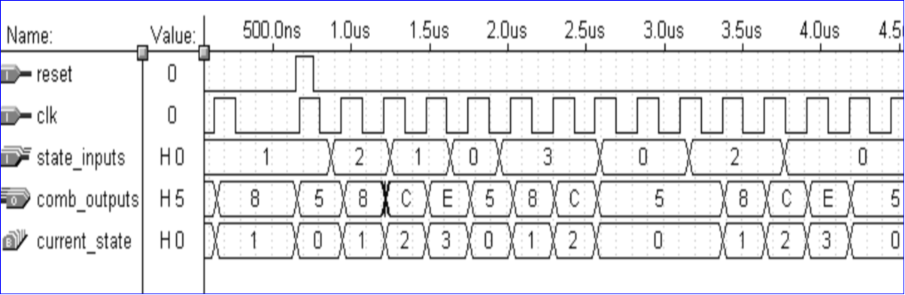
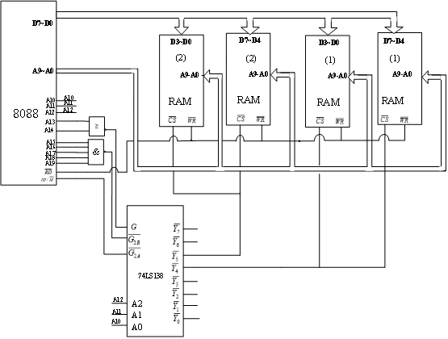

# 概念

**数据对象:**保存数据的单元

**客体：**凡是可以赋予一个值的对象

**四种客体**：信号，变量，常量，文件

- **信号：**`signal sys_clk: bit := ‘0’;`

- **变量**：`vairable x:integer := 10;`

- **共享变量：**`shared variable notclk: std_logic;`共享变量是全局变量，局部变量是局部量，其他客体都是全局量

- **常数:** `constant x:real := 5.0;`

**`:＝`：**表示对信号直接赋值，表示信号初始值不产生延时。

**`＜＝`：**表示代入赋值，是信号之间的传递，代入赋值法允许产生延时。

**数据类型：**

 

**位向量：**

~~~vhdl
signal  a：  bit_vector (0 to 7)；--递增
signal  b：  bit_vector (7 downto 0)；--递减
signal  c：  bit_vector  (0 to 3) ：=  “0110”；--向量用双引号“ ”
~~~

**标准逻辑：`**std_logic`

 

**标准逻辑向量：**`std_logic_vector `

~~~vhdl
--使用标准逻辑向量将两个信号相加：
entity adder1 is
    port(
    	a,b:in std_logic_vector(3 downto 0);
        y:out std_logic_vector(3 downto 0)
    );
end adder1;
    
architecture a of adder1 is
    begin
        y <= a+b;
    end a;
~~~

**integer（整数）：**范围: -(2^31－1)到(2^31－1)

**positive（正整数）和natural（自然数）**:正整数是0和0以上的整数。自然数是大于零的整数。

**unsigned无符号整数):**一定要使用downto的序列。

**real（实数）**:范围:  -1.7E38  to　1.7E38

**CHARACTER(字符)**:大小写英文字母不敏感

**TIME(时间)：**范围: -(2^31－1)到(2^31－1)

**SEVRITY  LEVEL(错误等级):**`NOTE`，`WARAING`，`ERROR`，`FALILURE`，即注意、警告、错误、失败4个等级。

**枚举、数组:**

~~~vhdl
type  states  is  (state0，state1，state2，state3);
type  bits  is  array  (7 downto 0)  of  bit ;
~~~

**数据类型转换：**

| 函数名               | 操作                            | 功能                                                      |
| :------------------- | :------------------------------ | --------------------------------------------------------- |
| `Std_logic_1164`     | `to_stdlogicvector(a)`          | 由`bit_vector`转化为`std_logic_vector`                    |
|                      | `to_bitvector`                  | 由`std_logic_vector`转化为`bit_vector`                    |
|                      | `to_stdlogic`                   | 由`bit`转化为`std_logic`                                  |
|                      | `to_bit`                        | 由`std_logic`转化为`bit`                                  |
| `Std_logic_arith`    | `conv_std_logic_vector(a,位长)` | 由`integer`、`unsigned`、`signed`转化为`std_logic_vector` |
|                      | `Conv_integer（a）`             | `unsigned`、`signed`转化为`integer`                       |
| `Std_logic_unsigned` | `Conv_integer（a）`             | 由`std_logic_vector`转化为`integer`                       |

~~~vhdl
--使用转换函数进行算术运算
Entity conv is
	port（
		a : in unsigned(3 downto 0);
		b: in std_logic_vector(3 downto 0);
		sum : out std_logic_vector(7 downto 0)
		);
	end conv;
Architecture a of conv is
Begin
	sum <= conv_std_logic_vector(a,4) + b;
End a;
~~~

**运算操作符：**包含数值运算、赋值（assignment）与连接运算。

数值运算以运算优先权的低高分为逻辑、关系、加法、乘法及其它运算符；
赋值运算符可以完成数据赋值操作；
连接运算符（&）可用来连接两种数据类型。

~~~vhdl
q <= a&b&c; --直接连接
q <= (2 => a,1 =>b,0 =>c); --聚合连接
~~~

**逻辑运算符：**`NOT`取反	`AND`与	`OR`或	`NAND`与非	`NOR`或非	`XOR`异或

**关系运算符：**`＝`等于	`/＝` 不等于	`＜ `小于	`＜＝`小于等于	`＞ `大于	`＞＝`大于等于

**算术运算符：**`＋`加运算	`－`减运算	`*`乘运算	`/` 除运算	`MOD`求模运算	`REM` 取余运算	`＋`   正	`－`  负	`**`  指数运算	`ABS` 取绝对值

~~~vhdl
architecture a of luoji is
begin
    process(a,b)
    begin
        if a=b then
            d <= a and c;
        elsif a<b then
            d <= a or c;
        else 
            d <= a and not c;
        end if;
    end process;
end a;
~~~

**命名规则**：

- 构成名字的符号有英文字母，数字和 ` _ `连字符。
- 名字的最前面应该是英文字母。
- 不能连续使用连字符，名字最后一个符号也不能用连字符。

~~~vhdl
--命名规则举例:
SIGNAL   sel：   INTEGER；
SIGNAL   PCI_BUS:STD_LOGIC_VECTOR(31 DOWNTO O)；
SIGNAL   8_BUS       --数字开头，是错误的名字
SIGNAL   PCI_@BUS    --@是非法符号
SIGNAL   PCI__ BUS   -- 连字符在名称中不能连着使用
SIGNAL   PCI_BUS_    -- 结尾不能用连字符
~~~

# 语句

## 基本语句

### 顺序语句

一类是真正的顺序语句（IF语句），一类是可以做顺序语句、又可以做并发语句、具有双重特性的语句(赋值语句、process语句)。

#### `wait`语句

进程在仿真运行中总是处于**执行状态**或**挂起状态**。当进程执行到等待语句时，就将被挂起，并设置好再次执行的条件。

~~~vhdl
wait --无限等待
wait on --等待敏感信号变化
wait until --条件满足
wait for --时间到
    
--wait on 
    --用法1
process(a,b) --a,b为敏感信号
begin
    y <= a and b;
end process;
    --用法2
process
begin
    y <= a and b;
    wait on a,b;
end process;
    --错误用法: 敏感信号 和 wait on 同时出现
process(a,b)
begin
    y <= a and b;
    wait on a,b;
end process;

--wait until:同时按顺序满足条件，才能脱离挂起状态
	-- 等待上升沿的三种写法
		--1. wait until clk = '1';
		--2. wait until clock'event and clk = '1';
		--3. wait until rising_edge(clk);
signal s1:std_logic;
…
process
begin
…
wait until s1=‘1’;
end process;
    
--wait for
wait for 20ns;
wait for(a*(b+c));--a,b,c 为时间量
~~~

#### 赋值语句

两种：**信号赋值**（代入）语句和**变量赋值**语句。

每个赋值语句由三部分组成：1.赋值目标	2.赋值符号	3.赋值源

#### `if`语句

​	(2) 用于二选一控制的IF语句	(3) 用于多选择控制的IF语句

~~~vhdl
--(1) 用于门闩控制的IF语句
	--格式
		--if ... then
		--    ...;
		--end if;
entity dff is
port(clk : in std_logic;
	d: in std_logic;
	q:  out std_logic
	);
end entity dff;
    
Architecture a of dff is
begin
	p1: process(clk)
	begin
		if clk'event and clk = '1' then
			q <= d;
		end if;
 	end process p1;
end a;

--(2)用于二选一控制的IF语句
    --格式
            --if ... then
            --		...;
            --else
            --		...;
            --end if
entity mux2 is
port(a,b,sel : in std_logic;
	c:  out std_logic
	);
end entity mux2;

Architecture rtl of mux2 is
Begin
	process(a,b,sel)
	begin
		if sel = '1' then
			c <= a;
		else
			c <= b;
		end if;
	end process;
End rtl;
            
--(3) 用于多选择控制的IF语句
	--格式
        --if ... then ...;
        --elsif ... then ...;
        --	...
        --elsif ... then ...;
        --else ...;
        --end if;
entity mux is
port(sel : in std_logic_vector(1 downto 0);
	input : in std_logic_vector(3downto 0);
	y:  out std_logic
	);
end entity mux;

Architecture a of mux is
begin
    Process(sel)
	begin
		if sel="00" then		
			y <= input(0);
		elsif sel="01" then	
			y <= input(1); 		
		elsif sel="10" then	
			y <= input(2); 	
		else 			
			y <= input(3); 	
		end if;		
end process;
end a;
~~~

#### `case`语句

~~~vhdl
--格式
--case signal is
--    when case1 => ...;
--	  when case2 => ...;
--	  ...
--    when others => ...;
--end case;
    
case s is
			when "00"=>
				y<=a;
			when "01"=>
				y<=b;
			when "10"=>
				y<=c;
			when others=>
				y<=d;
end case;

--case状态机
process(reset,clk)
	variable state : integer range 0 to 3;
begin
		if reset = ‘0’ then
			state := 0;
		elsif clk’event and clk = ‘1’ then
		case state is
			when 0 =>	q <= din(0);	state := 1;
			when 1 =>	q <= din(1);	state := 2;
			when 2 =>	q <= din(2);	state := 3;
			when 3 =>	q <= din(3);	state := 2;
			when others =>	state := 0;
		end case;	
end begin;
    
--case 实现四选一逻辑电路
entity mux4 is
port(input: in std_logic_VECTOR(1 downto 0);
	 i0,i1,i2,i3 : in std_logic;
	 q : out std_logic
	);
end entity mux4;

ARCHITECTURE  rtl OF mux4  IS
BEGIN
	PROCESS(input) 
	BEGIN
     		CASE  input  IS 
			WHEN "00"  => q <= i0;     
			WHEN "01"  => q <= i1;
		 	WHEN "10"  => q <= i2; 
		 	WHEN "11"  => q <= i3; 
		 	WHEN OTHERS => q <= 'X';
	 	END CASE;
	END PROCESS;
END rtl ;
~~~

- IF语句是有序的，先处理最起始、最优先的条件，后处理次优先的条件。
- case语句是无序的，所有表达式值都并行处理。
- case语句中的条件表达式的值必须举穷尽，又不能重复。
- 不能穷尽的条件表达式的值用OTHERS表示。

#### `loop`语句

~~~vhdl
--for loop 格式
	--for ... in ... loop
	--		...
	--end loop;

entity fuzhi is
	port(clk : in std_logic;
		a: in std_logic_vector(3 downto 0);
		y: out std_logic_vector(3 downto 0)
	);
end entity fuzhi;

architecture behave of fuzhi is
	signal q:std_logic_vector(3 downto 0);
begin
	process(clk)
	begin
		if clk'event and clk='1' then
			for i in 3 downto 0 loop
				q(i)<=a(3-i);
			end loop;
		end if;
	end process;
	y<=q;
end behave; 

-- while loop 格式
	--while ... loop
    --    ...
    --end loop ...;
pari:while(i<8)loop
    tmp := tmp xor a(i);
    i := i+1;
end loop pari;
~~~

#### `null`语句

表示一个空操作，它不发生任何动作

常用在case语句中，表示所剩条件选择值下的操作行为，满足了case语句对条件选择值全部列举的要求。

~~~vhdl
case s is
		when 0 =>	q <= a;
		when 1 =>	q <= not a;
		when others =>	null;
end case;	
~~~

#### 其他顺序语句

`NEXT`语句
`EXIT`语句
子程序调用语句
`RETURN`语句
*`PROCESS`语句:可并发可顺序

### 并发语句

#### 进程（Process）语句

- 在一个结构体中多个Process语句是同时**并发**运行的。

- 特点：
     (1) 进程内部的所有语句都是顺序执行的。
     (2) 多进程之间，是并行执行的，并可访问构造体或实体中所定义的信号。
     (3) 进程的启动是由进程标识符Process后的敏感信号来触发，也可用WAIT语句等待一个触发条件的成立。
     (4) 各进程之间的通信是由信号来传递的。

#### 并发信号代入语句

- 若在在进程内部使用，此时它作为顺序语句形式出现。

- 若在构造体的进程之外使用，此时它作为并发语句形式出现。

- 代入符号`<=`

~~~vhdl
--等待 a(i)变化的两种写法
ARCHITECTURE  behav  OF  a_var  IS
    BEGIN
         output<=a(i);
     END  behav ;
--------------------------------------------
	ARCHITECTURE  behav  OF  a_var  IS
    BEGIN
           PROCESS(a（i）)
		BEGIN
			output<= a(i); 
		END PROCESS
     END  behav ;
~~~

#### 条件信号代入语句

各赋值子句有优先级的差别，按书写顺序从高到低排序，所以各赋值条件可以重叠。

~~~vhdl
--格式
--	target_sign <= 	... when condition_1 else
--    		   		... when condition_2 else
--               		...
--              		... when condition_n-1 else
--               		...;

--四选一逻辑电路
entity mux4 is
port(a,b: in std_logic;
	 i0,i1,i2,i3 : in std_logic;
	 q : out std_logic
	);
end entity mux4;

ARCHITECTURE  rtl OF mux4  IS
	SIGNAL  sel :STD_LOGIC_Vector(1 DOWNTO  0);
BEGIN
    Sel <= b & a;
    q <= i0 WHEN  sel="00" ELSE
             i1 WHEN  sel="01" ELSE
             i2  WHEN  sel="10" ELSE
             i3  WHEN  sel="11" ELSE
             'X';
END rtl ;
~~~

#### 选择信号代入语句

~~~vhdl
--格式
--with ... select
--    target_signal <= ... when condition_1
--    				 ... when condition_2
--    					...
--    				 ... when others;

--利用选择信号代入语句来描述的四选一逻辑电路
entity mux4 is
port(a,b: in std_logic;
	 i0,i1,i2,i3 : in std_logic;
	 q : out std_logic
	);
end entity mux4;

ARCHITECTURE  rtl OF mux4  IS
 	SIGNAL  sel:INTEGER RANGE 0 TO 4 ;
 BEGIN
      WITH  sel  SELECT
          q <= i0  WHEN    0,
                  i1  WHEN   1,     --选择信号代入语句
                  i2  WHEN   2,
                  i3  WHEN   3,
                  'X' WHEN  OTHERS;
         sel<=0  WHEN  a='0'AND b='0‘ ELSE	
                 1  WHEN  a='1'AND b='0‘ ELSE
                 2  WHEN  a='0'AND b='1‘ ELSE
                 3  WHEN  a='1'AND b='1‘ ELSE
                 4;                           --条件信号代入语句
END rtl ;

~~~

#### 其他并发描述语句

并发过程调用语句

块（Block）语句

### 代入语句

信号量 <= 敏感信号量表达式；

~~~vhdl
a<=b; --该语句的功能是a得到b的值，b为敏感量，b值发生变化时，该语句执行；
z<=a NOR（b NAND c）;--3个敏感量a,b,c,无论哪一个的值发生变化时，该代入语句被执行；
a<=b AFTER 5ns;--当b发生变化5ns以后才代入到信号a。 
~~~

### 延时语句

#### 惯性延时

在惯性模型中，系统或器件输出信号要发生变化必须有一段时间的延时

特点：当一个系统或器件的输入信号变化周期小于它的惯性延时时，其输出保持不变。

#### 传输延时

描述总线延时、连接线的延时及ASIC芯片中的路径延时。
传输延时不是缺省的，必须在语句中明确说明。

## 其他描述语句

### 元件例化语句(component)

~~~vhdl
component  元件名
	   [generic   参数说明；]
  		 port  （	
              	信号1： 端口模式    数据类型；
              	信号2： 端口模式    数据类型；
				  …
			);
end  component;
~~~

### 端口映射语句(PORT MAP)

反映各模块之间、各元件之间的信号连接关系

~~~vhdl
标号名：元件名 PORT MAP(信号，…)；
U0：and2 PORT MAP(D0，D1，U0-q)；
~~~

### 生成语句（ GENERATE ）

用来产生多个相同的结构。

~~~vhdl
--FOR-GENERATE形式的生成语句用于描述多重模式，结构中所列举的是并发处理语句。
标号：FOR变量IN不连续区间GENERATE
	<并发处理的生成语句>
END  GENERATE  [标号名]；
--IF-GENERATE形式的生成语句用于描述结构的例外情况，比如边界处发生的特殊情况。
标号：IF 条件  GENERATE
	<并发处理的生成语句>
END  GENERATE[标号名]；

--4位移位寄存器GENERATE语句举例
 X(0) <= a；
  dff1：dff PORT MAP (X(0)，clk，X(1))；
  dff2：dff PORT MAP (X(1)，clk，X(2))；
  dff3：dff PORT MAP (X(2)，clk，X(3))；
  dff4：dff PORT MAP (X(3)，clk，X(4))；
  B<=X(4)；
…
BEGIN
X(0) <= a；	                   --输入信号代入语句
register1： FOR  i  IN  0 TO 3  GENERATE
     dffx：dff PORT MAP(X(i)，clk，X(i+1))；--端口映射
END  GENERATE；
     B <= X(4) ；
~~~

# VHDL语言程序基本结构

## PLD基本结构

## PLD分类

| 固定 | 可编程   |            |
| ---- | -------- | :--------- |
| 与   | 或       | PROM,EPROM |
| /    | 与 && 或 | PLA        |
| 或   | 与       | PAL,GAL    |

## 有限状态机

- 基本要素：状态 ，输入条件，输出

- Mooro型状态机：同步输出状态机，输出只和当前状态有关

- Mealy状态机：异步输出状态机，输出和所有的输入信号有关

- 步骤： 构造体说明：定义状态
  			｜
  		设计主控时序进程：状态转换
  			｜
  		设计主控组合进程：确定下一状态
  			｜	
  		设计辅助进程：配合工作          
- 一般状态机包含如下四个部分:
  1. 说明部分 
  2.  主控时序进程 :负责状态机运转，在时钟驱动下负责状态转换的进程。
  3. 主控组合进程 :确定下一状态，以及确定对外输出或对内部其它组合或时序进程输出控制信号的内容。
  4. 辅助进程：用于配合状态机工作的组合进程或时序进程。

## 组合逻辑电路

- 组合逻辑电路：任何时刻的输出仅取决于该时刻输入信号的组合，而与电路原有的状态无关的电路。

- 组合逻辑电路的特点：没有存储和记忆作用，没有反馈回路。

- 组合电路的描述方法：逻辑表达式、真值表、卡诺图和逻辑图等。

- 组合逻辑电路的分类：小规模：各种逻辑门电路，中规模：编码器、译码器、选择器、加法器、求补器等，大规模：微处理器、可编程逻辑器件等。

## 时序逻辑电路

- 时序逻辑电路：任何时刻的输出不仅取决于该时刻输入信号的组合，而且与电路原有的状态有关的电路。

- 时序逻辑电路结构及特点：由组合逻辑电路和存储电路两部分组成，其中存储电路必不可少。存储电路的输出状态必须反馈到输入端。

- 时序逻辑电路的分类：同步时序电路，异步时序电路。

- 常见的时序逻辑电路有：触发器、寄存器、计数器、存储器等。

- 时序电路的描述方法：状态转换表、状态转换图和时序图等。

## VHDL程序结构图

- 库（Library）：存放已经编译的实体、构造体、包、配置。

  - 存放实体说明、构造体、程序包和配置说明等。

  - ~~~vhdl
    --格式
    --library  库名;
    --use  库名.程序包名.all； --all指使用所有项目
    --use  库名.程序包名.项目名；--只使用库中的某个项目
    
    --库和程序包的常用写法
    LIBRARY IEEE;
    USE IEEE.STD_LOGIC_1164.ALL; --打开IEEE库中的程序包std_logic_ 1164 .all的所有项目
    --use IEEE.std_logic_1164.std_logic； --打开程序包std_logic_1164中的std_ logic（标准逻辑）数据类型
    USE IEEE.STD_LOGIC_ARITH.ALL;
    USE IEEE.STD_LOGIC_UNSIGNED.ALL;
    ~~~

- 包（Package）：存放各设计模块都能共享的数据类型、常数和子程序；

  - 存放VHDL语言中所要用到的信号定义、常量定义、数据类型、元件语句等

- 实体（Entity）：描述所设计的系统的外部接口信号；

  - 输入（Input）：clk、reset、en、addr等

  - 输出（Output）：输出信号，不能内部引用

  - 双向（Inout）：可代替所有其他模式，用于设计双向总线

  - 缓冲（Buffer）：与Output类似，但允许该管脚名作为一些逻辑的输入信号

  - 不定（Linkage）：不定方向，哪个方向都可连接

  - ~~~vhdl
    --格式
    --entity 实体名 is
    --	【generic（类型说明）】--定义端口大小，IO引脚分配
    --		port（	信号名：模式	信号类型；
    --			信号名：模式	信号类型；
    --				…
    --			信号名：模式	信号类型
    --			)；
    --end 实体名；
    
    Entity addr1 is
    port(a, b: in bit ; --在层次化设计时，Port为模块之间的接口，在芯片级，则代表具体芯片的管脚
            s,co:out bit
         	bus:out  std_logic_vector(7 downto 0));
            );
    end addr1;
    ~~~

- 构造体（Architecture）：描述系统内部的结构和行为；

  - 构造体有三种描述方式：行为描述，数据流描述或寄存器传输描述，结构化描述

  - ~~~vhdl
    --格式
    -- architecture 构造体名 of 实体名 is
    --	类型说明
    --	信号说明
    --	函数定义
    -- 	进程定义
    --	元件说明
    --begin
    --	并行语句
    --	…
    --	并行语句
    --end 构造体名；
    
    Architecture behavioral of eqcomp4 is 
    begin
    comp: process (a,b)
        	begin
    			if a=b then
    	      		equal <= ‘1’;   
    			else
    	      		equal <=‘0’;
    			end if;
        	end process comp;
    end behavioral ;
    ~~~

  - 构造体描述语句：块语句（Block）  进程语句(Process)     信号赋值语句(<=)     子程序调用语句(Subprogram)     元件例示语句(Component)

    - ~~~vhdl
      --Block语句结构
      
      --块结构名
      --Block 
      --begin
      --	并行语句
      --	…
      --	并行语句
      --End Block 块结构名；
      
      Entity latch is
      	port(d,clk: in bit;
      		q: out bit);
      end latch;
          
      architecture latch_guard of latch is
      begin
      	 g1:
      	block ( clk =’1’ ) --布尔表达式
      	begin
      		q<=guarded d after 5 ns; --前卫关键词，只有在布尔表达式为真时，语句才被执行
      		qb<=guarded not (d) after 7 ns;
      	end block g1;
      end latch_guard;
      
      ~~~

    - ~~~vhdl
      --进程(process)语句结构
      --[进程名] process（敏感信号1，敏感信号2）
      --				[说明区]
      --		begin
      --				顺序语句；
      --				…
      --				顺序语句；
      --end process [进程名]；
      
      --带清零端的D触发器
      entity VposDff is
          port(CLK,CLR,D:in STD_LOGIC;
              Q,QN:out STD_LOGIC);
      end VposDff;
          
      architecture VposDff_arch of VposDff is
      begin
          process(CLK,CLR)--敏感信号
          begin
              if CLR = '1' then Q <= '0'; QN <= '1';
              elsif CLK'event and CLK = '1' then Q <= D;QN <= not D;
          	end if;
          end process;
      end VposDff_arch;
      ~~~

- 配置（Configuration）：从库中选取所需单元组成系统设计的不同版本；

  - 描述层与层之间的连接关系以及实体与构造体之间的连接关系。

  - 根据不同的使用情况，大体分为四种类型：默认配置、元件配置、块配置和构造体配置。

  - ~~~vhdl
    --格式
    --Configuration  配置名  of  实体名  is
    --		【语句说明】；
    --end 配置名;
    -------------------------------------------
    --Configuration  配置名  of  实体名  is
    --		for 选配构造体名
    --		end for；
    --end 配置名；
    ~~~

## 时钟信号 && 复位信号

- 任何时序电路都是以时钟信号为驱动信号的，时序电路只有在时钟信号的边沿到来时，其状态才发生变化，因此，时钟信号通常是描述时序电路的执行条件。
- 时序电路可以通过复位信号来设置电路的初始状态。

~~~vhdl
--上升沿时钟信号描述
IF clk =‘1’ AND clk’ LAST_VAULE = ‘0’  AND clk’ EVENT  THEN
IF clk’ EVENT AND  clk =‘1’ THEN
IF rising_edge(clk) THEN
    
--下降沿时钟信号描述
IF clk =‘0’ AND clk’ LAST_VAULE = ‘1’  AND clk’ EVENT  THEN
IF clk’ EVENT AND  clk =‘0’ THEN
IF falling_edge(clk) THEN
    
--用时钟信号作为敏感信号
PROCESS (clock_signal)
     BEGIN
          IF(clock_edge_condition)THEN
                Signal_out <= signal_in；
			…;其他时序语句;…
          END IF；
     END PROCESS；
    
~~~

## 同步复位 && 异步复位

~~~vhdl
--同步复位
PROCESS (clock_signal)
 BEGIN
           IF (clock_edge_condition) THEN
                 IF (reset_condition) THEN 
                         Signal_out <= reset_value；
                  ELSE  
                         Signal_out <= signal_in；
                         -- 其他时序语句
                  END IF；
            END IF；
 END PROCESS； 

--异步复位
PROCESS(reset_signal，clock_signal)
BEGIN
    IF(reset_condition)THEN          --复位条件成立
         Signal_out <=reset_value； --复位赋予输出信号
    ELSIF(clock_event  AND  clock_edge_condition) THEN
         Signal_out <=signal_in；
          --复位条件不成立执行正常时序电路功能
          --其他时序语句
    END IF；
END PROCESS； 
   
~~~

# 例题

## Moore状态机

输出Q只与现状态有关，与输入无关

| clk  | Reset | State_ inputs | Current_state | Next_state | outputs |
| ---- | ----- | ------------- | ------------- | ---------- | ------- |
| x    | 1     | xx            | s0            | x          | 5       |
| ↑    | 0     | 00/xx         | s0            | s0/s1      | 5       |
| ↑    | 0     | 00/xx         | s1            | s1/s2      | 8       |
| ↑    | 0     | 11/xx         | s2            | s0/s3      | 12      |
| ↑    | 0     | 11/xx         | s3            | s3/s0      | 14      |

~~~vhdl
ENTITY s_machine IS
  PORT ( clk,reset    : IN STD_LOGIC;
      state_inputs : IN STD_LOGIC_VECTOR (0 TO 1);
     comb_outputs : OUT INTEGER RANGE 0 TO 15 );
END s_machine;
    ARCHITECTURE behv OF s_machine IS
  TYPE FSM_ST IS (s0, s1, s2, s3);  
  SIGNAL current_state, next_state: FSM_ST;
 BEGIN
  REG: PROCESS (reset,clk)   --主控时序进程 
  BEGIN
    IF reset = ‘1’ THEN   current_state <= s0; --异步复位
    ELSIF clk='1' AND clk'EVENT    THEN   
      current_state <= next_state; 
    END IF;
  END PROCESS;    --信号current_state将值带出此进程  
  COM:PROCESS(current_state, state_Inputs)  
     BEGIN
    CASE current_state IS                     
      WHEN s0 => comb_outputs<= 5; -- 输出仅取决于现态
        IF state_inputs = "00" THEN  next_state<=s0;                       
          ELSE  next_state<=s1; --输入决定次态
        END IF;
      WHEN s1 =>  comb_outputs<= 8;
        IF state_inputs = "00" THEN  next_state<=s1;    
          ELSE  next_state<=s2;   
        END IF;
      WHEN s2 =>   comb_outputs<= 12;  
        IF state_inputs = "11" THEN  next_state <= s0;
          ELSE  next_state <= s3; 
        END IF;
      WHEN s3 =>  comb_outputs <= 14;
        IF state_inputs = "11" THEN  next_state <= s3; 
          ELSE  next_state <= s0;   
        END IF;
    END case;
   END PROCESS;      
    END behv;
~~~

## Mealy型有限状态机

输出不仅取决于现态，还与输入有关；

| clk  | RESET | DATAIN | Current_state | Next _state | Q           |
| ---- | ----- | ------ | ------------- | ----------- | ----------- |
| x    | 1     | xx     | ST0           | x           | xx          |
| ↑    | 0     | 1/0    | ST0           | ST1/ST0     | 10000/01010 |
| ↑    | 0     | 0/1    | ST1           | ST2/ST1     | 10111/10100 |
| ↑    | 0     | 1/0    | ST2           | ST3/ST2     | 10101/10011 |
| ↑    | 0     | 0/1    | ST3           | ST4/ST3     | 11011/01001 |
| ↑    | 0     | 1/0    | ST4           | ST0/ST4     | 11101/01101 |

~~~vhdl
LIBRARY IEEE;  
USE IEEE.STD_LOGIC_1164.ALL;
ENTITY MEALY1 IS
PORT ( CLK ,DATAIN,RESET  : IN STD_LOGIC; 
         Q : OUT STD_LOGIC_VECTOR(4 DOWNTO 0));
END MEALY1;
ARCHITECTURE behav OF MEALY1 IS
  TYPE states IS (st0, st1, st2, st3,st4);      
  SIGNAL STX : states  ;  
BEGIN                          
 COMREG : PROCESS(CLK,RESET) --决定转换状态的进程
   BEGIN
    IF RESET ='1' THEN  STX <= ST0;
      ELSIF CLK'EVENT AND CLK = '1' THEN
   CASE STX IS           
    WHEN st0 => IF DATAIN = '1' THEN  STX <= st1; END IF;
    WHEN st1 => IF DATAIN = '0' THEN  STX <= st2; END IF;
    WHEN st2 => IF DATAIN = '1' THEN  STX <= st3; END IF;
    WHEN st3=>  IF DATAIN = '0' THEN  STX <= st4; END IF;
    WHEN st4=>  IF DATAIN = '1' THEN  STX <= st0; END IF;
    WHEN OTHERS => STX <= st0; 
   END CASE ;
   END IF;
  END PROCESS COMREG ;
  COM1: PROCESS(STX,DATAIN) --输出控制信号的进程
   BEGIN
    CASE STX IS           
      WHEN st0 => IF DATAIN = '1' THEN Q <= "10000" ;
                  ELSE Q<="01010" ;
                  END IF ;
    WHEN st1 => IF DATAIN = '0' THEN Q <= "10111" ;
                ELSE Q<="10100" ;
                END IF ;                   
    WHEN st2 => IF DATAIN = '1' THEN Q <= "10101" ;
                ELSE Q<="10011" ;
                END IF ;
    WHEN st3=>  IF DATAIN = '0' THEN Q <= "11011" ;
                ELSE Q<="01001" ;
                END IF ;
    WHEN st4=>  IF DATAIN = '1' THEN Q <= "11101" ;
                ELSE Q<="01101" ;
                END IF ;                                                
    WHEN OTHERS =>  Q<="00000" ;                
   END CASE ;
 END PROCESS COM1 ;
END behav;    
~~~

## 用状态机对AD0809进行采样控制

~~~vhdl
 LIBRARY IEEE;
  USE IEEE.STD_LOGIC_1164.ALL;
  ENTITY AD0809 IS
  PORT (  D :IN STD_LOGIC_VECTOR(7 DOWNTO 0);  
   CLK,EOC  : IN STD_LOGIC;
                      --状态机时钟CLK，AD0809工作状态信号EOC
    LOCK0   : OUT STD_LOGIC; 
                      --内部锁存信号LOCK的测试信号
  ALE,START,OE,ADDA : OUT STD_LOGIC; --AD0809控制信号
    Q : OUT STD_LOGIC_VECTOR(7 DOWNTO 0)); --锁存数据输出
  END AD0809;
  ARCHITECTURE behav OF AD0809 IS
    TYPE states IS (st0, st1, st2, st3,st4);  
    SIGNAL current_state, next_state: states :=st0 ;
    SIGNAL REGL : STD_LOGIC_VECTOR(7 DOWNTO 0);
    SIGNAL LOCK : STD_LOGIC;              
  BEGIN
    ADDA <= ‘1’; --模拟信号进入0809通道1                                                                        Q <= REGL ;  LOCK0<=LOCK;
     COM: PROCESS(current_state,EOC)   --决定各状态转换方式
  BEGIN                          
   CASE current_state IS           
   WHEN st0 => ALE<='0'; START<='0';LOCK<='0';OE<='0'; 
               next_state <= st1;         --0809初始化 
   WHEN st1 => ALE<='1'; START<='1';LOCK<='0';OE<='0'; 
               next_state <= st2;         --启动采样 
   WHEN st2 => ALE<='0'; START<='0';LOCK<='0';OE<='0'; 
          IF (EOC=‘1’) THEN next_state <= st3; --转换结束
          ELSE    next_state <= st2; --转换未结束，等待转换
          END IF ;
   WHEN st3 => ALE<='0'; START<='0';LOCK<='0';OE<='1'; 
          next_state <= st4;         --开启OE，输出有效 
   WHEN st4 => ALE<='0'; START<='0';LOCK<='1';OE<='1'; 
               next_state <= st0;           --锁存数据
   WHEN OTHERS => next_state <= st0;     
   END CASE ;
   END PROCESS COM ;
  REG: PROCESS (CLK)  --时序进程  
  BEGIN
   IF ( CLK'EVENT AND CLK='1')  
     THEN  current_state <= next_state; 
   END IF;
END PROCESS REG; --信号current_state将值带出此进程 
LATCH1 : PROCESS (LOCK)  --数据锁存器进程
 BEGIN
   IF LOCK='1' AND LOCK'EVENT   THEN REGL <= D ;
   END IF;
END PROCESS ;   --在LOCK的上升沿将转换好的数据锁入
END behav;
~~~

## D触发器

~~~vhdl
LIBRARY IEEE;
USE IEEE.STD_LOGIC_1164.ALL;
ENTITY dff1 IS
     PORT(clk,d:IN STD_LOGIC;
          q : OUT STD_LOGIC);
END dff1;
ARCHITECTURE rtl OF dff1 IS
BEGIN
  PROCESS (clk)
  BEGIN
       IF (clk'EVENT AND clk='1') THEN
             q<=d;
       END IF;   
  END PROCESS ;
END rtl;
~~~

## 非同步复位的D触发器

当clr=‘0’时，其q端输出被迫置为‘0’。clr又称清零输入端。

~~~vhdl
LIBRARY IEEE;    USE IEEE.STD_LOGIC_1164.ALL;
ENTITY dff2 IS
PORT(clk,d,clr:IN STD_LOGIC;                      	
     q : OUT STD_LOGIC);
END dff2;
ARCHITECTURE rtl OF dff2 IS
BEGIN
  PROCESS (clk,clr)
  BEGIN
       IF (clr='0') THEN   q<='0';
       ELSIF (clk'EVENT AND clk='1') THEN
           q<=d;
       END IF;   
  END PROCESS ;
END rtl;
~~~

## 非同步复位/置位的D触发器

clr和pset的复位、置位端。当clr=‘0’时复位，使q=‘0’；当pset =‘0’时置位，使q=‘1’。

~~~vhdl
LIBRARY IEEE;  USE IEEE.STD_LOGIC_1164.ALL;
ENTITY dff3 IS
PORT(clk,d,clr,pset:IN STD_LOGIC;
     q : OUT STD_LOGIC);
END dff3;
ARCHITECTURE rtl OF dff3 IS
BEGIN
  PROCESS (clk,pset,clr)
     BEGIN
       IF (pset='0') THEN    q<='1';  
       ELSIF (clr='0') THEN   q<='0';
       ELSIF (clk'EVENT AND clk='1') THEN
           q<=d;
       END IF;   
  END PROCESS ;
END rtl;
~~~

## JK触发器

~~~vhdl
LIBRARY IEEE;
USE IEEE.STD_LOGIC_1164.ALL;
ENTITY jkdff IS
PORT(clk,pset,clr,j,k:IN STD_LOGIC;
     q,qb: OUT STD_LOGIC);
END jkdff; 
ARCHITECTURE rtl OF jkdff IS
   SIGNAL q_s,qb_s:STD_LOGIC;
BEGIN
  PROCESS (pset,clk,clr,j,k)
     BEGIN
       IF (pset='0') AND (clr='1') THEN
            q_s<='1';  qb_s<='0';
       ELSIF (pset='1') AND (clr='0') THEN
            q_s<='0';  qb_s<='1';       
     ELSIF (clk'EVENT AND clk='1') THEN
            IF (j='0') AND (k='1') THEN
               q_s<='0';
               qb_s<='1';
            ELSIF (j='1') AND (k='0') THEN
               q_s<='1';
               qb_s<='0';
            ELSIF (j='1') AND (k='1') THEN
               q_s<=NOT q_s;
               qb_s<=NOT qb_s;
            END IF; 
      END IF; 
      q<=q_s;
      qb<=qb_s;
   END PROCESS ;
END rtl;
~~~

## 寄存器

~~~vhdl
LIBRARY IEEE;
USE IEEE.STD_LOGIC_1164.ALL;
ENTITY shift8_2 IS
  PORT (clk,a:IN STD_LOGIC;	                     		   
        b:OUT STD_LOGIC);
END shift8_2;
ARCHITECTURE rtl OF shift8_2 IS  
SIGNAL dfo_1,dfo_2,dfo_3,dfo_4,dfo_5,
	dfo_6,dfo_7,dfo_8:STD_LOGIC;
BEGIN
   PROCESS (clk)
    BEGIN
      IF (clk'EVENT AND clk ='1') THEN
	    dfo_1 <= a;
          dfo_2 <= dfo_1;   
          dfo_3 <= dfo_2;
          dfo_4 <= dfo_3;  
          dfo_5 <= dfo_4;
          dfo_6 <= dfo_5;   
          dfo_7 <= dfo_6;
          dfo_8 <= dfo_7;              
      END IF;
      b <= dfo_8;
   END PROCESS;
END rtl;

~~~

## 计数器

### 同步计数器

~~~vhdl
LIBRARY IEEE;
USE IEEE.STD_LOGIC_1164.ALL;
USE IEEE.STD_LOGIC_UNSIGNED.ALL;

ENTITY count12en IS
  PORT (
          clk,clr, en    :IN STD_LOGIC;
          qa,qb,qc,qd:OUT STD_LOGIC);
END count12en; 
ARCHITECTURE rtl OF count12en IS  
SIGNAL count_4:STD_LOGIC_VECTOR(3 DOWNTO 0);
BEGIN
    qa<=count_4(0);
    qb<=count_4(1);
    qc<=count_4(2);
    qd<=count_4(3);
PROCESS (clr,clk)
    BEGIN
      IF(clr='1') THEN
         count_4<="0000";
      ELSIF (clk'EVENT AND clk ='1') THEN
         IF(en='1') THEN
           IF (count_4="0010") THEN 
                 count_4<="0000";
           ELSE
	      count_4<=count_4+'1';
           END IF;
         END IF;
      END IF;
    END PROCESS;
END rtl;
~~~

## 分频器

对一个2X分频电路来说，count上限值为X-1，从0计到X-1恰好为X次，每X个上升翻转一次就实现了2X分频。

~~~vhdl
--6分频
LIBRARY IEEE;
USE IEEE.STD_LOGIC_1164.ALL;
USE IEEE.STD_LOGIC_UNSIGNED.ALL;
USE IEEE.STD_LOGIC_ARITH.ALL;

ENTITY fenpin IS
  PORT (rst, clkin :IN STD_LOGIC;
        clkout :OUT STD_LOGIC);
END fenpin;
ARCHITECTURE rtl OF fenpin IS
      signal count: STD_LOGIC_VECTOR(7 DOWNTO 0);
      signal      clk: STD_LOGIC;
BEGIN 
    process(clkin,rst)
    begin
	if rst ='1'then
	  count <= "00000000";   clk <= '0';
	elsif clkin'event and clkin='1' then
	   if count = "00000010" then	
		count <= "00000000";clk <= not clk;
	   else
		count <= count + 1;	                 	   
    	end if;                        
	end if;   
    end process;  
    clkout<=clk;
END rtl;
            
-----------------------------------------------
--奇数分频器
LIBRARY IEEE;
USE IEEE.STD_LOGIC_1164.ALL;
USE IEEE.STD_LOGIC_UNSIGNED.ALL;
USE IEEE.STD_LOGIC_ARITH.ALL;

ENTITY fenpin IS
  PORT (rst,clkin :IN STD_LOGIC;
                   clkout:OUT STD_LOGIC);
END fenpin;
ARCHITECTURE rtl OF fenpin IS
    signal count1,count2: STD_LOGIC_VECTOR(7 DOWNTO 0);
    signal tmp,tmp1,tmp2: STD_LOGIC;
BEGIN 
    tmp<=tmp1 AND tmp2;   clkout<=tmp XOR tmp1;
    process(clkin,rst)
	begin
	    if rst ='1'then
		count1 <= "00000000";
		tmp1<= '0';
	    elsif clkin'event and clkin='1' then
		if count1 = "00000100" then	
	          count1 <= "00000000";		
		else
		   count1 <= count1 + 1;
                   if count1 < "0000010" then	
                        tmp1<= '0';
                   else
                        tmp1<= '1';
		    end if;
	        end if;                        
	   end if;
     end process;   
      process(clkin,rst)
	begin
	    if rst ='1'then
		count2 <= "00000000";
		tmp2<= '1';
	    elsif clkin'event and clkin='0' then
		if count2 = "00000100" then	
	          count2 <= "00000000";		
		else
	          count2 <= count2 + 1;
                   if count2 < "0000010" then	
                       tmp2<= '1';
                   else
                       tmp2<= '0';
		      end if;
	       end if;                        
	     end if;
       end process;  
END rtl;
~~~

## 3-8译码器

~~~vhdl
LIBRARY IEEE;
USE IEEE.STD_LOGIC_1164.ALL;

ENTITY decoder_3_to_8 IS
    PORT (a,b,c,g1,g2a,g2b:IN STD_LOGIC;
                         y:OUT STD_LOGIC_VECTOR(7 DOWNTO 0));
END decoder_3_to_8;

ARCHITECTURE rtl OF decoder_3_to_8 IS
     SIGNAL indata:STD_LOGIC_VECTOR (2 DOWNTO 0);
BEGIN
       indata <= c & b & a;
      PROCESS (indata,g1,g2a,g2b)
      BEGIN
         IF (g1 = '1' AND g2a = '0' AND g2b = '0' ) THEN
             CASE indata IS
                 WHEN  "000"=> y <= "11111110";
                 WHEN  "001" => y <= "11111101";
                 WHEN  "010" => y <= "11111011";
                 WHEN  "011" => y <= "11110111";
                 WHEN  "100" => y <= "11101111";
                 WHEN  "101" => y <= "11011111"; 
                 WHEN  "110" => y <= "10111111"; 
                 WHEN  "111" => y <= "01111111";
                 WHEN  OTHERS=> y <= "XXXXXXXX";
              END CASE;
          ELSE
              y  <= "11111111";
          END IF;
    END PROCESS;
END rtl; 
~~~

## 编码器

~~~vhdl
LIBRARY IEEE;
USE IEEE.STD_LOGIC_1164.ALL;

ENTITY priority_encoder IS
   PORT(input:IN Std_Logic_Vector(7 Downto 0);
              y : OUT Std_Logic_Vector(2 Downto 0));
END priority_encoder;

ARCHITECTURE rtl OF priority_encoder IS
BEGIN  
    P1: PROCESS (input)
    BEGIN
         IF ( input(0) ='0') THEN
            y <= "111";
         ELSIF (input(1) ='0') THEN
            y <= "110";
         ELSIF (input(2) ='0') THEN
            y <= "101";
         ELSIF (input(3) ='0') THEN
            y <= "100";
         ELSIF (input(4) ='0') THEN
            y <= "011";
         ELSIF (input(5) ='0') THEN
            y <= "010";
         ELSIF (input(6) ='0') THEN
            y <= "001";       
         ELSE
            y <= "000";
         END IF;   
   END PROCESS P1;
END rtl;

~~~

## 选择器

~~~vhdl
LIBRARY IEEE;
USE IEEE.STD_LOGIC_1164.ALL;

ENTITY mux4 IS
PORT(input:IN Std_Logic_Vector(3 Downto 0);
              a,b:IN Std_Logic;
                y : OUT Std_Logic);
END mux4 ;

ARCHITECTURE rtl OF mux4  IS
SIGNAL sel:Std_Logic_Vector(1 Downto 0);
BEGIN  
  sel<=b & a;
  PROCESS (input,sel)
  BEGIN
          IF (sel="00") THEN
               y <= input(0);
          ELSIF (sel="01") THEN
               y <= input(1);
          ELSIF (sel="10") THEN
               y <= input(2);    
          ELSE
               y <= input(3);
          END IF;   
  END PROCESS;
END rtl;
~~~

## 加法器

### 半加器

~~~vhdl
Library ieee;
Use ieee.std_logic_1164.all;

Entity half_adder is
	port(a,b : in std_logic;
		s,co:out std_logic);
End half_adder;

Architecture half1 of half_adder is
	signal c,d:std_logic;
Begin 
	c <= a or b;
	d <= a nand b;
	co <= not d;
	s <= c and d;
End half1;
~~~

### 全加器

~~~vhdl
--两个半加器凑成一个全加器
LIBRARY IEEE;
USE IEEE.STD_LOGIC_1164.ALL;
ENTITY full_adder IS
  PORT (a,b,cin:IN STD_LOGIC;    s,co:OUT STD_LOGIC);
END full_adder;
ARCHITECTURE full1 OF full_adder IS
COMPONENT half_adder
  PORT (a,b:IN STD_LOGIC;
       s,co:OUT STD_LOGIC);
END COMPONENT;
SIGNAL u0_co,u0_s,u1_co:STD_LOGIC;
BEGIN
  u0:half_adder PORT MAP (a,b,u0_s,u0_co);
  u1:half_adder PORT MAP (u0_s,cin,s,u1_co);
  co <= u0_co OR u1_co;
END full1;
----------------------------------------------
-- 一位全加器
LIBRARY IEEE;
USE IEEE.STD_LOGIC_1164.ALL;
ENTITY full_adder IS
  PORT (a,b,cin:IN STD_LOGIC;    
                   s,co:OUT STD_LOGIC);
END full_adder;
ARCHITECTURE full1 OF full_adder IS
SIGNAL tmp1,tmp2,tmp3:STD_LOGIC;
BEGIN
	tmp1 <=  a XOR b;
	tmp2 <=  a AND b;
         tmp3 <= tmp1 AND cin;
         s        <= tmp1 XOR cin;
         co      <= tmp2 OR  tmp3;
END full1;
~~~

## 三态门

~~~vhdl
LIBRARY IEEE;    
USE IEEE.STD_LOGIC_1164.ALL;
ENTITY tri_gate IS
PORT(din,en:IN STD_LOGIC;  
	     dout : OUT STD_LOGIC);
END tri_gate ;
ARCHITECTURE zas OF tri_gate IS
BEGIN
  	PROCESS (din,en)
 	BEGIN
		IF (en='1')  THEN  dout <= din;
		ELSE	 dout <= 'Z';
 		END IF;   
	END PROCESS ;
END zas ;
~~~

## n进制计数器

~~~vhdl
--同步计数器 	计数（0～n-1）
--异步计数器		计数（0～n）	n->0很快啊

--100分频 计50个数
LIBRARY IEEE;
USE IEEE.STD_LOGIC_1164.ALL;
USE IEEE.STD_LOGIC_ARITH.ALL;
USE IEEE.STD_LOGIC_UNSIGNED.ALL;
ENTITY clk_div IS
	PORT(clkin:IN STD_LOGIC;
		clkout:OUT STD_LOGIC);
END clk_div;
ARCHITECTURE clk_div_behavior OF clk_div IS
	SIGNAL counter:STD_LOGIC_VECTOR(2 DOWNTO 0);
	SIGNAL temp:STD_LOGIC;
BEGIN
	PROCESS(clkin)
	BEGIN
		IF(clkin'EVENT AND clkin='1')THEN
			IF(counter="100")THEN        --注意，这里是0——4，一个周期1:1的高低电平
				counter<="000";
				temp<=NOT temp;
			ELSE
				counter<=counter+1;
			END	IF;
		END IF;
	END PROCESS;
	clkout<=temp;
END clk_div_behavior;
~~~

## 同步置位端D触发器

~~~vhdl
LIBRARY IEEE
USE IEEE.STD_LOGIC_1164.ALL
ENTITY dff4 IS
PORT(clk,clr,d:IN STD_LOGIC;
		q:OUT STD_LOGIC);
END ENTITY dff4;
ARCHITECTURE rtl OF dff4 IS
BEGIN
	PROCESS(clk) IS
	BEGIN
		IF clk =‘1’ AND clk’LAST_VALUE=‘0’ AND clk’ EVENT
			q<=‘0’;
		ELSE
			q<=d;
		END IF;
	END PROCESS;
END ARCHITECTURE;
~~~

## 利用FPGA实现流水灯功能

利用FPGA实现流水灯功能，具体电路连接图如图1所示。其中流水灯时间间隔10ms，RST复位信号是低电平有效。

1）设计FPGA内部功能实现框图；

2）采用VHDL语言设计相应的时钟分频模块、同步8进制计数器模块、3-8译码器模块等程序代码。

~~~vhdl
--3—8译码器
LIBRARY IEEE;
USE IEEE.STD_LOGIC_1164.ALL;

ENTITY decoder_3_to_8 IS 
    PORT(a,b,c,g1,g2a,g2b:IN_STD_LOGIC;
        y:OUT_STD_LOGIC_VECTOR(7 DOWNTO 0));
END decoder_3_to_8;
    
ARCHITECTURE rtl OF decoder_3_to_8 IS
    SIGNAL indata:STD_LOGIC_VECTOR(2 DOWNTO 0);
BEGIN 
    indata <= c&b&a;
	PROCESS(indata,g1,g2a,g2b)
    BEGIN
        IF(g1 = '1' AND g2a = '0' AND g2b = '0')THEN
            CASE indata IS
                WHEN "000" => y <= "11111110";
            	WHEN "001" => y <= "11111101";
                WHEN "010" => y <= "11111011";
            	WHEN "011" => y <= "11110111";   
                WHEN "100" => y <= "11101111";
            	WHEN "101" => y <= "11011111";
                WHEN "110" => y <= "10111111";
            	WHEN "111" => y <= "01111111";
				WHEN OTHERS => y <= "xxxxxxxx";
			END CASE;
        ELSE
            y <= "11111111";
        END IF;
    END PROCESS;
END rtl;
~~~

~~~vhdl
-- 8进制计数器模块
LIBRARY IEEE;
USE IEEE.STD_LOGIC_1164.ALL;
USE IEEE.STD_LOGIC_UNSIGNED.ALL;

ENTITY count8en IS
    PORT(
    	clk,clr,en:IN_STD_LOGIC;
        qa,qb,qc:OUT_STD_LOGIC;)
END count8en;
   
ARCHITECTURE rtl OF count8en IS
    SIGNAL count_3:STD_LOGIC_VECTOR(2 DOWNTO 0);
    BEGIN
        qa <= count_3(0);
    	qb <= count_3(1);
		qc <= count_3(2);
	PROCESS(clr,clk)
        BEGIN
            IF(clr='1')THEN
                count_3 <= "000";
            ELSIF(clk'EVENT AND CLK = '1')THEN
                IF(en='1') THEN
            		IF (count_3="111") THEN --逢8归零
                 		count_3<="000";
            		ELSE
	      				count_3<=count_3+'1';--非8加一
            		END IF;
         		END IF;
           END IF;
    END PROCESS;
END rtl;
~~~

~~~vhdl
-- 时钟分频模块
LIBRARY IEEE;
USE IEEE.STD_LOGIC_1164.ALL;
USE IEEE.STD_LOGIC_UNSIGNED.ALL;
USE IEEE.STD_LOGIC_ARITH.ALL;

ENTITY fenpin IS
  PORT (rst, clkin :IN STD_LOGIC;
        clkout :OUT STD_LOGIC);
END fenpin;
ARCHITECTURE rtl OF fenpin IS
      signal count: STD_LOGIC_VECTOR(13 DOWNTO 0);
      signal clk: STD_LOGIC;
BEGIN 
    process(clkin,rst)
    begin
	if rst ='1'then
	  	count <= "00000000000000";   clk <= '0';
	elsif clkin'event and clkin='1' then
	    if count = "10011100010000" then	--10000分频
			count <= "00000000000000";clk <= not clk;
	    else
			count <= count + 1;	                 	   
    	end if;                        
	end if;   
    end process;  
   	clkout<=clk;
END rtl;
~~~

## 利用FPGA实现7段式数码管由0到7依次循环显示

利用FPGA实现7段式数码管由0到7依次循环显示，具体电路连接图如图1所示。其中数码管更新时间为0.1ms，RST复位信号是低电平有效。采用VHDL设计相应的时钟分频模块，数字显示模块等程序代码。

1）设计时钟分频模块的程序代码

~~~vhdl
library IEEE;
use IEEE.STD_LOGIC_1164.ALL;
use IEEE.STD_LOGIC_ARITH.ALL;
use IEEE.STD_LOGIC_UNSIGNED.ALL;

entity FENPIN is
	port(RST,clk_in:in std_logic;
		CLKOUT:  out std_logic)；
End entity;
    
architecture Behavioral of FENPIN is
   signal count:std_logic_vector(9 downto 0);
begin
	process(clk_in,RST)
 	begin
  		if(RST=‘1’)then
      		count<= “0000000000”;
  			CLKOUT<= ‘0’;
		else if (clk_in'event and clk_in='0')then
    		if(count<= “1111101000”) then --1000分频
      			CLKOUT<= ‘1’;
				count<= “0000000000”;
			else 
  				count<= count+1;
  				CLKOUT<= ‘0’;
			end if;
		end if;
	end process;
end Behavioral;
~~~

2）设计数字显示模块相应的状态转换图

3）设计数字显示模块相应的代码

~~~vhdl
??
~~~

## 利用某8位微处理器控制8255A实现数码管显示

利用某8位微处理器控制8255A实现数码管显示，具体电路连接如下图所示，设PB口连接一个共阴极LED显示器，实现LED显示器由0到9依次循环显示，8255的A端口，B端口，C端口和控制端口地址20H~23H，延时子程序如附录C所示。

（1）设计8255初始化程序；

~~~asm
DATA      SEGMENT       
MY8255_A       EQU   20H          ;8255的A口地址
MY8255_B       EQU   21H          ;8255的B口地址
MY8255_C       EQU   22H          ;8255的C口地址
MY8255_MODE  EQU   23H          ;8255的控制寄存器地址
LED             DB   
3F,05,5B,4F,66,6D,7D,07,7F,67  数码管 0-9的配置值

DATA      ENDS

CODE	SEGMENT
		ASSUME CS:CODE ，DS:DATA
START:	MOV AX,DATA
        MOV DS,AX
        MOV DX, MY8255_MODE
		MOV AL, 80H   ;设置PB为方式0，PB口为输出，配置字为1XXXX00X,结果不唯一。
		OUT DX, AL
MOV CX,10
LEA  SI,LED
AA1:	MOV DX, MY8255_B
		MOV  AL, BYTE  PTR [SI]
        OUT DX, AL
CALL DELAY
INC SI
DEC CX
JNZ  AA1
       
DELAY:	PUSH CX
		MOV CX, 0F00H
AA2:	PUSH AX
		POP  AX
		LOOP AA2
		POP  CX
		RET
CODE	ENDS
		END  START
~~~

（2）利用汇编语言设计相应的程序，并画出流程图。

~~~arm
??
~~~

## 用SRAM为8088CPU设计RAM存储器

用某SRAM（1K *4bit)为8088CPU设计一个2K*8bit的RAM存储器，存储器地址设置为0F9000H开始的连续存储区域, 相关芯片的引脚示意图附录A所示。

（1）利用74LS138设计译码电路，画出电路连接图；

（2）写出各片SRAM的寻址空间。

第1组2片地址均为0F9000H~0F93FFH 

第2组2片地址均为0F9400H~0F97FFH 