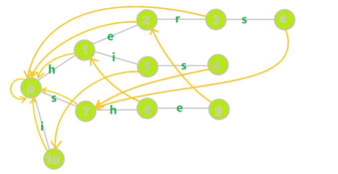
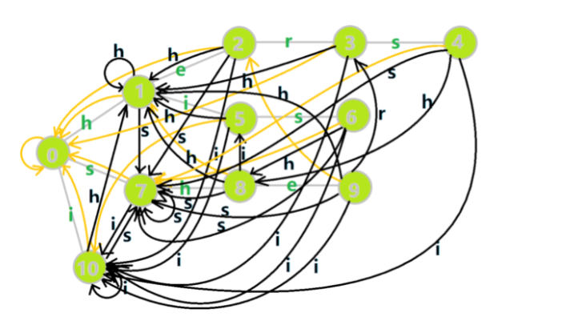

## tire树（字典树）

- 每个节点拥有一个bool 表示是否是一个单词的结尾
- 还拥有一个Trie树数组，26个字母为子节点

~~~cpp
class Trie {
private:
    bool isEnd;
    vector<Trie*>children;

    Trie*searchPrefix(string prefix)
    {
        Trie*node = this;
        for(char ch : prefix)
        {
            ch -= 'a';
            if(node->children[ch] == nullptr)
                return nullptr;
            node = node->children[ch];
        }
        return node;
    }
public:
    Trie():isEnd(false),children(26) {}
    
    void insert(string word) {
        Trie* node = this;
        for(char ch : word)
        {
            ch -= 'a';/
            if(node->children[ch] == nullptr)
            {
                node->children[ch] = new Trie();
            }
            node = node->children[ch];
        }
        node->isEnd = true;
    }
    
    bool search(string word) {
        Trie*node = this->searchPrefix(word);
        return  node != nullptr && node->isEnd;
    }
    
    bool startsWith(string prefix) {
        return this->searchPrefix(prefix) != nullptr;
    }
};
~~~

## AC自动机

- tire字典树的基础上加上filed指针
- bfs层序遍历，查找失败failed指针指向父类的相同字母
- 构建好的AC自动机如下图

- 字典图

## 快排

~~~cpp
void quickSort(vector<int>&nums,int l int r)
{
    if(l >= r)return ;
    int k = (l+r+1)>>1;
    int i = l-1, j = r+1;
    while(i<j)
    {
        do i ++ ;while(nums[i]<k);
        do j -- ; while(nums[j]>k);
        if(i < j) swap(nums[i],nums[j]);
    }
    quickSort(nums,l,i-1);
    quickSort(nums,i,r);
}
~~~

## 归并排序

~~~cpp
void mergeSort(vector<int>&nums , int l ,int r,)
{
    if(l >= r)return ;
    int mid = (l+r)>>1;
    mergeSort(nums,l,mid);
    mergeSort(nums,mid+1,r);

    int k = 0 , i = l , j = mid + 1;//两边的起点
    while(i <= mid && j <= r)
    {
        if(nums[i] < nums[j]) tmp[k++] = nums[i++];
        else tmp[k++] = nums[j++];
    }
    while(i <= mid) tmp[k++] = nums[i++];
    while(j <= r) tmp[k++] = nums[j++];
    for(i = l ,j = 0; i <= r ; i++,j++)nums[i] = tmp[j];
}
~~~

## A*寻路

~~~cpp
起点放到待遍历集合
while(目标没找到)
{	
	从待遍历集合取出Fn最小的点，作为当前计算点
	将当前计算点放入到已遍历集合中
	当前计算点上下左右的4个点进行遍历（如果支持斜方向，就是8个点）
		if (相邻点是墙 || 相邻点在已遍历集合中)
			进入下一个相邻点判断
		if (相邻点在待遍历集合)
			比较Gn，值比较小就更新 Fn、Gn、Hn 和其父节点
		else
			相邻点放到待遍历集合
} 
绘制路径
~~~

## 并查集

- 用于合并，查找的树形集合

~~~cpp
vector<int>disjoint;
vector<int>rank;//用于按秩压缩

void make_set()
{
    for(int i = 0; i < disjoint.size();++i)
    {
        disjoint[i] = i;
        rank[i] = 0;
    }
}

int find_set(int x)
{
    int tmp = x;
    while(x != disjoint[x])
    {
        x = disjoint[x];
    }
    return x;
}

//路径压缩
int find_Set(int x)
{
    if(x != disjoint[x])
    {
        disjoint[x] = find_set(disjoint[x]);//公父
    }
    return disjoint[x];
}

void union_set(int x,int y)
{
    fx = find_set(x);
    fy = find_set(y);
    if(fx != fy)
        father[fx] = fy;
}

//按秩（Rank）合并：
void union_set(int x, int y)
{   x = find_set(x);
    y = find_set(y);
    
    if(rank[x] > rank[y])
        disjoint[y] = x;
    else 
    {
        disjoint[x] = y;
        if(rank[x] == rank[y])
            rank[y]++;
    }
}
~~~

